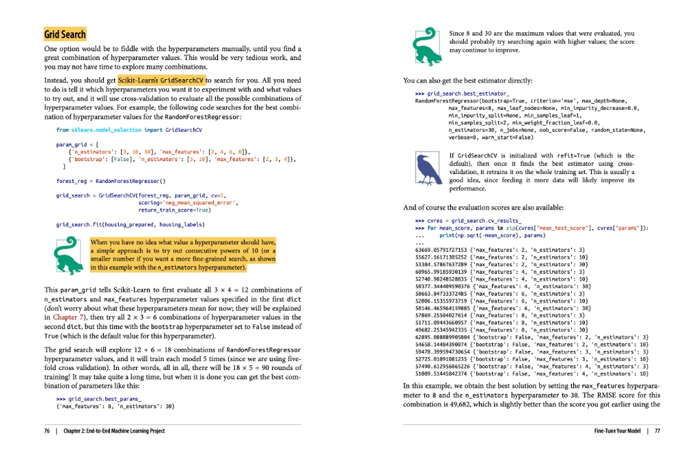

This page explains **Grid Search**, which is a common technique for **hyperparameter tuning**.

Think of a machine learning model (like the `RandomForestRegressor`) as a machine with several knobs and dials. These knobs are its **hyperparameters** (e.g., `n_estimators`, `max_features`). The settings of these knobs can drastically change the model's performance, but you don't know the best combination beforehand.

Instead of manually guessing and checking, `GridSearchCV` automates this process.

-----

## 🛠️ How `GridSearchCV` Works

The process shown in the image can be broken down into three main steps:

### 1\. Define the "Grid" of Hyperparameters

This is what the `param_grid` variable is. It's a list of dictionaries telling `GridSearchCV` exactly which combinations to try.

```python
param_grid = [
    # Try 12 combinations (3 'n_estimators' * 4 'max_features')
    {'n_estimators': [3, 10, 30], 'max_features': [2, 4, 6, 8]},
    
    # Then try 6 more combinations with 'bootstrap' set to False
    {'bootstrap': [False], 'n_estimators': [3, 10], 'max_features': [2, 3, 4]},
]
```

  * **First Dictionary**: Tries 12 combinations ($3 \times 4 = 12$).
  * **Second Dictionary**: Tries 6 combinations ($1 \times 2 \times 3 = 6$).
  * **Total**: The grid search will explore a total of **18 different hyperparameter combinations** ($12 + 6$).

### 2\. Run the Search

This is what happens when you call `grid_search.fit(housing_prepared, housing_labels)`.

`GridSearchCV` takes the 18 combinations and, for **each one**, it performs 5-fold cross-validation (because `cv=5` was set).

  * **What this means:** The model is trained and evaluated 5 times for *each* of the 18 combinations.
  * **Total Training Runs:** $18 \text{ combinations} \times 5 \text{ folds} = \mathbf{90 \text{ training runs}}$.

This is why the text mentions it can take a long time. The search is "brute-forcing" every option you gave it to find the best one.

### 3\. Get the Results

Once the search is complete, `GridSearchCV` gives you the best results.

  * **`grid_search.best_params_`**: This attribute (shown in the bottom-left output) tells you the *winning combination* of hyperparameters. In this example, the best settings were `{'max_features': 8, 'n_estimators': 30}`.
  * **`grid_search.best_estimator_`**: This gives you the `RandomForestRegressor` model that is already re-trained on the *entire* training set using those best parameters.
  * **`grid_search.cv_results_`**: This (shown on the right) is a detailed log of *every* combination tried and the performance score it achieved during cross-validation. This is useful for seeing if other combinations performed almost as well.

-----

## 💡 Other Key Points from the Image

  * **`scoring='neg_mean_squared_error'`**: The grid search needs a metric to decide which combination is "best." Since Scikit-Learn's scoring functions try to *maximize* a score, but we want to *minimize* an error (like Mean Squared Error), we use the "negative" mean squared error. The combination with the *highest* (least negative) score wins.
  * **Searching Powers of 10**: The green dinosaur note suggests that if you have no idea what value to use for a hyperparameter, a good starting point is to try large steps, like powers of 10 (e.g., `[1, 10, 100]`) or (as in this case) `[3, 10, 30]`. You can then do a "finer" search around the best value you find.

In short, `GridSearchCV` is a powerful tool that saves you from manual, tedious hyperparameter tuning by trying every combination you specify and reporting the best one.