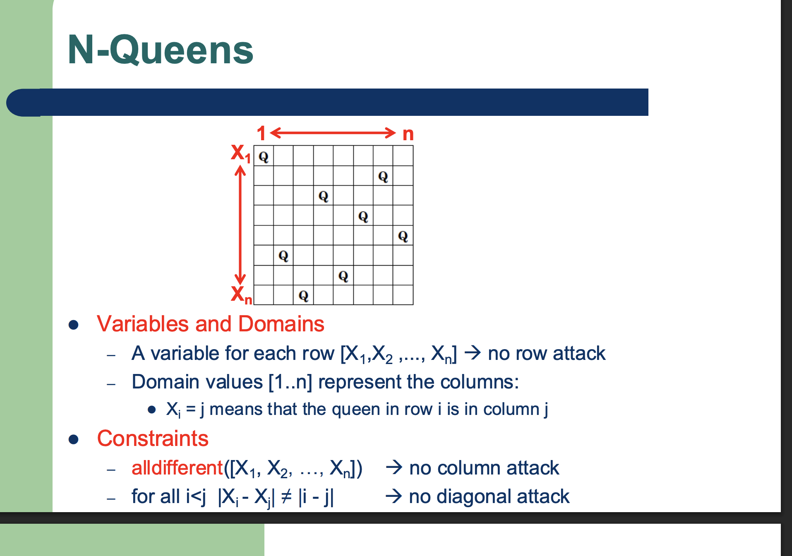
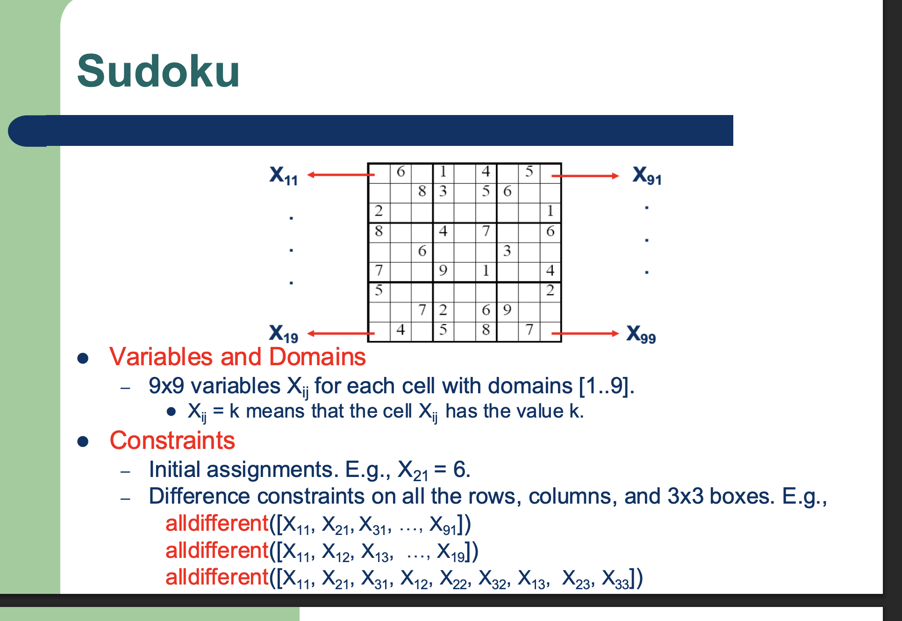
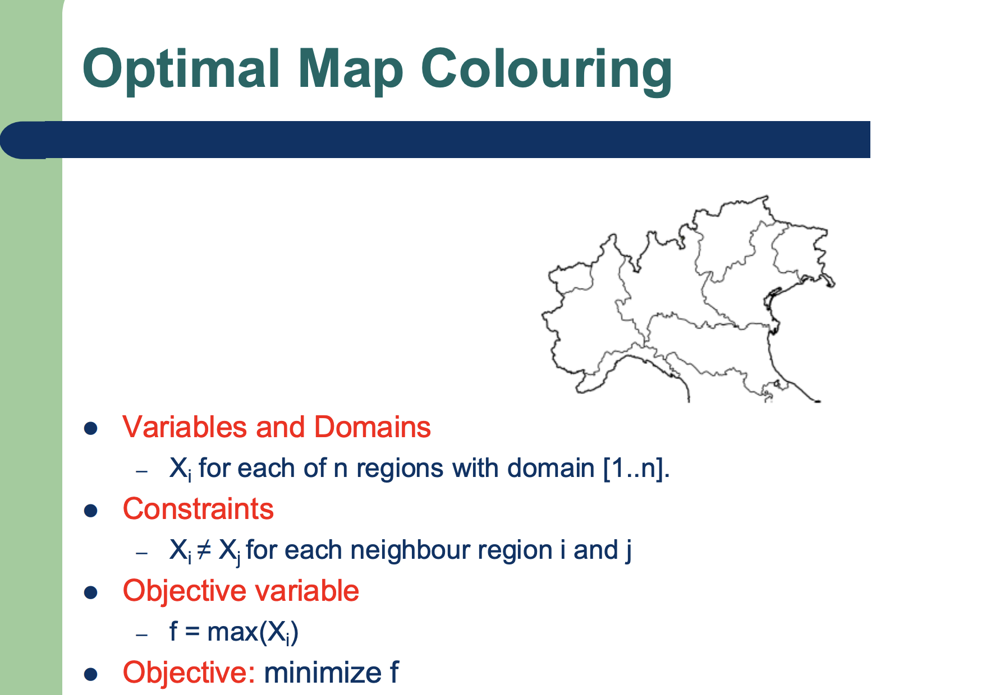
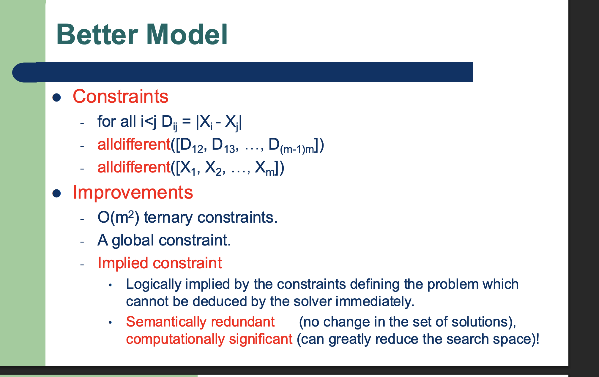

optimization = satisfaction

This slide outlines the formal mathematical definition of a Constraint Satisfaction Problem (CSP). This is a foundational concept in knowledge representation and search algorithms, where a problem is modeled by defining the rules (constraints) that a valid solution must follow, rather than defining a sequence of steps to reach a goal.

Here is a breakdown of the formalization presented in the slide:

### The CSP Triple: 

A CSP is defined by three main components working together:

**1. Decision Variables ()**

* 
* These are the entities in your problem that require an assignment or decision. For example, if you are scheduling classes, the variables would be the individual classes themselves.

**2. Domains ()**

* 
* Every variable  has a corresponding domain , which is the specific set of all possible values that can be assigned to that variable.
* The slide notes these are usually finite and non-binary. For instance, the domain for a class scheduling variable might be a finite set of available time slots like {9:00 AM, 11:00 AM, 2:00 PM}.

**3. Constraints ()**

* 
* These are the rules that restrict which combinations of values are valid.
* A specific constraint  applies to a certain subset of the variables, denoted as .
* Mathematically, a constraint is defined as the set of all *allowed* combinations of values. It is a subset of the Cartesian product of the domains of the involved variables:

* For example, a constraint might dictate that Class A () and Class B () cannot be scheduled at the exact same time.

### The Solution

A problem is considered "solved" only when every single variable in  has been assigned a value from its respective domain in , and this specific combination of assignments violates zero constraints in . It is a strict, simultaneous satisfaction of all rules.

In exam instead of using MiniZinc use this modelling methodology (notations) to model the CSP problem

This slide perfectly demonstrates how to apply the  CSP framework we just looked at to the classic **N-Queens problem**.

The goal of the N-Queens problem is to place  queens on an  chessboard so that no two queens can attack each other. In chess, queens can move horizontally, vertically, and diagonally.

Here is how the problem is translated into a formal CSP:

### 1. Variables ()

Instead of making every single square on the board a variable (which would be inefficient), the problem is formulated with one variable for each row: .

* **Built-in Constraint:** By defining the variables this way, the formulation automatically guarantees that there is exactly one queen per row. This cleverly satisfies the "no horizontal attack" rule by default, so we don't even need to write a separate constraint for it.

### 2. Domains ()

The domain for each variable  is the set of available columns: .

* An assignment like  means "the queen in row 1 is placed in column 4".

### 3. Constraints ()

Since the row attacks are handled by the variable definition, we only need to formally constrain the columns and diagonals to prevent attacks.

* **No Column Attack:** To ensure no two queens share the same column, every row variable must be assigned a unique column value. This is represented by the global constraint:

* **No Diagonal Attack:** This requires a bit of geometry. Two points on a grid share a diagonal if the horizontal distance between them is exactly equal to the vertical distance between them.
Therefore, to *prevent* a diagonal attack for any two distinct rows  and , the absolute difference between their columns () must **not** equal the absolute difference between their rows ().

By satisfying these specific conditions, an algorithm can systematically search for a valid board configuration without explicitly generating and checking every single possible placement.

These slides break down another excellent problem for studying knowledge representation and search: Sudoku. Unlike the N-Queens example where a rule could be built into the variable definitions themselves, Sudoku requires us to represent every single cell explicitly and apply multiple layers of overlapping constraints.

Here is how the  formalization maps out for this classic puzzle:

### 1. Variables ()

* The problem defines a  grid of variables, denoted as , representing every individual cell on the board.
* The assignment  simply means that the cell at that specific position holds the number . This gives us a total of 81 decision variables to solve for.

### 2. Domains ()

* The domain for every variable is the standard set of Sudoku numbers: .

### 3. Constraints ()

The constraints for Sudoku fall into two distinct categories, representing both the starting state and the rules of the game:

* **Initial Assignments:** The pre-filled numbers provided at the start of the puzzle act as rigid, single-value constraints. For example, if the puzzle gives you a 6 in a certain spot, the constraint is strictly .
* **Difference Constraints (The Rules):** The core rule of Sudoku is that no number can repeat in any row, column, or  box. This is modeled using the  constraint, which forces all variables in a given list to take on mutually exclusive values from their domains. The slide provides examples of how this is applied:
- Row Constraint: $alldifferent([X_{11}, X_{21}, X_{31}, \dots, X_{91}])$ ensures all cells in that row have unique values.
- Column Constraint: $alldifferent([X_{11}, X_{12}, X_{13}, \dots, X_{19}])$ ensures all cells in that column have unique values.
- Box Constraint: $alldifferent([X_{11}, X_{21}, X_{31}, X_{12}, X_{22}, X_{32}, X_{13}, X_{23}, X_{33}])$ enforces uniqueness for the top-left $3 \times 3$ region.

*** Optimal Map Colouring ***

if f = 1 means we use only 1 color and so on

constraints/linking variable

This slide introduces a significant new concept to the  framework you are studying: **Optimization**.

While previous examples like Sudoku and N-Queens simply asked for *any* valid assignment that satisfied all rules, the Optimal Map Colouring problem asks for the *best* valid assignment.

Here is how the formalization breaks down for this problem (featuring a map you will likely recognize as Emilia-Romagna):

### 1. Variables () and Domains ()

* **Variables:** The problem defines a variable  for each of the  distinct regions on the map.
* **Domains:** The domain for each region is a set of integers , where each integer represents a distinct color.

### 2. Constraints ()

* The fundamental rule of map coloring is that no two adjacent regions can share the same color.
* This is formally modeled as an inequality constraint:  for every pair of neighboring regions  and .

### 3. The Objective (The New Addition)

Instead of just stopping when a valid coloring is found, this formulation introduces an optimization layer to find a solution that uses the fewest colors possible.

* **Objective Variable:** A new variable is introduced, . Because the colors are represented by integers starting from 1, the *maximum* value assigned to any  will equal the total number of distinct colors used on the map.
* **Objective:** The goal is to **minimize **.

By defining the problem this way, it transforms from a standard Constraint Satisfaction Problem (CSP) into a Constraint Satisfaction **Optimization** Problem (CSOP). The solver must search the state space not just for a state with zero constraint violations, but for the state that yields the lowest possible value for .

It enforces that a maximum of 5 variables () can exceed their corresponding thresholds ().

*  resolves to 1 if true and 0 if false.
*  counts the total number of true instances.
*  sets the maximum allowed count.

always asked in the exam

it may happend that the solver may backtrack earlier if you add redundant implied constraints