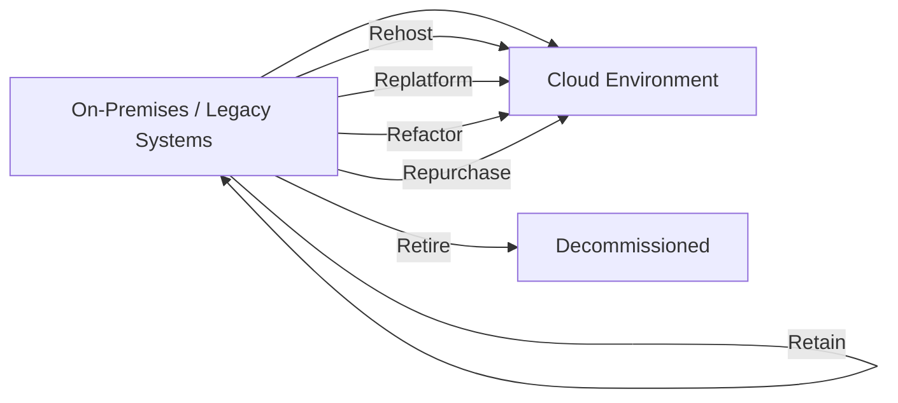
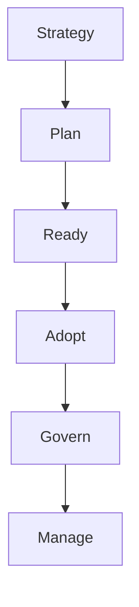

# Cloud Migration and CAF

## What is Cloud Migration?
Cloud Migration is the process of moving digital assets such as applications, data, IT resources, and workloads from on-premises infrastructure or one cloud environment to another.  
The goal is to take advantage of cloud benefits like **scalability, cost efficiency, performance, and flexibility**.

### Types of Cloud Migration
- **Rehosting ("Lift-and-Shift")**: Moving applications to the cloud with little or no changes.  
- **Replatforming**: Making minimal optimizations while moving (e.g., changing the database engine).  
- **Refactoring / Rearchitecting**: Redesigning applications to fully leverage cloud-native features.  
- **Repurchasing**: Moving to a different product (e.g., SaaS).  
- **Retiring**: Decommissioning obsolete applications.  
- **Retaining**: Keeping some apps on-premises.

---

## What is CAF?
CAF stands for **Cloud Adoption Framework**.  
It is a structured set of best practices, tools, and guidance provided by cloud providers (like Microsoft Azure CAF, AWS CAF, Google Cloud CAF) to help organizations **plan, adopt, govern, and manage** their cloud migration journey.

### Key Components of CAF (Example: Microsoft Azure CAF)
1. **Strategy**: Define business goals and outcomes.  
2. **Plan**: Assess readiness, prioritize workloads, and create a roadmap.  
3. **Ready**: Build a landing zone (cloud foundation with networking, identity, security).  
4. **Adopt**: Migrate and modernize workloads.  
5. **Govern**: Establish policies, compliance, and risk management.  
6. **Manage**: Operate and optimize cloud resources continuously.

---

## Benefits of Using CAF
- Provides a **clear roadmap** for cloud migration.  
- Ensures **security, compliance, and governance**.
- Helps align **technical and business objectives**.  
- Reduces risks and accelerates adoption.
  

