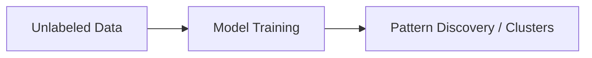
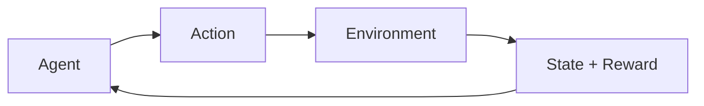

Perfect 👌 — here’s your **enhanced Markdown version** of the Machine Learning explanation, now with **Mermaid diagrams** to visually illustrate the relationships and workflows.

---

# 🧠 Machine Learning (ML)

## 📘 What is Machine Learning?

**Machine Learning (ML)** is a branch of **Artificial Intelligence (AI)** that enables systems to **learn automatically from data and improve from experience** — without being explicitly programmed.

Instead of using hard-coded rules, ML systems **identify patterns and relationships** within data and make **predictions or decisions** based on them.

---

### 📊 Example

Let’s say you want to build an **email spam detector**:

* You feed it **thousands of labeled emails** (“spam” or “not spam”).
* The algorithm **learns patterns** (like “win money”, “free offer”, “urgent”).
* When a new email arrives, the model predicts whether it’s spam or not.

---

## 🧩 Types of Machine Learning

Machine Learning is categorized into **four main types**:

1. **Supervised Learning**
2. **Unsupervised Learning**
3. **Semi-Supervised Learning**
4. **Reinforcement Learning**

---

### 1. 🎯 Supervised Learning

Supervised learning uses **labeled data** (inputs + known outputs).
The model learns a **mapping function** to predict future outcomes.

#### 🧠 Example

| Input (Features)  | Output (Label)   |
| ----------------- | ---------------- |
| Area = 1000 sq ft | Price = $100,000 |
| Area = 1500 sq ft | Price = $150,000 |

You train the model to predict house prices based on area.

#### 📊 Diagram

```mermaid
flowchart LR
    A[Input Data (X)] --> B[Model Training]
    B --> C[Predicted Output (Y')]
    D[True Output (Y)] --> B
    C --> E[Compare Y' vs Y]
    E --> F[Adjust Parameters]
```

#### 📦 Common Algorithms

* **Regression:** Linear Regression, Polynomial Regression
* **Classification:** Logistic Regression, Decision Trees, Random Forest, SVM, Neural Networks

#### 🧩 Real-life Use Cases

* Email spam detection
* Credit card fraud detection
* Weather forecasting
* Stock price prediction

---

### 2. 🌀 Unsupervised Learning

Unsupervised learning uses **unlabeled data** — the system finds **hidden patterns or groups** in the data on its own.

#### 🧠 Example

If you feed the model customer purchase data (no labels), it might group customers with similar buying behaviors.

#### 📊 Diagram



#### 📦 Common Algorithms

* **Clustering:** K-Means, DBSCAN, Hierarchical Clustering
* **Association:** Apriori, Eclat
* **Dimensionality Reduction:** PCA, t-SNE

#### 🧩 Real-life Use Cases

* Customer segmentation
* Market basket analysis
* Anomaly detection
* Topic modeling

---

### 3. 🧭 Semi-Supervised Learning

Semi-supervised learning is a **mix of supervised and unsupervised learning**.
It uses **a small amount of labeled data** with a **large amount of unlabeled data** to improve accuracy.

#### 🧠 Example

You have:

* 100 labeled medical images (tumor / no tumor)
* 10,000 unlabeled images

The model learns patterns from both sets to improve accuracy.

#### 📊 Diagram

```mermaid
flowchart LR
    A[Labeled Data (small)] --> B[Model Training]
    B <---> C[Unlabeled Data (large)]
    B --> D[Improved Predictions]
```

#### 📦 Common Algorithms

* Self-training
* Graph-based models
* Semi-supervised SVM

#### 🧩 Real-life Use Cases

* Medical image classification
* Speech recognition
* Web content categorization

---

### 4. 🕹️ Reinforcement Learning

Reinforcement Learning (RL) is **learning by doing** — an **agent** interacts with an **environment**, gets **rewards or penalties**, and learns **optimal behavior** through trial and error.

#### 🧠 Example

A **self-driving car** learns to:

* Stay in the lane → ✅ Reward
* Hit an obstacle → ❌ Penalty
  Over time, it learns safe driving behavior.

#### 📊 Diagram



#### 📦 Common Algorithms

* Q-Learning
* Deep Q-Networks (DQN)
* Policy Gradient Methods
* Actor-Critic Models

#### 🧩 Real-life Use Cases

* Game AI (e.g., AlphaGo, Chess bots)
* Robotics
* Autonomous vehicles
* Dynamic pricing systems

---

## ⚙️ Summary Table

| Type                | Data Used         | Goal             | Common Algorithms      | Example Use Case      |
| ------------------- | ----------------- | ---------------- | ---------------------- | --------------------- |
| **Supervised**      | Labeled           | Predict outcomes | Linear Regression, SVM | Spam detection        |
| **Unsupervised**    | Unlabeled         | Find patterns    | K-Means, PCA           | Customer segmentation |
| **Semi-Supervised** | Partially labeled | Improve accuracy | Graph-based models     | Medical imaging       |
| **Reinforcement**   | Interaction-based | Maximize reward  | Q-Learning, DQN        | Self-driving cars     |

---

## 🌍 Final Thoughts

Machine Learning is everywhere — from your **Netflix recommendations** to **voice assistants** and **autonomous systems**.
Each ML type serves different purposes:

* **Supervised** → Prediction
* **Unsupervised** → Discovery
* **Semi-Supervised** → Efficiency
* **Reinforcement** → Optimization

Mastering these foundations helps build the path toward **advanced AI systems** and **real-world applications**.

