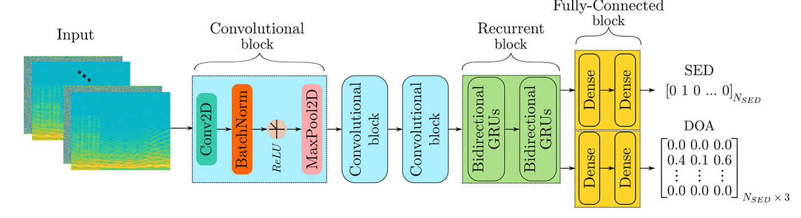
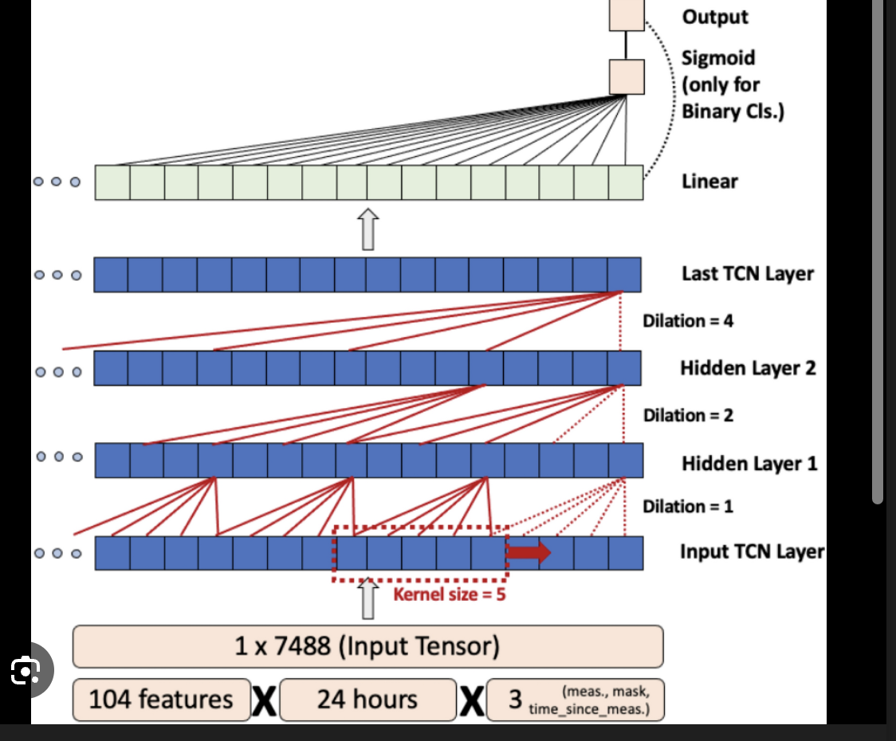

****Temporal Convolutional Networks (TCNs) represent a fascinating shift in deep learning architecture. For years, the default assumption was: if you have sequence data (time-series, text, audio), you must use Recurrent Neural Networks (RNNs) or LSTMs. TCNs flip that assumption on its head. They prove that Convolutional Neural Networks—when heavily modified—cannot only handle sequences but often outperform LSTMs while training significantly faster.****


- 1. The Core Problem: Standard CNNs vs. Time

A standard 1D Convolution (which we discussed earlier) is terrible for time-series prediction out of the box.If you use a standard $3 \times 3$ kernel to predict the stock market at time $t$, the kernel looks at $t-1$, $t$, and $t+1$. It looks into the future. This is "data leakage" and makes the model completely invalid for real-world autoregressive prediction.TCNs solve this and the long-term memory problem using three specific architectural pillars.


**Why?**

- The Mechanics of a Standard 1D Convolution (The Trap)

When you use PyTorch’s standard nn.Conv1d with a kernel size of 3 and padding=1 (to keep the output sequence the same length as the input), the framework defaults to centered padding. It puts one zero on the left, and one zero on the right.Because the kernel is centered, when it calculates the output for time $t$, it physically slides over the inputs at $t-1$, $t$, and $t+1$.The Math (Standard CNN):$$Y_t = (W_{-1} \cdot X_{t-1}) + (W_0 \cdot X_t) + (W_1 \cdot X_{t+1})$$The Real-World Scenario:Imagine you are building a stock trading bot. $X$ is the daily closing price.$X_{t-1}$ = Monday's price$X_t$ = Tuesday's price$X_{t+1}$ = Wednesday's priceYou are sitting at your desk on Tuesday night ($t$). You want the network to output a prediction ($Y_t$) so you can buy or sell before Wednesday morning.But look at the math equation above. To calculate the output $Y_t$ on Tuesday, the kernel mathematically requires $X_{t+1}$ (Wednesday's actual closing price).The Catastrophe: During training, you have historical data, so the network has Wednesday's price. The network will quickly realize, "Wait, to predict what happens next, I don't need to learn complex market trends. I'll just multiply the $W_1$ weight by $X_{t+1}$ and ignore everything else." It learns to cheat. When you deploy it live on Tuesday night, $X_{t+1}$ doesn't exist yet. The array is empty. The code crashes, or the model guesses blindly.

- The Causal Fix: Asymmetric Padding

To fix this, we must enforce Strict Causality: the output at time $t$ can only depend on inputs from time $t$ and earlier. We cannot change how a sliding window mathematically works, but we can trick the window by manipulating the data underneath it.Instead of padding both sides equally, we push all the padding to the past (the left side of the array).The Math (Causal CNN):To compute $Y_t$ with a kernel of size $K=3$, we want the kernel to look at:$$Y_t = (W_0 \cdot X_{t-2}) + (W_1 \cdot X_{t-1}) + (W_2 \cdot X_t)$$


The Engineering Trick (PyTorch implementation):
- If our sequence is [Mon, Tue, Wed, Thu, Fri] and $K=3$:We pad the left side with $K-1$ zeros: [0, 0, Mon, Tue, Wed, Thu, Fri].
- We run the standard Conv1d sliding window.

- Step 1: Window covers [0, 0, Mon]. 
The output aligns with Monday. It only saw Monday and the past. Safe.

- Step 2: Window covers [0, Mon, Tue]. The output aligns with Tuesday. It only saw Monday and Tuesday.

- Because the output array is now slightly too long (it extends into the future), we use the Chomp1d function I showed you earlier to simply slice off the end of the tensor.By shifting the data array relative to the kernel, we completely blind the network to the future.








## Architecture


## Pillar 1: Causal Convolutions (No Cheating)

To prevent the model from looking into the future, TCNs use Causal Convolutions.The Concept: The output at time $t$ is convolved only with elements from time $t$ and earlier in the previous layer.The Math/Engineering Trick: We achieve causality not by changing the convolution math, but by manipulating the padding.If you have a kernel of size $K$, you pad the left side of the input sequence with exactly $K-1$ zeros, and add zero padding to the right. After the standard convolution, you literally just slice off the extra outputs on the right side.$$Y_t = \sum_{i=0}^{K-1} W_i \cdot X_{t-i}$$(Notice the index $t-i$. We only ever subtract from $t$, meaning we only look backward in time).


## Pillar 2: Dilated Convolutions (The Memory Engine)

A simple causal convolution has a fatal flaw: its memory is tiny. If you stack five layers with a kernel size of 3, your network can only look back 11 time steps. For high-frequency trading or audio processing, you need to look back thousands of steps.TCNs solve this using Dilated Convolutions (which we touched on in the vision section, but here they are weaponized for time).The Concept: We exponentially increase the dilation factor $d$ at each new hidden layer (e.g., $d = 1, 2, 4, 8, 16$).The Math: The effective Receptive Field ($RF$) of a TCN grows exponentially with depth, rather than linearly.For a network with $N$ layers, kernel size $K$, and dilation base $b$ (usually 2), the receptive field is:$$RF = 1 + 2 \times (K-1) \times (b^N - 1)$$Why it's brilliant: You can achieve a receptive field of tens of thousands of time steps using only a few dozen layers and a tiny fraction of the parameters an RNN would require.


## Pillar 3: Residual Connections (The Stability Anchor)

Because TCNs rely on stacking many layers to build a large receptive field, they are highly susceptible to the vanishing gradient problem.The Fix: They use $1 \times 1$ convolutions to ensure the input tensor matches the exact channel depth of the output tensor, and then add them together: $Output = \text{Activation}(x + \mathcal{F}(x))$. This guarantees that gradients can flow unimpeded from the output all the way back to $t=0$.

## Why TCNs > LSTMs (The Researcher's Argument)

If you are defending a TCN architecture in a paper, these are your primary arguments:

- Massive Parallelism: LSTMs must wait for step $t$ to finish before computing step $t+1$. TCNs compute the entire sequence simultaneously during training using massive GEMM matrix multiplications on the GPU. They train exponentially faster.

- Stable Gradients: LSTMs suffer from exploding/vanishing gradients because they use Backpropagation Through Time (BPTT), which multiplies the exact same weight matrix against itself hundreds of times. TCNs use standard backprop through distinct layers.

- Flexible Receptive Field: You mathematically define exactly how far back the TCN can "remember" by setting the layers and dilation. LSTMs have an ambiguous, fading memory that is hard to control.


Here is how you actually build a Causal Dilated Convolution. Notice the Chomp1d class. This is the specific engineering trick used to enforce causality in PyTorch.


```
import torch
import torch.nn as nn

class Chomp1d(nn.Module):
    """
    This is the secret sauce for Causal Convolutions in PyTorch.
    It removes the extra elements on the right side of the sequence 
    so the output length matches the input length, and causality is maintained.
    """
    def __init__(self, chomp_size):
        super(Chomp1d, self).__init__()
        self.chomp_size = chomp_size

    def forward(self, x):
        # Slice the tensor to remove the last 'chomp_size' elements along the time dimension
        return x[:, :, :-self.chomp_size].contiguous()

class TemporalBlock(nn.Module):
    def __init__(self, n_inputs, n_outputs, kernel_size, stride, dilation, padding, dropout=0.2):
        super(TemporalBlock, self).__init__()
        
        # --- Layer 1 ---
        # Notice we add padding to both sides, but it's dictated by the dilation
        self.conv1 = nn.Conv1d(n_inputs, n_outputs, kernel_size,
                               stride=stride, padding=padding, dilation=dilation)
        # Immediately slice off the right side to make it Causal
        self.chomp1 = Chomp1d(padding)
        self.relu1 = nn.ReLU()
        self.dropout1 = nn.Dropout(dropout)

        # --- Layer 2 ---
        self.conv2 = nn.Conv1d(n_outputs, n_outputs, kernel_size,
                               stride=stride, padding=padding, dilation=dilation)
        self.chomp2 = Chomp1d(padding)
        self.relu2 = nn.ReLU()
        self.dropout2 = nn.Dropout(dropout)

        self.net = nn.Sequential(self.conv1, self.chomp1, self.relu1, self.dropout1,
                                 self.conv2, self.chomp2, self.relu2, self.dropout2)
        
        # --- The Residual Connection ---
        # If the input and output channels don't match, we use a 1x1 conv to align them
        self.downsample = nn.Conv1d(n_inputs, n_outputs, 1) if n_inputs != n_outputs else None
        self.relu = nn.ReLU()

    def forward(self, x):
        out = self.net(x)
        res = x if self.downsample is None else self.downsample(x)
        return self.relu(out + res)

# Example usage:
# A block with dilation 4, padding calculates as (kernel_size-1)*dilation
block = TemporalBlock(n_inputs=16, n_outputs=32, kernel_size=3, stride=1, dilation=4, padding=(3-1)*4)
dummy_time_series = torch.randn(8, 16, 50) # (Batch, Channels, Sequence_Length)
print(f"Output shape: {block(dummy_time_series).shape}") # (8, 32, 50)


```