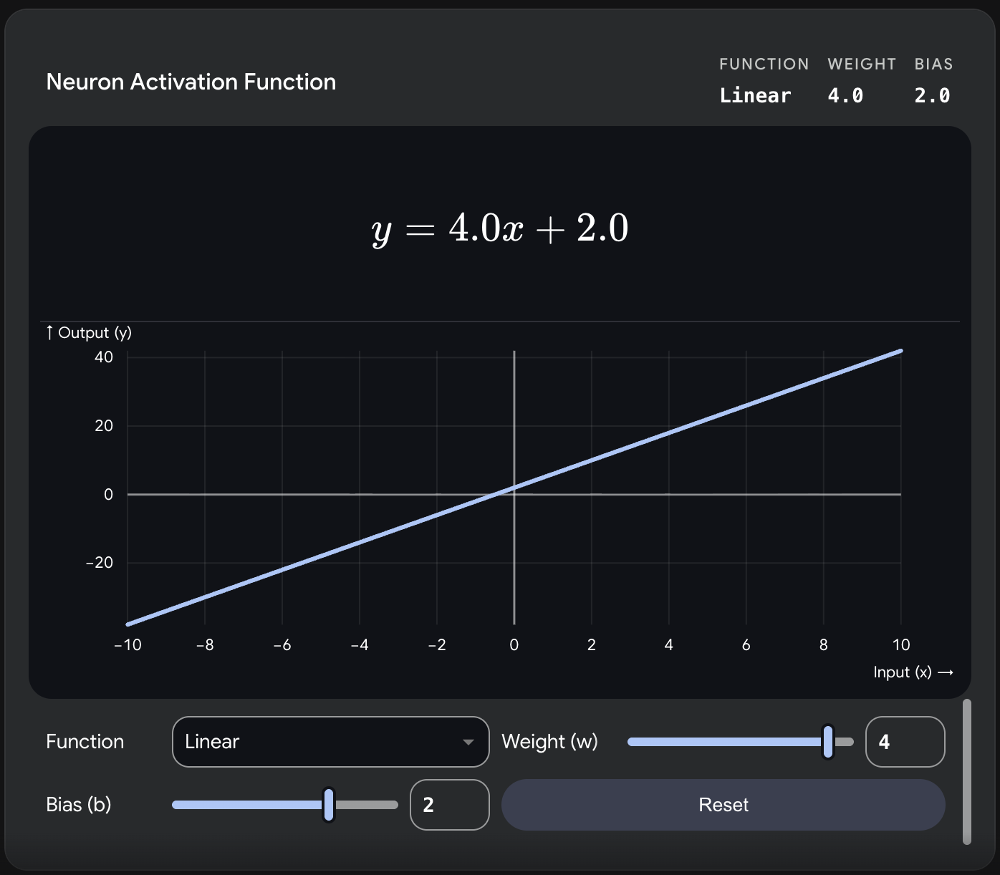
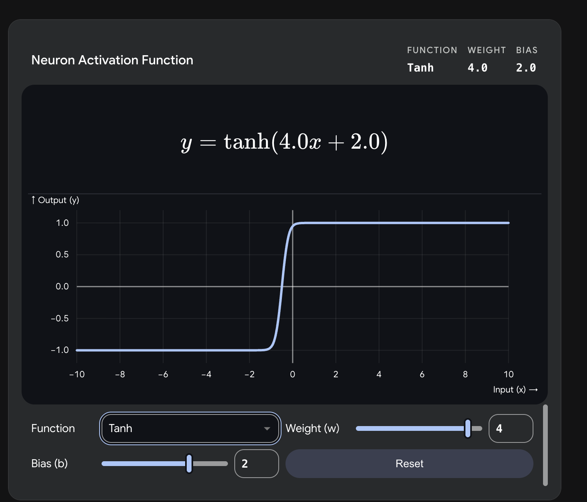
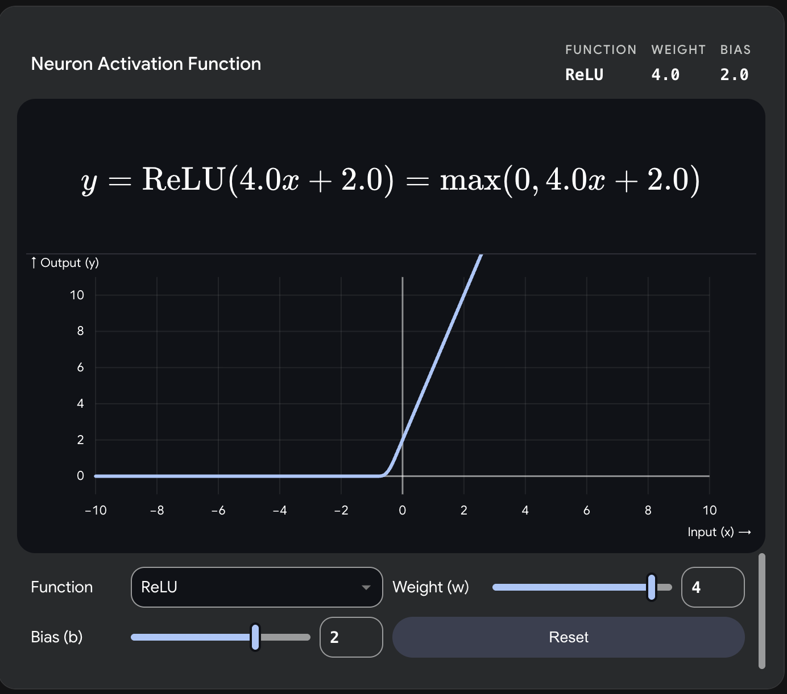
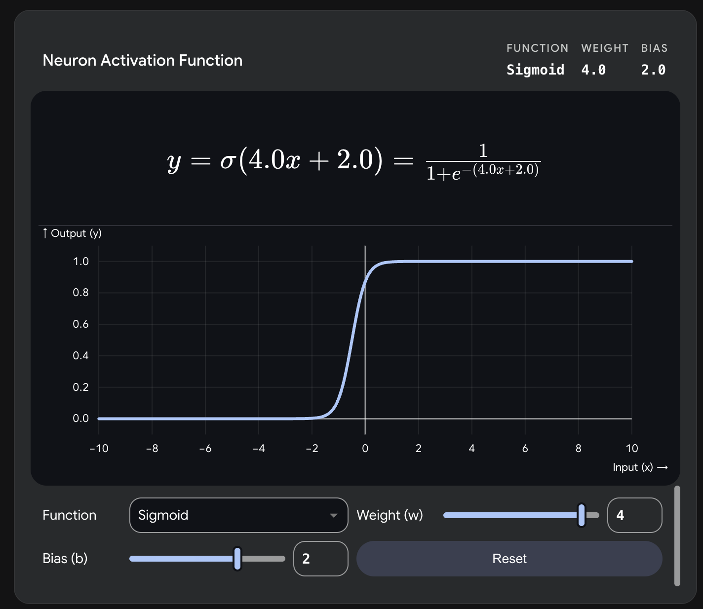
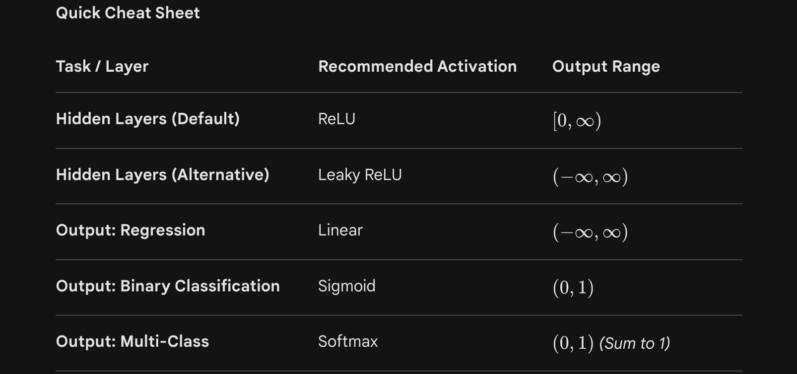

Level 1: The Basics (The Artificial Neuron)At its core, a neural network is a mathematical function that maps inputs to outputs. The fundamental building block is the artificial neuron (or perceptron).An artificial neuron does two things:Linear Transformation: It multiplies inputs by weights, sums them up, and adds a bias.Non-linear Activation: It passes that sum through an activation function to determine how "active" the neuron should be.The MathFor a single neuron with $n$ inputs:Inputs: $x = [x_1, x_2, \dots, x_n]$Weights: $w = [w_1, w_2, \dots, w_n]$Bias: $b$The linear combination $z$ is:$$z = \sum_{i=1}^{n} w_i x_i + b = w \cdot x + b$$The output $a$ (activation) uses a function like the Sigmoid function, which squishes values between 0 and 1:$$a = \sigma(z) = \frac{1}{1 + e^{-z}}$$


```
import numpy as np

# 1. Define inputs, weights, and bias
x = np.array([0.5, 0.8, 0.2])  # 3 input features
w = np.array([0.4, 0.6, 0.9])  # 3 weights
b = 0.1                        # 1 bias term

# 2. Linear Transformation (Dot product)
z = np.dot(w, x) + b

# 3. Activation Function (Sigmoid)
def sigmoid(z):
    return 1 / (1 + np.exp(-z))

a = sigmoid(z)
print(f"Neuron Output: {a:.4f}")

```


Level 2: Intermediate (Multi-Layer Perceptrons & Forward Pass)A single neuron can only learn linear boundaries. To learn complex patterns, we stack neurons into layers to create a Multi-Layer Perceptron (MLP).Input Layer: The raw data.Hidden Layers: Layers in between that extract features.Output Layer: The final prediction.The Math (Vectorized Forward Propagation)Instead of calculating one neuron at a time, we use matrices to calculate entire layers simultaneously. Let's look at the math for layer $l$:$W^{[l]}$ is the weight matrix of layer $l$.$A^{[l-1]}$ is the output (activation) from the previous layer.$b^{[l]}$ is the bias vector of layer $l$.
Step 1: Compute the pre-activation for the whole layer:$$Z^{[l]} = W^{[l]} A^{[l-1]} + b^{[l]}$$Step 2: Apply the activation function (like ReLU: $f(x) = \max(0, x)$):$$A^{[l]} = \text{ReLU}(Z^{[l]})$$


```

# Network architecture: 3 inputs -> 4 hidden neurons -> 1 output
# Initialize random weights and biases
np.random.seed(42)
W1 = np.random.randn(4, 3)  # Layer 1 weights (4 neurons, 3 inputs)
b1 = np.zeros((4, 1))       # Layer 1 biases
W2 = np.random.randn(1, 4)  # Layer 2 weights (1 neuron, 4 inputs)
b2 = np.zeros((1, 1))       # Layer 2 biases

# Input data (column vector)
A0 = np.array([[0.5], [0.8], [0.2]]) 

# --- Forward Pass ---
# Layer 1 (Hidden)
Z1 = np.dot(W1, A0) + b1
A1 = np.maximum(0, Z1)      # ReLU activation

# Layer 2 (Output)
Z2 = np.dot(W2, A1) + b2
A2 = sigmoid(Z2)            # Sigmoid activation for binary classification

print(f"Network Prediction: {A2[0][0]:.4f}")
```


Level 3: Advanced (Loss, Backpropagation, and Training)To make the network learn, it needs to compare its prediction to the actual truth, calculate the error (Loss), and adjust the weights to minimize that error.1. The Loss FunctionFor binary classification, we use Binary Cross-Entropy Loss ($L$):$$L = - \left( y \log(a) + (1 - y) \log(1 - a) \right)$$(Where $y$ is the true label and $a$ is the predicted probability).2. Backpropagation (The Chain Rule)We need to find out how much each weight contributed to the loss. We do this by calculating the gradient (derivative) of the loss with respect to each weight using the calculus chain rule.For the output layer weights $W^{[2]}$:$$\frac{\partial L}{\partial W^{[2]}} = \frac{\partial L}{\partial A^{[2]}} \times \frac{\partial A^{[2]}}{\partial Z^{[2]}} \times \frac{\partial Z^{[2]}}{\partial W^{[2]}}$$3. Gradient Descent (The Update Rule)Once we have the gradients, we update the weights by moving them slightly in the opposite direction of the gradient, controlled by a learning rate ($\alpha$):$$W^{[l]} := W^{[l]} - \alpha \frac{\partial L}{\partial W^{[l]}}$$The Code (A Complete Training Loop from Scratch)Here is a full implementation of training a 2-layer neural network on a simple dataset without any deep learning libraries, just raw math.








```

# Simple dataset: XOR problem approximation (Inputs -> Target)
X = np.array([[0,0], [0,1], [1,0], [1,1]]).T  # Shape: (2 inputs, 4 samples)
Y = np.array([[0, 1, 1, 0]])                  # Shape: (1 output, 4 samples)

# Initialize parameters
W1 = np.random.randn(4, 2) * 0.1 # 4 hidden neurons
b1 = np.zeros((4, 1))
W2 = np.random.randn(1, 4) * 0.1 # 1 output neuron
b2 = np.zeros((1, 1))

learning_rate = 0.1
epochs = 10000

for epoch in range(epochs):
    # --- 1. FORWARD PASS ---
    Z1 = np.dot(W1, X) + b1
    A1 = np.maximum(0, Z1)       # ReLU
    
    Z2 = np.dot(W2, A1) + b2
    A2 = sigmoid(Z2)             # Sigmoid
    
    # Calculate Cost (Binary Cross Entropy)
    m = Y.shape[1] # number of samples
    cost = -np.sum(Y * np.log(A2) + (1 - Y) * np.log(1 - A2)) / m
    
    # --- 2. BACKWARD PASS ---
    # Gradients for Layer 2
    dZ2 = A2 - Y
    dW2 = np.dot(dZ2, A1.T) / m
    db2 = np.sum(dZ2, axis=1, keepdims=True) / m
    
    # Gradients for Layer 1
    dA1 = np.dot(W2.T, dZ2)
    dZ1 = dA1 * (Z1 > 0)         # Derivative of ReLU
    dW1 = np.dot(dZ1, X.T) / m
    db1 = np.sum(dZ1, axis=1, keepdims=True) / m
    
    # --- 3. WEIGHT UPDATE (Gradient Descent) ---
    W1 -= learning_rate * dW1
    b1 -= learning_rate * db1
    W2 -= learning_rate * dW2
    b2 -= learning_rate * db2
    
    if epoch % 2000 == 0:
        print(f"Epoch {epoch} | Loss: {cost:.4f}")

# Test the trained network
print("\nFinal Predictions after training:")
print(A2)
```

## Which Activation Function to use?

Choosing the right activation function depends almost entirely on where the neuron is located in your network: the Output Layer or the Hidden Layers.


1. The Output Layer (Depends on your Problem)The activation function in the final layer is strictly determined by what you want your neural network to predict.Linear (No Activation)When to use: Regression tasks (predicting a continuous num`ber).Example: Predicting the price of a house, temperature, or age.Why: You want the network to output any real value without restricting it to a specific range.SigmoidWhen to use: Binary Classification (predicting between exactly two classes) or Multi-label classification (where an item can belong to multiple classes at once).Example: Is this email Spam (1) or Not Spam (0)?Why: It squishes the output to a probability between $0$ and $1$.SoftmaxWhen to use: Multi-class Classification (predicting exactly one class out of three or more).Example: Recognizing handwritten digits (0 through 9).Why: It converts raw scores into a probability distribution where all output probabilities sum to exactly $1.0$.

2. The Hidden Layers (Depends on Training Dynamics)Hidden layers do the "thinking" and feature extraction. Your goal here is to choose a function that helps the network learn quickly and avoids mathematical traps (like the vanishing gradient problem).ReLU (Rectified Linear Unit) — $f(x) = \max(0, x)$When to use: Almost always. This should be your default starting point for hidden layers in modern deep learning (CNNs, MLPs).Why: It is computationally cheap and doesn't suffer from the "vanishing gradient" problem for positive values, allowing deep networks to train much faster.The Catch: "Dying ReLU" problem. If a neuron's weights update in a way that it only outputs negative numbers, the gradient becomes $0$, and the neuron stops learning permanently.Leaky ReLU — $f(x) = x \text{ if } x > 0 \text{ else } \alpha x$ (where $\alpha$ is a small constant like $0.01$)When to use: When your standard ReLU network is suffering from dying neurons and performance is stalling.Why: It allows a small, non-zero gradient when the input is negative, keeping the neuron "alive" and updating.Tanh (Hyperbolic Tangent)When to use: Often used in Recurrent Neural Networks (RNNs) or when you specifically need zero-centered data.Why: It squishes values between $-1$ and $1$. Because it is zero-centered, it often makes optimization easier than Sigmoid.SigmoidWhen to use: Rarely in hidden layers today. It is mostly reserved for specific gating mechanisms (like in LSTMs).Why to avoid: It suffers heavily from the vanishing gradient problem. For very high or very low inputs, the curve flattens out, the derivative approaches zero, and the network stops learning.GELU (Gaussian Error Linear Unit)When to use: Advanced architectures, specifically Large Language Models (LLMs) and Vision Transformers.Why: It is a smoother version of ReLU that weights inputs by their probability under a Gaussian distribution. It tends to perform slightly better than ReLU in cutting-edge Transformer models.





1. Feed-Forward Neural Networks (FFNN)The Concept: This is the simplest type of artificial neural network. In a feed-forward network, information flows in exactly one direction: from the input layer, through the hidden layers, and straight to the output layer.No Loops: The data never circles back. Once a layer processes the data and passes it forward, it forgets about it.Best For: Independent data points where past inputs do not affect current inputs. Examples include predicting a house price based on its features, or recognizing whether an image contains a cat or a dog.
2. The Backward Pass (Backpropagation)The Concept: This is how networks actually learn. When you push data through a Feed-Forward network, it makes a prediction. If that prediction is wrong, the network needs to adjust its weights. The process of calculating how much to adjust them is the backward pass.Calculate the Error: Compare the network's prediction to the actual truth.Go Backwards: The network works in reverse, from the output layer back to the input layer, calculating the gradient (the mathematical slope) of the error with respect to each weight.Update Weights: It tweaks the weights slightly to reduce the error for the next time.Without the backward pass, a neural network is just a static mathematical formula that never improves.
3. Recurrent Neural Networks (RNN)The Concept: Feed-forward networks have amnesia—they treat every input as a completely isolated event. But what if you are reading a sentence? The word "bank" means something different if the previous word was "river" versus "rob the".RNNs solve this by introducing loops into the architecture. They maintain an internal "memory" (called a hidden state).How it Works: When an RNN processes an input at time step $t$, it looks at the current input ($x_t$) AND the hidden state from the previous time step ($h_{t-1}$).The Math: The hidden state update often looks like this:$$h_t = \tanh(W_{hh} h_{t-1} + W_{xh} x_t + b)$$(Where $W_{hh}$ is the weight matrix for the hidden state, and $W_{xh}$ is the weight matrix for the input).Best For: Sequential data. This includes Natural Language Processing (NLP), time-series forecasting (like stock prices), and speech recognition.