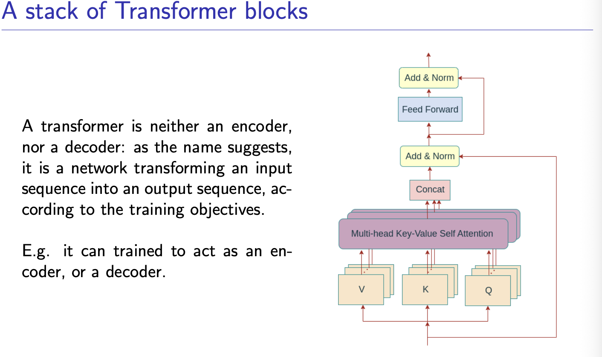
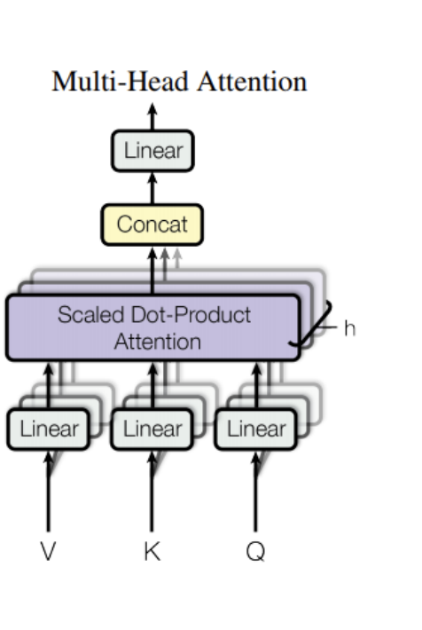
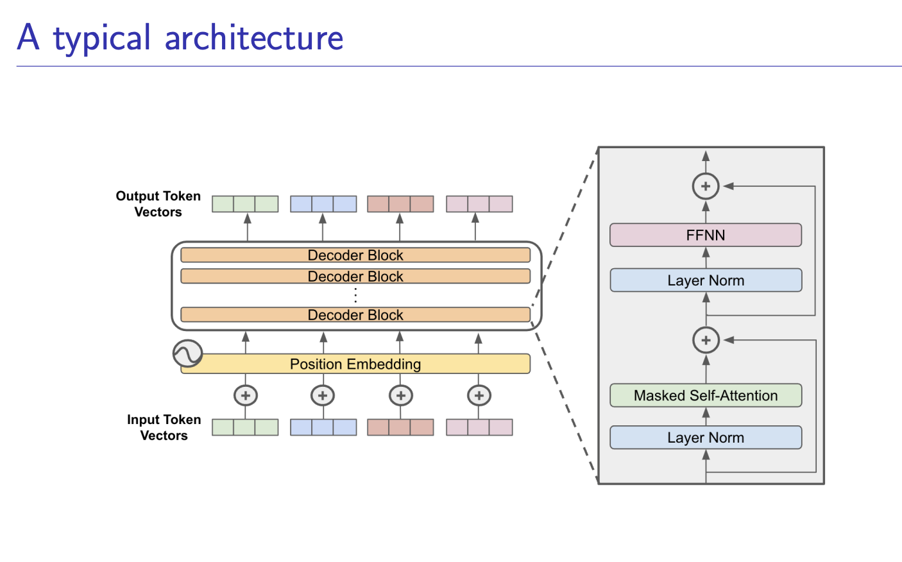

Why Residual Learning works?
- it seems to be a good idea to try to learn non-linear
corrections over a linear baseline

- during back propagation, the gradient at higher layers
can easily pass to lower layers, withouth being
mediated by the weight layers, which may cause vanishing
gradient or exploding gradient problem.

##### When Transfer Learning makes sense
transferring knowledge from problem A to problem
B makes sense if

- the two problems have “similar” inputs
- we have much more training data for A
than for B

If layers are the bricks and mortar, Architectures are the blueprints of the building. An architecture defines the macro-flow of data: how information is compressed, stored, and translated.

Latent space is a compressed, lower-dimensional representation of high-dimensional data (like images or text) learned by machine learning models, where similar items are placed closer together. It captures essential features and hidden patterns, enabling generative models like VAEs and GANs to create new data samples

The Autoencoder: The Latent Space ArchitectBefore we can classify or translate, we must understand compression. An Autoencoder is an unsupervised architecture that learns to copy its input to its output.The Problem: If you just connect Input directly to Output, the network learns the identity function ($f(x) = x$). That is useless.The Architecture: We force the data through a severe structural bottleneck.The Encoder: Smashes a high-dimensional input (like a $1024 \times 1024$ image) down into a tiny, dense vector called the Latent Vector ($z$).The Decoder: Is forced to reconstruct the original $1024 \times 1024$ image using only the information squeezed into $z$.The Math: It minimizes the Reconstruction Loss (usually Mean Squared Error): $L = \| X - D(E(X)) \|^2$Why it matters: To minimize this loss, the Encoder must learn the most critical, fundamental features of the data (ignoring noise). The Latent Space $z$ becomes a mathematically pure representation of your dataset.

Encoder-Classifier & Transfer Learning: The Brain TransplantOnce you understand Autoencoders, Transfer Learning makes perfect sense.The Concept: Training an Encoder to understand the visual world from scratch takes millions of images and massive GPU clusters. You don't want to do that every time you build a cat vs. dog classifier.The Architecture:Take a massive, pre-trained network (like ResNet50) that has already learned a brilliant Encoder.Chop off its original Decoder/Head.Take the Latent Vector $z$ output and attach a brand new, untrained Dense layer (the Classifier) tailored to your specific problem (e.g., 2 output nodes for Cat/Dog).Transfer Learning: You "freeze" the weights of the Encoder (so they don't change during training) and only train your new tiny Classifier head. You get state-of-the-art accuracy using only a few hundred images, because the network already knows how to see; it just needs to learn what to call what it sees.

 Encoder-Decoder (Seq2Seq): The TranslatorAn Autoencoder translates $X \rightarrow X$. An Encoder-Decoder translates $X \rightarrow Y$ (where $Y$ is a completely different domain).The Architecture:The Encoder reads an English sentence and compresses its entire semantic meaning into a single Context Vector.The Decoder takes that Context Vector and unfolds it into a French sentence.The Flaw (The Context Bottleneck): In early RNN-based Seq2Seq models, forcing an entire paragraph of English into a single vector caused the network to "forget" the beginning of the sentence by the time it reached the end. (This exact flaw is what prompted the invention of the Attention mechanism we discussed earlier).

 U-Net: The Spatial PreserverU-Net is an elegant modification of the Autoencoder, designed specifically for Image Segmentation (e.g., highlighting tumors in MRI scans).The Problem: In an Autoencoder, the deep bottleneck $z$ learns what is in the image (e.g., "there is a tumor"), but because it compressed the image so heavily, it completely forgot where the tumor is located spatially. You cannot draw a clean boundary.The U-Net Solution (Skip Connections): U-Net creates horizontal bridges. It takes the high-resolution, early layers from the Encoder (which still have exact spatial coordinates) and concatenates them directly to the late layers of the Decoder.The Result: The Decoder gets the "What" from the deep bottleneck, and the "Where" from the skip connections, allowing it to output a pixel-perfect classification mask.

 Transformers: BERT vs. GPT
The Transformer architecture split the Deep Learning world into two massive, distinct branches based on how they use the Encoder-Decoder paradigm.

A. BERT (The Encoder-Only Paradigm)
What it is: Bidirectional Encoder Representations from Transformers.

The Architecture: It strips away the Decoder completely. It only uses the Encoder block (which reads the entire sequence forwards and backwards simultaneously).

How it trains (Masked Language Modeling): You take a sentence, blank out 15% of the words, and ask BERT to guess the missing words. "The cat sat on the [MASK]."

The Use Case: Because it sees the entire context at once, it is the undisputed king of understanding text. If you need to classify documents, perform Sentiment Analysis, or do Named Entity Recognition (NER), you use an Encoder-like BERT.

B. GPT (The Decoder-Only Paradigm)
What it is: Generative Pre-trained Transformer.

The Architecture: It strips away the Encoder completely. It relies entirely on the Decoder block, utilizing the strict Causal Mask we implemented earlier.

How it trains (Autoregressive): It reads a sequence and predicts the very next token. It is mathematically barred from looking into the future.

The Use Case: Because its entire architecture is built around "what comes next?", it is the undisputed king of generation. It hallucinates, creates, and writes code.

(Note: Models like T5 or BART use the full Encoder-Decoder Transformer architecture, making them excellent at tasks that require both deep understanding and heavy generation, like Summarization or Translation).

Before Transformers, we used Recurrent Neural Networks (RNNs) to process text. RNNs read words one by one, left to right, maintaining a "hidden state" (a memory). The problem? They are sequential. You cannot compute step 100 until you compute step 99. This makes them slow and causes them to forget early context.

The Transformer, introduced in the 2017 paper "Attention Is All You Need", threw away recurrence entirely. Instead, it treats every word in a sequence as a node in a fully connected graph. Every word can "look" at every other word simultaneously.

Using multiple heads for attention
expands the model’s ability to focus on different positions, for different purposes.
As a result, multiple “representation subspaces” are created, focusing on potentially different aspects
of the input sequence.

The Macro View (Left Side): The Assembly LineThis shows how a sentence flows through the entire model.Input Token Vectors: Text doesn't exist in math. Words are chopped into "tokens" and mapped to high-dimensional vectors (lists of numbers).Position Embedding: As we discussed earlier, the Transformer processes all words simultaneously. It has no idea what order they are in. Here, we add a mathematical wave (the sine/cosine signal represented by the little $\sim$ icon) to the token vectors so the network knows, "I am the 3rd word in the sentence."The Stack of Decoder Blocks: This is where the magic happens. The data passes through multiple identical blocks (e.g., 12 for GPT-1, 96 for GPT-3). Each block refines the context.Output Token Vectors: After passing through the entire stack, these vectors hold the ultimate, context-rich representation of the sequence, ready to be translated into probabilities for the next word.

The Micro View (Right Side): Inside a Single Block

This zooms in on one of those orange "Decoder Block" rectangles. Data flows from the bottom to the top. Notice how it is distinctly split into two major phases, wrapped in bypass lanes.

Phase 1: The Communication Phase
Layer Norm (Bottom): Before doing any heavy math, the data is normalized (mean 0, variance 1). This acts as a traffic stabilizer, ensuring the numbers don't explode or vanish as they go through the network. (Note: This image shows a "Pre-Norm" architecture, which is what modern LLMs use because it's vastly more stable than the original 2017 paper's layout).

Masked Self-Attention: This is where the tokens "talk" to each other. The word "it" looks around to figure out if it refers to the "cat" or the "street".Why "Masked"? Because this is a generative model, it is strictly forbidden from looking at future tokens. The mask mathematically blocks future words from participating in the conversation.

The First + (Residual Connection): Look at the arrow bypassing the Attention box entirely. This is the Residual Connection. We take the original input and add it directly to the output of the Attention layer ($X + \text{Attention}(X)$). This creates a direct "gradient highway" that prevents the network from forgetting the original word and completely solves the vanishing gradient problem in deep networks.

Phase 2: The Computation Phase
Layer Norm (Middle): We stabilize the numbers again after the attention mixing.

FFNN (Feed-Forward Neural Network): Attention just moves data between words; it doesn't process it. The FFNN is a standard, two-layer dense network applied to every single token individually. If Attention is the tokens having a meeting to share notes, the FFNN is the tokens going back to their separate desks to think about what those notes mean.

The Second + (Residual Connection): Once again, we bypass the FFNN and add the pre-FFNN data to the output ($X + \text{FFN}(X)$), ensuring stability as we pass the data up to the next block in the stack.

The positional information is a vector of the same dimensions dmodel, of
the word embedding.
The authors use sine and cosine functions of different frequencies:

PE(pos,2i) = sin(pos/100002i/dmodel)

PE(pos,2i+1) = cos(pos/100002i+1/dmodel)

- In self-attention, each token attends to all others, including
future ones
- But to predict token t + 1, the model must not see it.
- We must enforce causality