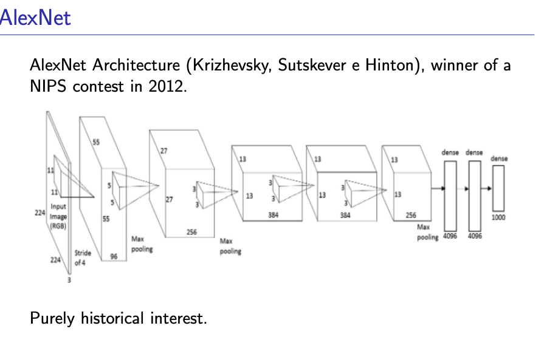
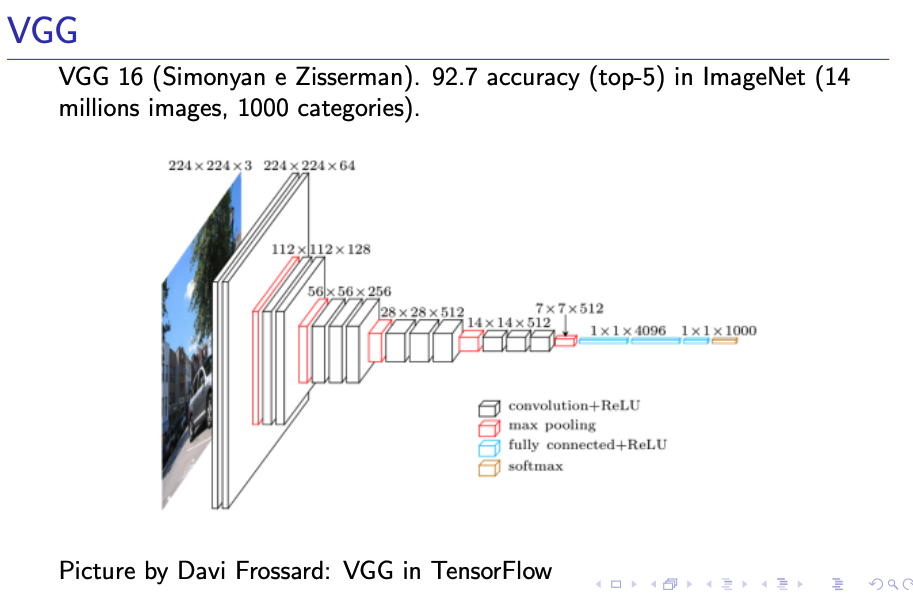
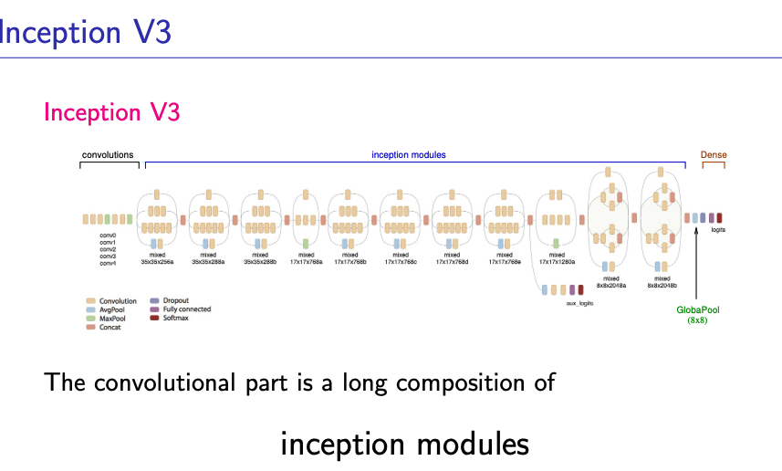
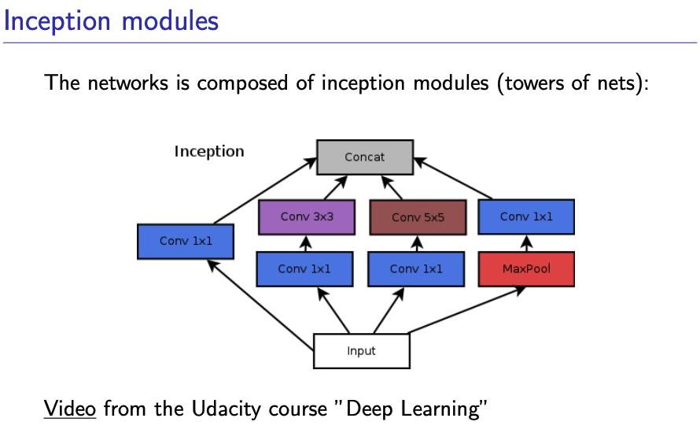
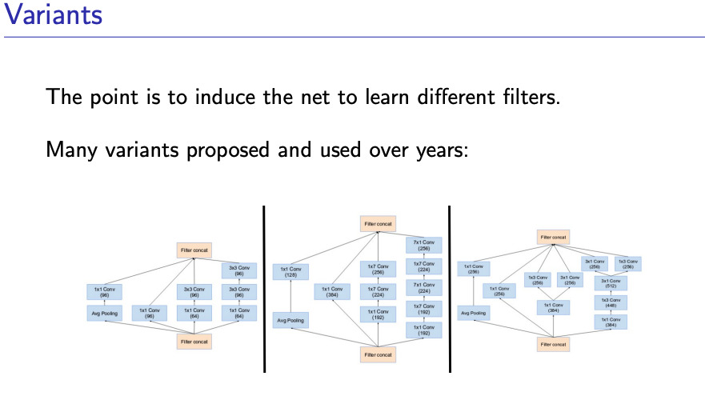
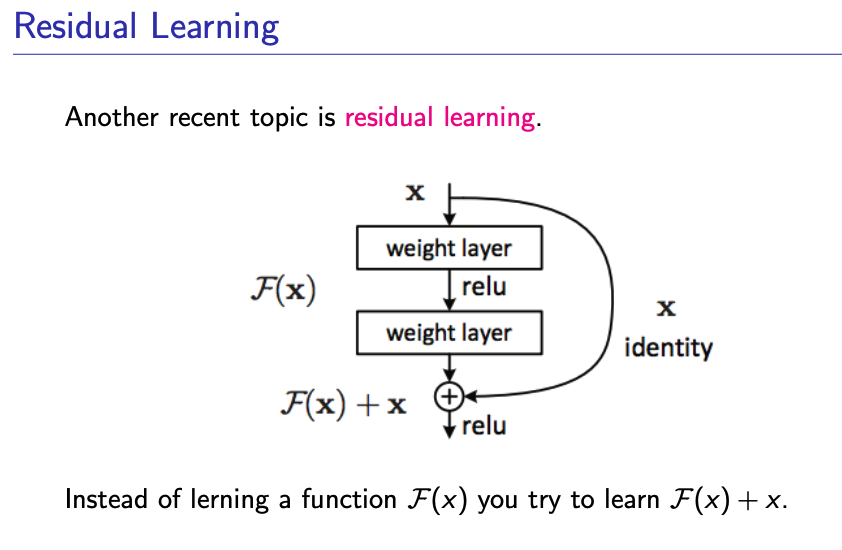
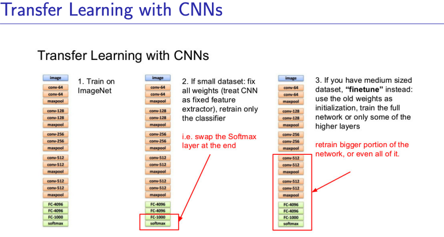
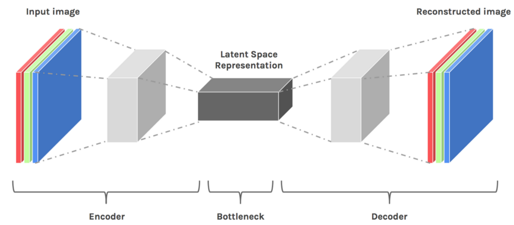

Why Residual Learning works?
- it seems to be a good idea to try to learn non-linear
corrections over a linear baseline

- during back propagation, the gradient at higher layers
can easily pass to lower layers, withouth being
mediated by the weight layers, which may cause vanishing
gradient or exploding gradient problem.

##### When Transfer Learning makes sense
transferring knowledge from problem A to problem
B makes sense if

- the two problems have “similar” inputs
- we have much more training data for A
than for B

If layers are the bricks and mortar, Architectures are the blueprints of the building. An architecture defines the macro-flow of data: how information is compressed, stored, and translated.

Latent space is a compressed, lower-dimensional representation of high-dimensional data (like images or text) learned by machine learning models, where similar items are placed closer together. It captures essential features and hidden patterns, enabling generative models like VAEs and GANs to create new data samples

The Autoencoder: The Latent Space ArchitectBefore we can classify or translate, we must understand compression. An Autoencoder is an unsupervised architecture that learns to copy its input to its output.The Problem: If you just connect Input directly to Output, the network learns the identity function ($f(x) = x$). That is useless.The Architecture: We force the data through a severe structural bottleneck.The Encoder: Smashes a high-dimensional input (like a $1024 \times 1024$ image) down into a tiny, dense vector called the Latent Vector ($z$).The Decoder: Is forced to reconstruct the original $1024 \times 1024$ image using only the information squeezed into $z$.The Math: It minimizes the Reconstruction Loss (usually Mean Squared Error): $L = \| X - D(E(X)) \|^2$Why it matters: To minimize this loss, the Encoder must learn the most critical, fundamental features of the data (ignoring noise). The Latent Space $z$ becomes a mathematically pure representation of your dataset.

Encoder-Classifier & Transfer Learning: The Brain TransplantOnce you understand Autoencoders, Transfer Learning makes perfect sense.The Concept: Training an Encoder to understand the visual world from scratch takes millions of images and massive GPU clusters. You don't want to do that every time you build a cat vs. dog classifier.The Architecture:Take a massive, pre-trained network (like ResNet50) that has already learned a brilliant Encoder.Chop off its original Decoder/Head.Take the Latent Vector $z$ output and attach a brand new, untrained Dense layer (the Classifier) tailored to your specific problem (e.g., 2 output nodes for Cat/Dog).Transfer Learning: You "freeze" the weights of the Encoder (so they don't change during training) and only train your new tiny Classifier head. You get state-of-the-art accuracy using only a few hundred images, because the network already knows how to see; it just needs to learn what to call what it sees.

 Encoder-Decoder (Seq2Seq): The TranslatorAn Autoencoder translates $X \rightarrow X$. An Encoder-Decoder translates $X \rightarrow Y$ (where $Y$ is a completely different domain).The Architecture:The Encoder reads an English sentence and compresses its entire semantic meaning into a single Context Vector.The Decoder takes that Context Vector and unfolds it into a French sentence.The Flaw (The Context Bottleneck): In early RNN-based Seq2Seq models, forcing an entire paragraph of English into a single vector caused the network to "forget" the beginning of the sentence by the time it reached the end. (This exact flaw is what prompted the invention of the Attention mechanism we discussed earlier).

 U-Net: The Spatial PreserverU-Net is an elegant modification of the Autoencoder, designed specifically for Image Segmentation (e.g., highlighting tumors in MRI scans).The Problem: In an Autoencoder, the deep bottleneck $z$ learns what is in the image (e.g., "there is a tumor"), but because it compressed the image so heavily, it completely forgot where the tumor is located spatially. You cannot draw a clean boundary.The U-Net Solution (Skip Connections): U-Net creates horizontal bridges. It takes the high-resolution, early layers from the Encoder (which still have exact spatial coordinates) and concatenates them directly to the late layers of the Decoder.The Result: The Decoder gets the "What" from the deep bottleneck, and the "Where" from the skip connections, allowing it to output a pixel-perfect classification mask.

 Transformers: BERT vs. GPT
The Transformer architecture split the Deep Learning world into two massive, distinct branches based on how they use the Encoder-Decoder paradigm.

A. BERT (The Encoder-Only Paradigm)
What it is: Bidirectional Encoder Representations from Transformers.

The Architecture: It strips away the Decoder completely. It only uses the Encoder block (which reads the entire sequence forwards and backwards simultaneously).

How it trains (Masked Language Modeling): You take a sentence, blank out 15% of the words, and ask BERT to guess the missing words. "The cat sat on the [MASK]."

The Use Case: Because it sees the entire context at once, it is the undisputed king of understanding text. If you need to classify documents, perform Sentiment Analysis, or do Named Entity Recognition (NER), you use an Encoder-like BERT.

B. GPT (The Decoder-Only Paradigm)
What it is: Generative Pre-trained Transformer.

The Architecture: It strips away the Encoder completely. It relies entirely on the Decoder block, utilizing the strict Causal Mask we implemented earlier.

How it trains (Autoregressive): It reads a sequence and predicts the very next token. It is mathematically barred from looking into the future.

The Use Case: Because its entire architecture is built around "what comes next?", it is the undisputed king of generation. It hallucinates, creates, and writes code.

(Note: Models like T5 or BART use the full Encoder-Decoder Transformer architecture, making them excellent at tasks that require both deep understanding and heavy generation, like Summarization or Translation).