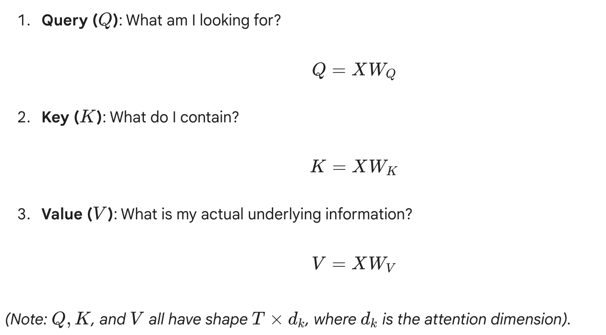
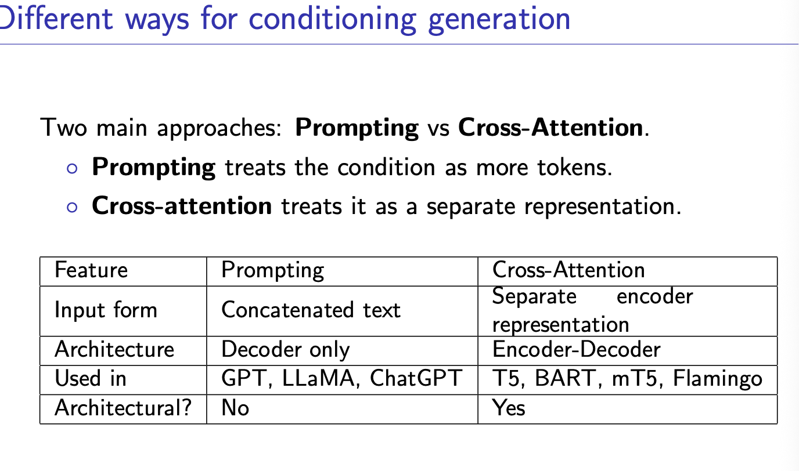
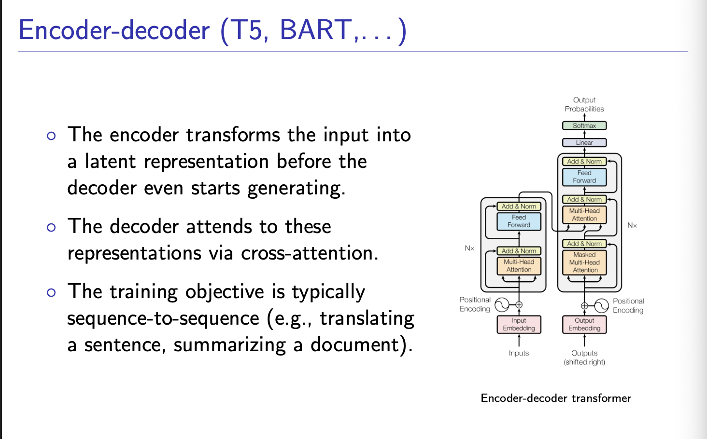

The Core Concept: Self-AttentionSelf-attention is simply a routing mechanism. Imagine a room full of people (tokens/words). Everyone has a nametag with their skills (Keys), everyone is shouting what they need help with (Queries), and everyone has actual knowledge to share (Values).Mathematically, we represent our input sequence as a matrix $X$ of shape $(T, C)$, where $T$ is the sequence length (Time) and $C$ is the embedding dimension (Channels).For every token in $X$, we create three new vectors using learned linear weight matrices ($W_Q, W_K, W_V$):

. The Math of Scaled Dot-Product Attention

How do we figure out which tokens should communicate? We calculate the dot product between every Query and every Key.Step 1: The Affinity MatrixWe multiply the Query matrix by the transpose of the Key matrix:$$ \text{Scores} = QK^T $$Since $Q$ is $(T, d_k)$ and $K^T$ is $(d_k, T)$, the result is a $(T, T)$ matrix.This is the Affinity Matrix. The value at row $i$, column $j$ tells us exactly how much token $i$ is "interested" in token $j$.

Step 2: The Scaling Factor (Crucial Detail)

We divide the scores by $\sqrt{d_k}$ (the square root of the dimension of the keys).Why? If $Q$ and $K$ have unit variance (variance of 1), their dot product will have a variance of $d_k$. If $d_k$ is large (e.g., 64), the dot products become massive numbers. When you feed massive numbers into a Softmax function, it outputs a "peaky" distribution (one value gets 100%, everything else gets 0%). This destroys backpropagation gradients. Scaling by $\sqrt{d_k}$ forces the variance back to 1.$$ \text{Scaled Scores} = \frac{QK^T}{\sqrt{d_k}} $$

Step 3: Softmax (The Attention Weights)

We apply the Softmax function row-wise to the scaled scores.$$ \text{Attention Weights} = \text{softmax}\left(\frac{QK^T}{\sqrt{d_k}}\right) $$Now, every row sums to exactly $1.0$. These are percentages. Row $i$ tells us what percentage of information token $i$ wants to absorb from every other token.

Step 4: The Weighted Sum (The Output)

Finally, we multiply our $(T, T)$ Attention Weights by the $(T, C)$ Value matrix ($V$).$$ \text{Output} = \text{Attention Weights} \times V $$If token 1 gave 90% of its attention to token 4, then 90% of token 1's new output vector will simply be token 4's Value vector. The tokens have successfully communicated.

LMs are next-token predictors by default
But we often want:
◦ Translate: English → French
◦ Summarize a paragraph
◦ Answer a question
◦ . . .
LLMs do not do these operations natively.
They just generate text - but we can condition them to behave
differently depending on what we input

The Encoder (The Left Stack): Total ComprehensionThe left side of the diagram is the Encoder. Its entire job is to read the source text and build a mathematically perfect, context-rich representation of it.Unmasked Self-Attention: Look at the first orange box in the left stack: it just says "Multi-Head Attention" (unlike the right side, which says "Masked").The Implication: The Encoder is fully bidirectional. It reads the entire input sequence at once. Every single word can look at every other word—past, present, and future—to understand the full context. If it reads the word "bank", it looks ahead at the rest of the sentence to know if it's a river bank or a financial bank before locking in its mathematical representation.The Output: After passing through $N$ layers (usually 6 to 12), the Encoder spits out a final set of vectors. This is the "latent representation" mentioned in your slide. It is a dense, high-dimensional map of the source sentence's meaning.

The Decoder (The Right Stack): Autoregressive Generation
The right side is the Decoder. Its job is to take the Encoder's deep understanding and generate a brand new sequence, one word at a time.

Masked Self-Attention (The Bottom Box): As the Decoder starts generating the output (e.g., the English translation), it must do so autoregressively (predicting the next word based only on the previous words). Therefore, its first attention layer is strictly Masked. It is mathematically blinded from looking at future tokens it hasn't generated yet.

The Inputs (Shifted Right): The diagram shows the input to the Decoder as "Outputs (shifted right)". This just means that to predict word number 4, you feed it words 1, 2, and 3.

The Bridge: Cross-Attention (The Magic Mechanism)

This is the most critical part of the diagram. Look at the arrows flowing from the top of the left Encoder stack directly into the middle of the right Decoder stack.This middle box is Multi-Head Cross-Attention. This is where the two sequences finally meet. Here is how the math works:In standard Self-Attention, the Queries ($Q$), Keys ($K$), and Values ($V$) all come from the exact same sequence. In Cross-Attention, they are split:The Query ($Q$) comes from the Decoder: The Decoder looks at the English words it has generated so far and creates a Query vector. (e.g., "I just wrote 'The black', I need a noun now. What should I focus on?")The Keys ($K$) and Values ($V$) come from the Encoder: The Encoder provides the final latent representations of the original French sentence.The Match: The Decoder's Query calculates the dot-product against all the Encoder's Keys. It finds the exact French word that corresponds to what it needs to translate next, pulls its Value, and pulls that information into the Decoder stream.

Why use this over GPT? (The Objective)

As the slide mentions, the training objective is sequence-to-sequence.

If you ask a Decoder-only model (like GPT) to summarize a 10-page document, it has to read the document and generate the summary simultaneously using the exact same self-attention mechanism, which can cause it to lose track of the broader context.

An Encoder-Decoder model (like T5) handles this much better. The Encoder reads the entire 10-page document thoroughly, cross-references every paragraph, and builds a rock-solid latent representation. Only then does the Decoder wake up, and it uses Cross-Attention to dynamically "glance back" at specific parts of that 10-page representation as it writes the summary.