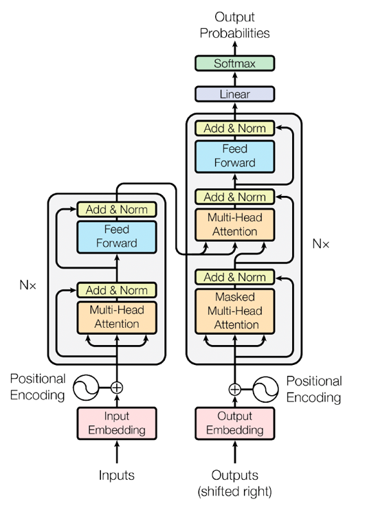
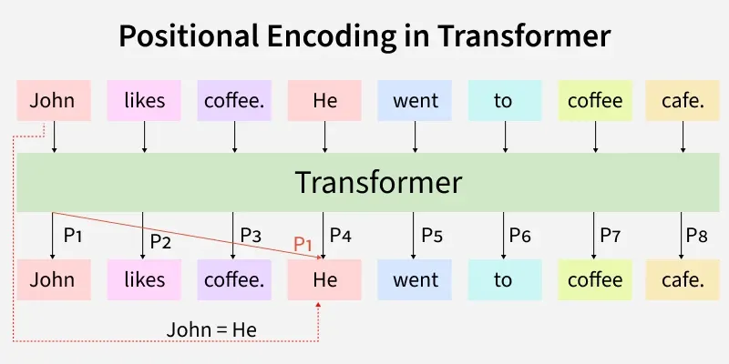

The Transformer Architecture (The Paradigm Shift)

Before Transformers (introduced in the landmark 2017 paper "Attention Is All You Need"), sequence tasks like translation relied heavily on Recurrent Neural Networks (RNNs) and LSTMs.

The major flaw with RNNs is that they process data sequentially—step by step. They are slow to train and struggle to remember the beginning of a long paragraph by the time they reach the end.

The Transformer Solution:
Transformers throw away recurrence entirely. They are a pure feed-forward architecture that relies entirely on Attention Mechanisms to process sequences. This allows them to look at an entire sequence simultaneously, making them highly parallelizable and capable of understanding long-range dependencies instantly.

Multi-Head Attention

Instead of calculating attention just once, Transformers use "Multi-Head" attention.

The Concept: The network calculates attention multiple times in parallel (e.g., using 8 "heads").

The Benefit: This creates multiple "representation subspaces." For example, in the sentence "The animal didn't cross the street because it was too tired," one attention head might focus on figuring out what "it" refers to (the animal), while another head might focus on the grammatical structure of the sentence.

Positional Encoding

Because Transformers process all words in a sentence at the exact same time (unlike an RNN which reads left-to-right), the attention mechanism has absolutely no concept of word order. The sentence "The dog bit the man" looks mathematically identical to "The man bit the dog."

The Fix: We inject a mathematical "timestamp" or "Positional Encoding" into the word embeddings before they enter the network.

The Math: Aserti notes the use of Sinusoid Encoding. By adding sine and cosine waves of varying frequencies to the data, the network can mathematically deduce the relative position and distance between any two words in the sequence.

The Learning Task & Causal Masking

When training a model for language generation (like predicting the next word), there is a critical problem: Transformers see everything at once.The Problem: If you are training a model to predict the word "mat" in the sequence "The cat sat on the [mat]", but you feed the entire sequence into the self-attention mechanism, the model will just look ahead, see the word "mat", and cheat. It learns nothing.The Solution (Masking the Future): We must enforce causality. We do this by applying a mathematical mask to the attention score matrix.The Math: We take all the attention scores that correspond to "future" tokens (values above the diagonal of the matrix) and set them to negative infinity ($-\infty$). When the network applies the Softmax function to turn these scores into percentages, $e^{-\infty}$ becomes $0$. The model is now mathematically blind to the future.