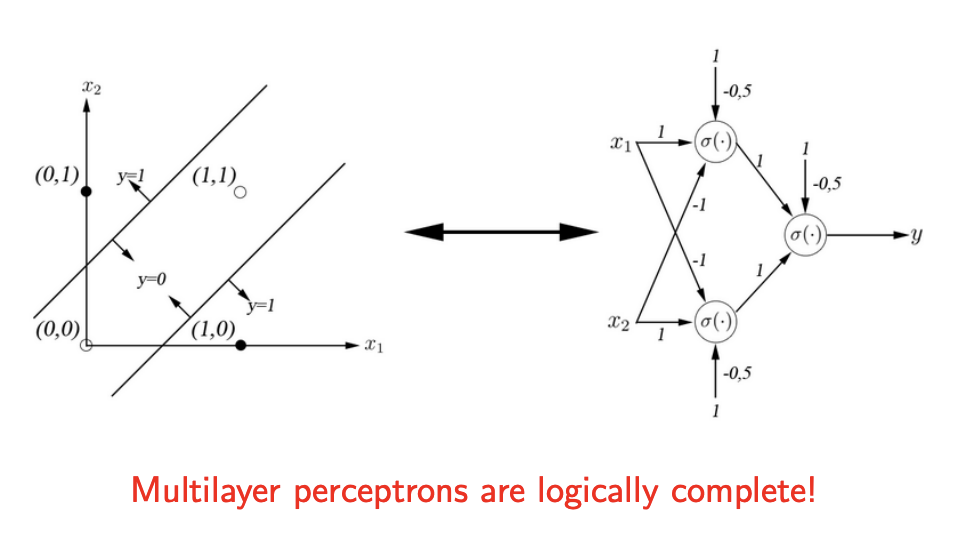
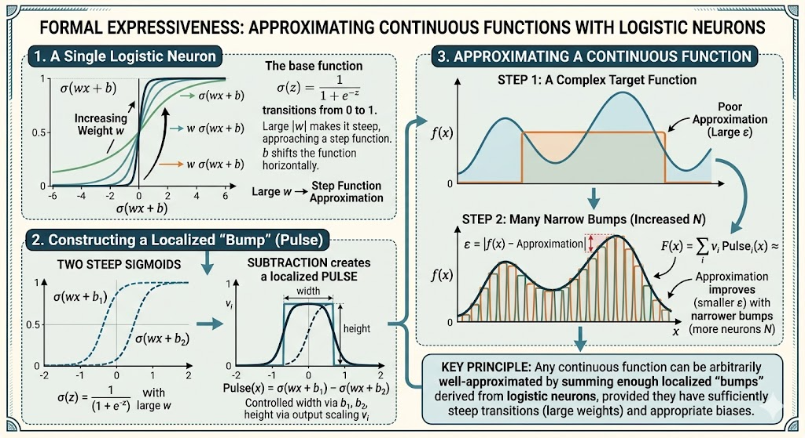

## Expressiveness

In machine learning, expressiveness (or expressive power) refers to the range and complexity of functions a neural network can successfully learn and represent.

If a dataset has highly complex, tangled, or non-linear patterns, you need a network with high expressiveness to untangle them. If the data is simple, a network with low expressiveness is sufficient.

In machine learning, **expressiveness** (or **expressive power**) refers to the range and complexity of functions a neural network can successfully learn and represent. 

If a dataset has highly complex, tangled, or non-linear patterns, you need a network with high expressiveness to untangle them. If the data is simple, a network with low expressiveness is sufficient.

Here is a breakdown of how expressiveness works and what controls it.

---

### **1. The Core Concept: The Universal Approximation Theorem**
The concept of expressiveness is anchored in a famous mathematical principle called the **Universal Approximation Theorem**. 

It states that a feed-forward neural network with just a **single hidden layer** containing a finite number of neurons can approximate *any* continuous function to any desired degree of accuracy—provided it has the right non-linear activation function and enough neurons.

In simple terms: **A neural network is the ultimate mathematical chameleon.** Given enough parameters, it can mold its decision boundaries to perfectly separate any data, no matter how complex.

### **2. What Controls Expressiveness?**

Three main architectural choices dictate how expressive your model is:

* **Depth (Number of Layers):** Adding layers increases expressiveness *exponentially*. Each successive layer combines the features learned by the previous layer. Think of it like folding a piece of paper: a single fold (one layer) creates a simple crease, but multiple folds (deep layers) allow you to create complex origami. This is why **Deep** Learning is so powerful.
* **Width (Neurons per Layer):** Adding more neurons to a single layer increases expressiveness *linearly*. It gives the network more "memory capacity" to learn distinct features at that specific stage of processing.
* **Activation Functions:** Without non-linear activation functions (like ReLU or Sigmoid), a neural network of *any* depth collapses into a simple linear equation ($y = mx + b$). Non-linearity is the spark that gives a network its expressive ability to curve, bend, and warp mathematical space.

### **3. The Double-Edged Sword: Overfitting**

You might ask: *"If high expressiveness is good, why not just build massive networks with thousands of layers?"*

Because of **Overfitting**. 
* **Under-expressive model (Underfitting):** The model is too simple. It cannot capture the underlying pattern (e.g., trying to fit a straight line to a curve).
* **Perfectly expressive model:** The model captures the true underlying pattern of the data perfectly.
* **Over-expressive model (Overfitting):** The model has so much capacity that it stops learning the *pattern* and starts memorizing the *noise*. It draws absurdly complex, squiggly boundaries that perfectly classify the training data but fail completely on new, unseen data.

### Optional yet useful

Mathematically, the **expressiveness** (or expressive capacity) of a neural network is defined by the size, complexity, and diversity of the **Hypothesis Space** ($\mathcal{H}$) it can represent. 

When you build a neural network, you are essentially defining a massive, parameterized mathematical function. Expressiveness is the measure of exactly *which* target functions that parameterized network is capable of imitating.

Here is the rigorous mathematical breakdown of expressiveness.

---

### **1. The Hypothesis Space ($\mathcal{H}$)**

Let a neural network be a function $f(x; \theta)$, where $x$ is the input vector and $\theta$ represents all the learnable parameters (weights $W$ and biases $b$).

The **hypothesis space**, $\mathcal{H}$, is the set of all possible functions the network can compute as its parameters $\theta$ are varied across all possible real numbers:
$$\mathcal{H} = \{ f(x; \theta) \mid \theta \in \mathbb{R}^d \}$$
*(Where $d$ is the total number of parameters).*

* **Low Expressiveness:** $\mathcal{H}$ is small and only contains simple functions (e.g., if the network only has linear activations, $\mathcal{H}$ is strictly the set of all affine transformations).
* **High Expressiveness:** $\mathcal{H}$ is vast and contains highly complex, non-linear functions capable of mapping intricate manifolds.

### **2. The Universal Approximation Theorem (Formalized)**

The mathematical guarantee of expressiveness is the Universal Approximation Theorem. Let $C(X)$ be the space of continuous functions on a compact subset $X \subset \mathbb{R}^n$. 

The theorem states that if $\mathcal{H}$ is generated by a feed-forward network with at least one hidden layer and a non-polynomial activation function (like ReLU or Sigmoid), then $\mathcal{H}$ is **dense** in $C(X)$. 

Mathematically, for any target function $F \in C(X)$ and any error margin $\epsilon > 0$, there exists a set of parameters $\theta$ such that:
$$\sup_{x \in X} |F(x) - f(x; \theta)| < \epsilon$$

In plain English: No matter how wild or chaotic the true target function $F(x)$ is, there is a configuration of weights in your network that will approximate it with an error smaller than $\epsilon$.

### **3. Quantifying Expressiveness: How do we measure it?**

While the Universal Approximation Theorem tells us a network *can* approximate anything, it doesn't tell us how efficiently it does so. Mathematicians measure a network's expressiveness using two primary metrics:

#### **A. Vapnik-Chervonenkis (VC) Dimension**
Used mostly for classification, VC dimension measures the maximum number of data points a network can "shatter" (perfectly separate, no matter what binary labels you assign to them).
* For a network with $W$ weights and a step activation function, the VC dimension scales as $O(W \log W)$. 
* This means the network's capacity to memorize distinct data configurations grows slightly faster than the number of parameters.

#### **B. Number of Linear Regions (For ReLU Networks)**
Because ReLU functions $f(x) = \max(0, x)$ are piecewise linear, a neural network using ReLU activations is entirely a massive piecewise linear function. It partitions the continuous input space $\mathbb{R}^n$ into distinct convex polytopes (geometric regions). Inside each region, the network behaves like a simple linear equation.

Expressiveness can be quantified by **how many regions** the network can fold the space into:
* A **shallow network** (one hidden layer) with $N$ neurons splits the space into $\sim O(N^d)$ regions.
* A **deep network** with $L$ layers splits the space exponentially into $\sim O(N^L)$ regions.

### **4. The Mathematical Advantage of Depth**

This brings us to the most important mathematical finding in modern deep learning: **Depth creates exponential expressiveness.**

There exist certain mathematical functions that can be represented by a deep neural network of polynomial size (e.g., $O(N)$ neurons per layer), but approximating that same function with a *shallow* network would require an **exponential** number of neurons ($O(2^N)$).

By stacking layers, the network essentially composes functions:
$$f(x) = f^{(L)}(f^{(L-1)}(\dots f^{(1)}(x) \dots))$$
This function composition allows deep networks to fold, twist, and partition the input space exponentially more times than a shallow network with the exact same total number of parameters.

1.  A single perceptron can compute NAND.
2.  NAND is functionally complete.

then, why perceptrons are not complete?

The flaw in the deduction lies in the physical architecture—specifically, **composition** (or wiring).

Here is the breakdown of why the logic doesn't bridge the gap to make a *single* perceptron complete.

### **The Missing Link: Composition vs. Single Unit**

When computer scientists say "NAND is logically complete," they mean that you can build any logical circuit **if you are allowed to wire the output of one NAND gate into the input of another NAND gate**. 

To build an XOR gate out of NAND gates, you cannot do it with just one. You need at least four NAND gates wired together in a circuit (meaning the data must flow through multiple sequential steps).

A single perceptron is equivalent to **one** NAND gate. It takes inputs, applies weights, calculates a threshold, and gives an output. However, a single perceptron cannot feed its own output back into itself, nor does it possess internal intermediate steps. 

Therefore:
* A single perceptron can only do what a *single* NAND gate can do (which is just NAND).
* To get the "logical completeness" of NAND, you must wire multiple perceptrons together into layers. 

### **The Mathematical Wall: Linear Separability**

Mathematically, a single perceptron simply draws a single straight line (a hyperplane) across your data. Its equation is strictly linear before the threshold:
$$w_1 x_1 + w_2 x_2 + b = 0$$

If you look at the truth table for XOR, the positive results (1) and negative results (0) are positioned diagonally from each other. **You cannot draw a single straight line that separates them.**

Because a single perceptron can only draw one straight line, it is physically incapable of computing XOR, no matter how you adjust the weights. 

### **The Resolution: Multi-Layer Perceptrons (MLPs)**

If you take perceptrons and wire them together the exact same way hardware engineers wire NAND gates together, **they are complete.**

When you connect the output of one layer of perceptrons to the input of another layer, you are creating a Multi-Layer Perceptron (MLP). The first layer draws multiple lines (extracting intermediate logic, like computing AND/OR), and the final layer combines those lines to solve complex, non-linear problems like XOR. 

By adding depth (composition), the network inherits the universal completeness you identified.

Universal Approximation Theorem guarantees that a shallow network (one hidden layer) *can* compute any continuous function. The catch is the word **"can."** Just because a shallow network *can* approximate a function doesn't mean it can do so **efficiently**. To approximate highly complex, high-dimensional data (like a 4K image or human language), a shallow network would need to be so absurdly wide that it would require more neurons than there are atoms in the universe. 

Deep networks compute the same functions with radically fewer neurons through **Function Composition** and **Feature Reusability**. Here is how it works mathematically and conceptually.

---

### **1. The Math: Addition vs. Composition**

* **Shallow Networks (Width) = Addition:** When you add neurons to a single hidden layer, you are taking their outputs and adding them together. If one neuron creates one "bend" or "fold" in your mathematical space, adding $N$ neurons gives you roughly $O(N)$ bends. The complexity grows **linearly**.
* **Deep Networks (Depth) = Composition:** When you stack layers, you are feeding the output of one function into another: $f(g(h(x)))$. Because of this composition, each layer multiplies the folds created by the previous layer. If you have $L$ layers, the complexity (the number of distinct regions the network can recognize) grows **exponentially** at a rate of $O(2^L)$.

**The Result:** A deep network can create a boundary with a billion folds using a few hundred neurons. A shallow network would need a billion neurons to draw that same boundary.

### **2. The Analogy: Folding Space**

Imagine you have a piece of dough, and you want to create 1,000 distinct, flaky layers (like a croissant). 
* **The Shallow Approach:** You lay out one massive, flat sheet of dough, cut it into 1,000 separate squares, and stack them one by one. This takes 1,000 individual operations (neurons).
* **The Deep Approach:** You take the dough, fold it in half, roll it out, fold it in half again, and repeat. 
    * Fold 1: 2 layers
    * Fold 2: 4 layers
    * Fold 3: 8 layers
    * Fold 10: $2^{10} = 1,024$ layers.
    
By using depth (folding the output of the previous step), you achieved 1,024 layers using only **10 operations (neurons)**. 

### **3. Feature Reusability (The Hierarchical Advantage)**

Data in the real world is almost always hierarchical. Deep networks mimic this reality, which makes them incredibly efficient.

Take facial recognition as an example:
* **Layer 1** detects simple edges and lines.
* **Layer 2** combines those edges to find curves and corners.
* **Layer 3** combines curves to form eyes, noses, and mouths.
* **Layer 4** combines those features to recognize a specific face.

In a deep network, Layer 3 doesn't have to re-learn what a "curve" is; it just reuses the curves already discovered by Layer 2. 

A **shallow network** cannot reuse features because it only has one step. It has to learn how to map raw pixels directly to "John's face," and then learn a completely separate mapping from raw pixels to "Sarah's face," resulting in massive, redundant inefficiency.

**Formal expressiveness in the continuous case approximating functions with logistic neurons.***  

This touches on one of the most elegant and foundational proofs in deep learning theory: **George Cybenko’s 1989 Universal Approximation Theorem**. 

When we talk about formal expressiveness in the continuous case using logistic (sigmoid) neurons, we are proving mathematically that a shallow network (just one hidden layer) can approximate *any* continuous function to *any* desired degree of accuracy, provided it has enough neurons.

Here is the formal breakdown of how smooth, continuous logistic S-curves can be molded to fit any chaotic shape.

---

### **1. The Formal Mathematical Statement**

Let $I_n$ be an $n$-dimensional unit hypercube (your input space, scaled between 0 and 1). Let $C(I_n)$ denote the space of all continuous functions on this hypercube. 

Cybenko’s theorem states that for any target continuous function $f \in C(I_n)$ and any acceptable error margin $\epsilon > 0$, there exists a shallow neural network function $F(x)$ such that:
$$|F(x) - f(x)| < \epsilon \quad \text{for all } x \in I_n$$

The network function $F(x)$ is defined as a finite sum of $N$ logistic neurons:
$$F(x) = \sum_{i=1}^{N} v_i \sigma(w_i^T x + b_i)$$
Where:
* $w_i \in \mathbb{R}^n$ are the input weights.
* $b_i \in \mathbb{R}$ are the biases.
* $v_i \in \mathbb{R}$ are the output weights.
* $\sigma(z) = \frac{1}{1 + e^{-z}}$ is the continuous logistic sigmoid function.

### **2. The Mechanical Proof: Building "Bumps"**

How does a smooth, continuous $S$-curve ($\sigma$) approximate a highly complex, jagged, or undulating function? The proof relies on turning continuous curves into localized **"step functions"** or **"bumps."**

Here is the step-by-step mathematical logic:

**Step A: The Steep S-Curve**
The logistic function $\sigma(wx + b)$ transitions smoothly from 0 to 1. But if you make the weight $w$ incredibly large (e.g., $w \to \infty$), the transition becomes instantaneous. The smooth S-curve turns into a sharp, discrete step function (a Heaviside step). 
The bias $b$ simply controls *where* on the x-axis this step occurs.

**Step B: Creating a Pulse (The Tower)**
If you take two steep logistic neurons, give them slightly different biases ($b_1$ and $b_2$), and subtract one from the other (by setting $v_1 = 1$ and $v_2 = -1$), you get a localized pulse, bump, or "tower."
$$Pulse(x) = \sigma(wx + b_1) - \sigma(wx + b_2)$$
* Before $b_1$: Both are 0. (Sum = 0)
* Between $b_1$ and $b_2$: The first is 1, the second is 0. (Sum = 1)
* After $b_2$: Both are 1. ($1 - 1 = 0$)

**Step C: Riemann Summation**
Once you can mathematically construct a localized rectangle/bump of any width and any height out of logistic neurons, you have won. You can approximate *any* continuous curve by simply stacking these localized bumps side-by-side along the curve, exactly like a Riemann Sum in integral calculus. 

If you want a tighter approximation (a smaller $\epsilon$), you just make the bumps narrower and use more of them (increasing $N$).

### **3. Why Logistic Neurons Specifically?**

Cybenko proved this specifically for sigmoidal functions because they are **monotonically increasing** and bounded between 0 and 1. 

However, later mathematicians (like Kurt Hornik) proved that the exact shape of the activation function doesn't actually matter. As long as the activation function is continuous, non-constant, and bounded (or at least non-polynomial, which includes ReLU), the Universal Approximation Theorem holds. **It is the architecture of the network (the weighted sums and layers) that creates the expressiveness, not the specific biological shape of the neuron.**

