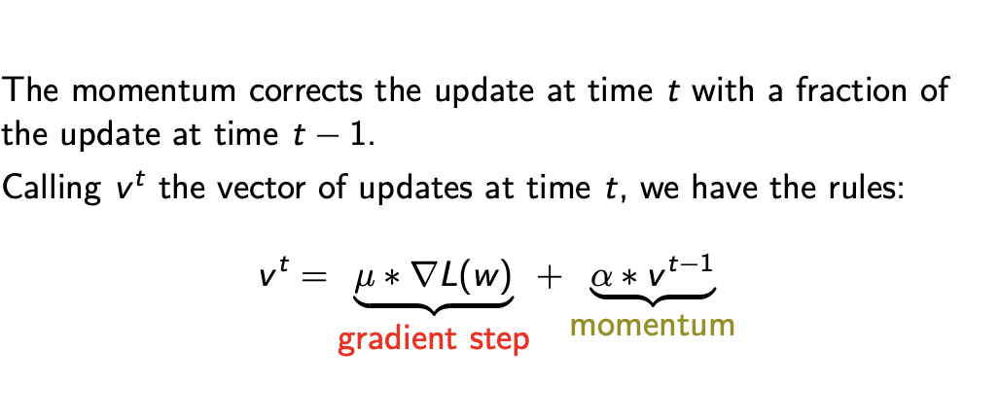

## Training

The mathematical tool for training we need are derivatives. The derivative is
the tangent of the angle α. The sign of the derivative provides orientation: it is positive if
α < 90◦
and negative if 90◦ < α < 180◦
If the derivative is positive we must decrease the parameter, if it is
negative we must increase it (since we are descending).
The magnitude of the derivative is the related the steepness of the
tangent: it is close to 0 if the angle is flat, and high when the
angle is almost right.

If we have many parameters, we have a different derivative for
each of them (the so called partial derivatives).
The vector of all partial derivatives is called the gradient of the
function.
∇w [L(w)] = [∂L(w)
∂w1
, . . . ,
∂L(w)
∂wn
]
With multiple parameters, the
magnitude of partial derivatives
becomes relevant, since it governs the orientation of gradient.
The gradient points in the direction of steepest ascent.

Optimizations
- Stochastic Gradient Descent
- Momentum

If, during consecutive training steps, the gradient seems to follow a
stable direction, we could improve its magnitude, simulating the
fact that it is acquiring a momentum along that direction, similarly
to a ball rolling down a surface.
The hope is to reduce the risk
to get stuck in a local minimum, or a plateau.
No theoretical justification

