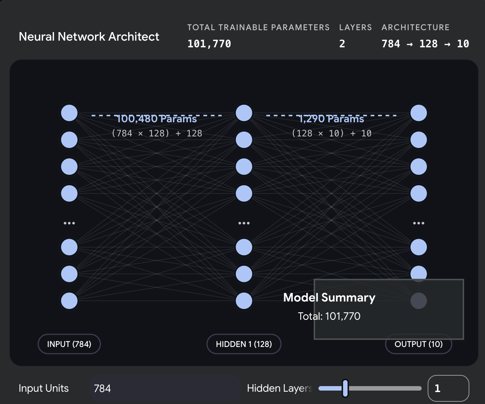
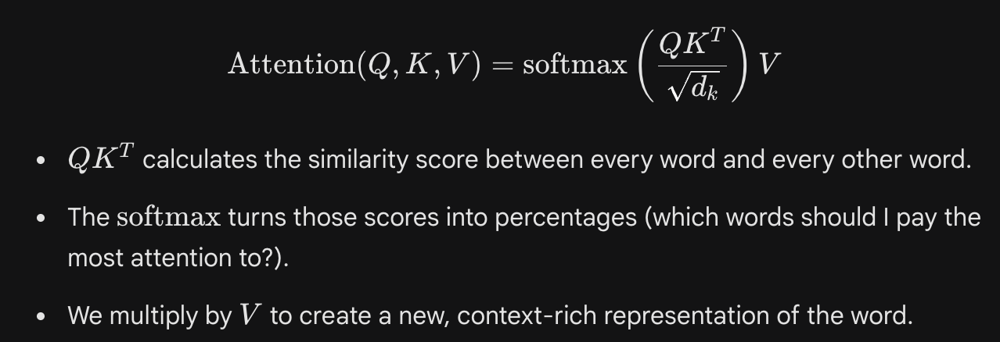
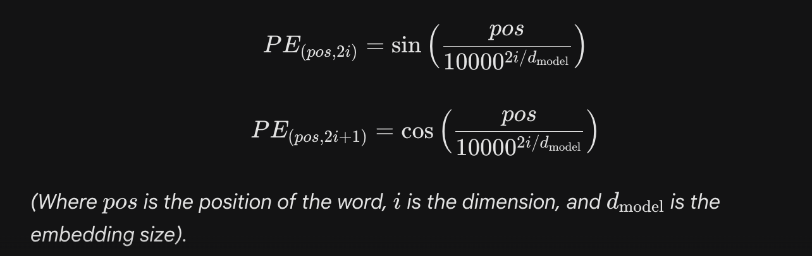

### **1. The Input Layer (The Receiver)**
This is the entry point of your network. 
* **What it does:** It does absolutely no computation. It simply holds your raw data and passes it forward.
* **Size (Neurons):** The number of neurons here must exactly match the number of features in a single data sample. 
* **Example:** In your MNIST digit network, the input shape was `784`. That means the input layer consists of 784 passive nodes, each holding the pixel intensity of one specific pixel from the $28 \times 28$ image.

### **2. The Hidden Layers (The Brain)**
Everything between the input and output is a hidden layer. They are "hidden" because you, the engineer, do not provide them with explicit ground-truth targets (unlike the input data or output labels). They figure out what to learn entirely on their own via backpropagation.

* **What it does:** This is where the actual "learning" and "expressiveness" happen. Each neuron in a hidden layer performs two mathematical operations:
    1.  **Linear Transformation:** It multiplies the outputs of the previous layer by its learned **weights**, sums them up, and adds a **bias**: 
        $$Z = W \cdot X + b$$
    2.  **Activation:** It passes that sum through a non-linear activation function (like ReLU) to decide if the neuron should "fire": 
        $$A = \text{ReLU}(Z)$$
* **Depth vs. Width:**
    * **Width:** How many neurons are in a single hidden layer. Wider layers memorize more features at that specific stage of processing.
    * **Depth:** How many hidden layers are stacked sequentially. Deeper networks learn hierarchical representations (e.g., Layer 1 learns edges $\rightarrow$ Layer 2 learns shapes $\rightarrow$ Layer 3 learns whole objects).

### **3. The Output Layer (The Decision Maker)**
This is the final stage of the assembly line. It takes the highly processed, abstract features from the final hidden layer and translates them into a human-readable prediction.

* **What it does:** It maps the network's internal logic to your specific problem space.
* **Size and Activation:** This is strictly dictated by your task.
    * **Regression (predicting a price):** 1 neuron, Linear activation (no activation).
    * **Binary Classification (Dog vs. Cat):** 1 neuron, **Sigmoid** activation (outputs a probability between 0 and 1).
    * **Multi-Class Classification (Digits 0-9):** 10 neurons, **Softmax** activation (outputs a probability distribution across 10 classes that sums to 1.0).

---

### **The Math of Connections: Parameters**
When layers connect, they generate **parameters** (the weights and biases). The total parameter count dictates how heavy the model is and how much memory it requires.
The formula for the number of parameters between Layer $A$ and Layer $B$ is:
$$\text{Parameters} = (\text{Neurons in A} \times \text{Neurons in B}) + \text{Neurons in B (for biases)}$$

To see how adding, removing, or resizing layers drastically alters the architecture and mathematical footprint of a network, try building one in the sandbox below.

1. Dense (Linear / Fully Connected) Layers: The Brute Force GeneralistWe have touched on this heavily with the mynet2 architecture. In a Dense layer, every single neuron is connected to every single output from the previous layer.The Concept: It assumes no spatial relationship in the data. Pixel 1 and Pixel 784 are treated exactly the same as Pixel 1 and Pixel 2. It looks at the entire global picture all at once to make a decision.The Math: It is a pure affine transformation.$$Y = WX + b$$(Where $W$ is a massive weight matrix, $X$ is the input vector, and $b$ is the bias vector).The Pros: Universal expressiveness. Given enough parameters, it can learn any mapping.The Cons: It is horribly inefficient. Because everything connects to everything, the parameter count explodes. If you feed a standard $1000 \times 1000$ image into a Dense layer with 1000 neurons, you immediately generate 1 billion parameters. It is highly prone to overfitting.

2. Convolutional Layers: Convolutional Neural Networks (CNNs) were designed to solve the inefficiency of Dense layers by making a structural assumption: local proximity matters.The Concept: Instead of looking at the whole image at once, a Convolutional layer uses a small "filter" or "kernel" (like a $3 \times 3$ grid) that slides across the input data.Parameter Sharing: The exact same $3 \times 3$ filter slides across the entire image. If it learns to detect a vertical edge in the top-left corner, it uses those exact same weights to detect a vertical edge in the bottom-right corner.Translation Invariance: An object is recognized regardless of where it appears in the input.The Math: The discrete convolution operation (often cross-correlation in actual code implementations) calculates the dot product between the filter and the localized patch of data:$$S(i, j) = (I * K)(i, j) = \sum_{m} \sum_{n} I(i-m, j-n) K(m, n)$$(Where $I$ is the input image and $K$ is the kernel).The Application: While famously used for computer vision, 1D Convolutions are also powerful for signal processing or finding local $n$-gram patterns in text arrays.

3. Attention Layers (Self-Attention): The Contextual MatchmakerThis is the engine powering modern Deep Learning (Transformers, LLMs) and is fundamentally different from both Dense and Conv layers.The Concept: A Convolutional layer has a fixed window (e.g., it only looks at 3 adjacent words). A Dense layer looks at everything with fixed, static weights. Attention is dynamic. It allows the network to look at an entire sequence of data and dynamically decide which parts of the sequence are most relevant to each other, regardless of the physical distance between them.The Application: When processing highly contextual text—like evaluating nuanced social media data for sexism detection or building automated term extraction pipelines—a local window isn't enough. A noun at the end of a sentence might be modified by an adjective at the very beginning. Attention creates a direct mathematical bridge between those two words, bypassing the words in between.The Math (Scaled Dot-Product Attention): The input is split into three learned matrices: Queries (what I am looking for), Keys (what I have), and Values (what I actually am).

1. The Core Components of a Transformer
A standard Transformer consists of stacked blocks. Each block takes a sequence of vectors, enriches them with context, and outputs a sequence of the same shape.

Here are the pieces that make up one Transformer Encoder Block:

1. The Core Components of a TransformerA standard Transformer consists of stacked blocks. Each block takes a sequence of vectors, enriches them with context, and outputs a sequence of the same shape.Here are the pieces that make up one Transformer Encoder Block:

- A. Positional EncodingBecause Transformers process all words at the exact same time (for massive GPU parallelization), they have no concept of word order. "The dog bit the man" and "The man bit the dog" look mathematically identical to a pure attention layer.The Math: We inject the position by adding a mathematical wave to the word embeddings before they enter the network. We use sine and cosine functions of different frequencies:

- B. Multi-Head Attention
Instead of calculating Attention once, Transformers calculate it multiple times in parallel (e.g., 8 "heads").

Why: One head might learn to pay attention to grammar (subject-verb agreement), while another head learns to pay attention to sentiment, and another tracks pronouns. The results of all heads are concatenated and pushed through a linear layer.

- C. Residual Connections & Layer Normalization (Add & Norm)Deep networks suffer from vanishing gradients. To fix this, Transformers use Residual Connections (bypassing the attention layer and adding the original input directly to the output: $X + \text{Attention}(X)$). This is immediately followed by Layer Normalization to keep the numbers stable.

- D. Position-wise Feed-Forward Network (FFN)
After the attention mechanism figures out the context, the data passes through a standard, 2-layer Dense network.

The Catch: This dense network is applied to each word individually and identically. It acts as a processing step to solidify the new context-aware features before passing them to the next block.