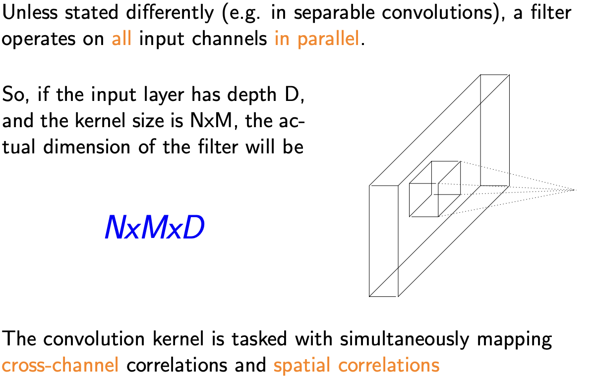

In deep learning, you are constantly wrestling with multi-dimensional arrays (tensors). Tensor shape mismatches are the single most common cause of crashes when building models. Shaping layers do not extract complex logic; their sole job is to crush, stretch, flatten, or reshape your data so it flows seamlessly from one processing step to the next.

Here is the detailed breakdown of the three main categories of shaping layers, along with their PyTorch implementations.

1. Downsampling & Pooling: The Summarizers
When you process data (especially images or long audio sequences), you often end up with massive tensors. Pooling reduces the spatial dimensions of your data while keeping the most important information. This drastically reduces the parameter count for the next layers and helps prevent overfitting.

Max Pooling: Slides a window over the data and simply keeps the highest value.

Why: It acts as a feature detector. If a Convolutional layer detects a sharp edge, Max Pooling ensures the network remembers "there is an edge in this general area" without needing to remember its exact pixel coordinate. This creates translation invariance.

Average Pooling: Slides a window and calculates the mean.

Why: It provides a smoother summary of the region. Often used at the very end of CNNs (Global Average Pooling) to crush an entire feature map into a single number before the final classification.

2. Upsampling: The Expanders
Upsampling does the exact opposite of pooling. It takes a small tensor and blows it up into a larger one. This is absolutely critical for Generative AI (like generating high-res images from a tiny noise vector in GANs) or Segmentation (where you shrink an image to understand context, and then expand it back to its original size to color in specific pixels).

Interpolation (Nearest / Bilinear): A mathematical resizing algorithm. "Nearest" just duplicates adjacent pixels to fill the new space. "Bilinear" calculates a smooth gradient between pixels.

Transposed Convolution (Deconvolution): Unlike interpolation, which is a fixed mathematical rule, a Transposed Conv uses a learnable filter. The network actually learns the best way to expand the data.

3. Reshape / Flatten / View: The TranslatorsYou often need to transition between fundamentally different types of layers. For example, Convolutional layers output 4D tensors (Batch, Channels, Height, Width). Dense (Linear) layers only accept 2D tensors (Batch, Features).You must flatten the grid into a single 1D line of numbers before the Dense layer can read it.The Concept: Reshaping does not change the underlying data in memory. It simply changes how PyTorch reads that block of memory.The Math: The total number of elements must remain identical.A tensor of shape $(32, 64, 10, 10)$ contains $32 \times 64 \times 10 \times 10 = 204,800$ elements.If you flatten it (keeping the batch size of 32 separate), the new shape must be $(32, 6400)$.