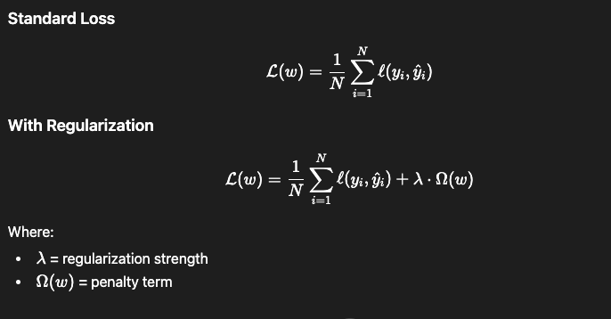
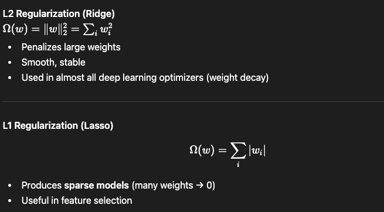
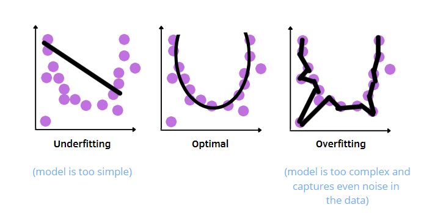
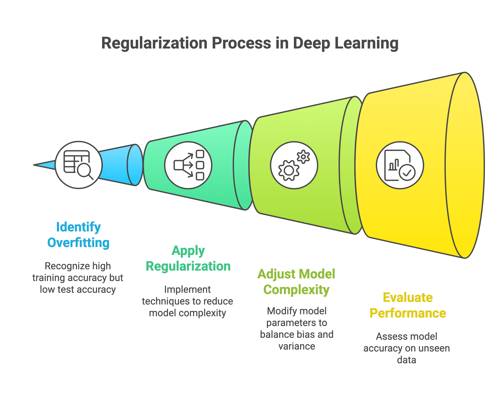
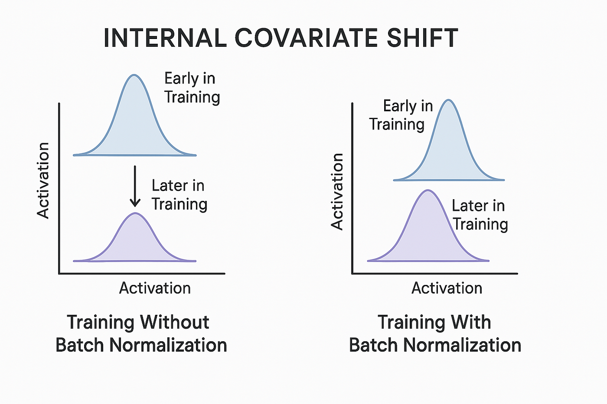
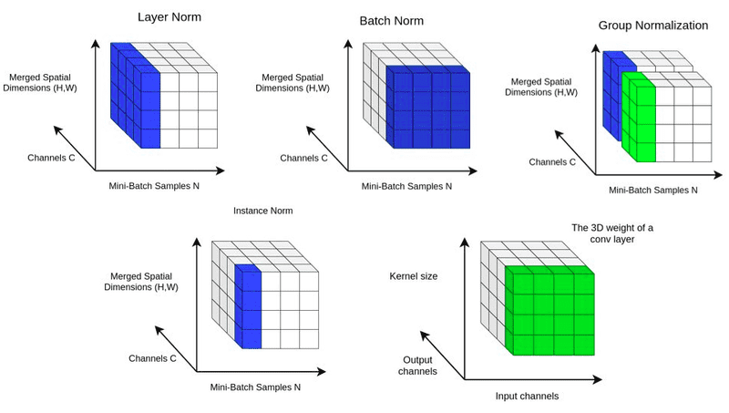

If processing layers are the "brains" and shaping layers are the "plumbing," the Normalization and Regularization Layers are the "safety rails and traffic controllers."

When you build deep networks, two major problems occur during training:

Overfitting: The network gets too smart and starts memorizing the training data exactly, making it useless on new, unseen data.

Instability: As data flows through many layers, the numbers can spiral out of control (getting too massive or shrinking to zero), causing the network to stall and stop learning.

Here is the detailed breakdown of how Regularization (Dropout) and Normalization (Batch/Layer Norm) solve these exact problems.

1. Dropout (Regularization): The Anti-Memorization ProtocolDropout is one of the most brilliantly simple and effective regularization techniques in deep learning.The Concept: Imagine a football team where one star player scores all the goals. If that player gets injured, the team fails. Dropout forces the team to adapt. During every single training step, Dropout randomly "turns off" a percentage of the neurons in a layer.Why it matters: It prevents co-adaptation. Neurons cannot rely on their neighbors to do the heavy lifting. They are forced to learn independent, robust features because they never know which of their inputs might suddenly vanish.The Math (Training vs. Inference):Training: Each neuron has a probability $p$ of being dropped (set to $0$). If it survives, its output is scaled up by $\frac{1}{1-p}$ to keep the overall mathematical sum of the layer consistent.Inference (Real World): Dropout is turned off. All neurons are active because you want the full power of the network when making real predictions.

Internal covariate shift is the change in the distribution of network activations caused by updating model parameters during training. It occurs as earlier layers change, forcing subsequent layers to continuously adapt to new input distributions, which slows down training and makes optimization difficult. Batch Normalization is the primary technique used to stabilize these inputs and accelerate training.

2. Batch Normalization: The Traffic StabilizerAs data flows through a deep network, the distribution of numbers shifts. Layer 1 might output numbers between -1 and 1, but by Layer 50, the weights might have multiplied those numbers into the thousands. This is called Internal Covariate Shift, and it makes finding the right learning rate almost impossible.The Concept: Batch Normalization grabs the output of a layer across an entire batch of data, calculates the average, and forces the numbers back into a standard, clean distribution.The Math: For a batch of data $x$:Calculate the mean ($\mu$) and variance ($\sigma^2$) of the batch.Normalize the data to have a mean of 0 and variance of 1:$$\hat{x} = \frac{x - \mu}{\sqrt{\sigma^2 + \epsilon}}$$The Trick: The network might actually want the data to be shifted or stretched to solve the problem. So, BatchNorm applies two learnable parameters, Gamma ($\gamma$) and Beta ($\beta$), allowing the network to reshape the normalized data however it wants:$$y = \gamma \hat{x} + \beta$$

3. Layer Normalization: The Sequence Saver
Batch Normalization is incredible for CNNs, but it has a fatal flaw: it breaks if your batch size is too small (you can't calculate a good average on a batch of 2), and it struggles with sequential data (like sentences of varying lengths in NLP).

The Concept: Instead of calculating the average across the batch for one specific feature, Layer Normalization calculates the average across all features for one specific data sample.

Why it matters: It is completely independent of the batch size. This is the normalization technique used inside Transformers (like the nn.LayerNorm we used in the GPT block earlier). It ensures that every single word embedding maintains a stable mathematical profile before hitting the Attention mechanism.

