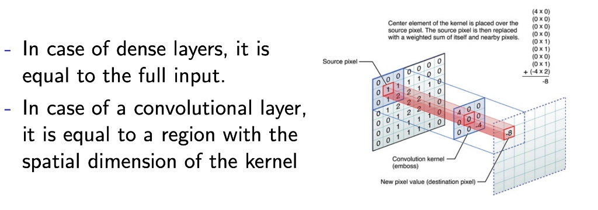
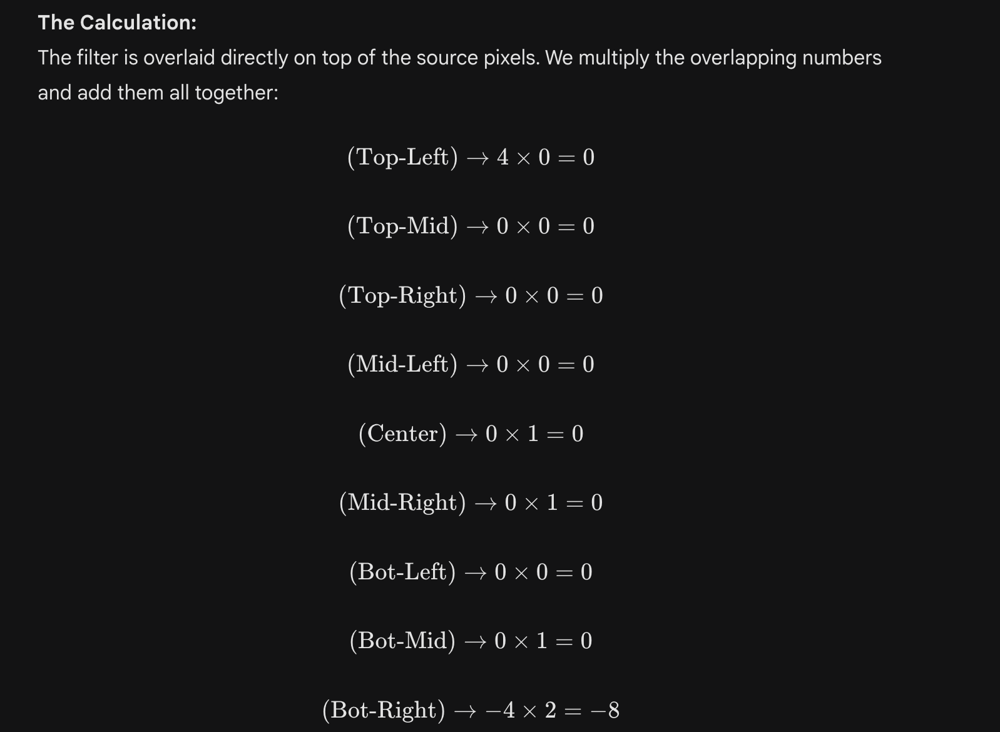
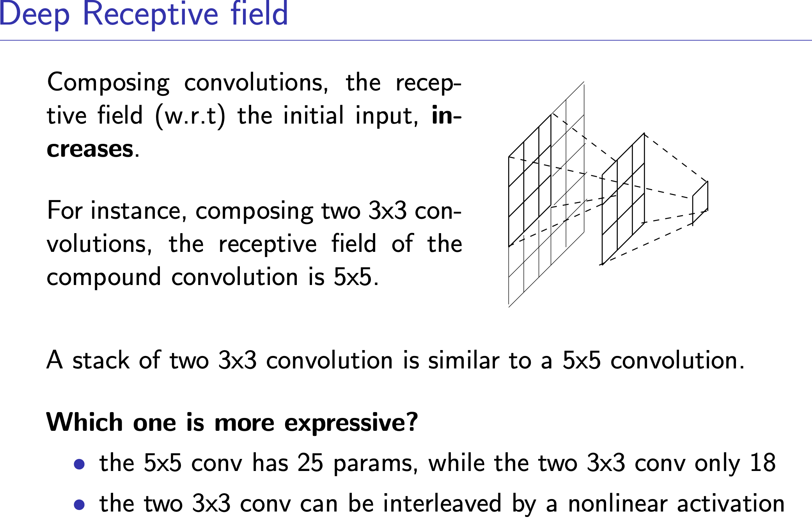
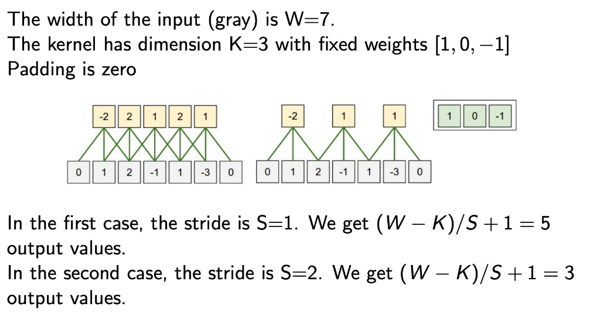
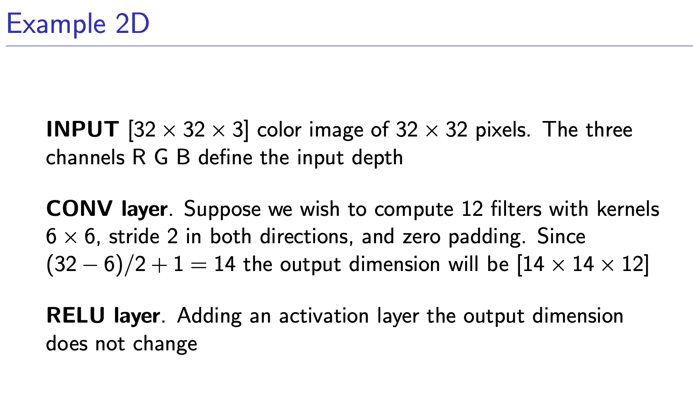

The receptive field of a neuron is the region of the input
influencing it.
- In case of dense layers, it is
equal to the full input.
- In case of a convolutional layer,
it is equal to a region with the
spatial dimension of the kernel

The Receptive Field (RF) is the exact physical region of the original input image that contributes to the calculation of a single neuron deep in the network.If you are trying to classify a face, but your final neuron only has a receptive field of 15x15 pixels on a 1024x1024 image, the network physically cannot see the face. It is mathematically blind to the larger context.The Mechanics:A standard 3x3 convolution gives an output pixel a receptive field of 3x3. But as you stack layers, this field grows.Layer 1 (3x3 conv): RF is 3x3.Layer 2 (3x3 conv): RF is 5x5. (Because one pixel in Layer 2 sees a 3x3 patch in Layer 1, and each of those 9 pixels saw a 3x3 patch in the original image).Pool (2x2): Doubles the growth rate of the RF for all subsequent layers.The Math:The receptive field $r$ at layer $l$ is calculated recursively:$$r_l = r_{l-1} + (k_l - 1) \times j_{l-1}$$(Where $k$ is the kernel size, and $j$ is the accumulated stride from all previous layers).The Takeaway: To capture large objects, you must rapidly increase the receptive field using strides or pooling, which trades spatial resolution for global context.

The text on the left contrasts how the two architectures "look" at data:Dense Layers (Like your mynet2): "It is equal to the full input." In your mynet2 summary, the first hidden layer has 100 neurons, and the input is 784 pixels. Every single one of those 100 neurons connects to all 784 pixels simultaneously. The receptive field is the entire image. This is why it requires $78,500$ parameters just for that one layer.Convolutional Layers: "It is equal to a region with the spatial dimension of the kernel." The red box in the image is the kernel (a $3 \times 3$ grid). The neuron calculating the output pixel doesn't look at the whole image; it only looks at that specific $3 \times 3$ patch. It is mathematically blind to the rest of the image at that specific moment.

The Math: The Convolutional Dot ProductThe right side of the image shows the exact mathematical operation of a single convolution step. It is performing an element-wise multiplication between the source pixels and the kernel weights, followed by a sum.The Source Patch (from the blue grid):$$\begin{bmatrix}
0 & 0 & 0 \\
0 & 1 & 1 \\
0 & 1 & 2
\end{bmatrix}$$The Convolution Kernel (The "Emboss" filter):$$\begin{bmatrix}
4 & 0 & 0 \\
0 & 0 & 0 \\
0 & 0 & -4
\end{bmatrix}$$

The Final Output: Summing all those together gives us $-8$.
This single number replaces that entire $3 \times 3$ patch in the new "Destination pixel" grid.3. Why use an "Emboss" Kernel?Notice the specific numbers in that kernel: a positive $4$ in the top-left and a negative $4$ in the bottom-right.This specific matrix is a classic image processing filter. It mathematically calculates the difference between the top-left pixels and the bottom-right pixels.

- If the pixels are identical (a solid color), the positive and negative sides cancel out, resulting in $0$ (black).
- If there is a sudden change in color or brightness along that diagonal, the result will be a high positive or negative number.This is how neural networks detect edges and textures!

 It captures one of the most important architectural breakthroughs in modern Computer Vision (famously popularized by the VGG Network in 2014).The two images you uploaded perfectly contrast the "brute force" of Dense layers with the "elegant efficiency" of deep Convolutional layers. Here is the breakdown of the deep receptive field concept and why it matters.
 1. The Contrast: Dense vs. Convolutional (Image 1 vs Image 2)Image 1 (mynet2): As we discussed, that dense_1 layer has $78,500$ parameters because every single one of its 100 neurons connects to the entire 784-pixel input. It achieves a "global" receptive field instantly, but at a massive memory cost.
 2. Image 2 (CNNs): Convolutional layers start with a tiny receptive field (e.g., $3 \times 3$). But this slide shows the magic trick of CNNs: you don't need a massive kernel to see the big picture; you just need to stack them.

 **How Two $3 \times 3$ Convolutions = One $5 \times 5$ Receptive Field**
 
 Imagine you have three layers: the Input Image, Hidden Layer 1, and Hidden Layer 2.A single pixel in Hidden Layer 1 is the result of looking at a $3 \times 3$ patch of the Input Image.A single pixel in Hidden Layer 2 is the result of looking at a $3 \times 3$ patch of Hidden Layer 1.But remember, each of those 9 pixels in Hidden Layer 1 was already looking at its own $3 \times 3$ patch of the input!When you trace the edges of all those overlapping patches back to the original image, they span exactly a $5 \times 5$ area.

 **The Math: Why is stacking better? (The Expressiveness Question)**

 The slide asks: "Which one is more expressive?" and provides the two mathematical reasons why stacking $3 \times 3$ convolutions is vastly superior to using one large $5 \times 5$ convolution.
 
 Advantage 1: Parameter Efficiency (Less Math, Less Memory)Let's assume we have 1 input channel and 1 output channel.
 - One $5 \times 5$ Conv: Requires $5 \times 5 = \mathbf{25}$ parameters to look at that region.
 - Two $3 \times 3$ Convs: Requires $(3 \times 3) + (3 \times 3) = \mathbf{18}$ parameters to look at the exact same region.
 - The Impact: You get the exact same spatial awareness (Receptive Field) but you save 28% of the computational cost! As networks get deeper, this savings becomes astronomical. Three $3 \times 3$ layers give you a $7 \times 7$ field using 27 parameters, whereas a single $7 \times 7$ layer requires 49 parameters.

 Advantage 2: Increased Expressiveness (Non-Linearity) 
 
 - If you use a single $5 \times 5$ layer, you are applying one linear transformation, followed by one activation function (like ReLU).
 - If you stack two $3 \times 3$ layers, you get: Linear Transformation $\rightarrow$ ReLU $\rightarrow$ Linear Transformation $\rightarrow$ ReLU.
 - The Impact: As we discussed earlier with the Universal Approximation Theorem, non-linear activation functions are what allow a network to bend and warp its decision boundaries. By stacking smaller layers, you inject more non-linearities into the network, making it exponentially more expressive and capable of learning highly complex patterns.

 Input/Output Dimensions: This is the single most common place where neural network code crashes. When you pass a tensor through a CNN layer, its spatial dimensions change based on four variables: Input size ($I$), Kernel size ($K$), Padding ($P$), and Stride ($S$).The Formula:$$O = \lfloor \frac{I - K + 2P}{S} \rfloor + 1$$Padding ($P$): Adds rings of zeros around the input. We usually use $P = (K - 1) / 2$ (with stride 1) to ensure the output size perfectly matches the input size ("Same" padding).Stride ($S$): How many pixels the window shifts. Stride 2 cuts the spatial dimensions perfectly in half.The "+ 1": This is the classic "fencepost error" correction. If you have a 10-foot fence with posts every 2 feet, you need 6 posts, not 5.

These slides provide the exact mathematical blueprints for how convolutional layers reshape your data tensors. They put the formula we discussed earlier ($O = \lfloor \frac{I - K + 2P}{S} \rfloor + 1$) into practical action.Here is the step-by-step breakdown of the math happening in both the 1D and 2D examples.1. The 1D Example (Image 2)This slide demonstrates two things: how the spatial dimension shrinks, and how the actual values are calculated via the dot product.The Setup:Input Width ($W$): $7$ (The array [0, 1, 2, -1, 1, -3, 0])Kernel Size ($K$): $3$ (The weights [1, 0, -1])Padding ($P$): $0$Case 1: Stride ($S$) = 1When the stride is 1, the window slides one position to the right at a time.The Shape Math: $\frac{7 - 3}{1} + 1 = 4 + 1 = \mathbf{5}$ output values.The Value Math (Dot Product): Let's calculate the very first output box (the yellow -2).Look at the first 3 input numbers: [0, 1, 2]Multiply element-wise with the kernel [1, 0, -1]:$$(0 \times 1) + (1 \times 0) + (2 \times -1) = 0 + 0 - 2 = \mathbf{-2}$$The window slides right by 1 step. The new inputs are [1, 2, -1]. The math repeats, giving the next yellow box 2.Case 2: Stride ($S$) = 2When the stride is 2, the window jumps over an input value every time it moves.The Shape Math: $\frac{7 - 3}{2} + 1 = \frac{4}{2} + 1 = 2 + 1 = \mathbf{3}$ output values.The Impact: By increasing the stride, you drastically compress the spatial dimension of the data (from 7 down to 3). This is how CNNs summarize data without needing Pooling layers.2. The 2D Example (Image 3)This slide scales the exact same logic up to 2D images and introduces the concept of Depth (Channels).The Setup:Input: $32 \times 32 \times 3$ (Height $\times$ Width $\times$ RGB Color Channels)Filters: $12$ (The network is looking for 12 distinct patterns, like edges, colors, or textures).Kernel ($K$): $6 \times 6$Stride ($S$): $2$ (in both vertical and horizontal directions)Padding ($P$): $0$The Spatial Math (Height & Width):Because the image is a square and the stride is symmetrical, the math applies equally to both height and width.$$O = \frac{32 - 6}{2} + 1 = \frac{26}{2} + 1 = 13 + 1 = \mathbf{14}$$So, the new spatial grid is $14 \times 14$.The Depth Math (Channels):The depth of a Convolutional layer's output is always exactly equal to the number of filters used.Because we told the layer to compute 12 different filters, it stacks those 12 distinct $14 \times 14$ feature maps on top of each other.Final Output Shape: $\mathbf{14 \times 14 \times 12}$The ReLU Layer:The slide notes that adding an activation layer does not change the dimension. This is because ReLU ($f(x) = \max(0, x)$) is an element-wise operation. It just looks at the $14 \times 14 \times 12$ tensor, turns all the negative numbers into $0$, and leaves the positive numbers alone. The "box" of data stays the exact same size.

**Backpropagation for CNNs:**

 The Matrix RealityHow does backpropagation actually work for a sliding window? The short answer: it doesn't.Writing nested for loops to slide a window backward through a tensor is computationally suicidal. Instead, AI libraries like PyTorch and CUDA use a trick called im2col (Image to Column).The im2col Trick:PyTorch takes every local patch of the image that the kernel would touch and flattens it into a single column.It takes the Convolutional filters and flattens them into a row.The convolution is then executed as one massive, highly optimized General Matrix Multiplication (GEMM).The Calculus:When computing the gradients, convolutions exhibit a beautiful mathematical symmetry:The gradient of the Loss with respect to the Input ($X$) is a full convolution of the Loss Gradients with the flipped (rotated 180 degrees) Kernel.The gradient of the Loss with respect to the Weights ($W$) is a convolution between the Input and the Loss Gradients.

 