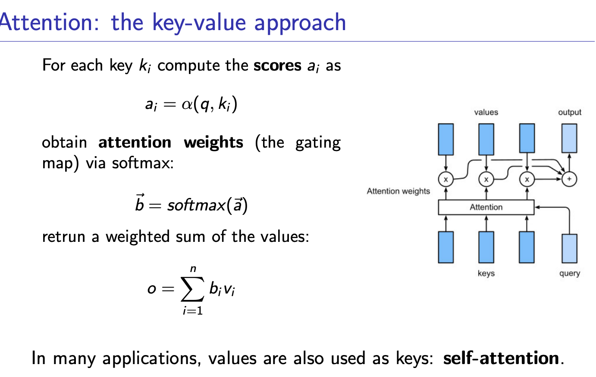
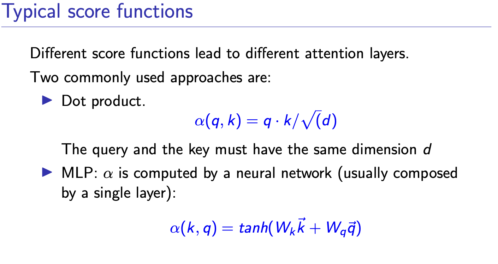
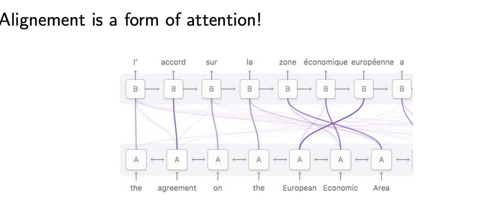
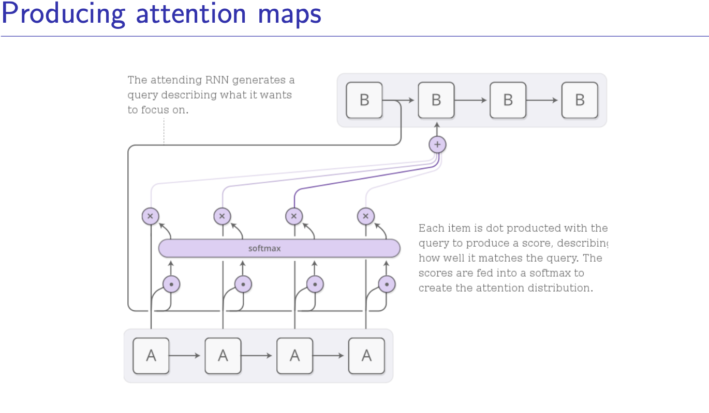
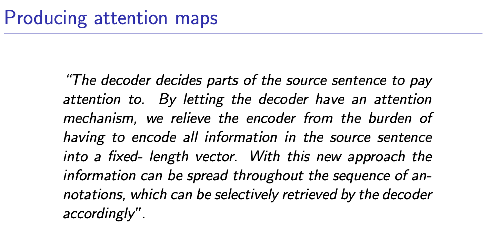

**Regularization & Dropout**

Neural networks are inherently prone to overfitting. To combat this, several techniques are used, including early stopping, weight-decay, data augmentation, and dropout.

- Dropout Mechanism: Dropout stochastically "cripples" the neural network by disabling hidden units during training with a specific probability, such as $p = 0.5$.
- Purpose: This prevents hidden units from co-adapting with one another. It effectively acts as a way to train many different crippled networks and average their results.
- Geometric Averaging: During training, only the active (crippled) network is trained via backpropagation, and weights are shared among all the different crippled configurations. To compensate for the disabled units mathematically, the weights of the remaining active units are multiplied by $1/p$.

**Normalization Layers**

Normalization aims to increase the independence between layers, leading to more stable and potentially faster training.

- Batch Normalization: This operates on single layers on a per-channel basis. During each training iteration, it normalizes the input by subtracting the moving batch mean ($\mu_B$) and dividing by the batch standard deviation ($\sigma_B$).
- Learned Parameters: After normalizing, it applies an opposite transformation using learned parameters: $\gamma$ (scale) and $\beta$ (center).
- Prediction Mode: Batch normalization behaves differently during prediction. Once training is complete, stable statistics computed from the entire training dataset are used instead of moving batch statistics.

**Attention**

alignment: identify which parts of the input sequence are
relevant to each word in the output.

translation is the process of using the relevant information to
select the appropriate output.

Attention allows a network to dynamically focus on different parts of the input based on the problem's requirements.

- Differentiability: It is designed to be a differentiable mechanism, meaning the network can learn exactly where to focus using standard backpropagation.

- Gating Maps: Attention is typically implemented using gating maps generated dynamically by a neural net. For example, Squeeze and Excitation (SE) layers use self-attention to dynamically focus on particular channels.

- Neural Machine Translation (NMT): In translation, attention acts as an alignment mechanism. It relieves the encoder from having to compress all source sentence information into a single fixed-length vector. Instead, the decoder selectively retrieves relevant information spread throughout the sequence.

**The Key-Value Paradigm**

- The network accesses this memory using Queries ($q$) matched with Keys ($k_i$).
- A score is computed for each key, often using a dot product: $\alpha(q, k) = q \cdot k / \sqrt{d}$ or a multi-layer perceptron (MLP).
- These scores are transformed into attention weights ($\vec{b}$) using a softmax function.
- The final output is computed as a weighted sum of the Values ($v_i$): $o = \sum_{i=1}^{n} b_i v_i$.