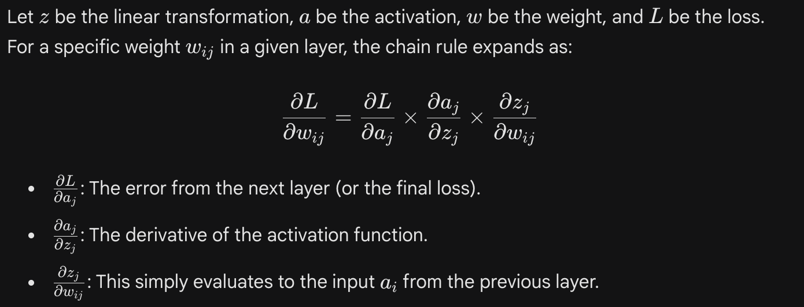
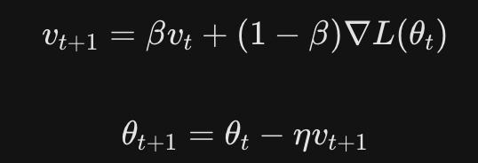

Gradient Descent (GD)Gradient Descent is the foundational optimization algorithm. It treats the neural network's loss landscape as a multi-dimensional terrain and calculates the slope (gradient) to take a step toward the lowest point (the minimum).
For parameters $\theta$ and a Loss function $L(\theta)$, the gradient $\nabla L(\theta)$ points in the direction of the steepest ascent. We subtract it to go down, scaled by the learning rate $\eta$:$$\theta_{t+1} = \theta_t - \eta \nabla L(\theta_t)$$


```
import numpy as np

def gradient_descent(params, gradients, learning_rate):
    """
    Updates parameters using vanilla Gradient Descent.
    """
    return params - learning_rate * gradients

```

Backpropagation

Gradient Descent needs the gradients ($\nabla L(\theta)$) to know which way to step. Backpropagation is the algorithm that computes these gradients using the Chain Rule from calculus. It computes the derivative of the loss with respect to every single weight in the network, working backward from the output layer to the input layer.




Stochastic Gradient Descent (SGD) & Mini-Batch

Vanilla GD computes the gradient using the entire dataset. For large datasets, this is computationally paralyzing. Stochastic Gradient Descent estimates the gradient using a single random data point (or a small "mini-batch").

This introduces noise into the gradient calculation, causing the optimization path to become jagged, but it computes exponentially faster and the noise can actually help the model bounce out of shallow local minima.

Instead of the true gradient $\nabla L(\theta)$, we use an estimated gradient $\nabla L_i(\theta)$ calculated on a mini-batch of size $B$:$$\theta_{t+1} = \theta_t - \eta \nabla L_B(\theta_t)$$


```
def create_mini_batches(X, Y, batch_size):
    m = X.shape[1]
    mini_batches = []
    
    # Shuffle data
    permutation = list(np.random.permutation(m))
    shuffled_X = X[:, permutation]
    shuffled_Y = Y[:, permutation].reshape((1, m))
    
    # Partition into batches
    num_complete_batches = m // batch_size
    for k in range(num_complete_batches):
        batch_X = shuffled_X[:, k * batch_size : (k + 1) * batch_size]
        batch_Y = shuffled_Y[:, k * batch_size : (k + 1) * batch_size]
        mini_batches.append((batch_X, batch_Y))
        
    return mini_batches

```

Optimizations: Momentum

SGD has trouble navigating ravines (areas where the surface curves much more steeply in one dimension than in another). It tends to oscillate across the slopes of the ravine while making painfully slow progress along the bottom toward the optimum.

Momentum solves this by adding a fraction of the previous update vector to the current update vector. It simulates physical inertia: building up speed in directions with consistent gradients and dampening oscillations in directions where the gradient constantly flips.


We maintain a velocity vector $v$. $\beta$ is the momentum coefficient (usually $0.9$).
