This slide explains the fundamental mathematical concept behind detecting edges in a one-dimensional (1D) signal, which is the foundational theory for edge detection in images (2D signals).

### 1. The Signal ($s(x)$)

The top graph represents an input signal, $s(x)$.

* **The Step-Edge:** The signal is mostly flat (constant) but has a sudden jump to a higher level. This transition region is what we want to detect—this is the "edge."
* **Inflection Point:** This is the exact middle of the slope, where the signal is changing the fastest.

### 2. The First Derivative ($s'(x)$)

The middle graph shows the first derivative of the signal. In mathematics, the derivative measures the **rate of change**.

* Where the original signal $s(x)$ is flat, the rate of change is zero, so $s'(x)$ is near the bottom axis.
* In the transition region where the signal jumps up, the rate of change increases, creating a peak.
* The very top of this peak (the extremum) aligns perfectly with the **inflection point** of the original signal. Finding this peak is how we mathematically locate the edge.

### 3. Thresholding ($T_h$)

Real-world signals have noise (tiny fluctuations). If we just looked for any change greater than zero, we would detect thousands of fake edges.

* To solve this, we set a **Threshold** (represented by the dashed red line and the box $T_h$).
* The logic is simple: we take the absolute value of the derivative $|s'(x)|$ and compare it to the threshold. If the peak crosses above the threshold line, we confidently declare it an edge. If it stays below, we ignore it as noise.

### 4. The Block Diagram

The diagram at the bottom summarizes this entire process as a mathematical pipeline:

1. **$s(x)$:** The raw input signal.
2. **$|d/dx|$:** An operator that calculates the absolute value of the first derivative.
3. **$|s'(x)|$:** The resulting magnitude of the rate of change.
4. **$T_h$:** The thresholding operator.
5. **$e(x)$:** The final output signal, which will be a binary indicator marking exactly where the true edges are located.

---

This slide expands the concept of edge detection from a 1D signal to 2D images. The critical difference is that a 1D edge only has a "strength" (magnitude), while a 2D edge has both **strength and direction**.

Here is a breakdown of the core concepts:

### 1. Edge Orientation vs. Change Detection

The top visuals illustrate a key, sometimes counter-intuitive, point about 2D edges:

* **Vertical Edge:** To detect an edge that runs vertically, you must look for changes moving horizontally (left-to-right).
* **Horizontal Edge:** To detect an edge that runs horizontally, you must look for changes moving vertically (top-to-bottom).
* **Diagonal Edge:** The change happens along both axes simultaneously.

### 2. The Gradient ($\nabla I$)

Because changes can happen in any direction, we use a mathematical tool called the **Gradient**, denoted by $\nabla I(x, y)$.

The gradient is a vector that combines the partial derivatives (rates of change) along the two primary axes:

$$\nabla I(x, y) = \frac{\partial I(x,y)}{\partial x}\mathbf{i} + \frac{\partial I(x,y)}{\partial y}\mathbf{j}$$

* $\frac{\partial I}{\partial x}$ is the rate of change in the horizontal direction.
* $\frac{\partial I}{\partial y}$ is the rate of change in the vertical direction.
* $\mathbf{i}$ and $\mathbf{j}$ are the unit vectors for the x and y axes.

**The most important property of the gradient:** The gradient vector always points in the direction of the *steepest* change in image intensity (from dark to light). Consequently, the gradient vector is always **perpendicular to the edge itself**.

### 3. Directional Derivatives

The final bullet point notes that once you have the gradient vector, you can find the rate of change in *any* arbitrary direction. You do this by taking the dot product of the gradient $\nabla I$ and a unit vector pointing in your desired direction.

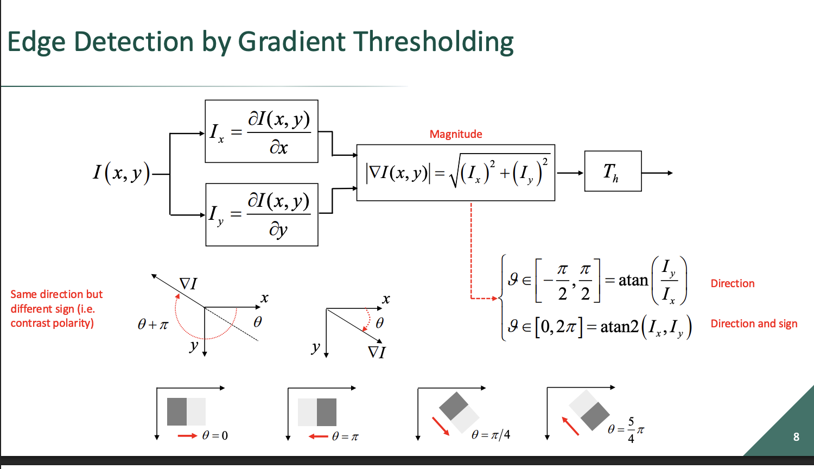

This slide ties together the previous concepts into a complete computational pipeline for detecting edges in 2D images. It answers the question: *Once we have the horizontal ($I_x$) and vertical ($I_y$) rates of change, what do we actually do with them?*

Here is a breakdown of the process shown in the block diagram:

### 1. Computing the Gradient Components

The pipeline starts with the raw image $I(x,y)$. It splits into two parallel operations to compute the partial derivatives:

* **$I_x$:** How much the intensity changes horizontally.
* **$I_y$:** How much the intensity changes vertically.

### 2. Magnitude (Edge Strength)

To figure out if there is an edge at a specific pixel, we need to know the total strength of the change, regardless of its direction.

* We use the Pythagorean theorem to combine the horizontal and vertical components into the **Gradient Magnitude**: $|\nabla I(x,y)| = \sqrt{I_x^2 + I_y^2}$.
* This magnitude is then passed through a **Threshold ($T_h$)**. If the magnitude is larger than the threshold, the pixel is marked as an edge. This is the exact same thresholding logic used in the 1D step-edge slide.

### 3. Direction and Contrast Polarity

While the magnitude tells us *if* an edge exists, we also need to know which way it's facing. The slide highlights a critical distinction in how we calculate the angle ($\theta$ or $\vartheta$):

* **Orientation only (`atan`):** Using standard arctangent ($\text{atan}(I_y / I_x)$) only returns angles within a $180^\circ$ ($[ -\pi/2, \pi/2 ]$) range. It tells you the line the edge sits on, but it gets confused by contrast polarity. It treats a "dark-to-light" edge exactly the same as a "light-to-dark" edge along that same line.
* **Direction and Sign (`atan2`):** Using the two-argument arctangent ($\text{atan2}(I_x, I_y)$) checks the signs of both inputs to return the full $360^\circ$ ($[0, 2\pi]$) direction. This tells you the orientation of the edge **and** which side is the dark side versus the light side.

### 4. Image Coordinate System

Take a close look at the vector diagrams and the edge examples at the bottom. In standard math, the Y-axis points up. However, **in image processing, the Y-axis points down** (starting from pixel 0,0 at the top-left).

* Because the gradient points from dark to light, a diagonal edge that is dark on the top-left and light on the bottom-right will yield a gradient pointing down and to the right. In this downward-Y coordinate system, that results in a positive angle of $\theta = \pi/4$.

---

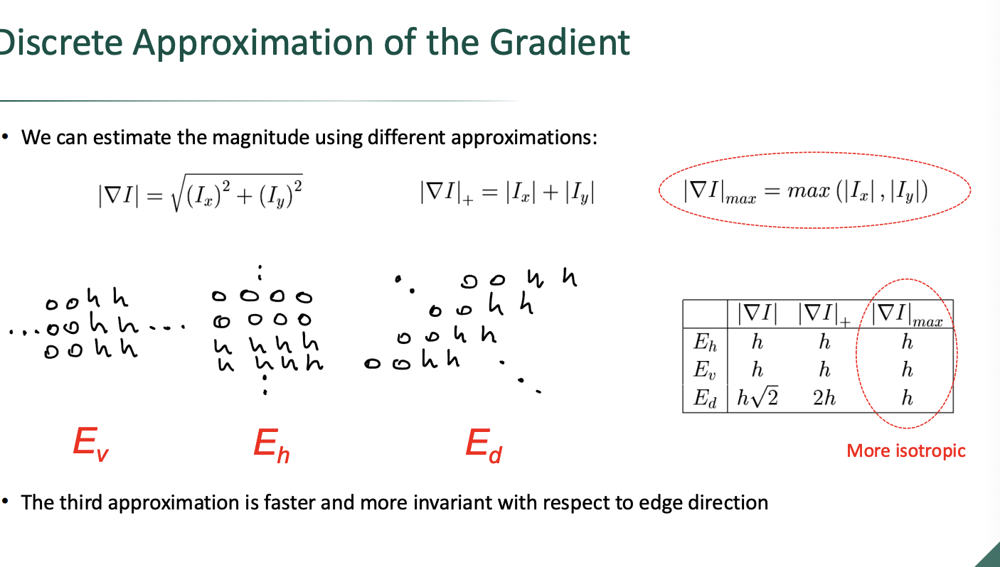

This slide addresses a practical engineering problem in computer vision: **computational cost**.

While we just established that the true gradient magnitude is calculated using the Pythagorean theorem ($|\nabla I| = \sqrt{I_x^2 + I_y^2}$), calculating squares and square roots for every single pixel in a high-resolution image is computationally expensive, especially on older hardware or embedded devices. To speed things up, we use **discrete approximations**.

Here is a breakdown of the three methods shown and why the third one is highlighted:

### 1. The Three Magnitude Formulas

* **True Magnitude ($L_2$ Norm):** $|\nabla I| = \sqrt{I_x^2 + I_y^2}$
* The most accurate, but mathematically heavy.

* **Absolute Sum ($L_1$ Norm):** $|\nabla I|_+ = |I_x| + |I_y|$
* Very fast to compute (just addition and absolute values).

* **Maximum ($L_\infty$ Norm):** $|\nabla I|_{max} = \max(|I_x|, |I_y|)$
* Also extremely fast (just a comparison operation).

### 2. Edge Orientations ($E_v, E_h, E_d$)

The diagram shows three types of pixel transitions from a background value of '0' to an edge value of 'h':

* **$E_v$ (Vertical Edge):** The change is purely horizontal ($I_x = h, I_y = 0$).
* **$E_h$ (Horizontal Edge):** The change is purely vertical ($I_x = 0, I_y = h$).
* **$E_d$ (Diagonal Edge):** The change happens in both directions simultaneously ($I_x = h, I_y = h$).

### 3. The Comparison Table & "Isotropy"

The table is the most crucial part of this slide. It compares the output of all three formulas across the three edge types.

* For straight vertical ($E_v$) or horizontal ($E_h$) edges, **all three formulas output the exact same value ($h$).**
* The difference appears on the **diagonal edge ($E_d$)**:
* True Magnitude outputs $h\sqrt{2}$ (approx. $1.41h$).
* Absolute Sum outputs $2h$. This is a massive overestimation. It means the algorithm will treat diagonal edges as being significantly "stronger" than horizontal or vertical edges, even if the actual pixel contrast ($h$) is the same. This makes it heavily dependent on direction (**anisotropic**).
* Maximum outputs $h$. While this underestimates the true mathematical magnitude ($1.41h$), it outputs the exact same strength ($h$) for the diagonal edge as it did for the vertical and horizontal edges.

**Conclusion:** The Maximum approximation is circled because it is both incredibly fast to compute and **isotropic**—meaning its response is invariant (consistent) regardless of which direction the edge is facing.

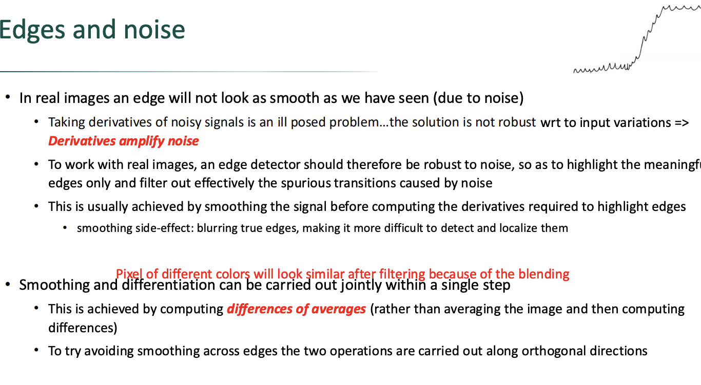

This slide introduces the most significant real-world obstacle in edge detection: **Sensor Noise**. Mathematical ideals (like the perfect step-edges we saw previously) do not exist in raw image data.

Here is a breakdown of the core problem and the proposed solutions:

### 1. The Core Problem: Derivatives Amplify Noise

Look at the hand-drawn sketch in the top right corner. A real edge is jagged.

* Noise consists of high-frequency, sudden, small changes in pixel intensity.
* Because a derivative measures the *rate of change*, it is hypersensitive to these sudden jumps.
* Taking the derivative of a noisy signal results in massive, chaotic spikes that can easily be larger than the peak of the actual edge you are trying to detect. This makes thresholding impossible.

### 2. The Naive Solution & Its Trade-off

The logical first step is to clean up the image before finding edges.

* **Smoothing:** We apply a filter (like a moving average or Gaussian blur) to average out the tiny noise fluctuations.
* **The Trade-off (Blurring):** Smoothing fundamentally works by blending adjacent pixels together. If you blend pixels across a sharp edge, that edge becomes a gradual slope. A gradual slope means a wider, shorter derivative peak, which makes it much harder to pinpoint the exact, pixel-perfect location of the edge (poor localization).

### 3. The Optimized Solution: Joint Operations

Instead of executing two separate, computationally heavy steps (Smooth $\rightarrow$ Differentiate), modern edge detectors combine them into a single mathematical step: **Differences of Averages**.

To minimize the blurring trade-off mentioned above, the slide notes a clever trick involving **orthogonal directions**:

* If you want to detect a *vertical* edge, you need to calculate the difference *horizontally*.
* To prevent blurring that edge, you should apply your smoothing *vertically* (parallel to the edge, rather than across it).

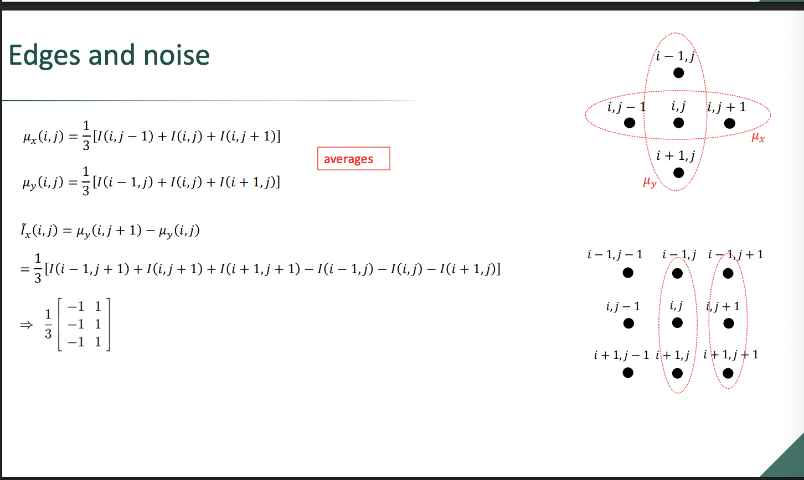
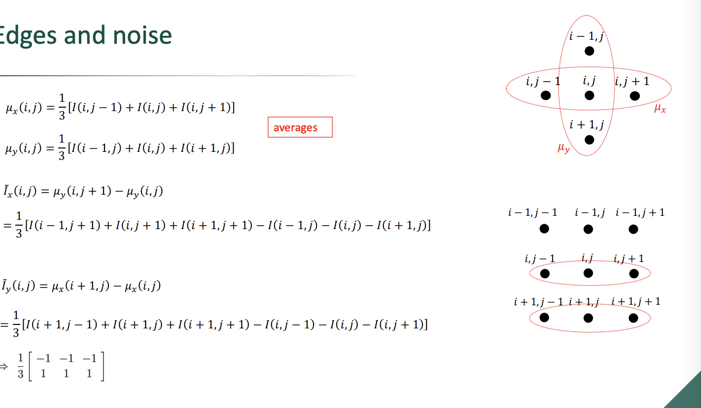

These slides translate the conceptual solution from the previous slide (joint smoothing and differentiation) into concrete mathematical formulas and convolution matrices.

By defining these operations algebraically, we can create standard matrices (kernels) that can be swept across an entire image to calculate gradients efficiently. Note that in image processing coordinates, $i$ represents the row index (vertical y-axis, pointing down) and $j$ represents the column index (horizontal x-axis, pointing right).

Here is the breakdown of the mathematical derivations:

### 1. The Horizontal Gradient ($\tilde{I}_x$) - Slide 1

To detect a vertical edge robustly, we must look for horizontal changes while smoothing vertically.

* **The Smoothing Step ($\mu_y$):** The top formula defines $\mu_y(i, j)$. This takes a pixel at $(i, j)$ and averages its intensity with the pixel directly above it $(i-1, j)$ and below it $(i+1, j)$. This smooths out any noise running parallel to the edge.
* **The Differentiation Step ($\tilde{I}_x$):** Next, the formula calculates the rate of change by taking the difference between two *already smoothed* vertical columns located at $j$ and $j+1$.
* **The Matrix Form:** When you expand the algebra (combining the terms from the right column and subtracting the left column), you can extract a constant $3 \times 2$ matrix.

$$\frac{1}{3} \begin{bmatrix} -1 & 1 \\ -1 & 1 \\ -1 & 1 \end{bmatrix}$$

Instead of doing complex math pixel-by-pixel, a computer can simply multiply this standardized matrix (a convolution kernel) against any $3 \times 2$ patch of pixels in the image to instantly get the noise-resistant horizontal gradient.

### 2. The Vertical Gradient ($\tilde{I}_y$) - Slide 2

This slide applies the exact same logic, but rotated 90 degrees to detect horizontal edges.

* **The Smoothing Step ($\mu_x$):** The top formula defines $\mu_x(i, j)$. This averages three pixels horizontally (left, center, right) to smooth noise parallel to a horizontal edge.
* **The Differentiation Step ($\tilde{I}_y$):** The derivative is calculated by subtracting the smoothed upper row $i$ from the smoothed lower row $i+1$.
* **The Matrix Form:** Expanding this yields a $2 \times 3$ matrix:

$$\frac{1}{3} \begin{bmatrix} -1 & -1 & -1 \\ 1 & 1 & 1 \end{bmatrix}$$

Notice that the signs perfectly match the image coordinate system where the Y-axis points downward. Subtracting the top row ($-1$) from the bottom row ($1$) gives a positive gradient if the image transitions from dark on top to light on the bottom.

---

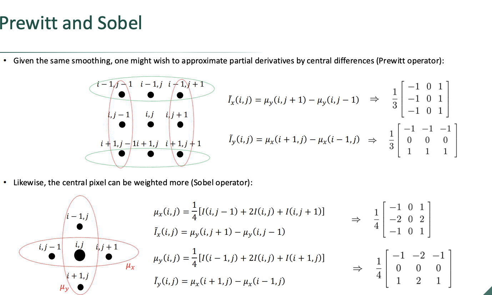

This slide introduces two of the most famous and widely used classical algorithms in computer vision: the **Prewitt** and **Sobel** operators.

They build directly upon the joint smoothing and differentiation concept from the previous slides, but they introduce two important upgrades: **Central Differences** and **Weighted Smoothing**.

Here is the breakdown of how they work:

### 1. The Prewitt Operator (Central Differences)

In the previous slides, we calculated the gradient by subtracting two adjacent columns or rows (a $3 \times 2$ matrix). Prewitt expands this to a symmetric $3 \times 3$ matrix.

* **Central Differences:** Look at the Prewitt $I_x$ matrix. The center column is entirely zeros. To find the gradient at pixel $(i, j)$, Prewitt subtracts the smoothed column *to the left* $(j-1)$ from the smoothed column *to the right* $(j+1)$. It skips the center pixel entirely.
* **Why do this?** Centering the derivative around the target pixel provides a slightly more accurate estimate of the slope exactly at that point, rather than the slope *between* two points.
* **The Matrices:** The resulting kernels are the $3 \times 3$ matrices shown on the right. Notice they are just the smoothing step (all $1$s) combined with the central difference step ($-1$ and $1$, separated by $0$).

### 2. The Sobel Operator (Weighted Smoothing)

The Sobel operator is arguably the most famous edge detector of the classical era. It is identical in structure to Prewitt, but it changes how the smoothing is calculated.

* **The Weights:** Look closely at the $\mu_x$ and $\mu_y$ smoothing formulas for Sobel. Instead of averaging three pixels equally ($1, 1, 1$), it gives the center pixel double the weight: $I(i, j-1) + 2I(i, j) + I(i, j+1)$.
* **The Matrices:** This results in the famous Sobel kernels where the center row/column has values of $2$ and $-2$ instead of $1$ and $-1$.
* **Why do this?** The pixels immediately adjacent to the center $(i, j)$ are physically closer to the point you are analyzing than the diagonal pixels in the corners of the $3 \times 3$ grid. By giving them double the weight, the Sobel operator smooths out noise but preserves a tighter, more localized edge than the Prewitt operator.

---

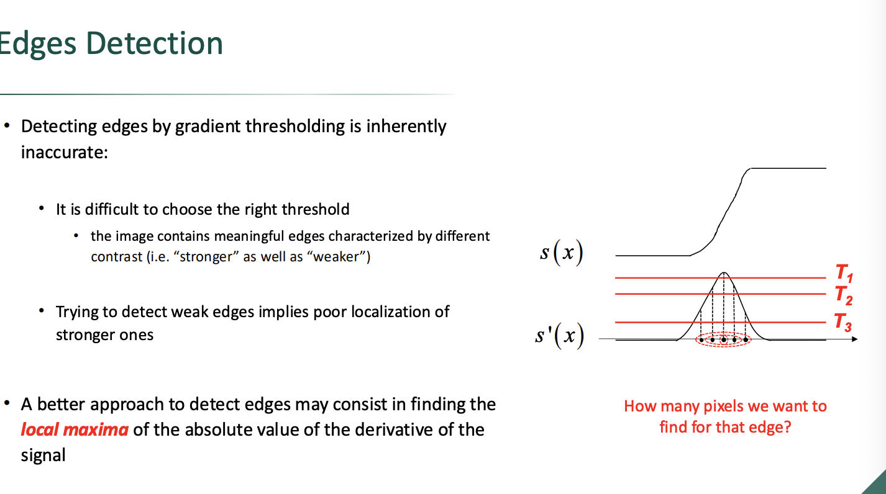

This slide identifies a fundamental flaw with the simple thresholding method we've discussed so far and introduces the conceptual fix that powers modern edge detection algorithms (like the Canny edge detector).

Here is a breakdown of the problem and the proposed solution:

### 1. The Thresholding Dilemma

Real images contain a mix of sharp, high-contrast edges (like a dark silhouette against a bright sky) and soft, low-contrast edges (like subtle shadows or textures). This creates a "Goldilocks" problem when picking a single threshold ($T_h$):

* **High Threshold ($T_1$):** If you set the threshold high to only catch the very tip of the derivative peak, you get a perfectly thin, 1-pixel-wide line for your strong edges. However, the derivative peaks of weaker edges will fall entirely below this line, meaning you will completely miss them.
* **Low Threshold ($T_3$):** If you lower the threshold to ensure you detect the faint edges, you ruin the localization of your strong edges. Look at the red dotted ovals in the diagram: at $T_3$, the strong edge's curve is so wide that five consecutive pixels cross the threshold. Your output will show a thick, blurry 5-pixel-wide band instead of a precise, crisp edge.

### 2. The Question of Thickness

The red text asks, *"How many pixels we want to find for that edge?"*
In ideal edge detection, the answer is exactly **one**. An edge represents the exact boundary between two regions; it shouldn't have a "thickness."

### 3. The Solution: Local Maxima (Non-Maximum Suppression)

To get single-pixel localization while still detecting weak edges, the slide proposes abandoning the flat cutoff approach.

Instead, we look for the **Local Maxima**—the exact peak of the derivative curve.
If a pixel has a higher derivative value than its immediate neighbors on the left and right (along the direction of the gradient), it is the true center of the edge. We keep that pixel and suppress (set to zero) all the surrounding pixels that merely belong to the "slopes" of the peak.

This technique is formally known in computer vision as **Non-Maximum Suppression**. It guarantees that edges are exactly one pixel wide, regardless of how strong or weak the original contrast was.

---

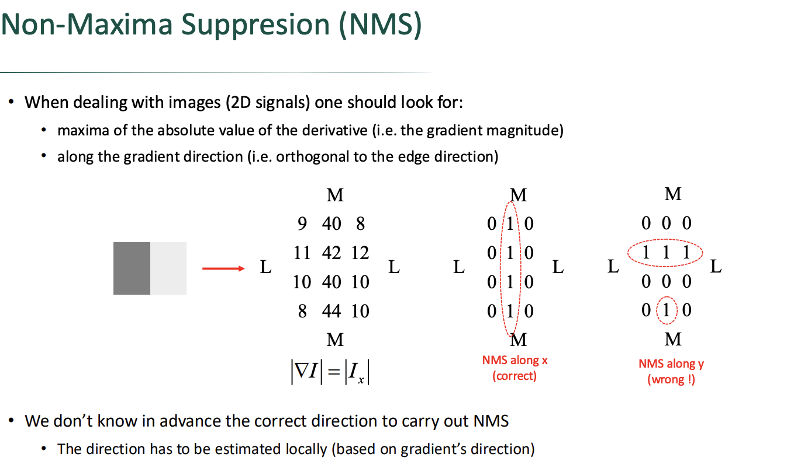

This slide tackles the challenge of applying Non-Maximum Suppression (NMS) to a 2D image. In 1D, you only have left and right neighbors. In 2D, a pixel is surrounded in all directions. The critical takeaway here is that **Non-Maximum Suppression must be strictly directional.**

Here is a breakdown of the concept and the visual examples:

### 1. The Setup (The Gradient Magnitude Grid)

The matrix on the left represents the gradient magnitudes ($|\nabla I|$) of a small image patch.

* Notice that the high values (`40`, `42`, `40`, `44`) are all clustered in the center column.
* This indicates a strong **vertical edge** that is currently smeared across a few pixels (represented by the gray and white squares).
* Our goal is to thin this down to exactly a 1-pixel-wide line.

### 2. The Golden Rule: Search Along the Gradient Direction

Because the edge is vertical, the actual *change* in intensity is happening horizontally (from left to right). Therefore, the gradient vector points **horizontally** (along the x-axis).
To properly thin the edge, you must only compare a pixel to its neighbors that lie *along that gradient direction*.

### 3. NMS Along X (The Correct Way)

If we evaluate the grid horizontally (along the x-axis):

* Look at the `42` in the second row. We compare it only to its horizontal neighbors: `11` and `12`. Since `42` is the local maximum, it "survives" and becomes a `1`.
* Look at the `11` in that same row. Its horizontal neighbors are a pixel off-screen and `42`. Since it is smaller than `42`, it is suppressed and becomes a `0`.
* **The Result:** We get a perfect, single-pixel-thick vertical line of `1`s exactly down the center of the edge.

### 4. NMS Along Y (The Wrong Way)

If we mistakenly evaluate the grid vertically (along the y-axis, parallel to the edge instead of perpendicular to it):

* Look at the `42` again. We compare it to its vertical neighbors: `40` and `40`. It is the maximum, so it survives (`1`).
* Now look at the `11`. We compare it to its vertical neighbors: `9` and `10`. Because `11` is greater than `9` and `10`, **it also survives (`1`)**.
* **The Result:** The algorithm incorrectly flags multiple adjacent pixels as edges, destroying the vertical line and creating a chaotic, broken horizontal pattern.

### The Conclusion

The bottom text summarizes the reality of edge detection: we don't know the orientation of edges in an image beforehand. Therefore, a modern edge detector (like the Canny algorithm) uses the gradient angle ($\theta = \text{atan2}(I_y, I_x)$) calculated for *every individual pixel* to dynamically determine which axis (0°, 45°, 90°, or 135°) it should use to perform the NMS check.

---

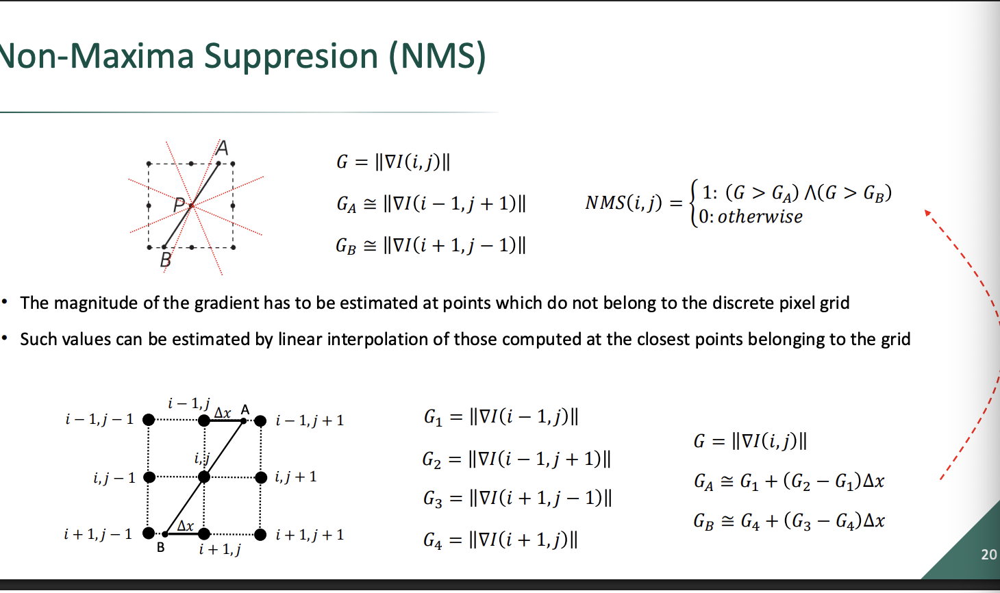

This slide addresses a critical flaw in the simplified Non-Maximum Suppression (NMS) we looked at previously.

In the last slide, we assumed the gradient vector pointed perfectly along the X or Y axis. But in the real world, edges can sit at any continuous angle (e.g., $27^\circ$ or $142^\circ$), meaning the gradient vector will also point at an arbitrary angle.

Here is the breakdown of the problem and the mathematical solution:

### 1. The Sub-Pixel Problem (Top Half)

Look at the top diagram. The center pixel is $P$. The solid black line is the true gradient direction.

* To check if $P$ is a local maximum, we must compare it to the values exactly along that line at points $A$ and $B$.
* **The issue:** Points $A$ and $B$ do not land squarely on the center of the neighboring pixels (the black dots). They fall somewhere *in between* the grid points.
* Because digital images only store data at discrete integer coordinates (the grid points), we do not inherently know the gradient magnitude at these floating-point locations $A$ and $B$.

### 2. The Solution: Linear Interpolation (Bottom Half)

To solve this, we estimate the values at $A$ and $B$ using **Linear Interpolation**. This means we look at the two closest actual pixels and calculate a weighted average based on exactly where the line crosses between them.

Let's break down the math for point $A$:

* The vector crosses the top row between pixel $(i-1, j)$ [which has magnitude $G_1$] and pixel $(i-1, j+1)$ [which has magnitude $G_2$].
* **$\Delta x$** represents the exact physical distance from the left pixel to intersection point $A$. It acts as our sliding weight. If $\Delta x$ is $0$, point $A$ is exactly on $G_1$. If $\Delta x$ is $0.5$, point $A$ is exactly halfway between them.
* **The Formula:** $G_A \cong G_1 + (G_2 - G_1)\Delta x$. This elegantly calculates the sub-pixel value. It starts at the base value ($G_1$) and adds a fraction of the difference between the two pixels based on how far along the path point $A$ sits.

The same logic applies to point $B$ in the opposite direction, using the bottom row pixels ($G_4$ and $G_3$).

### 3. The Final NMS Decision

Once we have calculated our sub-pixel estimates ($G_A$ and $G_B$), we run the standard NMS check:

$$NMS(i, j) = 1 \text{ if } (G > G_A) \text{ and } (G > G_B)$$

If the center magnitude $G$ is strictly greater than both interpolated estimates, it survives. Otherwise, it is suppressed to $0$.

---

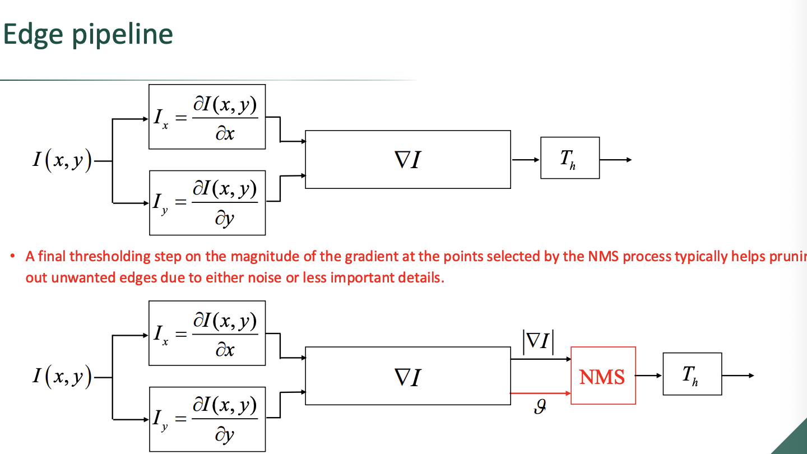

This slide represents the culmination of all the concepts we've discussed so far. It compares the basic, naive edge detection pipeline with a more robust, modern architecture (like the one used in the famous Canny edge detector).

Here is a breakdown of the two pipelines and why the bottom one is superior:

### 1. The Basic Pipeline (Top)

This is the simple approach we started with.

* It takes the image $I(x,y)$, calculates the horizontal and vertical derivatives ($I_x$ and $I_y$), and combines them into the gradient.
* It immediately applies a Threshold ($T_h$) to the raw gradient magnitude.
* **The Problem:** As we saw earlier, this results in thick, blurry edges and forces you to choose between keeping weak edges or accurately localizing strong ones.

### 2. The Advanced Pipeline (Bottom)

This is the upgraded pipeline that incorporates Non-Maxima Suppression (NMS). Notice how the data flows differently:

* **Splitting the Gradient:** After calculating the gradient $\nabla I$, the pipeline explicitly splits it into two distinct pieces of information: the **Magnitude** ($|\nabla I|$) and the **Direction** ($\vartheta$).
* **The NMS Block:** Both the magnitude *and* the direction are fed into the red NMS block. (Remember the previous slide: NMS *must* know the gradient direction $\vartheta$ so it can perform the local maxima check along the correct axis).

### 3. The Role of the Final Threshold ($T_h$)

You might ask: *If NMS fixes the edge thickness, why do we still have a thresholding block at the end?* The red text explains this.

* **NMS only guarantees thinness, not importance.** If you have a tiny fluctuation of noise in a blank wall, it will technically have a "local maximum." NMS will faithfully turn that noise into a perfect, 1-pixel-wide edge.
* Therefore, the **Final Threshold** acts as a garbage filter. Once NMS has thinned all the potential edges down to single pixels, the threshold ($T_h$) sweeps through and deletes any of those pixels whose original gradient magnitude was too low.
* **Summary:** NMS handles **Localization** (making the edge 1 pixel wide). Thresholding handles **Relevance** (deleting noise and unimportant details).

---

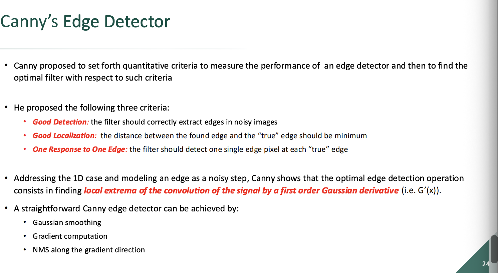 
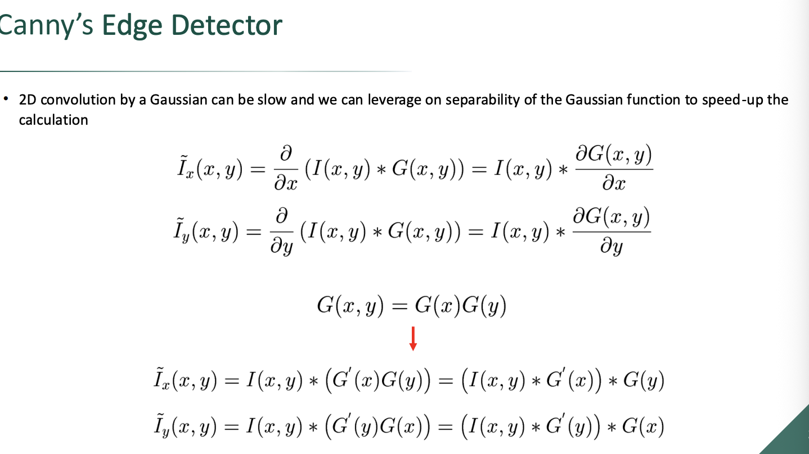
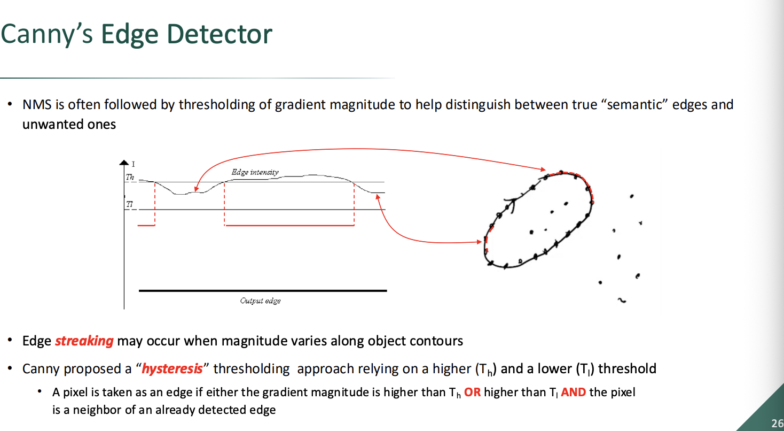
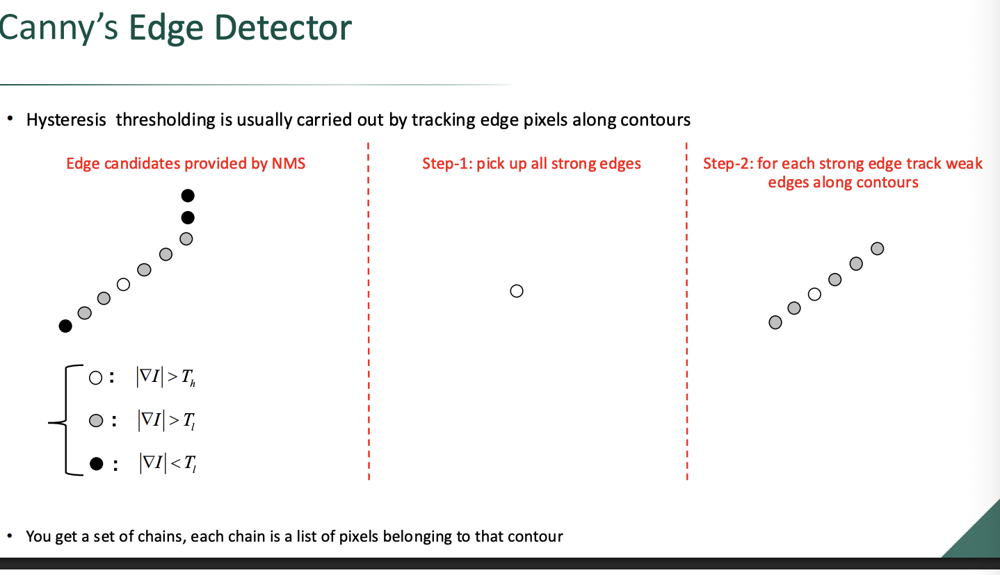
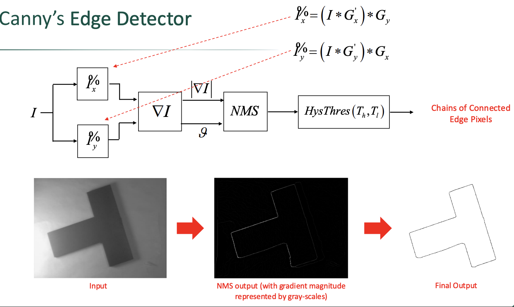

These slides outline the complete architecture of the **Canny Edge Detector**, developed by John F. Canny in 1986. It remains one of the most widely used and effective edge detection algorithms in computer vision because it elegantly combines all the concepts we've discussed so far while introducing a final, clever step to solve a major problem.

Here is a breakdown of the Canny architecture and its core innovations:

### 1. The Three Criteria (Slide 1)

Canny didn't just guess at a good filter; he mathematically defined what a "perfect" edge detector should do:

* **Good Detection:** It must find all true edges and ignore all noise.
* **Good Localization:** The detected edge must be as close as possible to the physical true edge in the image.
* **One Response:** It should return exactly one pixel for each edge (no thick bands).

He proved mathematically that finding the local extrema of a signal smoothed by a Gaussian derivative perfectly satisfies these criteria.

### 2. Separable Gaussian Derivatives (Slide 2)

This slide introduces a computational optimization. Instead of using a large, slow 2D matrix to calculate the smoothed derivative all at once, Canny leverages the mathematical property of **separability**.

* The math shows that you can split the heavy 2D operation into two fast 1D operations.
* For example, to get the horizontal gradient ($\tilde{I}_x$), you take the 1D derivative of the image horizontally ($G'(x)$), and then apply a 1D Gaussian smoothing filter vertically ($G(y)$). This is much faster for a computer to execute while achieving the exact same mathematical result.

### 3. The Streaking Problem & Hysteresis Thresholding (Slides 3 & 4)

This is Canny's most famous innovation.
In the previous pipeline, we used a single threshold. The problem with a single threshold is **edge streaking**. Because images have noise and varying lighting, the gradient magnitude of a continuous edge might fluctuate. If it dips even slightly below your single threshold, the line breaks, resulting in dashed, disconnected segments instead of a solid contour.

Canny solved this using **Hysteresis Thresholding**, which utilizes *two* thresholds: $T_{high}$ and $T_{low}$.

Here is how the logic works (visualized perfectly in Slide 4):

1. **Strong Edges:** Any pixel with a magnitude higher than $T_{high}$ is immediately classified as a confirmed, true edge.
2. **Noise:** Any pixel with a magnitude lower than $T_{low}$ is immediately discarded as noise.
3. **Weak Edges:** Pixels that fall in the middle (between $T_{low}$ and $T_{high}$) are the tricky ones. The algorithm looks at their neighbors. If a weak pixel is physically connected to a Strong Edge (or connected to a chain of pixels that eventually leads to a Strong Edge), it is "rescued" and kept as a true edge. If it is isolated, it is discarded.

### 4. The Final Pipeline (Slide 5)

The final slide puts the entire puzzle together:

1. Calculate horizontal and vertical gradients with separated Gaussian derivatives.
2. Combine them into Magnitude ($|\nabla I|$) and Direction ($\vartheta$).
3. Pass them through Non-Maxima Suppression (NMS) using the direction to thin the edges to exactly 1 pixel.
4. Pass the thinned edges through Hysteresis Thresholding to connect broken lines and drop isolated noise.
5. Output the final, pristine edge chains.

---

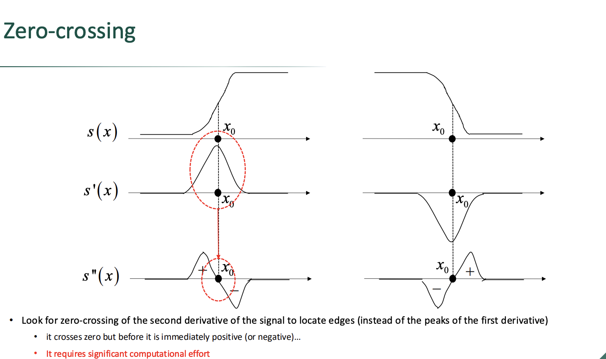

This slide introduces an alternative mathematical approach to edge detection. Instead of looking for the peaks of the first derivative, this method searches for the **zero-crossings of the second derivative**.

Here is the calculus behind why this works and the trade-offs involved:

### 1. The Mathematical Connection

In calculus, when a function reaches a local maximum or minimum (a peak or a valley), its derivative is exactly zero.

* We know from earlier slides that the exact center of an edge ($x_0$) is where the *first derivative* $s'(x)$ reaches its absolute peak.
* Therefore, if we take the derivative *again* to get the **second derivative** $s''(x)$, the exact location of the edge will be the point where the $s''(x)$ graph crosses the zero axis.

### 2. Rising vs. Falling Edges

The slide contrasts two types of edges and how their zero-crossings behave:

* **Rising Edge (Left Column):** The signal transitions from dark to light. The first derivative forms a positive peak. The second derivative spikes up (positive), crosses exactly at $x_0$, and dips down (negative). You look for a **$+$ to $-$** zero-crossing.
* **Falling Edge (Right Column):** The signal transitions from light to dark. The first derivative forms a negative valley. The second derivative dips down (negative), crosses exactly at $x_0$, and spikes up (positive). You look for a **$-$ to $+$** zero-crossing.

### 3. The Trade-off

Why look for zero-crossings instead of peaks?

* **The Pro:** Finding a zero-crossing in digital pixels is very easy and highly precise. You just scan the image and look for two adjacent pixels where the sign flips from positive to negative (or vice versa). The edge is perfectly localized between them.
* **The Con:** The red text warns that it "requires significant computational effort." Every time you take a derivative, you amplify noise. Taking the *second* derivative amplifies noise quadratically. To make this work on a real image without detecting thousands of fake edges, you have to apply massive, mathematically heavy smoothing filters (like a Laplacian of Gaussian) before doing the zero-crossing check.

---

These slides introduce the **Marr-Hildreth Edge Detector**, which relies on the **Laplacian of Gaussian (LoG)**. This represents a major philosophical shift from the Canny detector: instead of hunting for the *peaks* of the first derivative, we are now hunting for the **zero-crossings of the second derivative**.

Here is a breakdown of the mathematics that makes this approach work, moving from theoretical calculus to practical code.

### 1. The Math of the 2nd Derivative: Ideal vs. Practical

To find an edge using the second derivative, we ideally want to measure the rate of change exactly across the edge.

* **The Ideal (The Hessian):** Slide 1 shows the exact, rigorous formula: $\mathbf{n}^T \mathbf{H} \mathbf{n}$.
* $\mathbf{H}$ is the **Hessian matrix**, which contains every possible second-order partial derivative ($I_{xx}, I_{xy}, I_{yy}$).
* $\mathbf{n}$ is the gradient unit vector pointing across the edge.
* Multiplying them essentially "steers" the second derivative to point exactly across the edge contour. While mathematically perfect, doing this matrix multiplication for every single pixel in a video feed is incredibly computationally expensive.

* **The Practical (The Laplacian):** To save computation, Marr and Hildreth proposed using the **Laplacian operator** ($\nabla^2$).
* The formula is simply $\nabla^2 I = I_{xx} + I_{yy}$.
* It throws away the mixed derivatives ($I_{xy}$) and simply adds the pure horizontal and vertical 2nd derivatives together.
* Because it sums the axes, it is **isotropic** (it treats all directions equally), meaning you don't need to know the edge's direction beforehand to compute it.

### 2. Deriving the 3x3 Discrete Kernel

Slide 2 shows how the continuous calculus of the Laplacian is translated into a discrete $3 \times 3$ grid for a computer to process.

1. **1D 2nd Derivative:** If you take the difference of differences (forward minus backward), the horizontal 2nd derivative ($I_{xx}$) at the center pixel simplifies to: $1 \cdot (\text{Left}) - 2 \cdot (\text{Center}) + 1 \cdot (\text{Right})$.
2. **Adding the Y-axis:** The vertical 2nd derivative ($I_{yy}$) is exactly the same: $1 \cdot (\text{Top}) - 2 \cdot (\text{Center}) + 1 \cdot (\text{Bottom})$.
3. **The Final Kernel:** If you add $I_{xx}$ and $I_{yy}$ together, the center pixel gets $-2$ from the horizontal math and $-2$ from the vertical math, resulting in **$-4$**. The four adjacent neighbors get $+1$, and the corners get $0$. This yields the elegant $3 \times 3$ convolution matrix shown at the bottom of the slide.

### 3. The "LoG" Mathematical Trick

Slide 3 addresses the elephant in the room: **Noise**.
We learned earlier that taking the 1st derivative amplifies noise. Taking the *2nd derivative* amplifies noise quadratically. If you apply the Laplacian matrix to a raw photograph, you will just get a screen full of static.

* You *must* smooth the image with a Gaussian filter ($G$) first: $\tilde{I} = I * G$.
* Then you apply the Laplacian: $\nabla^2(I * G)$.
* **The Trick:** Because these are linear mathematical operators, the associative property applies. You can swap the order: $\nabla^2(I * G) = I * (\nabla^2 G)$.
* This means you can calculate the "Laplacian of the Gaussian" ($\nabla^2 G$) completely offline, creating a single, combined filter mask (often called the "Mexican Hat" operator). You then sweep this single mask across the image, doing the smoothing and the 2nd derivative simultaneously.

### 4. Locating the Edge (Zero-Crossing)

Slide 4 explains how to find the mathematical zero in a grid of discrete pixels.

* A computer scans the LoG output looking for adjacent pixels where the sign flips (e.g., from $-10$ to $+20$). The true edge lies somewhere between them.
* **Sub-pixel Accuracy:** The exact edge is closest to the pixel with the smaller absolute value. In the $[-10, 20]$ example, the true zero is closer to $-10$ than $20$, so the edge is assigned to the pixel that yielded $-10$.

### 5. The Role of Sigma ($\sigma$)

The final slide demonstrates why the LoG is so powerful: **Scale Control**.
The Gaussian filter is defined by its standard deviation, $\sigma$ (sigma).

* **Small $\sigma$ (e.g., 1):** The filter is narrow. It applies very little blur. The 2nd derivative finds every tiny texture, wrinkle, and shadow in the image (high detail, high noise).
* **Large $\sigma$ (e.g., 3):** The filter is wide. It blurs out all the fine details and textures. Only the most massive, high-contrast structural boundaries in the image survive the blur to trigger a zero-crossing.

---
