**Why are we doing all this feature matching in the first place?**

The answer is to solve the problem of **Instance-level Object Detection**.

Here is a breakdown of what that means and the terminology used in the field:

### 1. "Instance-Level" vs. Categorical

In computer vision, there is a big difference between finding a *category* and finding an *instance*.

* **Categorical Detection:** You train a neural network to find *any* car, *any* pedestrian, or *any* dog. It just puts a box around things that look generally like the category.
* **Instance-Level Detection:** You are looking for a highly specific, unique item. You aren't looking for *any* book; you are looking for a specific copy of *Multiple View Geometry* (as seen in the previous SIFT slides). In this slide's example, the system isn't looking for just any circle on a circuit board; it is looking for that exact, specific metallic pad pattern.

### 2. The Reference vs. The Target

To perform this task, the algorithm always needs two inputs:

* **The Reference Image (Model):** This is the "wanted poster." It is a clean, isolated crop of the specific object you are trying to find (shown as the small square on the right of the slide).
* **The Target Image:** This is the messy, real-world scene you are analyzing (the large circuit board on the left).

The algorithms we just learned about (like SIFT) extract hundreds of keypoint descriptors from the Reference, and thousands from the Target, and then try to find matching pairs between them.

### 3. Estimating the "Pose"

If the algorithm finds enough matching features, it declares a successful detection. But just saying "Yes, it's in the image" isn't enough for most applications (like a robotic arm trying to pick up a part). The system must estimate the **Pose**—how the object is physically situated in the target image compared to the reference.

The bottom bullet point defines the three levels of pose complexity:

* **Translation:** The object just slid up, down, left, or right ($x, y$ movement).
* **Roto-translation (Euclidean):** The object moved $x, y$ AND it spun around (rotation).
* **Similarity:** The object moved $x, y$, rotated, AND it moved closer/further away from the camera, changing its size (scale).

Because real-world objects constantly undergo "Similarity" transformations when you wave a camera at them, algorithms like SIFT (which are inherently rotation and scale invariant) are absolute requirements for solving this problem reliably.

### 1. The Real-World Nuisances

When you try to find a specific object in the real world, the math has to fight through three major headaches:

* **Intensity Changes:** Shadows, bright sunlight, or different camera exposures. (This is exactly why SIFT normalizes its 128-dimensional descriptor vector).
* **Clutter:** The background is busy and full of shapes that might accidentally trigger a false positive. (This is why Lowe invented the distance Ratio Test we looked at earlier).
* **Occlusions:** The object is partially hidden behind something else. (Because algorithms like SIFT find *local* keypoints rather than looking at the whole image at once, they can still recognize a book even if your hand is covering half of it).

### 2. The Grand Divide: Classical vs. Deep Learning

The bottom half of the slide highlights the definitive boundary line in modern computer vision.

**Instance-Level Detection (Classical Vision)**

* **The Goal:** Finding a *specific* item (e.g., your exact copy of *Multiple View Geometry*, or a specific microchip on an assembly line).
* **The Trait (Limited Variability):** The object is rigid. It might rotate, shrink, or tilt, but its internal geometry never changes. A printed letter 'A' on a book cover always looks exactly the same relative to the rest of the cover.
* **The Solution:** Classical algorithms like Harris and SIFT are mathematically perfect for this. They are heavily used in industrial vision and robotics because they are fast, mathematically provable, and don't require training data.

**Category-Level Detection (Deep Learning)**

* **The Goal:** Finding a *class* of items (e.g., "Find all the cars" or "Find the pedestrians").
* **The Trait (High Variability):** Cars come in thousands of different shapes, colors, and models. Pedestrians can be tall, short, sitting, walking, or wearing different clothes.
* **The Solution:** SIFT completely fails here. If you try to match a SIFT keypoint from a Honda Civic's headlight to a Ford truck's headlight, the gradients won't match. To solve high-variability problems, you must use Machine Learning (like YOLO or CNNs) to teach a computer the abstract *concept* of a car through thousands of examples.

---

This slide takes us back to the absolute most fundamental, brute-force method for finding an object in an image: **Template Matching**.

Before researchers invented complex, invariant algorithms like SIFT or Harris, they used this exact technique. It is the underlying math behind basic computer vision functions (like `cv2.matchTemplate()` if you are building an OpenCV pipeline).

Here is the breakdown of the concept and the math shown on the slide:

### 1. The Concept of Template Matching

Imagine taking a small, transparent photograph of a specific object (the **Template**, denoted as **$T$** on the slide). Your goal is to find that object inside a larger, messy picture (the **Target Image**, denoted as **$I$**).

The algorithm does this by literally using a "sliding window."

* It places the top-left corner of the Template at the top-left corner of the Target Image $(0,0)$.
* It compares the pixels.
* It shifts the Template one pixel to the right and compares again.
* It repeats this for every single possible $(i, j)$ coordinate until it has scanned the entire image.

### 2. The Math: Sum of Squared Differences (SSD)

At every single "stop" along that sliding path, the computer has to calculate a score to answer: *"How well do the pixels under my window match my template?"*

The equation on the bottom of the slide is the most common way to calculate this score, known as the **Sum of Squared Differences (SSD)**:

$$SSD(i, j) = \sum_{m=0}^{M-1} \sum_{n=0}^{N-1} (I(i+m, j+n) - T(m,n))^2$$

Here is what that actually means in plain English:

* **$T(m,n)$**: The brightness value of a specific pixel inside your small template.
* **$I(i+m, j+n)$**: The brightness value of the corresponding pixel in the large image, offset by wherever your sliding window $(i, j)$ currently is.
* **The Subtraction**: The math subtracts the image pixel from the template pixel. If they are the exact same color, the answer is $0$.
* **The Square**: The result is squared to ensure the number is always positive, and to heavily penalize pixels that are wildly different colors.
* **The Double Summation ($\sum\sum$)**: The computer simply runs a nested loop over the width ($M$) and height ($N$) of the template, adding up the squared errors for every single pixel in the box.

### 3. Why is it called a "(Dis)Similarity Function"?

It is called a *dissimilarity* function because the math is measuring the **error** (the difference) between the two patches.

* A score of **$0$** means the pixels match perfectly.
* A massive score means the window is looking at something completely different.

Once the algorithm finishes sliding across the entire image, it generates a heatmap of these SSD scores. The $(i, j)$ coordinate with the **absolute minimum score** is declared the winner—that is where your object is located.

### The Fatal Flaw (Why SIFT was invented)

Template matching is incredibly fast and conceptually simple, but it has a massive vulnerability: **it is entirely rigid.**

Because it calculates the difference pixel-by-pixel, the object in the Target Image must be the *exact same size* and the *exact same rotation* as your Template. If the camera tilts 10 degrees, or zooms in 5%, the raw pixel grids no longer align, the SSD error shoots through the roof, and the detection fails completely.

This exact vulnerability is the reason the computer vision field had to invent the complex, dynamically scaling, gradient-voting algorithms like SIFT that we covered in the previous slides!

These slides detail how to make basic **Template Matching** survive real-world lighting changes.

As we discussed, standard template matching uses a sliding window to compare a small Template ($T$) against a Target Image ($I$). The core problem with the basic **Sum of Squared Differences (SSD)** is that it is mathematically brittle. If a shadow falls over your target image, or if the camera's exposure changes, the raw pixel numbers change, and SSD will fail to find a match even if the object is right there.

Here is the mathematical progression of how computer vision engineers solved the lighting problem:

### 1. The Baseline: SAD (Sum of Absolute Differences)

Slide 8 introduces SAD:

$$SAD(i, j) = \sum_{m=0}^{M-1}\sum_{n=0}^{N-1} |I(i+m, j+n) - T(m,n)|$$

* **What it is:** Instead of squaring the difference like SSD, it just takes the absolute value (turning negative numbers positive).
* **Why use it?** It is computationally faster for a computer to calculate than squares.
* **The Flaw:** Just like SSD, SAD is a **Dissimilarity Function** (an error score where $0$ is a perfect match). And just like SSD, it is completely destroyed by intensity changes. If the sun comes out and adds $+50$ brightness to every pixel in the image, the subtraction will result in a massive error score.

### 2. The First Fix: NCC (Normalized Cross-Correlation)

To fix the lighting issue, the math transitions from an error function to a **Similarity Function** (where $1.0$ is a perfect match, and $0$ is no match).

$$NCC(i, j) = \frac{\sum\sum I \cdot T}{\sqrt{\sum\sum I^2 \cdot \sum\sum T^2}}$$

* **The Vector Concept:** Instead of subtracting pixels, this equation treats the entire template patch and the image patch as two giant vectors in space. It calculates the cosine of the angle between them ($\cos \theta$). If the vectors point in the exact same direction, the angle is 0, the cosine is $1$, and you have a perfect match.
* **Multiplicative Invariance:** Imagine the contrast doubles (e.g., $I_{new} = 2 \cdot I_{old}$). Because of the fraction in the NCC formula, that multiplier of $2$ appears in both the numerator (the top) and the denominator (the bottom square root). The 2s perfectly cancel each other out! Therefore, NCC is immune to linear contrast changes.

### 3. The Ultimate Fix: ZNCC (Zero-Mean Normalized Cross-Correlation)

Slide 10 addresses the final vulnerability. NCC survives if you multiply the brightness (contrast), but it actually fails if you just *add* a flat amount of brightness to the whole image (e.g., a camera flash).

To achieve perfect lighting invariance, you must calculate the **mean** ($\mu$)—the average brightness of the pixels inside the window—and subtract it from every pixel before running the NCC math.

$$ZNCC(i, j) = \frac{\sum\sum (I - \mu_I)(T - \mu_T)}{\sqrt{\sum\sum (I - \mu_I)^2 \cdot \sum\sum (T - \mu_T)^2}}$$

* **Additive Invariance:** By subtracting the local average brightness ($\mu$) from every pixel, you mathematically destroy any flat brightness shift. If the sun adds $+50$ brightness to every pixel, the average $\mu$ also goes up by $50$. When you subtract the new $\mu$ from the new pixels, the $+50$ is instantly erased.
* **The Result:** ZNCC is mathematically invariant to **affine intensity changes** ($\tilde{I} = \alpha \cdot T + \beta$). No matter how you multiply the contrast ($\alpha$) or shift the brightness ($\beta$), ZNCC will still perfectly recognize the structural pattern of the template.

This slide provides the ultimate visual proof of why we had to upgrade the template matching math from SSD to ZNCC. It is a real-world "stress test" showing exactly how the algorithms behave when the lighting goes wrong.

Here is the breakdown of what is happening in the three images:

### 1. The Setup (Left Image)

This is the baseline. The computer is given a template: a crop of the person wearing a white shirt and dark pants (marked by the red box). The goal is to find this exact person in the other two mathematically corrupted images.

### 2. Test 1: Extreme Brightness (Middle Image)

This image has been severely washed out (overexposed). A massive amount of flat brightness was added to every pixel.

* **SSD (Blue) & SAD (Green) Fail:** Look at where their bounding boxes landed. They completely missed the target. Because they measure absolute mathematical differences, the added brightness ruined their scores. To minimize the massive math error, they just randomly latched onto the darkest blurry shapes left in the image.
* **NCC & ZNCC (Red) Succeed:** They found the target perfectly because they look at the *relative* structural pattern (the vectors), ignoring the flat brightness boost.

### 3. Test 2: Extreme Darkness (Right Image)

This image has been severely darkened and its contrast crushed.

* **SSD & SAD Fail:** They miss the target again for the same reasons.
* **NCC (Yellow) Fails:** Notice that the basic Normalized Cross-Correlation (NCC) has now drifted off target! NCC handles contrast multiplication well, but it struggles with severe additive/subtractive lighting shifts.
* **ZNCC (Red) Succeeds:** The Zero-Mean Normalized Cross-Correlation remains perfectly locked on the target. Because ZNCC calculates the local average brightness and subtracts it *before* making the comparison, it is completely blind to the darkness. It only sees the underlying structural pattern.

**The Takeaway:** As the red text states, ZNCC is the undisputed winner. If you are building a computer vision system for the real world—where clouds pass over the sun, shadows move, and cameras adjust their exposure—you must use ZNCC to ensure your tracking boxes don't wander off.

---
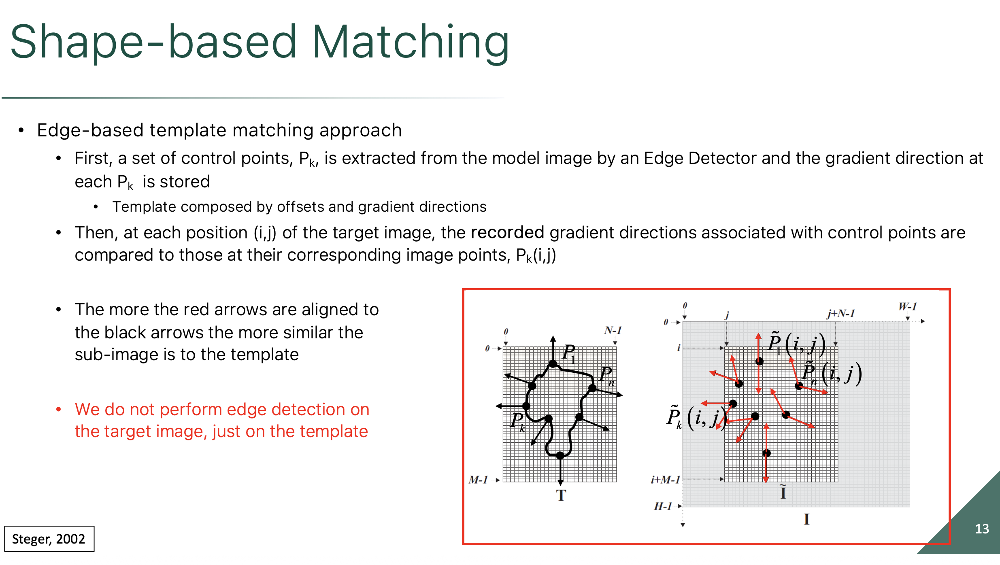

This slide introduces **Shape-based Matching**, which is a brilliant leap forward from the pixel-by-pixel template matching (SSD, ZNCC) we just looked at.

Instead of trying to mathematically normalize the brightness of a million pixels to fight bad lighting, Shape-based Matching abandons raw pixel colors entirely. It relies strictly on the geometric outline of the object.

Here is the step-by-step breakdown of how this highly efficient algorithm works:

### 1. Step One: Building a "Wireframe" Template (Left Image)

Instead of saving the entire dense grid of pixels as the template, the computer runs an **Edge Detector** over the model image.

* It finds the boundary of the object (the thick black line).
* It extracts a set of specific **Control Points** ($P_k$) along that boundary.
* Most importantly, it calculates and saves the **Gradient Direction** at every single control point. These are represented by the outward-pointing **black arrows**.
* The final template is no longer a picture; it is just a lightweight list of coordinates and angles (a wireframe).

### 2. Step Two: The Efficient Search (Right Image)

The algorithm uses the standard "sliding window" technique to sweep this wireframe across the larger Target Image ($I$). However, it uses a massive computational shortcut (highlighted in red on the slide): **"We do not perform edge detection on the target image, just on the template."**

Running a heavy edge-detection algorithm over a massive 4K photograph takes a lot of processing power. Instead, the algorithm is lazy in the smartest way possible:

* It drops the wireframe template onto a specific $(i, j)$ coordinate in the target image.
* It looks at the pixels in the target image that fall *exactly underneath* the template's control points.
* It calculates the gradient directions at *only those specific spots*. These are represented by the **red arrows** ($\tilde{P}_k$).

### 3. Step Three: The Scoring Mechanism

To see if it found the object, the algorithm simply compares the angles of the arrows.

* It measures the alignment between the template's memory (the black arrows) and what it is currently seeing in the target image (the red arrows).
* Mathematically, this is done using the dot product of the vectors. If a black arrow and a red arrow point in the exact same direction, they score a $1.0$. If they point in opposite directions, they score a $-1.0$.
* The algorithm averages the alignment of all the arrows. **The more the red arrows align with the black arrows, the higher the match score.**

### Why is this so powerful?

By looking only at gradient *directions* on the edges, this method is fundamentally immune to lighting changes. Whether an object is brightly lit or hidden in deep shadow, the direction of the transition from the object to the background remains exactly the same. Furthermore, because it only checks the outline, it completely ignores any confusing patterns or clutter printed *inside* the object or sitting in the background.

---

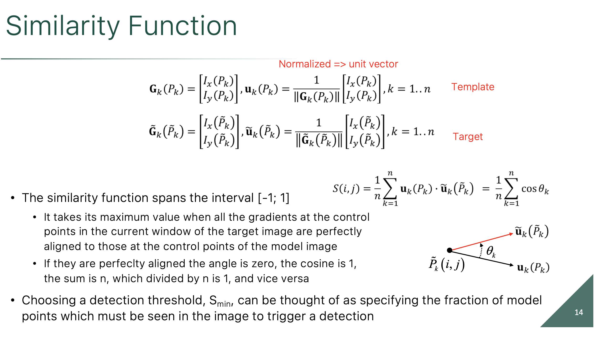

This slide pulls back the curtain on the exact mathematics that power the **Shape-based Matching** we just looked at. It explains how the computer compares the "black arrows" (template memory) to the "red arrows" (target reality) to generate a score.

The genius of this specific formula is that it makes the detection almost completely immune to changes in lighting and contrast. Here is the step-by-step breakdown of the math:

### 1. The Gradients and Normalization (Top Equations)

Let's look at the equations for the Template (the model memory).

* **$\mathbf{G}_k(P_k)$:** This is the raw image gradient at a specific control point ($P_k$). It is a 2D vector containing the change in the X direction ($I_x$) and the change in the Y direction ($I_y$). The length (magnitude) of this vector tells us how *sharp* the edge is (e.g., black to white is a long vector; light gray to dark gray is a short vector).
* **$\mathbf{u}_k(P_k)$:** This is the **Normalized Unit Vector**. The math divides the raw gradient vector $\mathbf{G}_k$ by its own length $||\mathbf{G}_k||$.
* **Why do this?** Normalizing forces every single vector to have a length of exactly $1.0$. This mathematically destroys all the contrast information. A sharp, high-contrast edge and a faint, low-contrast edge will result in the exact same unit vector $\mathbf{u}_k$ as long as they face the same direction! This is the secret to contrast invariance.

### 2. The Dot Product / Cosine Angle

Look at the diagram in the bottom right. The computer takes the normalized template vector ($\mathbf{u}_k$) and the normalized target vector ($\tilde{\mathbf{u}}_k$) and calculates their **Dot Product**.

Because both vectors have a length of exactly 1, trigonometry dictates that their dot product is exactly equal to the **Cosine of the angle between them ($\cos \theta_k$)**:

* If they point the exact same way ($0^\circ$), the cosine is **$1.0$**.
* If they are perpendicular ($90^\circ$), the cosine is **$0.0$**.
* If they point in opposite directions ($180^\circ$), the cosine is **$-1.0$**.

### 3. The Final Similarity Score ($S$)

The final formula simply loops through all $n$ control points on the shape, calculates the cosine score for each pair of arrows, and averages them together ($\frac{1}{n} \sum$).
Because it is an average of cosines, the final Similarity Score spans precisely from **$-1$ to $1$**.

### 4. The Detection Threshold ($S_{min}$)

The final bullet point explains how we use this score in the real world. You set a threshold, like $S_{min} = 0.8$.
Because the max score is $1.0$, setting an 80% threshold roughly means: *"Trigger a detection as long as 80% of the object's edges are visible and aligned."* This allows the algorithm to successfully find objects even if they are partially occluded (e.g., finding a coffee mug even if your hand is covering part of it).

---

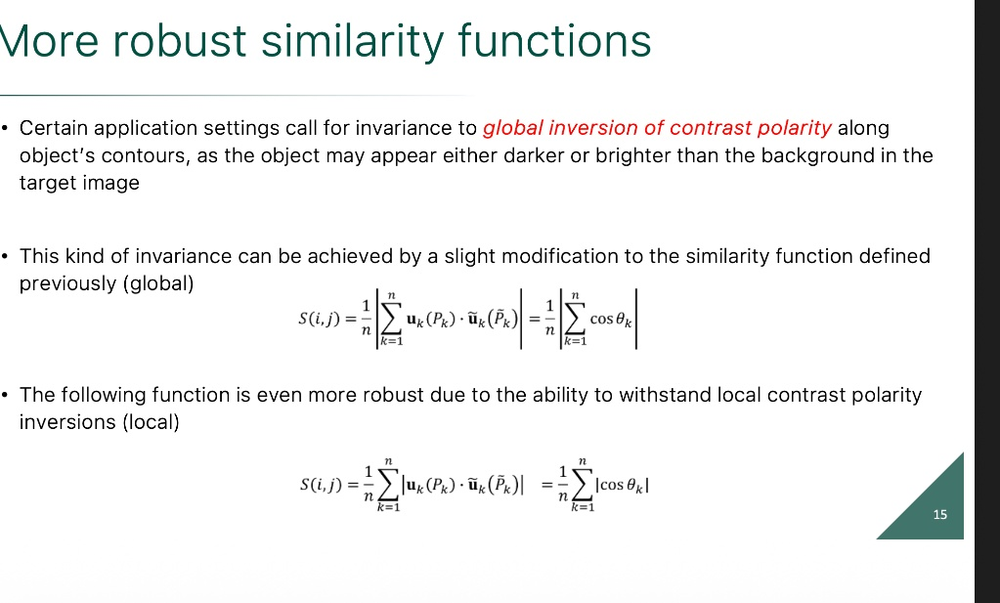

This slide addresses a very specific, but very common, blind spot in the shape-based matching algorithm we just learned: **Contrast Polarity Inversion**.

In the previous slide, we saw that by normalizing the gradient vectors, the algorithm became immune to changes in contrast *strength*. But what happens if the contrast completely flips?

Here is a breakdown of the problem and the two mathematical modifications used to fix it:

### 1. The Problem: Black-on-White vs. White-on-Black

Imagine your template is a black circle printed on white paper. The edge gradients point from dark to light (outward).
Now, imagine the camera looks at a white circle printed on black paper. The physical shape is exactly the same, but because the colors flipped, the gradient vectors all point 180° in the opposite direction (inward).

If we use the standard formula from the last slide, every outward template vector will be compared to an inward target vector. They point in opposite directions, so every dot product scores a **$-1.0$**. The algorithm will average them together, return a final score of $-1.0$, and confidently declare: "This is not a match."

### 2. The Global Inversion Fix (Middle Equation)

To fix this, we need the algorithm to realize that a $-1.0$ is just as good as a $1.0$.

Look closely at the vertical bars in the middle equation. The absolute value brackets are placed on the **outside** of the summation:

$$S(i,j) = \frac{1}{n} \left| \sum_{k=1}^n \cos \theta_k \right|$$

* **How it works:** The computer adds up all the raw scores first. If the entire object flipped colors, all the scores are $-1$, and the total average is $-1.0$. By applying the absolute value at the very end, it flips that $-1.0$ into a perfect **$1.0$**.
* **The Catch:** This only works if the *entire* object flips polarity uniformly (Global Inversion).

### 3. The Local Inversion Fix (Bottom Equation)

What if the object is sitting on a complex, checkered background? Half of the object might be darker than the background, while the other half is brighter. Some target vectors will point outward ($+1$), and some will point inward ($-1$).

If you use the Global formula above, the $+1$ scores and the $-1$ scores will cancel each other out during the summation, resulting in a score near $0$. The detection will fail.

Look at the absolute value brackets in the bottom equation. They have been moved **inside** the summation:

$$S(i,j) = \frac{1}{n} \sum_{k=1}^n |\cos \theta_k|$$

* **How it works:** This formula applies the absolute value to *every single arrow individually*, before they are added together. It turns every $-1$ into a $+1$ immediately.
* **The Result:** The algorithm no longer cares if an arrow points "in" or "out." It only cares that an edge *exists* along that specific line. This is the most robust version of shape-based matching, capable of finding objects perfectly even when they cross over messy, high-contrast backgrounds.

---

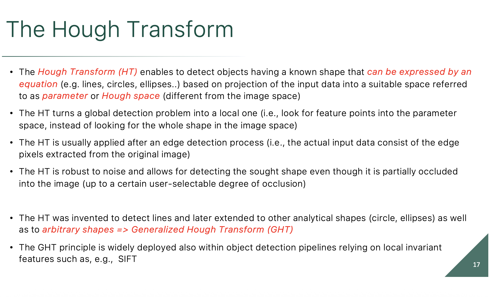

These slides introduce the **Hough Transform (HT)**. If SIFT is the ultimate tool for finding a *specific* complex object, the Hough Transform is the ultimate tool for finding *general mathematical shapes*—most famously, straight lines.

We already know how to find edge pixels using derivatives. But an edge detector just gives you a messy cloud of disconnected pixels. It doesn't know which pixels belong together to form a continuous straight line, especially if that line is broken, noisy, or partially hidden behind something else (occluded).

The Hough Transform solves this by performing a brilliant mathematical "magic trick" involving coordinate spaces, turning a difficult global search into a simple local voting game.

Here is the breakdown of the underlying math shown on Slide 18:

### The "Magic Trick": Swapping Constants and Variables

The standard equation for a line is:

$$y = mx + c$$

*(Note: The slide writes it as $y - mx - c = 0$, which is exactly the same thing).*

**Perspective 1: The Image Space (What we normally see)**
In your standard $X, Y$ image plane, a line has a specific, fixed slope ($\hat{m}$) and a fixed y-intercept ($\hat{c}$).

* The equation is $y = \hat{m}x + \hat{c}$.
* In this view, $m$ and $c$ are **constants**, while $x$ and $y$ are the **variables** that draw the line across the image.

**Perspective 2: The Parameter Space (The Hough Space)**
Now, let's flip the script. Imagine you are looking at a *single, specific edge pixel* on your screen. That pixel has a fixed coordinate ($\hat{x}, \hat{y}$).
Because that pixel is fixed, we can plug its numbers into the equation and rewrite it to solve for $c$:

$$c = -\hat{x}m + \hat{y}$$

Notice what just happened! Because $\hat{x}$ and $\hat{y}$ are now the constants, **$m$ and $c$ have become the variables.** If you graph this new equation on a brand new grid where the axes are $M$ and $C$, it draws a straight line!

### The Core Principle of the Hough Transform

This math proves a fundamental duality:

1. A **single point** in the Image Space translates to a **straight line** in the Parameter Space.
2. That line in the Parameter Space represents *every possible line* that could mathematically pass through your original pixel.

**How we use this to find lines in photos:**

* The computer looks at the first edge pixel in the image and draws its corresponding line in the $M, C$ parameter space.
* It looks at a second edge pixel and draws its line in the parameter space.
* **The "Aha!" Moment:** If those two lines in the parameter space intersect, that intersection point $(m, c)$ represents the *exact slope and intercept of the line that connects both pixels in the image!* If you have 100 edge pixels that all belong to the same physical edge in your photo, their 100 lines in the parameter space will all perfectly cross at one single, massive intersection point. To find the line in the photo, the computer just looks for the brightest intersection "hotspot" in the parameter space. This is why it is so robust to occlusion (Slide 17)—even if half the line is missing, the remaining pixels will still cast enough mathematical "votes" to create a visible hotspot.
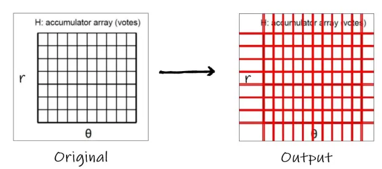
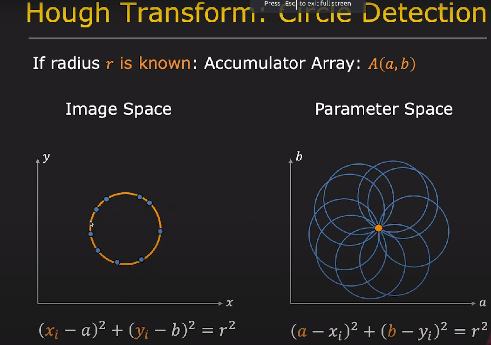
 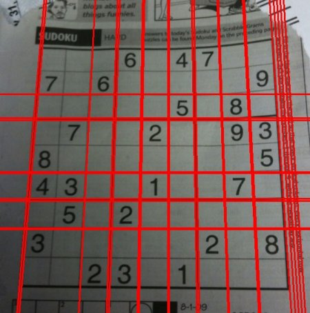

 These slides take the mind-bending duality we just discussed and prove it with concrete mathematics. They show exactly how a computer uses this trick to confidently connect the dots in a messy image.

Here is the step-by-step breakdown of the math in action:

### 1. Two Points Make a Line (Slide 19)

Slide 19 walks through the exact algebra of finding a line between two specific pixels, $P_1$ and $P_2$.

Let's look at the coordinates on the Image Space graph (left):

* **$P_1$** is at $(1, 1)$
* **$P_2$** is at $(2, 3)$

If we plug these $X$ and $Y$ constants into our reversed equation ($c = -xm + y$), we get two equations representing the two lines in the Parameter Space (right):

1. For $P_1$: $c = -1m + 1$
2. For $P_2$: $c = -2m + 3$

Where do these two lines intersect? We just set them equal to each other:

$$1 - m = 3 - 2m$$

$$m = 2$$

If $m = 2$, then plugging it back in gives $c = -1$.
The intersection point in the Parameter Space is exactly **$(2, -1)$**. This perfectly describes the line $y = 2x - 1$ in the image space!

### 2. The Power of Collinearity (Slide 20)

Slide 19 notes that if you have $n$ random points, their parameter lines will cross all over the place, creating a chaotic mess of $n(n-1)/2$ intersections.

However, Slide 20 shows the magic of the Hough Transform. If you have $n$ points that all sit on the *exact same straight line* in the image (collinear points), their corresponding lines in the Parameter Space will not be chaotic. **They will all intersect at one single, massive nexus point.** Look at the red circle on the right graph. Eight different lines all precisely cross through that exact coordinate.

### 3. The Grid: How Computers Actually "See" the Intersection

You might notice that the Parameter Space on Slide 20 has a grid drawn over it. This is a critical implementation detail called the **Accumulator Array**.

Computers don't actually calculate infinite, continuous mathematical lines. Instead, they divide the Parameter Space into a discrete 2D grid of "bins" (like a spreadsheet).

* When the computer draws a parameter line for an edge pixel, it adds $+1$ "vote" to every single bin that the line passes through.
* It repeats this for every edge pixel in the image.
* Once finished, it scans the grid. Most bins will have $0$, $1$, or $2$ votes. But the bin sitting at the intersection point of a real line will have a massive stack of votes (e.g., $150$ votes if there are $150$ pixels on that edge).

By turning line detection into a simple popularity contest (finding the bin with the highest number), the Hough Transform becomes incredibly resilient to missing pixels and noisy data.

---
 

 It is completely normal to find this confusing! The Hough Transform requires you to bend your brain and think in reverse.

To make this crystal clear, forget about complex calculus for a moment. Think of the **Parameter Space** as a map of every possible line in the universe, and the **Accumulator Array** as a blank spreadsheet used to tally votes.

Here is the step-by-step breakdown of how this "spreadsheet" actually looks and works.

### 1. The Setup

Imagine you are the computer. You are looking at a tiny image, and your edge detector has found exactly **two pixels** that it thinks might be part of a line:

* **Pixel A:** is at coordinate $(x=1, y=1)$
* **Pixel B:** is at coordinate $(x=2, y=2)$

You know the equation of a line is $y = mx + c$. Because you know the $x$ and $y$ of your pixels, you flip the equation to solve for the unknowns ($m$ and $c$):

$$c = -x(m) + y$$

### 2. The Accumulator Array (The Spreadsheet)

You construct your Accumulator Array. This is literally just a 2D grid in the computer's memory. The columns represent different possible slopes ($m$), and the rows represent different possible y-intercepts ($c$).

At the start of the algorithm, every box in the spreadsheet has zero votes:

|  | m = 0 | m = 1 | m = 2 |
| --- | --- | --- | --- |
| **c = 2** | 0 | 0 | 0 |
| **c = 1** | 0 | 0 | 0 |
| **c = 0** | 0 | 0 | 0 |

### 3. Pixel A Casts Its Votes

You look at **Pixel A** $(1, 1)$. You plug its numbers into your reversed equation: $c = -1(m) + 1$.
Now, you guess every possible slope ($m$) to see what the intercept ($c$) would be, and you put a **+1 vote** in those boxes:

* If $m = 0$, then $c = 1$. -> Add a vote to the $(0, 1)$ box.
* If $m = 1$, then $c = 0$. -> Add a vote to the $(1, 0)$ box.
* If $m = 2$, then $c = -1$. (Out of bounds for our mini-grid).

Here is what the Accumulator Array looks like after Pixel A votes:

|  | m = 0 | m = 1 | m = 2 |
| --- | --- | --- | --- |
| **c = 2** | 0 | 0 | 0 |
| **c = 1** | **1** | 0 | 0 |
| **c = 0** | 0 | **1** | 0 |

*Notice that Pixel A's votes form a diagonal path across the spreadsheet. A single point in the image creates a line of votes in the accumulator!*

### 4. Pixel B Casts Its Votes

Now you look at **Pixel B** $(2, 2)$. You plug its numbers into the equation: $c = -2(m) + 2$.
You guess the slopes again and cast its votes:

* If $m = 0$, then $c = 2$. -> Add a vote to the $(0, 2)$ box.
* If $m = 1$, then $c = 0$. -> Add a vote to the $(1, 0)$ box.

Here is the final Accumulator Array after Pixel B votes:

|  | m = 0 | m = 1 | m = 2 |
| --- | --- | --- | --- |
| **c = 2** | 1 | 0 | 0 |
| **c = 1** | 1 | 0 | 0 |
| **c = 0** | 0 | **2** | 0 |

### The Grand Reveal

The algorithm is finished. The computer scans the spreadsheet looking for the box with the highest number of votes.

It finds that the box for **$m = 1$ and $c = 0$** has 2 votes. This means both Pixel A and Pixel B agree that they belong to the line $y = 1x + 0$. The computer has successfully found the line connecting the dots!

In a real photograph, this spreadsheet is massive (thousands of rows and columns), and a true edge might cast 300 votes into a single box. By finding that "hotspot" of votes, the computer can find lines even if the edge is noisy or partially hidden behind a tree.

---

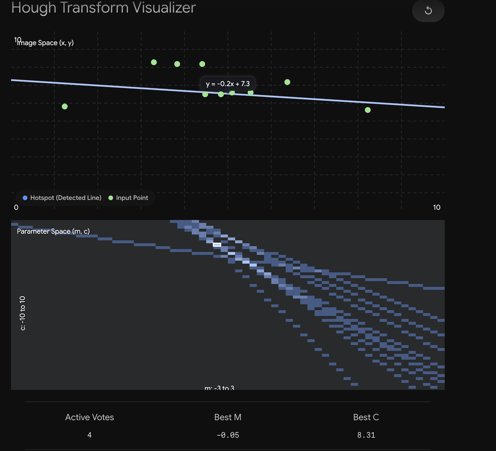

It is completely normal to find this confusing! The Hough Transform requires you to bend your brain and think in reverse.

To make this crystal clear, forget about complex calculus for a moment. Think of the **Parameter Space** as the *concept* of every possible line in the universe, and the **Accumulator Array** as the physical *spreadsheet* the computer uses to tally votes.

Here is the exact difference between the two, and how they work together:

### 1. The Parameter Space (The Mathematical Concept)

In our normal world (the Image Space), you locate things using $X$ and $Y$ coordinates. A point is a dot, and a line is a streak drawn across the screen.

The **Parameter Space** is an alternate mathematical universe where the rules are swapped. Instead of $X$ and $Y$, the axes are **$M$ (Slope)** and **$C$ (Y-Intercept)**.

* Because a straight line is completely defined by its slope and intercept ($y = mx + c$), a full, infinite line in our normal world shrinks down to become a **single, specific dot** in the Parameter Space.
* Conversely, a single dot in our normal world translates into a **continuous line** in the Parameter Space.

### 2. The Accumulator Array (The Computer's Spreadsheet)

While the Parameter Space is a beautiful mathematical idea, computers cannot calculate infinite, continuous math. They need discrete numbers.

The **Accumulator Array** is how the computer physically builds the Parameter Space in its memory. It creates a massive 2D grid—literally just a spreadsheet or an array.

* The columns represent different possible slopes ($m$).
* The rows represent different possible intercepts ($c$).
* Every single "cell" or "bin" in this spreadsheet starts with a value of **$0$**.

### 3. The Voting Process (Connecting the Dots)

Here is how the computer uses this spreadsheet to find a line in a messy photo:

1. **Find a Pixel:** The edge detector finds a single edge pixel at coordinate $(2, 2)$.
2. **Reverse the Math:** The computer plugs those coordinates into the reversed line equation: $c = -2m + 2$.
3. **Cast the Votes:** The computer draws this new equation across the Accumulator Array. It goes cell-by-cell. If the line passes through a cell, the computer adds **$+1$ vote** to that cell.
4. **Repeat:** The computer does this for every single edge pixel in the image. Every pixel casts a line of votes across the spreadsheet.
5. **The Winner:** If 50 pixels in your image all belong to the exact same physical edge, their 50 lines of votes will all perfectly intersect at one specific cell in the Accumulator Array. The computer simply scans the spreadsheet, finds the cell with $50$ votes, reads the $M$ and $C$ labels for that cell, and knows exactly where the line is in the photo!

---

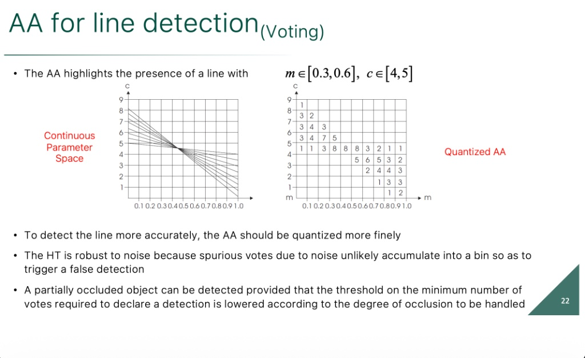

This slide shows the exact "spreadsheet" voting process we just discussed, and it highlights three massive real-world advantages of using this system.

Here is the breakdown of the concepts shown on the slide:

### 1. Continuous vs. Quantized (The Grid Size)

Look at the two graphs side-by-side.

* **The Left Graph (Continuous):** This is the pure mathematical theory. The lines are infinitely thin, and they cross at one microscopic, perfect point. Computers cannot process infinite continuous space.
* **The Right Graph (Quantized AA):** This is reality. The computer chops the space up into discrete boxes (quantization). The numbers inside the boxes are the physical tallies of the votes. The winning box has an **$8$** in it.

Notice the mathematical trade-off mentioned in the bullet points. Because the winning box is relatively wide, the computer doesn't know the *exact* perfect slope; it only knows the slope is somewhere inside that box ($m \in [0.3, 0.6]$). If you want more precise line detection, you must make the grid boxes smaller (quantize more finely). However, if you make the boxes too microscopic, slight camera noise might cause the lines to miss the box entirely!

### 2. Robustness to Noise (Ignoring the Garbage)

Real photos are filled with "spurious" noise—random bright pixels that the edge detector accidentally flags.

* A random noise pixel will still cast a line of votes across the Accumulator Array.
* However, because noise is random, these parameter lines will go in all sorts of random directions. They might drop a $1$ or a $2$ in various random boxes.
* The magic of the Hough Transform is that **random noise will never conspire to intersect at the exact same point.** Only pixels that physically sit on a straight line in the real world will cast votes into the same box. By simply ignoring any box with a low score, the computer effortlessly filters out the noise.

### 3. Surviving Occlusions (Hidden Objects)

Imagine you are writing software for a self-driving car to detect the straight painted lines of a highway lane. What happens if a passing car physically blocks half of the lane line from the camera's view?

* Basic template matching would fail because half the template is missing.
* The Hough Transform succeeds brilliantly. If half the line is hidden, you simply have fewer pixels voting. Instead of a box getting 100 votes, it might only get 50 votes.
* As the bottom bullet point explains, as long as you lower your **Detection Threshold** (e.g., telling the computer, "A box only needs 40 votes to be considered a real line"), it will still flawlessly detect the geometry of the entire lane line, even the part hidden underneath the other car.

This slide reveals a massive, hidden flaw in the $y = mx + c$ Hough Transform we just learned about, and introduces the final, real-world math used to fix it: **The Polar (Normal) Parameterization**.

Here is the breakdown of why the previous math breaks, and how this new equation saves the day:

### 1. The "Infinite Slope" Problem

In the previous slides, we built an Accumulator Array spreadsheet with the slope ($m$) on the X-axis.

* A horizontal line has a slope of $m = 0$.
* A 45-degree line has a slope of $m = 1$.
* **The Problem:** A perfectly vertical line has a slope of **infinity** ($m = \infty$).

Because a computer's memory is finite, you cannot build a spreadsheet with an infinite number of columns to capture every possible vertical slope. If you use $y = mx + c$, your program will literally crash or fail to detect vertical lines.

### 2. The Solution: Polar Coordinates ($\rho, \theta$)

To fix this, mathematicians abandoned $m$ and $c$ entirely. Instead, they describe a line using two finite boundaries: **$\rho$ (rho)** and **$\theta$ (theta)**.

Look at the diagram on the right of the slide:

* **$\rho$ (Distance):** Draw a line perfectly perpendicular from the origin $(0,0)$ to your target line. $\rho$ is the physical length of that perpendicular segment.
* **$\theta$ (Angle):** This is the angle that the perpendicular segment makes with the x-axis.

**Why is this brilliant?** Both of these numbers have strict, absolute maximum limits!

* The angle ($\theta$) can only ever spin from $-90^\circ$ to $+90^\circ$ ($-\frac{\pi}{2}$ to $\frac{\pi}{2}$).
* The distance ($\rho$) can never be larger than the physical diagonal corner-to-corner length of your image ($N \cdot \sqrt{2}$).
* Because both bounds are strictly capped, you can build a perfectly sized, finite Accumulator Array spreadsheet that will never crash.

### 3. The New Equation (Sine Waves)

Because we changed the variables, the equation mapping the image to the parameter space changes to the one shown in the middle of the slide:

$$\rho = x \cos \theta + y \sin \theta$$

This fundamentally changes the visual geometry of the "magic trick":

* In the old method, a single pixel plotted a *straight line* in the parameter space.
* In this new method, because of the sine and cosine, a single pixel plots a **curved, sinusoidal wave** in the parameter space.

However, the voting logic remains exactly the same! If you have 50 pixels sitting on a straight line in your photo, they will cast 50 sine waves into the Accumulator Array. Those 50 sine waves will all perfectly intersect at a single "hotspot" peak. The coordinates of that peak give you the exact $\rho$ and $\theta$ of the line in your image.

---
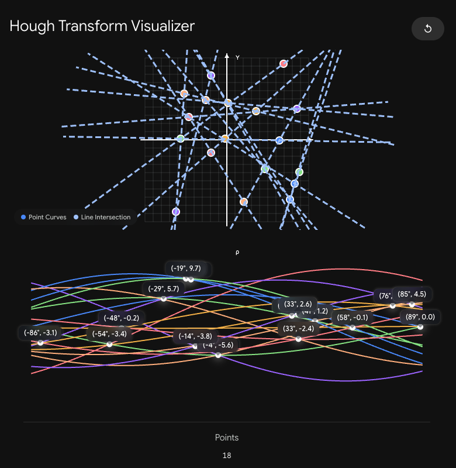

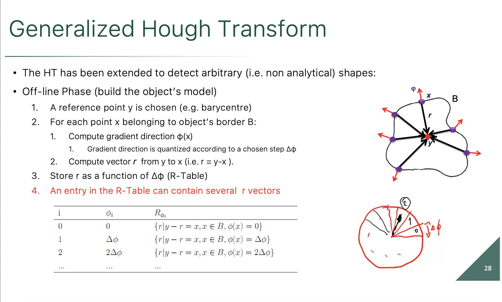

This slide introduces the **Generalized Hough Transform (GHT)**.

Up until now, the Hough Transform was limited by a strict mathematical rule: you could only detect a shape if you could write a clean algebra equation for it (like $y = mx + c$ for a line, or $x^2 + y^2 = r^2$ for a circle).

But what if you want to teach a computer to detect a complex, arbitrary shape, like the silhouette of a cat, a puzzle piece, or the bumpy blob shown on the slide? You cannot write a simple equation for that.

To solve this, the GHT completely abandons algebra. Instead of an equation, it builds a **mathematical cheat sheet** called the **R-Table**.

Here is the step-by-step breakdown of the "Off-line Phase" (how the computer memorizes the shape before it goes looking for it):

### 1. Pick a Center Point (The Barycenter)

Look at the diagram in the top right. The computer looks at its template shape and picks a single reference point inside it, labeled **$y$** (usually the center of mass/barycenter). The entire goal of the algorithm will be to figure out where this exact center point is hiding in the final photograph.

### 2. Map the Border (The Red and Black Arrows)

The computer runs an edge detector around the border of the shape. At every single pixel on that border (labeled $x$), it records two crucial pieces of information:

* **The Red Arrow ($\phi$):** Which way is the edge facing at this exact spot? This is the gradient direction.
* **The Black Arrow ($r$):** Where is the center point from here? This is the vector drawn from the edge pixel back to the center point $y$.

### 3. Build the Cheat Sheet (The R-Table)

The computer organizes all this information into the R-Table shown on the bottom left.

* It divides all possible 360 degrees of edge directions into "bins" or "slices" (like the hand-drawn pizza chart on the bottom right, $\Delta\phi$).
* **The Logic:** It creates a lookup table that says: *"If I ever see an edge facing exactly $45^\circ$, the center of the shape should be located exactly [Vector $r$] away from me."*

### 4. Handling Arbitrary Bumps

The last red bullet point notes a critical detail: *An entry in the R-Table can contain several $r$ vectors.*
Because the shape is a weird blob, there might be three different spots on the border that all happen to face $45^\circ$. If the computer sees a $45^\circ$ edge in the wild, it won't know *which* of the three spots it is looking at. So, the R-Table simply stores all three $r$ vectors in that row.

### How it Votes (The Sneak Peek)

While this slide only shows the "memorization" phase, it sets up the exact same Accumulator Array (spreadsheet) voting system you struggled with earlier!
When searching a real photograph, the computer finds an edge, checks its angle ($\phi$), opens its R-Table cheat sheet to that angle, and casts a $+1$ vote for every center location ($r$) listed in that row. The spot in the spreadsheet that gets the most votes is declared the center of the hidden object.

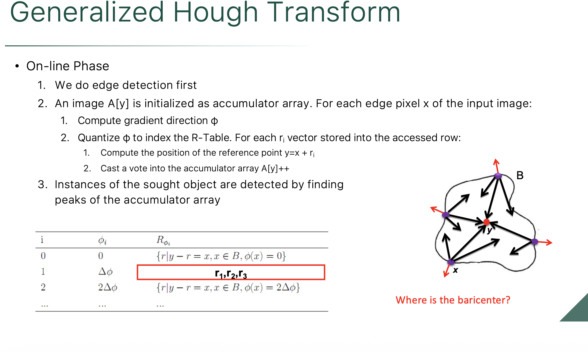

This slide is the payoff! We built the R-Table "cheat sheet" in the last step. Now, this slide explains the **On-line Phase**—how the computer actually uses that table to hunt down the object in a brand new, messy photograph.

Here is the step-by-step breakdown of how the voting process works in the wild:

### 1. Edge Detection & The Accumulator

First, the computer runs a standard edge detector over the target image. It ignores all the blank space and only looks at pixels sitting on an edge.
It also creates a blank 2D grid in its memory to act as the voting spreadsheet (the **Accumulator Array**, $A[y]$). This grid represents every possible $(x, y)$ pixel coordinate where the object's center could be hiding.

### 2. The Lookup and Vote (The Red Box)

For every single edge pixel ($x$) it finds, the computer does the following:

* **Measure the Angle:** It calculates the gradient direction ($\phi$) of that specific pixel. Let's say it is facing $45^\circ$.
* **Consult the R-Table:** It opens its cheat sheet to the $45^\circ$ row.
* **The Ambiguity (Red Box):** Look at the red box on the slide. Because the target shape might be bumpy and weird, there might be three completely different spots on the object's border that all have a $45^\circ$ angle. The table lists all three possible vectors to the center: $\mathbf{r_1, r_2, r_3}$.
* **Cast the Votes:** Because the computer doesn't know *which* part of the object it is currently looking at, it just blindly casts a vote for all of them! It calculates the guessed center point for each vector ($y = x + r_i$) and adds a $+1$ to those bins in the Accumulator Array.

### 3. Convergence (Finding the Peak)

Casting three votes for a single pixel might sound like a recipe for chaos. It means 2 out of every 3 votes are completely wrong (spurious votes).

However, just like the line detection we saw earlier, **random garbage doesn't overlap**. The wrong votes will scatter seemingly randomly across the spreadsheet. But the *correct* vector from every single edge pixel will all point back to the exact same $(x, y)$ coordinate.

When the computer finishes scanning the edge and looks at the Accumulator Array, the true center (the barycenter) will have a massive, undeniable mountain of votes, while the rest of the grid just has faint, scattered noise.

---
