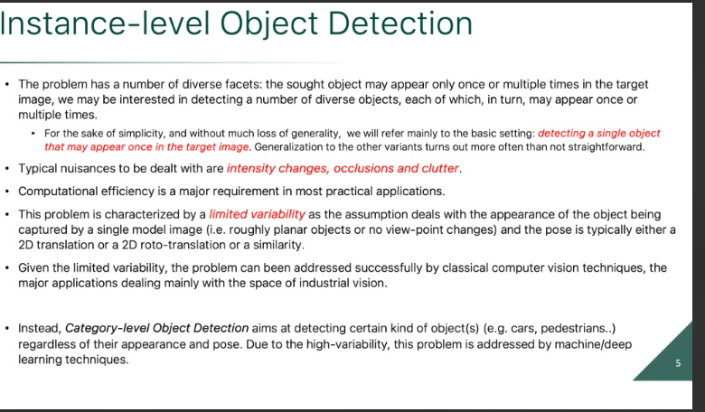
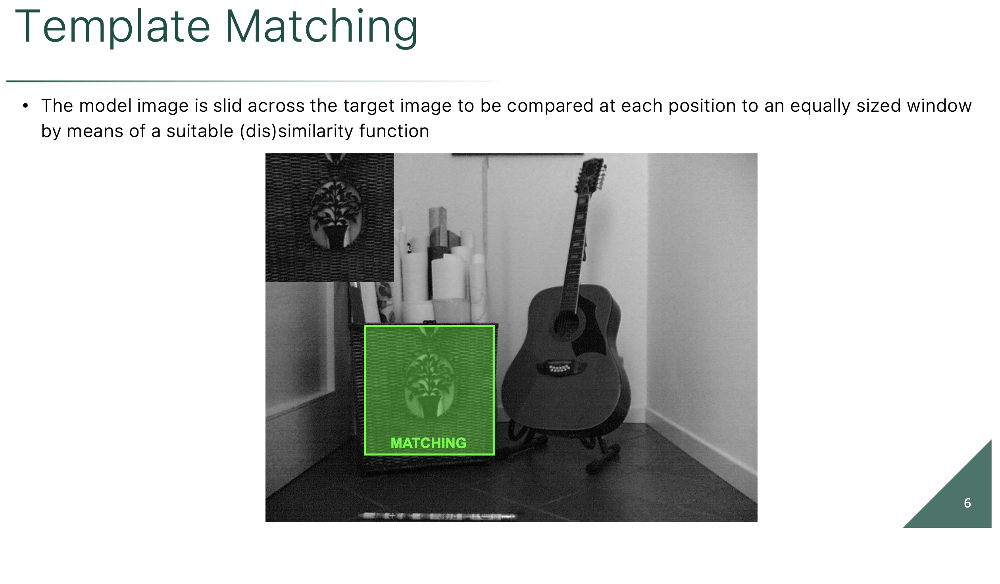
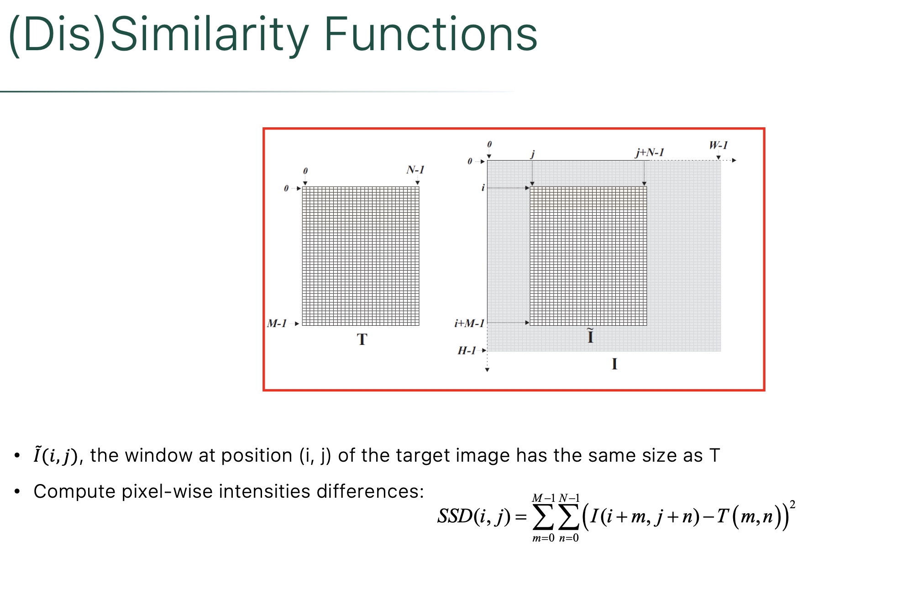
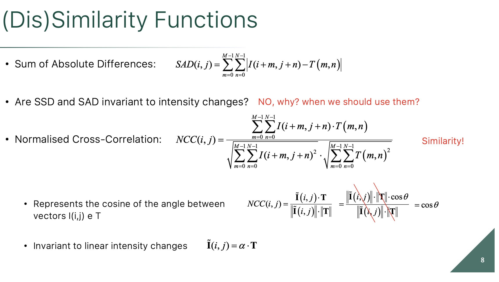
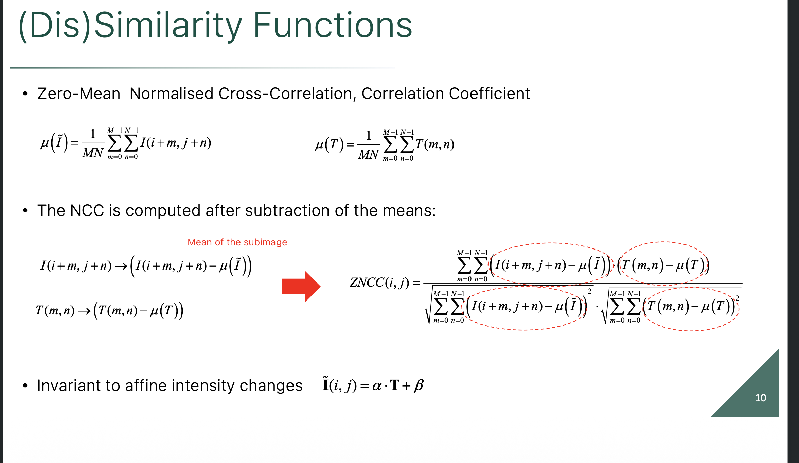
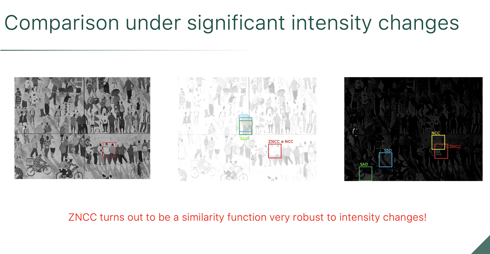

**Why are we doing all this feature matching in the first place?**

The answer is to solve the problem of **Instance-level Object Detection**.

Here is a breakdown of what that means and the terminology used in the field:

### 1. "Instance-Level" vs. Categorical

In computer vision, there is a big difference between finding a *category* and finding an *instance*.

* **Categorical Detection:** You train a neural network to find *any* car, *any* pedestrian, or *any* dog. It just puts a box around things that look generally like the category.
* **Instance-Level Detection:** You are looking for a highly specific, unique item. You aren't looking for *any* book; you are looking for a specific copy of *Multiple View Geometry* (as seen in the previous SIFT slides). In this slide's example, the system isn't looking for just any circle on a circuit board; it is looking for that exact, specific metallic pad pattern.

### 2. The Reference vs. The Target

To perform this task, the algorithm always needs two inputs:

* **The Reference Image (Model):** This is the "wanted poster." It is a clean, isolated crop of the specific object you are trying to find (shown as the small square on the right of the slide).
* **The Target Image:** This is the messy, real-world scene you are analyzing (the large circuit board on the left).

The algorithms we just learned about (like SIFT) extract hundreds of keypoint descriptors from the Reference, and thousands from the Target, and then try to find matching pairs between them.

### 3. Estimating the "Pose"

If the algorithm finds enough matching features, it declares a successful detection. But just saying "Yes, it's in the image" isn't enough for most applications (like a robotic arm trying to pick up a part). The system must estimate the **Pose**—how the object is physically situated in the target image compared to the reference.

The bottom bullet point defines the three levels of pose complexity:

* **Translation:** The object just slid up, down, left, or right ($x, y$ movement).
* **Roto-translation (Euclidean):** The object moved $x, y$ AND it spun around (rotation).
* **Similarity:** The object moved $x, y$, rotated, AND it moved closer/further away from the camera, changing its size (scale).

Because real-world objects constantly undergo "Similarity" transformations when you wave a camera at them, algorithms like SIFT (which are inherently rotation and scale invariant) are absolute requirements for solving this problem reliably.

### 1. The Real-World Nuisances

When you try to find a specific object in the real world, the math has to fight through three major headaches:

* **Intensity Changes:** Shadows, bright sunlight, or different camera exposures. (This is exactly why SIFT normalizes its 128-dimensional descriptor vector).
* **Clutter:** The background is busy and full of shapes that might accidentally trigger a false positive. (This is why Lowe invented the distance Ratio Test we looked at earlier).
* **Occlusions:** The object is partially hidden behind something else. (Because algorithms like SIFT find *local* keypoints rather than looking at the whole image at once, they can still recognize a book even if your hand is covering half of it).

### 2. The Grand Divide: Classical vs. Deep Learning

The bottom half of the slide highlights the definitive boundary line in modern computer vision.

**Instance-Level Detection (Classical Vision)**

* **The Goal:** Finding a *specific* item (e.g., your exact copy of *Multiple View Geometry*, or a specific microchip on an assembly line).
* **The Trait (Limited Variability):** The object is rigid. It might rotate, shrink, or tilt, but its internal geometry never changes. A printed letter 'A' on a book cover always looks exactly the same relative to the rest of the cover.
* **The Solution:** Classical algorithms like Harris and SIFT are mathematically perfect for this. They are heavily used in industrial vision and robotics because they are fast, mathematically provable, and don't require training data.

**Category-Level Detection (Deep Learning)**

* **The Goal:** Finding a *class* of items (e.g., "Find all the cars" or "Find the pedestrians").
* **The Trait (High Variability):** Cars come in thousands of different shapes, colors, and models. Pedestrians can be tall, short, sitting, walking, or wearing different clothes.
* **The Solution:** SIFT completely fails here. If you try to match a SIFT keypoint from a Honda Civic's headlight to a Ford truck's headlight, the gradients won't match. To solve high-variability problems, you must use Machine Learning (like YOLO or CNNs) to teach a computer the abstract *concept* of a car through thousands of examples.

---

This slide takes us back to the absolute most fundamental, brute-force method for finding an object in an image: **Template Matching**.

Before researchers invented complex, invariant algorithms like SIFT or Harris, they used this exact technique. It is the underlying math behind basic computer vision functions (like `cv2.matchTemplate()` if you are building an OpenCV pipeline).

Here is the breakdown of the concept and the math shown on the slide:

### 1. The Concept of Template Matching

Imagine taking a small, transparent photograph of a specific object (the **Template**, denoted as **$T$** on the slide). Your goal is to find that object inside a larger, messy picture (the **Target Image**, denoted as **$I$**).

The algorithm does this by literally using a "sliding window."

* It places the top-left corner of the Template at the top-left corner of the Target Image $(0,0)$.
* It compares the pixels.
* It shifts the Template one pixel to the right and compares again.
* It repeats this for every single possible $(i, j)$ coordinate until it has scanned the entire image.

### 2. The Math: Sum of Squared Differences (SSD)

At every single "stop" along that sliding path, the computer has to calculate a score to answer: *"How well do the pixels under my window match my template?"*

The equation on the bottom of the slide is the most common way to calculate this score, known as the **Sum of Squared Differences (SSD)**:

$$SSD(i, j) = \sum_{m=0}^{M-1} \sum_{n=0}^{N-1} (I(i+m, j+n) - T(m,n))^2$$

Here is what that actually means in plain English:

* **$T(m,n)$**: The brightness value of a specific pixel inside your small template.
* **$I(i+m, j+n)$**: The brightness value of the corresponding pixel in the large image, offset by wherever your sliding window $(i, j)$ currently is.
* **The Subtraction**: The math subtracts the image pixel from the template pixel. If they are the exact same color, the answer is $0$.
* **The Square**: The result is squared to ensure the number is always positive, and to heavily penalize pixels that are wildly different colors.
* **The Double Summation ($\sum\sum$)**: The computer simply runs a nested loop over the width ($M$) and height ($N$) of the template, adding up the squared errors for every single pixel in the box.

### 3. Why is it called a "(Dis)Similarity Function"?

It is called a *dissimilarity* function because the math is measuring the **error** (the difference) between the two patches.

* A score of **$0$** means the pixels match perfectly.
* A massive score means the window is looking at something completely different.

Once the algorithm finishes sliding across the entire image, it generates a heatmap of these SSD scores. The $(i, j)$ coordinate with the **absolute minimum score** is declared the winner—that is where your object is located.

### The Fatal Flaw (Why SIFT was invented)

Template matching is incredibly fast and conceptually simple, but it has a massive vulnerability: **it is entirely rigid.**

Because it calculates the difference pixel-by-pixel, the object in the Target Image must be the *exact same size* and the *exact same rotation* as your Template. If the camera tilts 10 degrees, or zooms in 5%, the raw pixel grids no longer align, the SSD error shoots through the roof, and the detection fails completely.

This exact vulnerability is the reason the computer vision field had to invent the complex, dynamically scaling, gradient-voting algorithms like SIFT that we covered in the previous slides!

These slides detail how to make basic **Template Matching** survive real-world lighting changes.

As we discussed, standard template matching uses a sliding window to compare a small Template ($T$) against a Target Image ($I$). The core problem with the basic **Sum of Squared Differences (SSD)** is that it is mathematically brittle. If a shadow falls over your target image, or if the camera's exposure changes, the raw pixel numbers change, and SSD will fail to find a match even if the object is right there.

Here is the mathematical progression of how computer vision engineers solved the lighting problem:

### 1. The Baseline: SAD (Sum of Absolute Differences)

Slide 8 introduces SAD:

$$SAD(i, j) = \sum_{m=0}^{M-1}\sum_{n=0}^{N-1} |I(i+m, j+n) - T(m,n)|$$

* **What it is:** Instead of squaring the difference like SSD, it just takes the absolute value (turning negative numbers positive).
* **Why use it?** It is computationally faster for a computer to calculate than squares.
* **The Flaw:** Just like SSD, SAD is a **Dissimilarity Function** (an error score where $0$ is a perfect match). And just like SSD, it is completely destroyed by intensity changes. If the sun comes out and adds $+50$ brightness to every pixel in the image, the subtraction will result in a massive error score.

### 2. The First Fix: NCC (Normalized Cross-Correlation)

To fix the lighting issue, the math transitions from an error function to a **Similarity Function** (where $1.0$ is a perfect match, and $0$ is no match).

$$NCC(i, j) = \frac{\sum\sum I \cdot T}{\sqrt{\sum\sum I^2 \cdot \sum\sum T^2}}$$

* **The Vector Concept:** Instead of subtracting pixels, this equation treats the entire template patch and the image patch as two giant vectors in space. It calculates the cosine of the angle between them ($\cos \theta$). If the vectors point in the exact same direction, the angle is 0, the cosine is $1$, and you have a perfect match.
* **Multiplicative Invariance:** Imagine the contrast doubles (e.g., $I_{new} = 2 \cdot I_{old}$). Because of the fraction in the NCC formula, that multiplier of $2$ appears in both the numerator (the top) and the denominator (the bottom square root). The 2s perfectly cancel each other out! Therefore, NCC is immune to linear contrast changes.

### 3. The Ultimate Fix: ZNCC (Zero-Mean Normalized Cross-Correlation)

Slide 10 addresses the final vulnerability. NCC survives if you multiply the brightness (contrast), but it actually fails if you just *add* a flat amount of brightness to the whole image (e.g., a camera flash).

To achieve perfect lighting invariance, you must calculate the **mean** ($\mu$)—the average brightness of the pixels inside the window—and subtract it from every pixel before running the NCC math.

$$ZNCC(i, j) = \frac{\sum\sum (I - \mu_I)(T - \mu_T)}{\sqrt{\sum\sum (I - \mu_I)^2 \cdot \sum\sum (T - \mu_T)^2}}$$

* **Additive Invariance:** By subtracting the local average brightness ($\mu$) from every pixel, you mathematically destroy any flat brightness shift. If the sun adds $+50$ brightness to every pixel, the average $\mu$ also goes up by $50$. When you subtract the new $\mu$ from the new pixels, the $+50$ is instantly erased.
* **The Result:** ZNCC is mathematically invariant to **affine intensity changes** ($\tilde{I} = \alpha \cdot T + \beta$). No matter how you multiply the contrast ($\alpha$) or shift the brightness ($\beta$), ZNCC will still perfectly recognize the structural pattern of the template.

This slide provides the ultimate visual proof of why we had to upgrade the template matching math from SSD to ZNCC. It is a real-world "stress test" showing exactly how the algorithms behave when the lighting goes wrong.

Here is the breakdown of what is happening in the three images:

### 1. The Setup (Left Image)

This is the baseline. The computer is given a template: a crop of the person wearing a white shirt and dark pants (marked by the red box). The goal is to find this exact person in the other two mathematically corrupted images.

### 2. Test 1: Extreme Brightness (Middle Image)

This image has been severely washed out (overexposed). A massive amount of flat brightness was added to every pixel.

* **SSD (Blue) & SAD (Green) Fail:** Look at where their bounding boxes landed. They completely missed the target. Because they measure absolute mathematical differences, the added brightness ruined their scores. To minimize the massive math error, they just randomly latched onto the darkest blurry shapes left in the image.
* **NCC & ZNCC (Red) Succeed:** They found the target perfectly because they look at the *relative* structural pattern (the vectors), ignoring the flat brightness boost.

### 3. Test 2: Extreme Darkness (Right Image)

This image has been severely darkened and its contrast crushed.

* **SSD & SAD Fail:** They miss the target again for the same reasons.
* **NCC (Yellow) Fails:** Notice that the basic Normalized Cross-Correlation (NCC) has now drifted off target! NCC handles contrast multiplication well, but it struggles with severe additive/subtractive lighting shifts.
* **ZNCC (Red) Succeeds:** The Zero-Mean Normalized Cross-Correlation remains perfectly locked on the target. Because ZNCC calculates the local average brightness and subtracts it *before* making the comparison, it is completely blind to the darkness. It only sees the underlying structural pattern.

**The Takeaway:** As the red text states, ZNCC is the undisputed winner. If you are building a computer vision system for the real world—where clouds pass over the sun, shadows move, and cameras adjust their exposure—you must use ZNCC to ensure your tracking boxes don't wander off.

---
