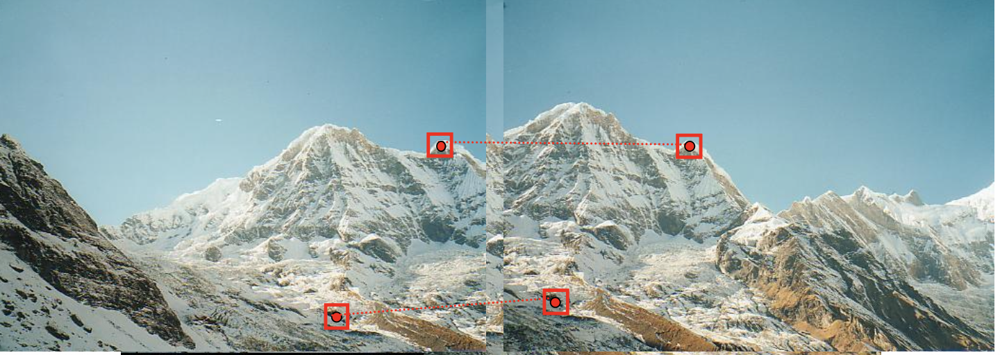

This slide marks a major shift in the computer vision topics we've been covering. We are moving away from low-level pixel processing (like finding raw edges) and moving toward higher-level understanding: **matching objects and scenes across different photos**.

Here is a breakdown of the core problem this slide introduces:

### 1. The Goal: Finding "Corresponding Points"

Imagine you are trying to stitch two photos together to make a panorama, or you are trying to track a moving car across multiple frames of a video. To do this, the computer needs to find **Correspondences**.

* A correspondence is a pair of pixels (one in Image A, one in Image B) that both represent the exact same physical, 3D point in the real world.
* If you can find enough of these matching pairs, you can mathematically align the images or calculate the depth of the scene.

### 2. The Problem: The World is 3D, Images are 2D

The second bullet point highlights why this is incredibly difficult. You cannot simply look for the exact same patch of pixels in both images. Why? Because a 3D point rarely looks the same twice.

When you take a picture of a scene from two different angles, the resulting 2D projections suffer from several distortions:

* **Viewpoint Variations:** If you move to the right, a square building might look like a skewed trapezoid (perspective distortion). If you step back, the object shrinks (scale variation). If you tilt the camera, the object rotates (rotation variation).
* **Lighting Changes:** A point that falls in bright sunlight in one photo might be covered by a dark shadow in the next photo just a few seconds later.

### 3. The Solution: "Local Invariant Features"

To solve this, we need to extract features from the image that are:

* **Local:** They rely on a very small, specific patch of pixels around the point (so they aren't affected if the rest of the background changes or gets blocked).
* **Invariant:** Their mathematical description does *not* change even if the image is rotated, scaled, or darkened.

If we can mathematically describe a point in a way that ignores viewpoint and lighting, we can confidently match it across completely different photos.

---

This slide takes the theoretical problem of "Corresponding Points" from the previous slide and applies it to a classic, practical Computer Vision task: **Panorama Stitching**.

It outlines the standard four-step pipeline that your phone's camera uses every time you take a panoramic photo.

Here is a breakdown of the pipeline shown in the slide:

### 1. Detection (Finding "Salient Points")

The computer cannot look at every single pixel—that's too slow. Instead, it scans both images independently to find **Salient Points** (often called "Keypoints" or "Features").

* A salient point is a pixel that stands out from its neighbors and is mathematically unique.
* A patch of flat blue sky is useless (every pixel looks the same).
* A jagged mountain peak (like the ones highlighted with red boxes in the photo) is perfect because it has sharp gradients in multiple directions.

### 2. Description (Computing a "Local Description")

Once the computer flags a mountain peak as a salient point, it needs a way to remember what it looks like.

* It looks at a small window of pixels surrounding that point and calculates a mathematical summary of that neighborhood (usually based on gradient directions).
* Think of this as creating a unique **mathematical fingerprint** for that specific mountain peak, designed to remain constant even if the lighting changes or the camera rotates slightly.

### 3. Matching (Finding Pairs)

Now the computer has a list of fingerprints from Image A (the left photo) and a list from Image B (the right photo).

* It simply compares the two lists. If a fingerprint in Image A is highly mathematically similar to a fingerprint in Image B, the computer declares them a **Match** (a Correspondence).
* The dotted red lines in the image represent these successful matches.

### 4. Alignment (Estimating a Homography)

Once the computer knows that Point 1 in Image A is the exact same physical rock as Point 1 in Image B, it can warp the images to overlap perfectly. It does this using a **Homography**.

* A Homography is a $3 \times 3$ transformation matrix that maps points from one 2D plane to another. It can handle rotation, translation, scaling, and perspective skew.
* **Why exactly 4 points?** A homography matrix has 8 unknown parameters (degrees of freedom). Because every point on a 2D image has two coordinates ($x$ and $y$), each matching pair gives you 2 equations. To solve for 8 unknowns, you need a minimum of 4 matching pairs ($4 \text{ pairs} \times 2 \text{ equations} = 8$).

---

To help visualize how matching points physically drive the alignment of two images, I've generated an interactive homography simulator below. You can act as the "matching algorithm" by dragging the four corners of a warped image to stitch it seamlessly onto a target background.

This slide expands on the concept of "Corresponding Points" by showing us *why* we go through the trouble of finding them. While the previous slide showed a panorama, this one highlights four advanced, real-world Computer Vision applications that entirely depend on **Local Invariant Features**.

Here is a breakdown of the four technologies shown:

### 1. Instance-Level Object Detection

Unlike generic object detection (which just asks "is there *a* car in this photo?"), instance-level detection asks "is there *this exact specific* car in this photo?"

* **How it works:** The system extracts feature "fingerprints" from a clean reference image (like the cereal box on the left). It then extracts features from a messy, cluttered live camera feed. By finding enough corresponding points (represented by the light blue lines), it can mathematically prove the object is there, even if it is rotated, partially hidden, or under different lighting.

### 2. Robot Navigation (Visual SLAM)

Robots (like the vacuum shown) and self-driving cars need to know exactly where they are in a room or on a street. This technique is called Simultaneous Localization and Mapping (SLAM).

* **How it works:** As the robot drives, its camera identifies distinct local features (like the corner of the couch or the edge of the table). It uses these features as digital "landmarks." By tracking how these landmarks move across its camera feed over time, the robot can calculate its own movement and build a 3D map of the room simultaneously.

### 3. Augmented Reality (AR)

To make a digital character look like it is physically standing on a real-world book (as shown in the image), the camera must perfectly track the book's position and angle in 3D space in real-time.

* **How it works:** The AR app finds invariant features on the book's cover. As you move your phone, it continuously tracks those corresponding points frame-by-frame. It uses the math of those moving points to anchor the 3D character, keeping the illusion intact even if you rotate your phone or the room gets darker.

### 4. 3D Reconstruction (Photogrammetry)

This is how Google Earth builds its 3D cities, and how archaeologists create digital twins of monuments like the Colosseum.

* **How it works:** You take hundreds of overlapping 2D photographs of a structure from every angle. The computer hunts for corresponding points across *all* the photos. If it finds the exact same chip in a stone pillar across 15 different photos taken from different angles, it can use triangulation to calculate the exact 3D depth of that chip. It does this for millions of points to build the 3D wireframe you see on the right.

---

This slide formalizes the entire workflow we’ve been discussing into a standardized, three-step framework known as the **Local Invariant Features Paradigm**. This is the foundational architecture for almost all modern object recognition and tracking algorithms.

Here is a breakdown of the three steps and the crucial concept of "invariance" they rely on:

### 1. The Three-Step Pipeline

To reliably match the Taj Mahal across completely different photos, the computer executes this strict sequence:

* **Detection (The "Where"):** The algorithm scans the image to find "salient points" (keypoints). It ignores the flat blue sky and the smooth white marble walls. Instead, it looks for corners, sharp peaks (like the top of the domes), or high-contrast intersections. These are the anchor points.
* **Description (The "What"):** Once a keypoint is detected, the algorithm looks at the small neighborhood of pixels immediately surrounding it. It performs math on these pixels (usually analyzing the direction of color gradients) to create a unique **Descriptor**—a digital fingerprint for that specific corner or peak.
* **Matching (The "Who"):** The computer takes the fingerprint from the main image and searches the database of fingerprints extracted from the other images. When it calculates a high mathematical similarity between two descriptors, it declares a match.

### 2. The Core Challenge: "Invariance"

The bottom half of the slide uses the Taj Mahal to visually explain the most difficult part of this paradigm. The descriptors we create in Step 2 **must be invariant**.

Invariance means the mathematical fingerprint of a keypoint must remain the same (or very close to it) even if the real-world conditions completely change the pixels. Look at the 8 photos on the right. A good descriptor must be robust against:

* **Scale Variations:** The Taj Mahal is huge in the bottom-left picture, but tiny in the top-middle picture.
* **Illumination Changes:** The lighting changes drastically from bright midday sun to sunset, to dark silhouettes.
* **Viewpoint/Perspective:** The camera moves from a dead-on frontal view to an angled side view, skewing the geometry of the building.
* **Occlusion:** Trees block parts of the building in the top-right photo. (Because these features are *local*, a tree blocking the left tower doesn't stop the algorithm from matching the right tower).

If a descriptor relies purely on exact pixel colors (e.g., "this pixel is pure white"), it will fail as soon as the sun sets. The magic of this paradigm is finding mathematical descriptions that survive these transformations.

---
