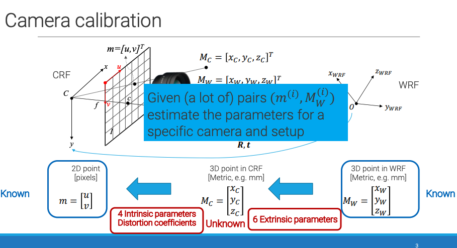
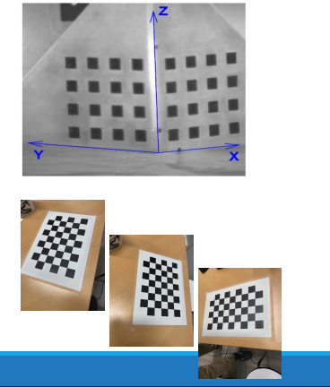
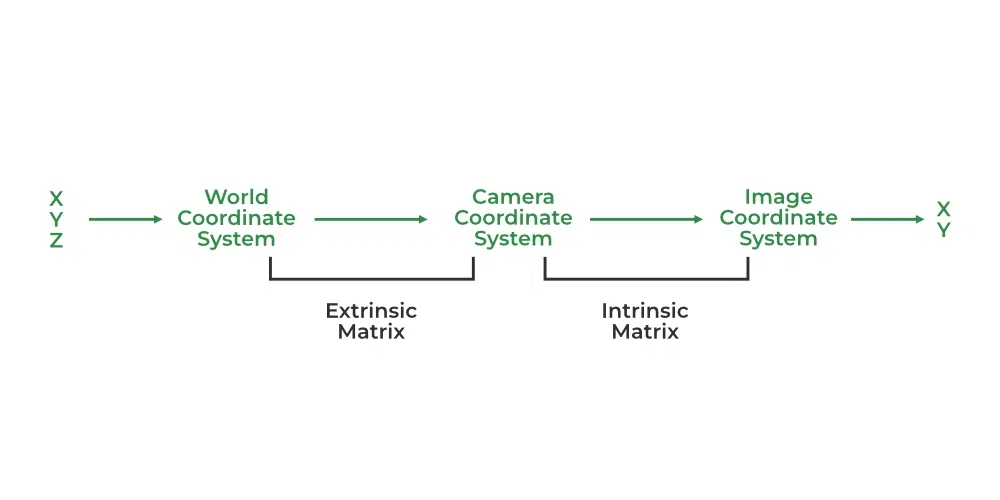
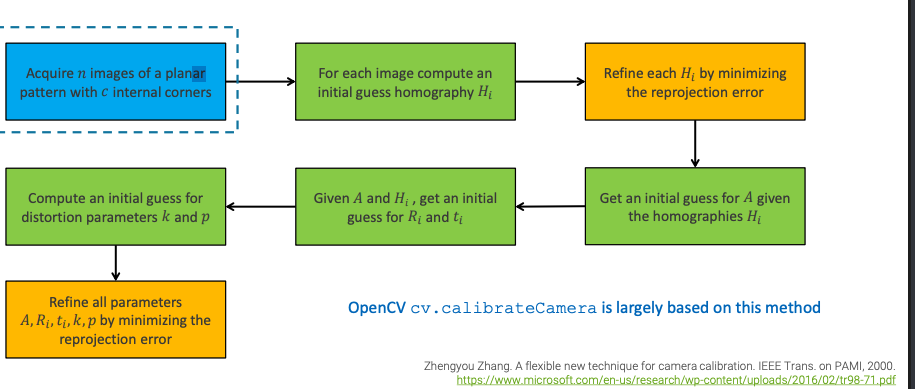

Welcome to **Lecture 2: Camera Calibration**!

These title and intro slides perfectly set the stage for what we are about to do. They reiterate the exact transition we discussed at the end of the last module:

We are officially leaving the **Forward Model** (where we know the camera and want to find the pixel) and entering the **Inverse Problem**:

* **The Goal:** Estimate the 6 Extrinsic parameters, the 4 Intrinsic parameters, and the lens distortion coefficients.
* **The Method:** We are given $i$ number of pairs of known 3D World points ($M_W$) and their corresponding 2D pixel locations ($m$).

Now that the problem is formally defined, the next slides should dive into the actual algorithms used to mathematically crack this.

Calibration Patterns: How to get Ground Truth Data

To figure out the camera's parameters, we need pairs of 3D world points ($M_W$) and 2D pixels ($m$). To get the 3D world points, we use Calibration Patterns (usually checkerboards, because the corners are incredibly sharp and easy for a computer algorithm to detect).

There are two main mathematical approaches to calibration, based on the physical object you use:

1. The 3D Calibration Object (Top Right Image)

The Method: You build a 3D physical object with at least two orthogonal planes (like the inside corner of a box) and paste checkerboard patterns on them.

The Math: Because the object is truly 3D (it has depth, $X$, $Y$, and $Z$ variance in the real world), you technically only need to take a single photograph of it to mathematically calculate all of your camera parameters!

The Catch: As the slide notes, "it is difficult to build accurate targets containing multiple planes." If the two boards are angled at $89.5^\circ$ instead of exactly $90.0^\circ$, your entire math model will be corrupted. Manufacturing these objects with sub-millimeter precision is incredibly expensive and difficult.

2. The 2D Planar Pattern (Bottom Right Images)

The Method: You print a checkerboard on a single, flat piece of paper and glue it to a stiff, flat board.

The Math: Because the board is completely flat, $Z=0$ for every single point on the board. You don't have enough 3D depth data from a single photo to solve the math. Therefore, you must take several different images (at least 3, but usually 10-20) of the exact same board from different angles and distances.

The Advantage: This is the industry standard (often called Zhang's Method). It is incredibly cheap and easy to print a perfectly flat checkerboard on a piece of rigid glass or metal. Moving the camera around it 10 times is much easier than building a perfectly square 3D box.

Software Implementation

The slide ends with a note of relief: "Implementing a camera calibration software requires a significant effort." Writing the calculus optimization code to solve the non-linear distortion equations from scratch is a nightmare. Fortunately, nobody does it from scratch anymore. The math has been perfectly packaged into single lines of code in standard Computer Vision libraries:

OpenCV (C++ and Python) uses the cv2.calibrateCamera() function.

MATLAB has a dedicated, easy-to-use GUI called the Camera Calibration Toolbox.

Zhang's Method: The Industry Standard for Calibration

Zhang's method (published in 2000) revolutionized computer vision because it proved you don't need an expensive 3D calibration box. You can calibrate a camera using just a flat piece of paper (a planar pattern) shown from a few different angles.

The algorithm works in four major phases, starting with rough mathematical guesses and ending with a massive, highly precise optimization loop.

Phase 1: Data Collection (Blue Box)

Acquire $n$ images: You take several photos (usually 10 to 20) of a flat checkerboard from different angles and distances.

$c$ internal corners: A computer algorithm scans each image and finds the exact $(u, v)$ pixel coordinates of the checkerboard intersections.

Phase 2: Homographies (Top Green & Orange Boxes)

Because the checkerboard is perfectly flat, we can assume its $Z$-coordinate is always $0$. This magically simplifies our $3 \times 4$ Camera Matrix into a $3 \times 3$ matrix called a Homography ($H$).

Compute $H_i$: For every single image ($i$), the computer calculates a rough Homography matrix that maps the flat 3D checkerboard plane to the flat 2D image plane.

Refine $H_i$: It tweaks these matrices to minimize the Reprojection Error.

What is Reprojection Error? It is the distance in pixels between where the algorithm found the corner in the photo, and where the math predicts the corner should be. We want this error to be as close to 0 as possible.

Phase 3: The "Initial Guesses" (Middle Green Boxes)

Now that the computer has a set of highly accurate Homographies ($H_i$), it uses a clever set of linear algebra formulas to rip those Homographies apart into our standard camera parameters:

Guess $A$ (Intrinsics): It mathematically extracts the focal lengths ($f_u, f_v$) and principal point ($u_0, v_0$). Notice there is only one $A$ matrix, because the camera's internal hardware doesn't change between photos.

Guess $R_i$ and $t_i$ (Extrinsics): It calculates where the camera was physically located for each of the $n$ images.

Guess $k$ and $p$ (Distortion): It calculates a rough starting guess for the radial and tangential lens bending.

Phase 4: Global Non-Linear Optimization (Bottom Orange Box)

This is the grand finale. The "initial guesses" from Phase 3 are pretty good, but they were calculated in pieces and rely on linear approximations.

To get perfect, sub-pixel accuracy, Zhang's method takes all the parameters ($A$, all the $R_i$'s and $t_i$'s, and the distortion coefficients $k, p$) and throws them into a giant calculus optimization engine (usually the Levenberg-Marquardt algorithm).

It slightly nudges all the numbers up and down simultaneously, projecting the 3D points through the complete, non-linear image formation pipeline we learned in the last module, until the global reprojection error across all $n$ images is absolutely minimized.

Designing the Calibration Pattern

To solve the massive math problem of camera calibration, we need to feed the computer a set of perfect $(m, M_W)$ pairs.

$m$ = 2D pixel coordinates (found by the computer).

$M_W$ = 3D physical world coordinates (provided by us).

To make this as easy as possible, we use a printed chessboard. Here are the strict rules for setting it up:

1. Breaking Symmetry (The "Odd x Even" Rule)

Look at the first slide. Why does the leftmost chessboard have a big red "X" over it?

It is a $5 \times 5$ internal corner grid.

Because it is perfectly symmetrical, if you rotate the board $90^\circ$ or $180^\circ$, it looks exactly the same.

The Problem: The computer algorithm will get confused and might think the camera flipped upside down instead of the board rotating.

The Solution: You must use an Odd $\times$ Even grid of internal corners (like a $9 \times 6$ board). This breaks the symmetry. No matter how you rotate the board, there is only one "top left" corner, meaning the computer can track the exact orientation (Rotation matrix $R$) perfectly.

2. Physical Scale (The Ruler)

A camera is just an eye; it doesn't know if it's looking at a tiny toy chessboard from 2 inches away, or a massive billboard-sized chessboard from 50 feet away. The math is identical.
To get real-world measurements (like Translation $t$ in millimeters), you must measure the exact physical size of the printed squares (e.g., $0.6$ cm or $6$ mm) and tell the software.

3. Defining the World Reference Frame ($M_W$)

Look at the second slide. This is how we map out the 3D coordinates ($M_W$) for every single corner on the board without having to measure them all by hand:

The Origin $(0,0,0)$: We pick one specific corner (using the asymmetric pattern to find it reliably every time) and declare that it is the exact center of the universe.

The $Z=0$ Plane: Because the paper is perfectly flat, we declare that the paper is the $X-Y$ plane. This means every single corner on the board has a $Z$-coordinate of exactly $0$. (This is the trick that simplifies Zhang's method!)

The $X$ and $Y$ Axes: We align the $X$-axis along the short side of the board and the $Y$-axis along the long side.

The Magic Trick:
Because we know the origin is $(0,0,0)$ and we know each square is exactly $0.6$ cm wide, the computer can automatically calculate the exact 3D world coordinate of any corner just by counting squares!

Look at the yellow box in the slide. The corner is 3 squares to the right ($X$) and 6 squares down ($Y$).

$X = 3 \times 0.6 = 1.8$ cm

$Y = 6 \times 0.6 = 3.6$ cm

$Z = 0$

Final World Coordinate ($M_W$): $[1.8, 3.6, 0]^T$

4. Finding the Pixels ($m$)

To get the other half of the pair, the computer uses standard computer vision algorithms (like the Harris Corner Detector) on the photograph. This scans the image for high-contrast intersection points and spits out the exact 2D pixel coordinates $(u,v)$.