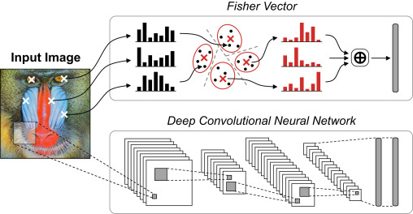

A Fisher vector is a high-dimensional descriptor that represents the image-level characteristics by aggregating a dense set of local features using a feature-encoding technique called Fisher vector representation. It is computed by generating a Gaussian Mixture Model (GMM) with K components based on the local features extracted from training images, and then soft-assigning each local feature to the Gaussian components. The Fisher vector descriptor is obtained by computing the average first- and second-order differences between the local features and each GMM center. It is power- and L2-normalized and has a dimension of 2KD, where D is the dimension of the local features.

