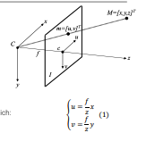
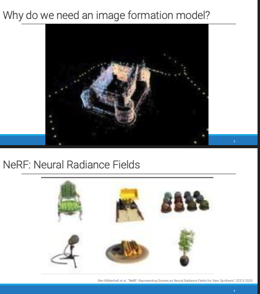
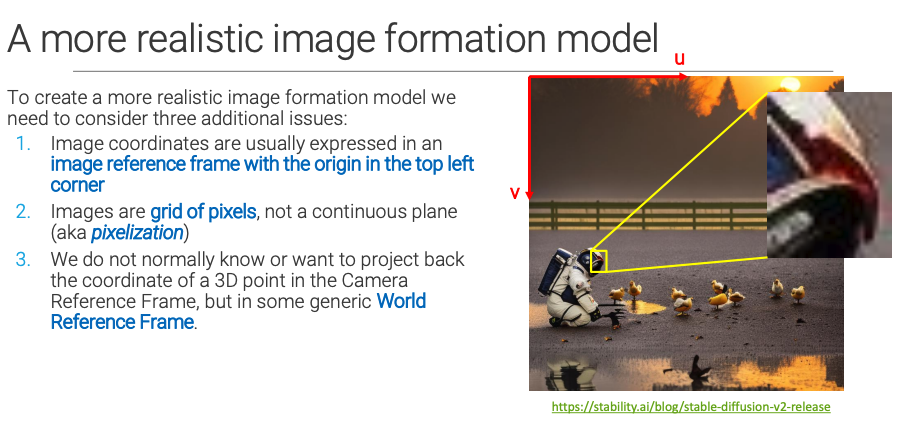
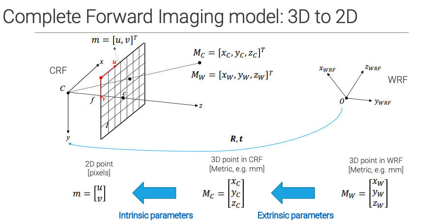
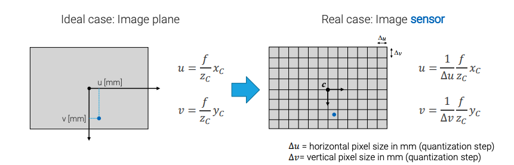
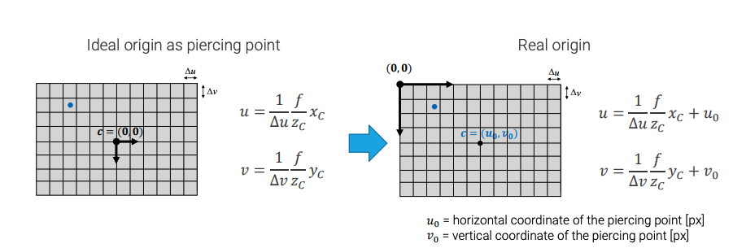

This slide kicks off the technical content for Module 2 by recapping the absolute most fundamental concept in 3D computer vision: **The Perspective Projection Model** (often called the Pinhole Camera Model).

Before we can teach a computer to understand 3D space, we have to define exactly how the 3D world gets squashed onto a flat 2D photograph. Here is a breakdown of the geometry and the math shown on the slide:

### 1. The Setup: The Camera Reference Frame (CRF)

Look at the diagram on the right. To do the math, we pin our 3D coordinate system directly to the camera itself.

* **The Origin ($C$):** The center of our 3D universe $(0,0,0)$ is placed exactly at the camera's lens (the optical center).
* **The Z-Axis:** This points straight out from the lens. It is called the **Optical Axis**. The $Z$ value of an object is simply its depth (how far away it is from the camera).
* **The Image Plane ($I$):** This is the camera sensor (or film) where the 2D picture is formed. It is positioned at a specific distance from the lens, known as the **focal length ($f$)**.

### 2. The Math: Similar Triangles (Equation 1)

If you have a physical point in the real world $M = [x, y, z]$, where exactly will it appear on your 2D screen $m = [u, v]$?

The light ray travels from the real-world object $M$, passes through the 2D image plane at $m$, and hits the lens $C$. This creates two perfect right triangles that share the same angle. Using the geometry of "similar triangles," we get the formulas:

* **$u = f \frac{x}{z}$** (for the horizontal pixel position)
* **$v = f \frac{y}{z}$** (for the vertical pixel position)

### 3. What this equation actually means in real life

Look closely at the division by $Z$. This is the mathematical proof of why **objects look smaller as they get further away**.

* If a person ($X$ height) stands 5 meters away ($Z=5$), they take up a certain number of pixels ($u$) on your screen.
* If that same person walks 100 meters away ($Z=100$), you are dividing by a much larger number. Their pixel size ($u$) shrinks drastically.

### 4. The Headache: "Non-Linear Equations"

Notice that the slide explicitly highlights in blue that these are **non-linear equations**.
In linear algebra, computers love multiplying matrices to solve problems (e.g., $A \cdot x = B$). But you *cannot* use standard matrix multiplication if you have a variable ($z$) in the denominator of a fraction!

Because dividing by depth ($z$) ruins standard linear algebra, the very next thing you will likely learn is a clever mathematical trick called **Homogeneous Coordinates**, which allows us to "fake" this division so we can put all of this camera physics into a clean, solvable matrix.

Why Do We Need an Image Formation Model?

In the previous slide, we looked at the math of how a 3D point is flattened onto a 2D image plane (Perspective Projection). It can seem tedious, but these two slides show you the spectacular things you can build once you understand that math.

If you know the exact mathematical model of how a camera creates an image, you can run that math in reverse.

Slide: 3D Point Cloud Reconstruction

The image on Slide 3 shows a 3D point cloud of a castle. This was likely generated from dozens or hundreds of standard 2D photographs (perhaps taken by a drone flying around it).

This process is called Structure from Motion (SfM) or 3D Reconstruction.

If you take photos of a castle from many different angles, and you find matching SIFT features across those photos...

AND you know the Image Formation Model (the focal length of the camera, and exactly where the camera was in 3D space for every photo)...

You can triangulate the rays of light backwards from the 2D pixels out into virtual 3D space to find exactly where they intersect.

Knowing the camera model allows the computer to "un-flatten" the 2D photos back into a full 3D geometric map!

Slide: NeRF (Neural Radiance Fields)

Slide 4 jumps straight into the cutting edge of modern computer vision. The images shown (the Lego bulldozer, the hotdog, the chair) are from a revolutionary 2020 paper introducing NeRFs.

What is a NeRF?
NeRF stands for Neural Radiance Field. It is an AI model that learns to represent a continuous 3D scene.

You feed the AI a dataset of 2D photos of an object taken from various angles.

The AI learns the density and color of every single microscopic point of light in that 3D space.

Once trained, you can ask the AI to render a brand new, photorealistic 2D image of the object from an angle that the camera never even took a picture from. This is called Novel View Synthesis.

Why is it on this slide?
You might think, "If NeRF uses deep learning AI, why do we care about the old classical camera math?"

Because the AI cannot learn without the camera model. To train a NeRF, every single 2D training photo you feed into the neural network MUST be accompanied by its exact camera pose (its 3D location, rotation, and lens properties). The AI uses the perspective projection math to shoot virtual "rays" through the pixels of the 2D images to figure out how to build the 3D object.

The Takeaway: The "classical" math of how cameras work isn't obsolete—it is the foundational bedrock that allows modern Deep Learning AI to understand 3D space!

This slide bridges the gap between the perfect, theoretical math of the Pinhole Camera Model and the messy reality of digital photographs and code.

The equation we learned earlier ($u = f\frac{x}{z}$) is completely mathematically correct for an ideal pinhole camera. However, if you tried to program that equation into Python or OpenCV right now, it would fail.

Here is a breakdown of the three reasons why, and how we must adjust the model to make it "realistic":

### 1. The Origin Shift (Top-Left Corner)

* **The Theory:** In the ideal math model from the previous slide, the $(0,0)$ origin of the 2D image is exactly where the optical axis (the Z-axis) pierces the sensor. This is usually dead-center in the middle of the image.
* **The Reality:** In computer science, an image is just an array (a matrix) of numbers. Array indexing *always* starts at the **top-left corner**. Notice the red arrows in the image forming the $u, v$ axes from the top left.
* **The Fix:** We have to add an offset to our math. We introduce parameters (usually called $c_x$ and $c_y$, the **principal point offset**) to mathematically shift the origin from the center of the lens to the top-left corner of the digital image.

### 2. Pixelization (Millimeters vs. Pixels)

* **The Theory:** The basic equations treat the image plane as a continuous sheet of glass. The output of $f\frac{x}{z}$ gives you a physical metric distance, like "14 millimeters from the center."
* **The Reality:** Digital images are discrete grids of square (or sometimes rectangular) pixels. You can't ask a computer to draw something at "14 millimeters"—you have to tell it which specific pixel index to illuminate.
* **The Fix:** We need to introduce a conversion factor. We have to multiply our physical measurements by the density of the sensor (e.g., "pixels per millimeter") to convert continuous metric units into discrete pixel coordinates.

*(Note: Together, these first two fixes—the origin shift and the pixel conversion factors—make up the **Intrinsic Parameters** or the Camera Matrix, which we will see in the upcoming slides).*

### 3. World Reference Frame (Moving Cameras)

* **The Theory:** The basic math assumes the 3D coordinate $(X, Y, Z)$ is measured starting directly from the camera's lens. The camera is the center of the universe.
* **The Reality:** If you have an autonomous car driving down a street, the street doesn't move when the car moves. The world has its own fixed coordinate system (the **World Reference Frame**).
* **The Fix:** Before we can use our $u = f\frac{x}{z}$ equation, we first have to calculate where the object is relative to the camera. We must use a Rotation matrix ($R$) and a Translation vector ($t$) to mathematically pick up the 3D point from the World Frame and move it into the Camera Frame. These are the **Extrinsic Parameters**.

**In Summary:** To do real computer vision, you can't just project 3D to 2D. You must first translate World 3D to Camera 3D (Extrinsics), then project Camera 3D to Sensor 2D (Perspective), and finally convert Sensor physical units to Digital Pixels (Intrinsics).

The Math of a Realistic Camera Model

To solve the three issues listed on Slide 6, computer vision uses a system called Homogeneous Coordinates. This allows us to combine all the camera physics, pixel conversions, and 3D rotations into clean, multipliable matrices.

Here is how the concepts from the slide translate into actual code and math.

Fixing Issues 1 & 2: The Intrinsic Matrix ($K$)

The Intrinsic Matrix (often denoted as $K$) handles everything happening inside the camera. It solves the pixelization and the top-left origin shift.

Instead of just having a focal length $f$, we upgrade our parameters:

Focal length in pixels ($f_x, f_y$): We multiply the physical focal length by the density of the sensor's pixels. We have two separate values because sometimes pixels aren't perfectly square!

Principal Point ($c_x, c_y$): This solves the origin issue. This is the exact pixel coordinate (usually near the center of the image) where the optical axis hits the sensor, measured from the top-left corner.

We pack these into a $3 \times 3$ matrix:

$$K = \begin{bmatrix} f_x & 0 & c_x \\ 0 & f_y & c_y \\ 0 & 0 & 1 \end{bmatrix}$$

Fixing Issue 3: The Extrinsic Matrix ($[R|t]$)

The Extrinsic Matrix handles everything happening outside the camera. It defines where the camera is located in the World Reference Frame.

It consists of two parts:

Rotation ($R$): A $3 \times 3$ matrix that defines which way the camera is pointing (pan, tilt, roll).

Translation ($t$): A $3 \times 1$ vector that defines where the camera is physically sitting in the 3D world $(X, Y, Z)$.

We combine them into a $3 \times 4$ matrix:

$$Extrinsics = \begin{bmatrix} r_{11} & r_{12} & r_{13} & t_x \\ r_{21} & r_{22} & r_{23} & t_y \\ r_{31} & r_{32} & r_{33} & t_z \end{bmatrix}$$

The Grand Finale: The Projection Matrix ($P$)

When you want to take a 3D point in the real world ($M_w$) and figure out exactly which pixel ($m$) it will land on in your digital image, you combine the two matrices into the ultimate Camera Projection Matrix ($P$):

$$P = K \times [R | t]$$

The entire, realistic image formation pipeline boils down to one simple matrix multiplication:

$$m = P \cdot M_w$$

Summary of the Pipeline:

The Extrinsic part of the matrix grabs the 3D point from the world and moves it relative to the camera lens.

The Intrinsic part projects that point through the lens, scales it into pixels, and shifts it to fit a digital image grid starting from the top-left corner.

If you look at the blue arrows along the bottom, you can see how it perfectly perfectly aligns with the matrices we just discussed:

- Start on the Right ($M_W$): You begin with a 3D point in the World Reference Frame (like the corner of a building). Notice the units here are physical metrics (like millimeters or meters).

- The First Jump (Extrinsics): The rightmost blue arrow applies the Extrinsic parameters (our $[R|t]$ matrix). This physically picks up the coordinate system from the world origin ($O$) and moves it so the origin is sitting exactly inside the camera lens ($C$). The point is now $M_C$. Crucially, the units are still physical millimeters.

- The Final Jump (Intrinsics): The leftmost blue arrow applies the Intrinsic parameters (our $K$ matrix). This is where the magic happens. The math projects the 3D point onto the flat 2D plane, applies the focal length, and—most importantly—converts those physical metric millimeters into discrete digital pixels ($u, v$).

This entire diagram is just a visual representation of the final equation from the document:$m = K \times [R|t] \times M_W$

### Image Pixelization: From Millimeters to Pixels

This slide explains how we bridge the gap between continuous physics and discrete computer science.

1. The Ideal Case (Left Side)

The equations on the left represent pure optical physics:

$$u = \frac{f}{z_c} x_c$$

$$v = \frac{f}{z_c} y_c$$

$x_c, y_c, z_c$: These are the coordinates of the 3D object in the Camera Reference Frame (measured in physical units, like millimeters).

$f$: The focal length of the lens (also measured in physical millimeters).

The Result ($u, v$): Because you are doing math with millimeters, the output is in millimeters! The equation is telling you: "The light ray will hit the sensor exactly 14.5 millimeters away from the origin."

2. The Problem

A computer cannot store an image based on continuous millimeters. An image sensor is made of a physical grid of microscopic light-gathering buckets (pixels). We need to tell the computer which specific bucket index (e.g., Pixel column 800, Pixel row 600) the light hit.

3. The Real Case (Right Side)

To translate from a distance to a bucket index, we need to know the physical size of the buckets on the camera's silicon chip.

$\Delta u$: The physical width of a single pixel (e.g., $0.005 \text{ mm/pixel}$).

$\Delta v$: The physical height of a single pixel. (Note: Usually pixels are perfectly square, so $\Delta u = \Delta v$, but the math leaves them separate just in case they are rectangular).

Now look at the new equations on the right:

$$u = \frac{1}{\Delta u} \frac{f}{z_c} x_c$$

$$v = \frac{1}{\Delta v} \frac{f}{z_c} y_c$$

How it works (Dimensional Analysis):
If you look at the units of measurement, the genius of this equation becomes obvious.
Let's look at the horizontal formula:

We know that $(\frac{f}{z_c} x_c)$ gives us a physical distance in [millimeters].

We know that $\Delta u$ is measured in [millimeters / pixel].

If we divide the total distance by the width of one pixel:

$$\frac{[\text{millimeters}]}{[\text{millimeters} / \text{pixel}]}$$

The millimeters cancel out, and the unit flips to the top, leaving us with a pure [pixel] count!

4. A Sneak Peek at the Intrinsic Matrix

In computer vision, calculating $\frac{f}{\Delta u}$ over and over again is annoying. Because both the focal length ($f$) and the pixel width ($\Delta u$) are fixed, permanent hardware properties of your specific camera, we usually just combine them into a single constant.

This new constant is called $f_x$ (focal length expressed in pixels):

$$f_x = \frac{f}{\Delta u}$$

$$f_y = \frac{f}{\Delta v}$$

These $f_x$ and $f_y$ values are the exact numbers that go into the top-left and middle slots of the $3 \times 3$ Intrinsic Camera Matrix ($K$) we discussed earlier!

This slide addresses the final adjustment needed for the Intrinsic Camera Matrix: shifting the origin to avoid negative pixel coordinates.

### The Problem: Negative Indices

In the "Ideal origin" model (left), the $(0,0)$ origin is exactly where the optical axis pierces the sensor (the principal point, $c$).

* Because this point is in the center of the sensor, any pixel to the left of center gets a negative $u$ coordinate.
* Any pixel above center gets a negative $v$ coordinate.
* Digital images are stored as matrices (arrays) in computer memory. Arrays start at index `[0,0]` in the top-left corner. If you try to access a pixel at `[-50, -20]`, your code will crash.

### The Solution: The Principal Point Offset ($u_0, v_0$)

To map mathematical projections to a digital array, the origin must be moved to the top-left corner (the "Real origin" model on the right).

To do this mathematically, you simply take the physical pixel coordinates of the central piercing point—labeled as **$u_0$** (horizontal center) and **$v_0$** (vertical center)—and add them to your equations.

This yields the final, complete intrinsic projection equations:

$$u = f_x \frac{x_c}{z_c} + u_0$$

$$v = f_y \frac{y_c}{z_c} + v_0$$

*(Note: $f_x$ and $f_y$ are the pixelized focal lengths from the previous slide: $\frac{f}{\Delta u}$ and $\frac{f}{\Delta v}$)*.

With this shift, all projected points strictly land on positive integers, matching standard digital image formatting.

This slide is the grand finale for the **Intrinsic Parameters**. It takes all the individual fixes we discussed—converting to pixels and moving the origin—and bundles them into one clean set of equations.

Here is the breakdown of what this slide is telling us:

### 1. Condensing the Math

Instead of dealing with three separate physical measurements (focal length $f$, physical pixel width $\Delta u$, and physical pixel height $\Delta v$), we mathematically merge them.

* $f_u = \frac{f}{\Delta u}$ (Focal length measured in horizontal pixels)
* $f_v = \frac{f}{\Delta v}$ (Focal length measured in vertical pixels)

This simplifies the projection math tremendously. When you buy a digital camera or use OpenCV to calibrate one, you don't actually care how many physical millimeters wide a pixel is; you only care about the combined $f_u$ and $f_v$ values.

### 2. The Final 4 Parameters

The text at the bottom confirms that the internal geometry of *any* digital camera can be perfectly described by just **4 numbers**:

1. **$f_u$**: Horizontal zoom/scaling.
2. **$f_v$**: Vertical zoom/scaling. *(If $f_u$ and $f_v$ are different, it means your pixels are rectangular, which stretches the image!)*
3. **$u_0$**: The horizontal offset to shift the origin to the top-left.
4. **$v_0$**: The vertical offset to shift the origin to the top-left.

### 3. "Independent of its position in the world"

This last sentence is crucial. These 4 parameters belong to the *camera hardware itself*. Whether you take your camera to the moon, turn it upside down, or strap it to a self-driving car, these 4 intrinsic numbers will never change. They are completely separate from the **Extrinsic parameters** (Rotation and Translation) which describe *where* the camera is.

---

### Step 1: The Extrinsic Transformation (Right to Middle)

* **The Starting Point ($M_W$):** We begin with a 3D point in the global **World Reference Frame (WRF)**. This could be a pedestrian's location relative to a crosswalk.
* **The Action:** The camera is located somewhere else in that world. We apply the **Extrinsic Parameters**—a Rotation matrix ($R$) and a Translation vector ($t$)—to mathematically "pick up" the world and move it so the $(0,0,0)$ origin is sitting exactly inside the camera's lens.
* **The Result ($M_C$):** We now have the 3D coordinates of the pedestrian relative to the camera lens. This is the **Camera Reference Frame (CRF)**. The measurements are still in physical millimeters or meters.

### Step 2: The Intrinsic Transformation (Middle to Left)

* **The Action:** Now that we know where the object is relative to the lens, we project the light ray through the lens and onto the flat sensor. We apply the 4 **Intrinsic Parameters** ($f_u, f_v, u_0, v_0$) we just learned about.
* **The Result ($m$):** The Intrinsic matrix scales the 3D projection by the focal length, converts the physical millimeters into discrete pixels, and shifts the origin to the top-left corner. We finally arrive at a 2D pixel coordinate $[u, v]^T$ on our screen!

### The Master Equation

When you put it all together, the entire pipeline is expressed in one elegant formula called the **Camera Projection Matrix ($P$)**:

$$m = K \cdot [R | t] \cdot M_W$$

*(Where $K$ is the $3 \times 3$ Intrinsic Matrix, and $[R | t]$ is the $3 \times 4$ Extrinsic Matrix).*

---
