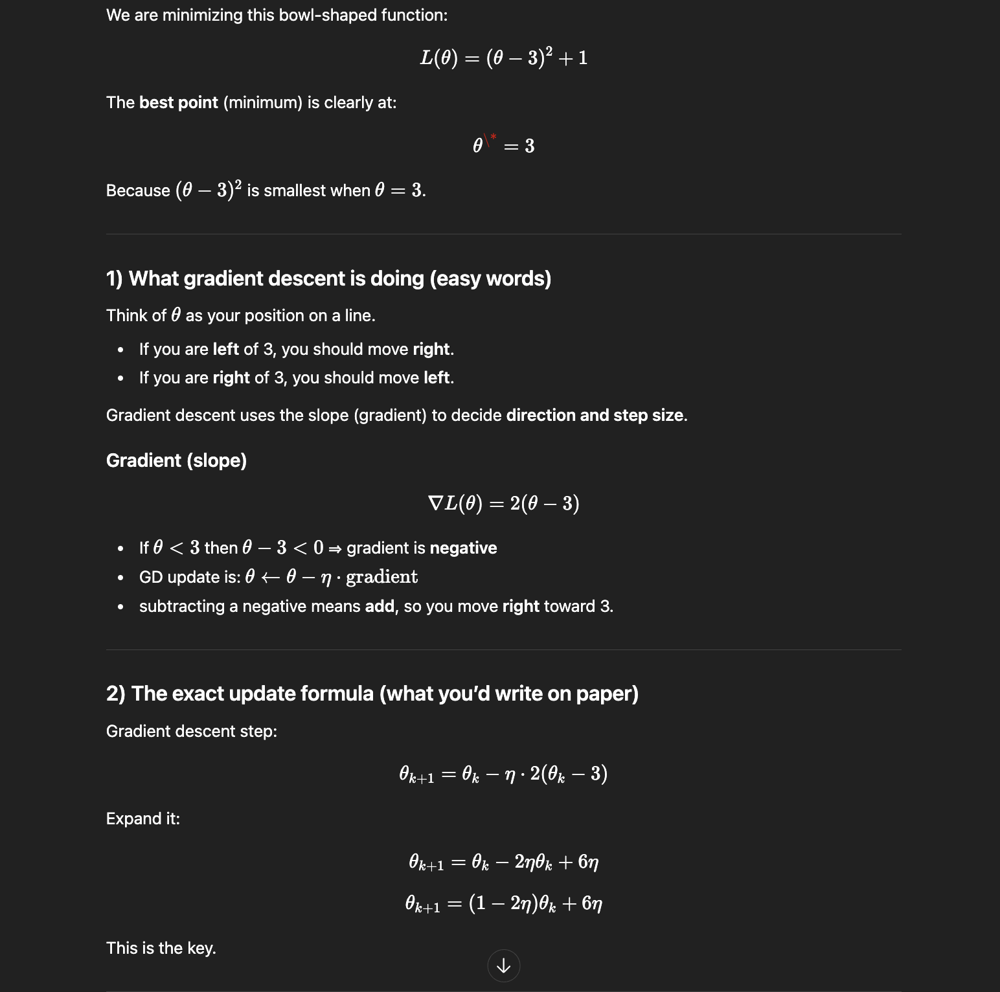
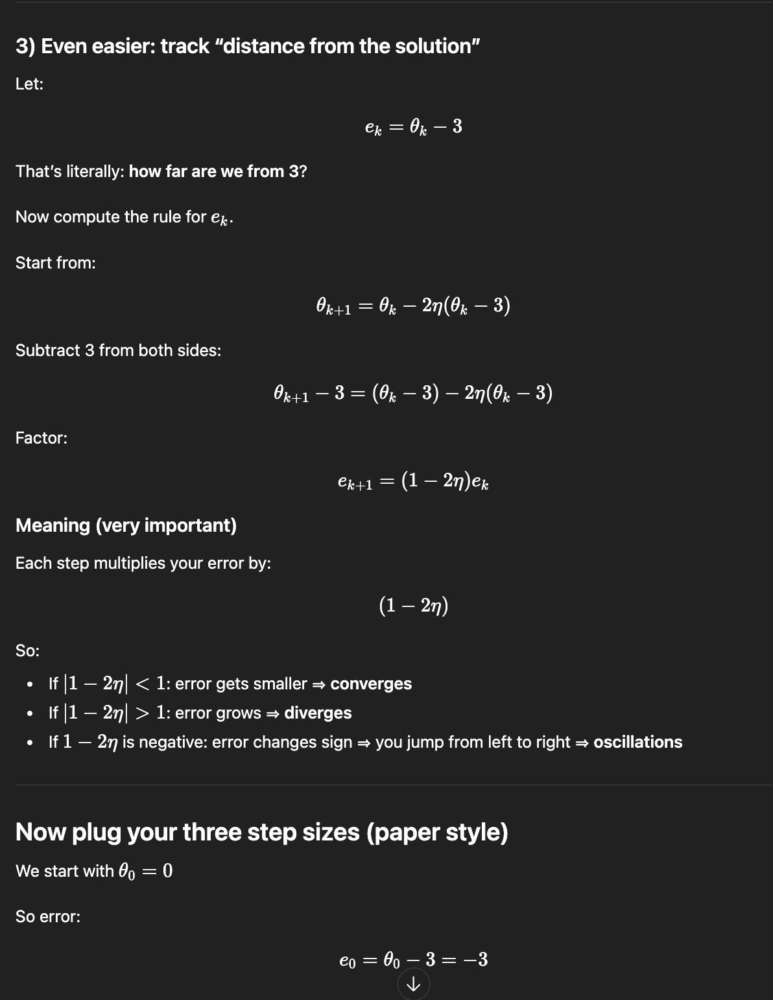
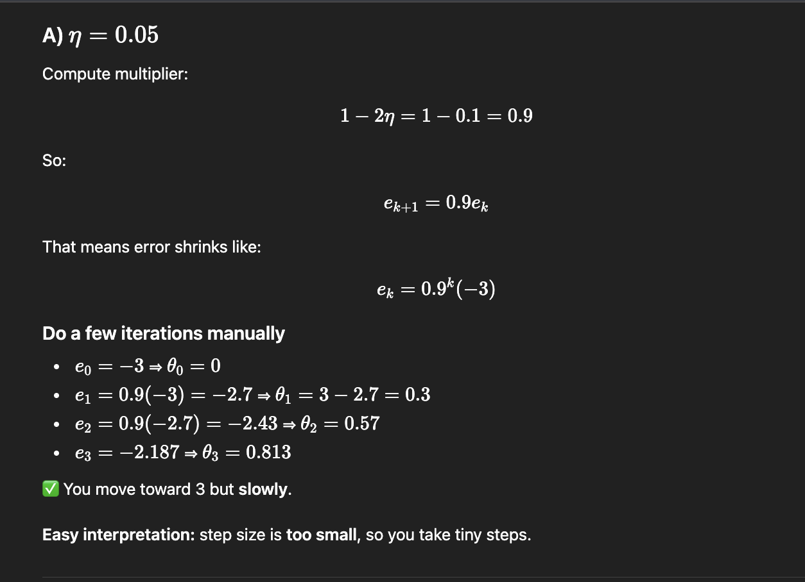
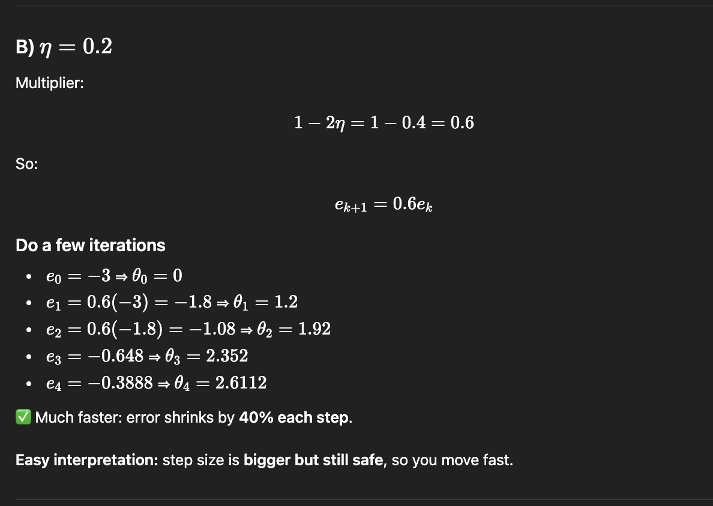
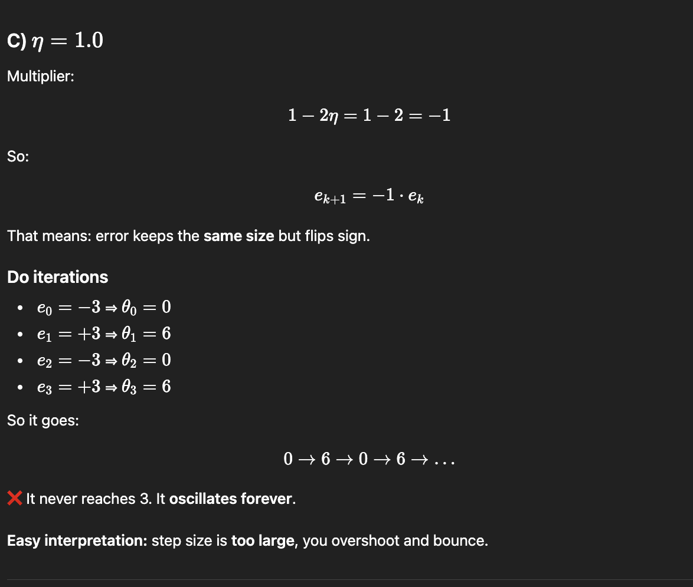
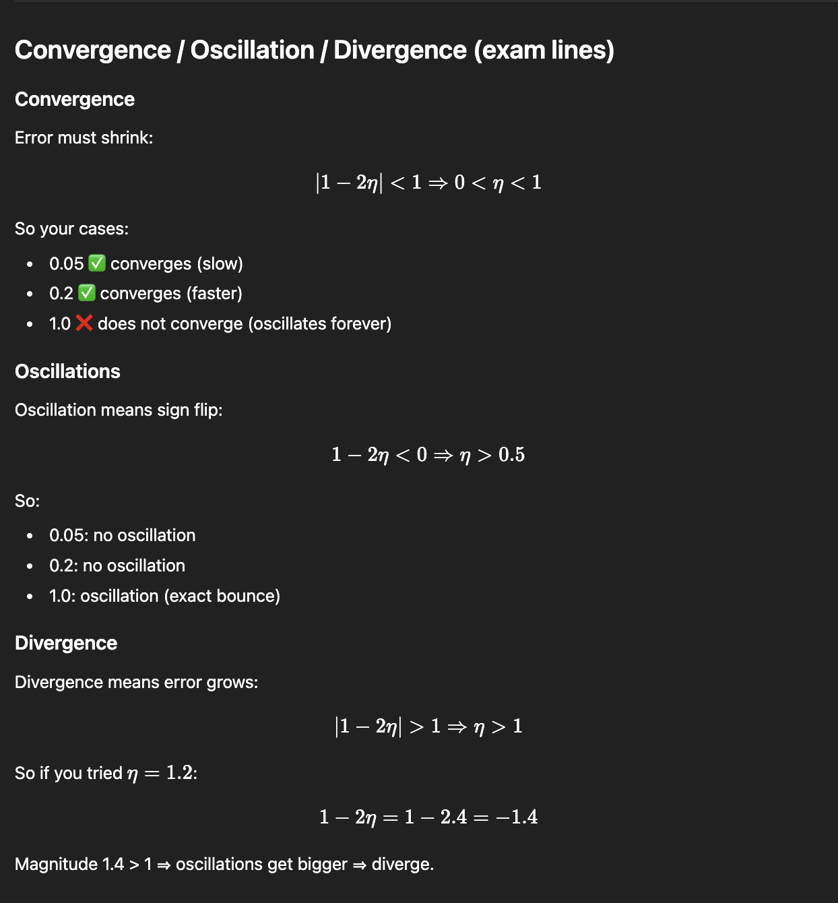
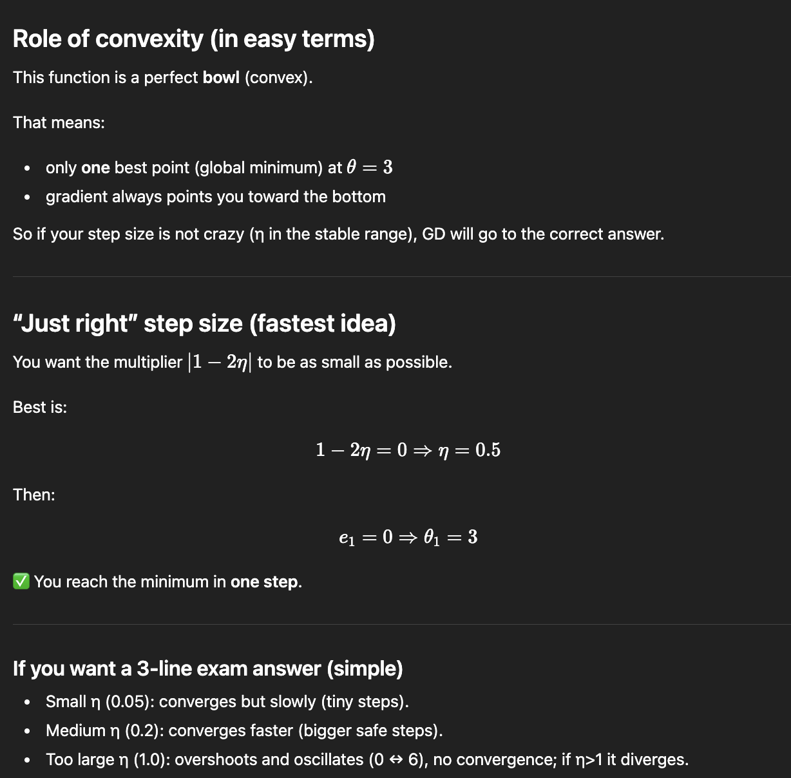

### Stopping Rules

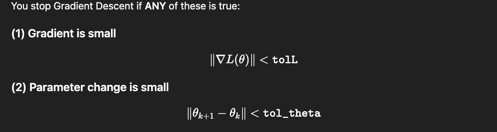
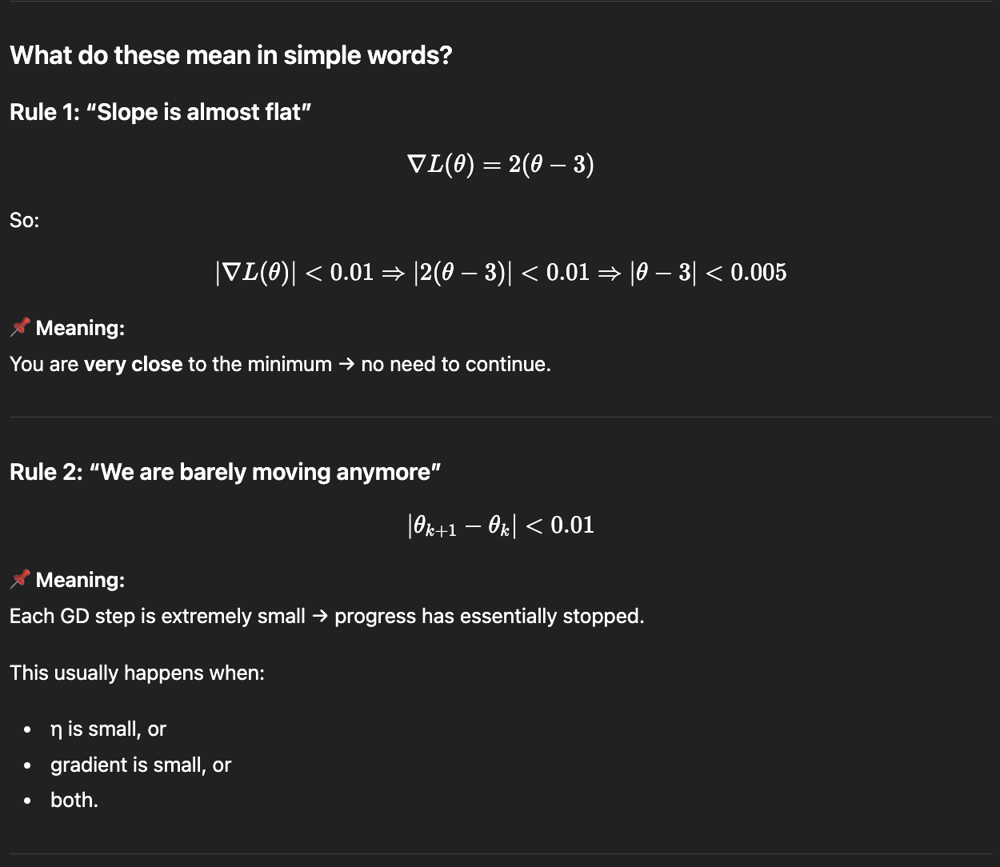
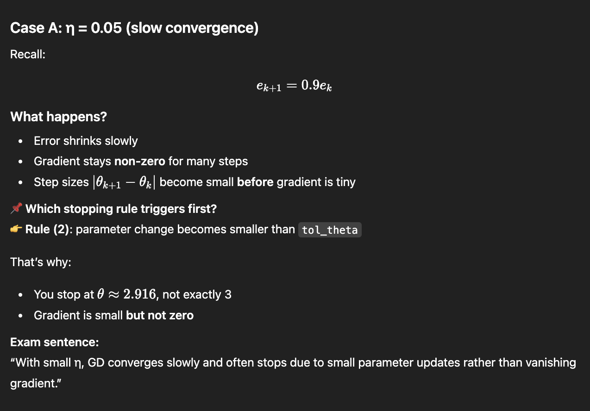
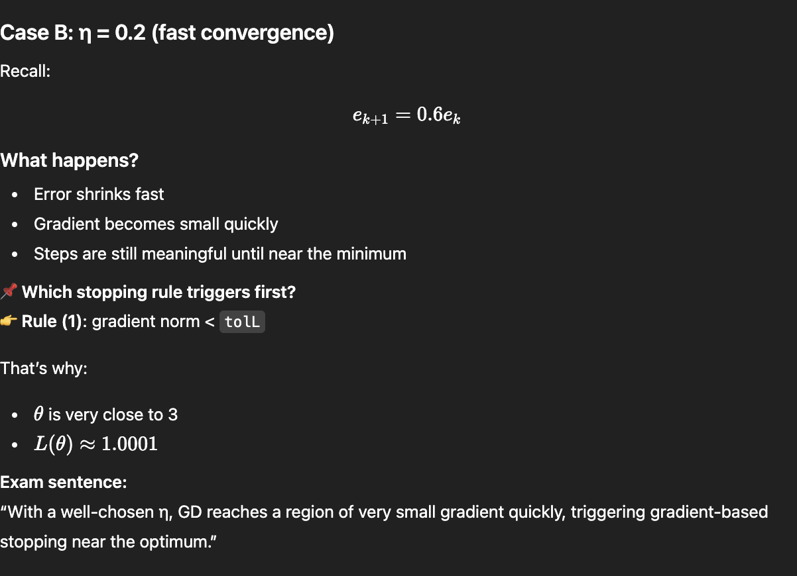
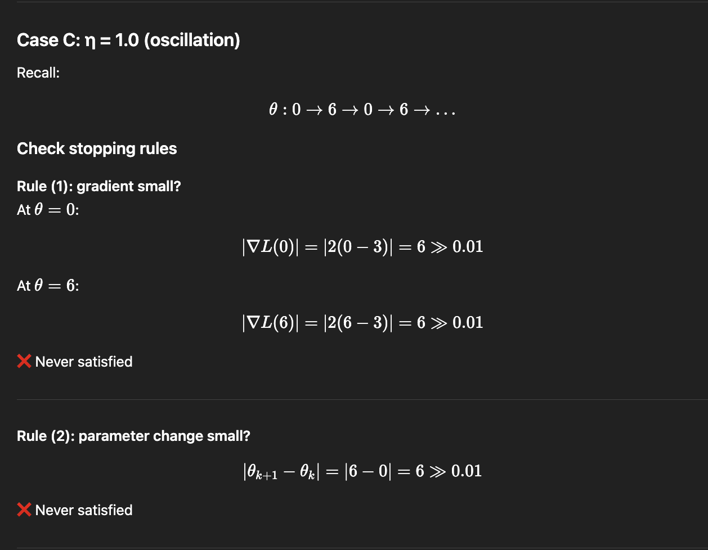

Conclusion:
Neither stopping condition is ever met → GD only stops because of n_iters.

Exam sentence:
“With too large η, GD oscillates with constant step size and gradient norm, so stopping criteria are never satisfied.”

Gradient Descent stops either when the gradient norm is small (flat region near the minimum) or when successive updates are negligible.
For small step sizes, convergence is slow and stopping is usually due to small parameter updates.
For well-chosen step sizes, the gradient quickly vanishes near the minimum.
For excessively large step sizes, GD oscillates and neither stopping condition is satisfied.
Thus, stopping criteria approximate convergence and depend strongly on the step size.

# Gradient Descent: Convergence, Oscillations, and Stopping Criteria

*(Simple explanation + paper-and-pen math)*

---

## Problem Setup

We want to minimize the following function:

$$
L(\theta) = (\theta - 3)^2 + 1
$$

This is a **convex quadratic (bowl-shaped)** function.

* Global minimum:
  $$
  \theta^* = 3
  $$

* Gradient:
  $$
  \nabla L(\theta) = 2(\theta - 3)
  $$

---

## Gradient Descent Update Rule

Gradient Descent updates the parameter as:

$$
\theta_{k+1} = \theta_k - \eta \nabla L(\theta_k)
$$

Substitute the gradient:

$$
\theta_{k+1} = \theta_k - 2\eta(\theta_k - 3)
$$

Expand:

$$
\theta_{k+1} = (1 - 2\eta)\theta_k + 6\eta
$$

---

## Error Formulation (Key Insight)

Define the error as the distance from the optimal solution:

$$
e_k = \theta_k - 3
$$

Subtract 3 from both sides of the update rule:

$$
\theta_{k+1} - 3 = (1 - 2\eta)(\theta_k - 3)
$$

So:

$$
e_{k+1} = (1 - 2\eta)e_k
$$

### Interpretation

At each iteration, the error is multiplied by:

$$
\rho = 1 - 2\eta
$$

---

## Convergence Conditions

* **Convergence**:
  $$
  |1 - 2\eta| < 1 \Rightarrow 0 < \eta < 1
  $$

* **Oscillations**:
  $$
  1 - 2\eta < 0 \Rightarrow \eta > 0.5
  $$

* **Divergence**:
  $$
  |1 - 2\eta| > 1 \Rightarrow \eta > 1
  $$

---

## Case Analysis (Starting from ( \theta_0 = 0 ))

Initial error:

$$
e_0 = \theta_0 - 3 = -3
$$

---

### Case 1: ( \eta = 0.05 ) — *Slow Convergence*

Multiplier:

$$
1 - 2\eta = 0.9
$$

Error update:

$$
e_{k+1} = 0.9 e_k
$$

Iterations:

* ( e_0 = -3 \Rightarrow \theta_0 = 0 )
* ( e_1 = -2.7 \Rightarrow \theta_1 = 0.3 )
* ( e_2 = -2.43 \Rightarrow \theta_2 = 0.57 )

**Observation**:

* Error decreases slowly
* No oscillations
* Many iterations needed

**Conclusion**:
Small step size → stable but **slow convergence**

---

### Case 2: ( \eta = 0.2 ) — *Fast Convergence*

Multiplier:

$$
1 - 2\eta = 0.6
$$

Error update:

$$
e_{k+1} = 0.6 e_k
$$

Iterations:

* ( e_1 = -1.8 \Rightarrow \theta_1 = 1.2 )
* ( e_2 = -1.08 \Rightarrow \theta_2 = 1.92 )
* ( e_3 = -0.648 \Rightarrow \theta_3 = 2.352 )

**Observation**:

* Error shrinks quickly
* No oscillations

**Conclusion**:
Well-chosen step size → **fast and stable convergence**

---

### Case 3: ( \eta = 1.0 ) — *Oscillation (No Convergence)*

Multiplier:

$$
1 - 2\eta = -1
$$

Error update:

$$
e_{k+1} = -e_k
$$

Iterations:

* ( \theta_0 = 0 )
* ( \theta_1 = 6 )
* ( \theta_2 = 0 )
* ( \theta_3 = 6 )

**Observation**:

* Constant oscillation
* Error magnitude never decreases

**Conclusion**:
Step size too large → **no convergence**

---

## Stopping Criteria

Gradient Descent stops if **either** condition is met:

### 1. Gradient is small

$$
|\nabla L(\theta)| < \texttt{tolL}
$$

For this problem:

$$
|2(\theta - 3)| < 0.01 \Rightarrow |\theta - 3| < 0.005
$$

Meaning: very close to the minimum.

---

### 2. Parameter update is small

$$
|\theta_{k+1} - \theta_k| < \texttt{tol_theta}
$$

Meaning: updates are negligible → progress has stalled.

---

## Effect of Step Size on Stopping

| Step Size           | Behavior         | Stopping Reason        |
| ------------------- | ---------------- | ---------------------- |
| Small ((\eta=0.05)) | Slow convergence | Small parameter change |
| Medium ((\eta=0.2)) | Fast convergence | Small gradient         |
| Large ((\eta=1.0))  | Oscillation      | Never stops            |

---

## Role of Convexity

* The function is **convex**
* There is a **single global minimum**
* Gradient always points toward the optimum
* GD converges for any ( \eta ) in the stable range

---

## “Just Right” Step Size

Fastest convergence occurs when:

$$
1 - 2\eta = 0 \Rightarrow \eta = 0.5
$$

Then:

$$
e_1 = 0 \Rightarrow \theta_1 = 3
$$

The minimum is reached **in one step**.

---

## Exam-Ready Summary

> For a strongly convex quadratic function, Gradient Descent converges when
> ( 0 < \eta < 1 ).
> Small step sizes lead to slow but stable convergence, moderate step sizes give fast convergence, and overly large step sizes cause oscillations or divergence.
> Stopping criteria approximate convergence and depend on both the gradient magnitude and parameter updates.

