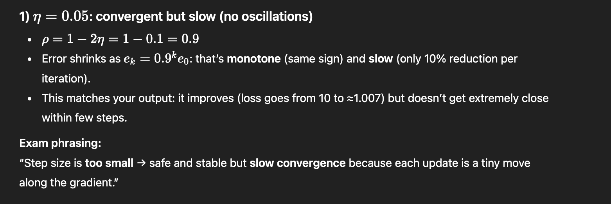
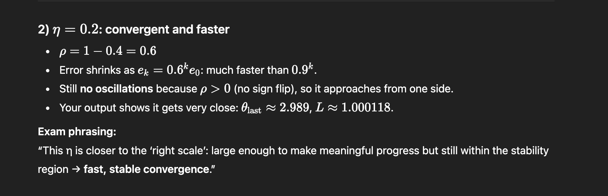
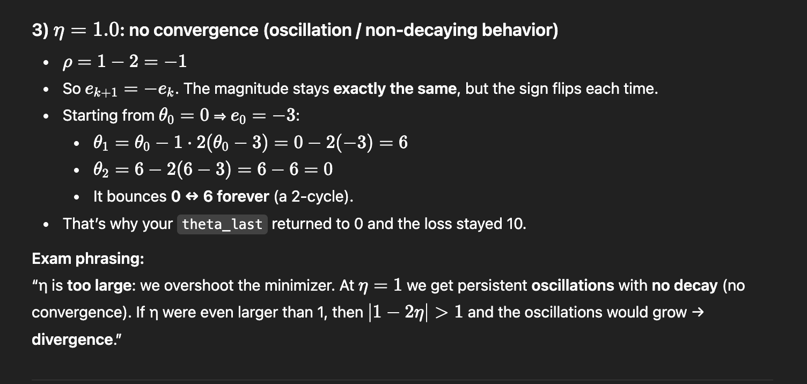
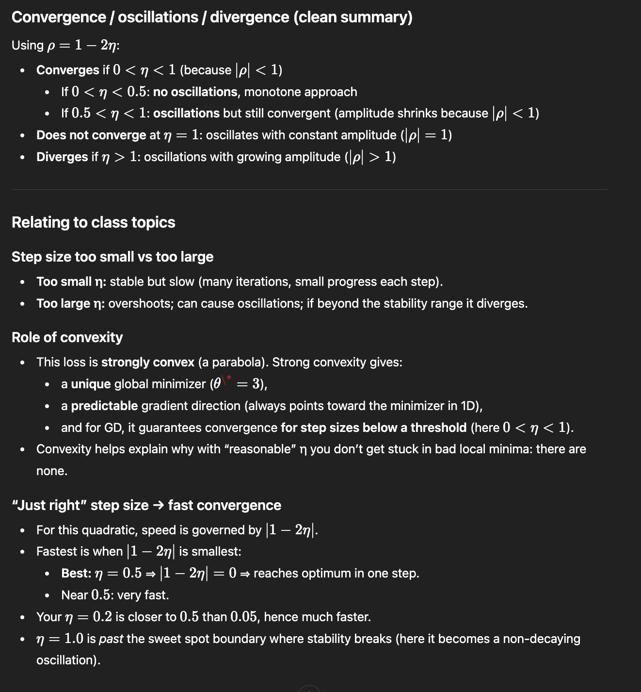

Relation to theoretical discussion
Step size: too small vs too large

A too small step size guarantees convergence but leads to slow progress.

A too large step size causes oscillations or divergence because the algorithm overshoots the minimum.

Only step sizes within a certain range lead to convergence.

Role of convexity

The function is strictly convex, so it has:

a single global minimum,

no local minima or saddle points.

Convexity guarantees that, when the step size is chosen appropriately, gradient descent converges to the global optimum, regardless of the initial point.

# Comments 

As seen in the plots of $\eta = .05$, the step size being too small lead to a slower Gradient descent; in that case the size was still large enough to guarantee convergence but if it got much smaller then it would've been stuck before reaching convergence.

In the case of $\eta = 1$ the algorithm didn't converge; this is the situation of step size being too large, this value in particular makes the algorithm bounce between two values. Any value different from $1$ would make the algorithm bounce between different values.

$\eta = .2$ is the best case of the three since it converges in the smallest amount of iterations, this means choosing $\eta$ "just right": the step size is neither too large or too small, that is the algorithm won't spend iterations on small steps which go slowly towards convergence and big steps that makes it bounce side by side in the loss function. 

In this situation the fact that the Loss function is strictly convex can relieve us from the burden of choosing a $\Theta_0$, that is, it doesn't matter very much where we start in this case since we have only a global minimum.
