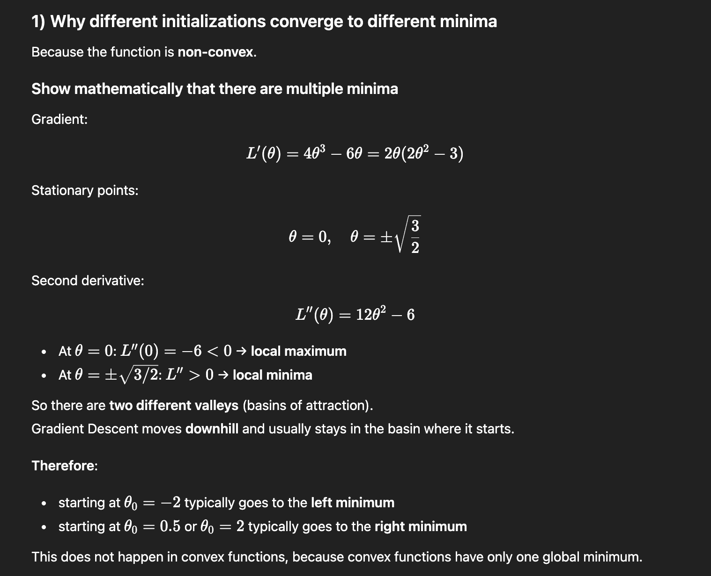
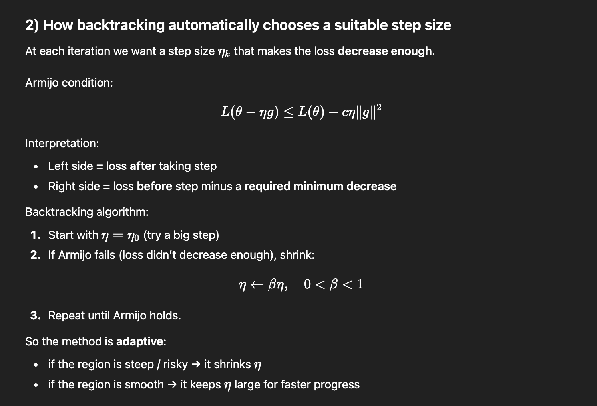
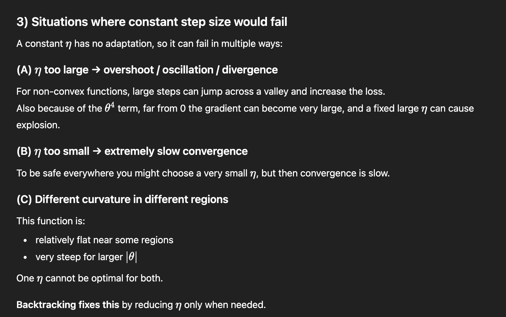

#### Note: In exercise 1, gradient_descent() used a fixed eta, so it was not “GD with Backtracking”. The correct approach is: choose eta_k using backtracking at every iteration, which the provided solution does.

## Comments

Unlike the Loss function from Exercise 1, this one is not convex, this means that more than minimun points are possible; this time the convergence value will depend on $\Theta_0$   

Thanks to backtracking the step size always fits the situation, this is due to the Armijo condition which checks if the decrease of value of the Loss is enough trough this condition:
- $L(\Theta^{(k)} - \eta_k*g^{(k)}) ≤ L(\Theta^{(k)}) - c \eta_k ||g^{(k)}||^2$ where $g$ is the gradient of $L$ in $\Theta^{(k)}$

The left side of the condition represents the value of the loss at $\Theta^{(k+1)}$; so the condition determines a maximum threshold based on value of the loss at $\Theta^{(k)}$ subtracted by a value scaled by the constant $c$, and this guarantees that the value of the loss is always decreasing while mantaining a step large enough to keep the algorithm fast also in zones with small gradients.

### (A) Why different initializations converge to different minima

Because the function is **non-convex** and has **multiple basins of attraction**:

* If you start on the left side (e.g., (\theta_0=-2)), the gradient tends to push you toward the **left minimum** (-\sqrt{3/2}).
* If you start on the right side (e.g., (\theta_0=2)), the gradient tends to push you toward the **right minimum** (+\sqrt{3/2}).
* If you start near the middle (e.g., (\theta_0=0.5)), the side you converge to depends on the slope at that point and the steps taken. In practice (0.5>0) usually converges to the **right** minimum.

In convex problems, all initial points converge to the same global minimum; here they may not.

---

### (B) How backtracking automatically chooses a suitable step size

At each iteration:

1. It proposes a step size (\eta_k=\bar{\eta}).
2. If the step does not reduce the loss enough (Armijo fails), it shrinks (\eta_k \leftarrow \beta \eta_k).
3. It repeats until the loss decreases sufficiently.

This adapts to the local shape:

* In steep regions → it may shrink (\eta_k) to avoid overshooting.
* In smooth regions → it may accept larger (\eta_k) for faster progress.

---

### (C) Situations where a constant step size would fail

A fixed (\eta) can fail in non-convex or badly scaled problems:

* **Overshooting / oscillations:** if (\eta) is too large, steps jump across valleys and may increase the loss.
* **Divergence:** if (\eta) is large enough, iterates can blow up (especially when gradients grow quickly, like the (\theta^4) term here).
* **Very slow convergence:** if (\eta) is chosen tiny to be safe everywhere, convergence becomes very slow.
* **Different curvature regions:** one (\eta) cannot be optimal in both flat and steep parts of the function.

Backtracking avoids these issues by shrinking the step only when needed.

---

## 7) Short conclusion

* The function is non-convex with two local minima, so GD can converge to different solutions depending on initialization.
* Backtracking line search (Armijo) ensures each step makes sufficient progress and prevents overshooting.
* Constant step size is often either unstable (too big) or slow (too small), especially in non-convex settings.

---
