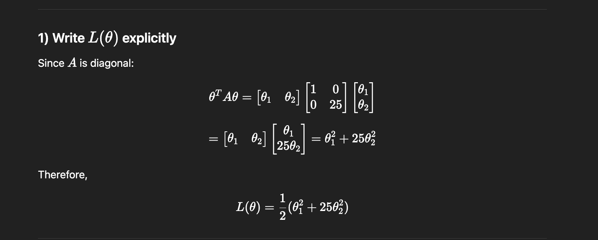
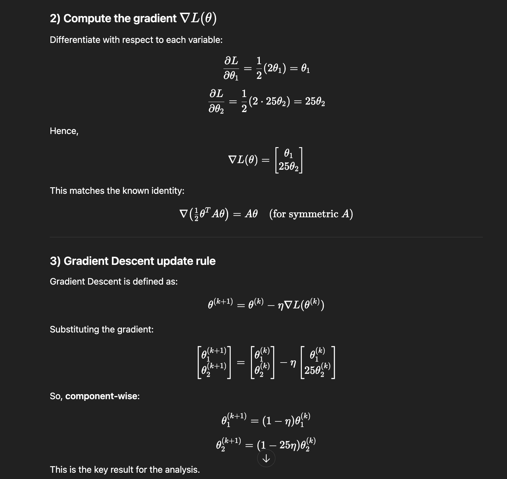
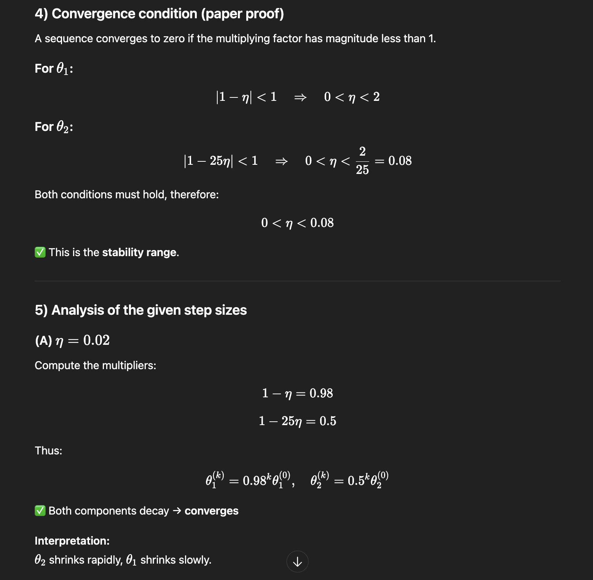
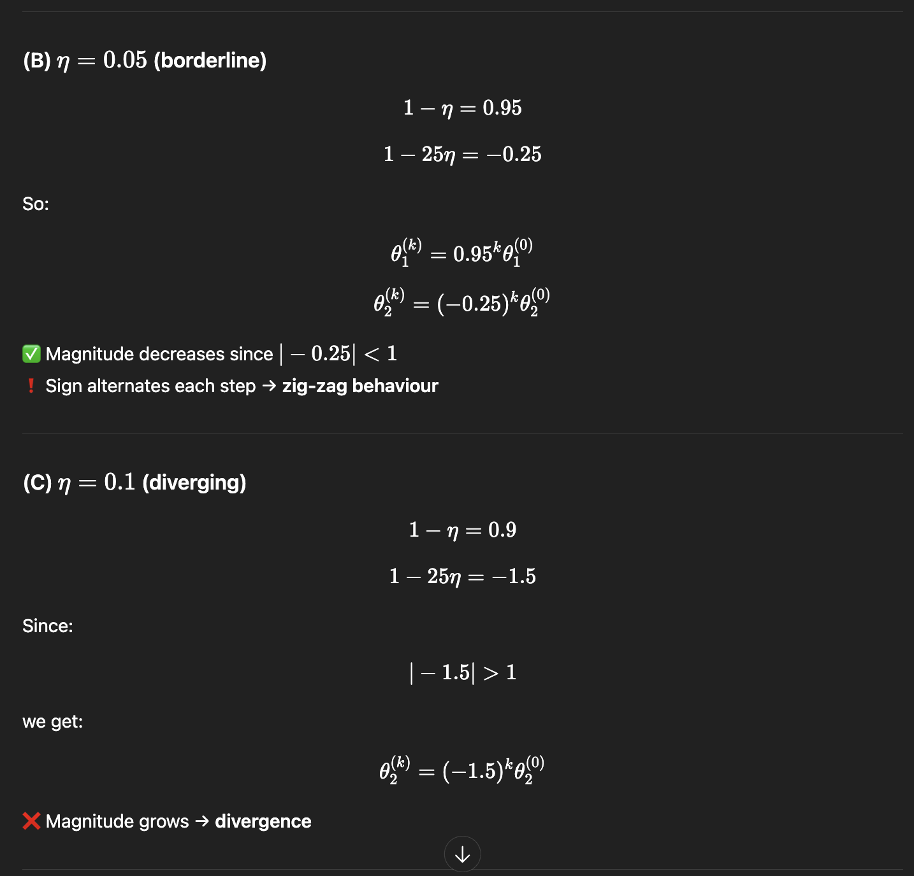
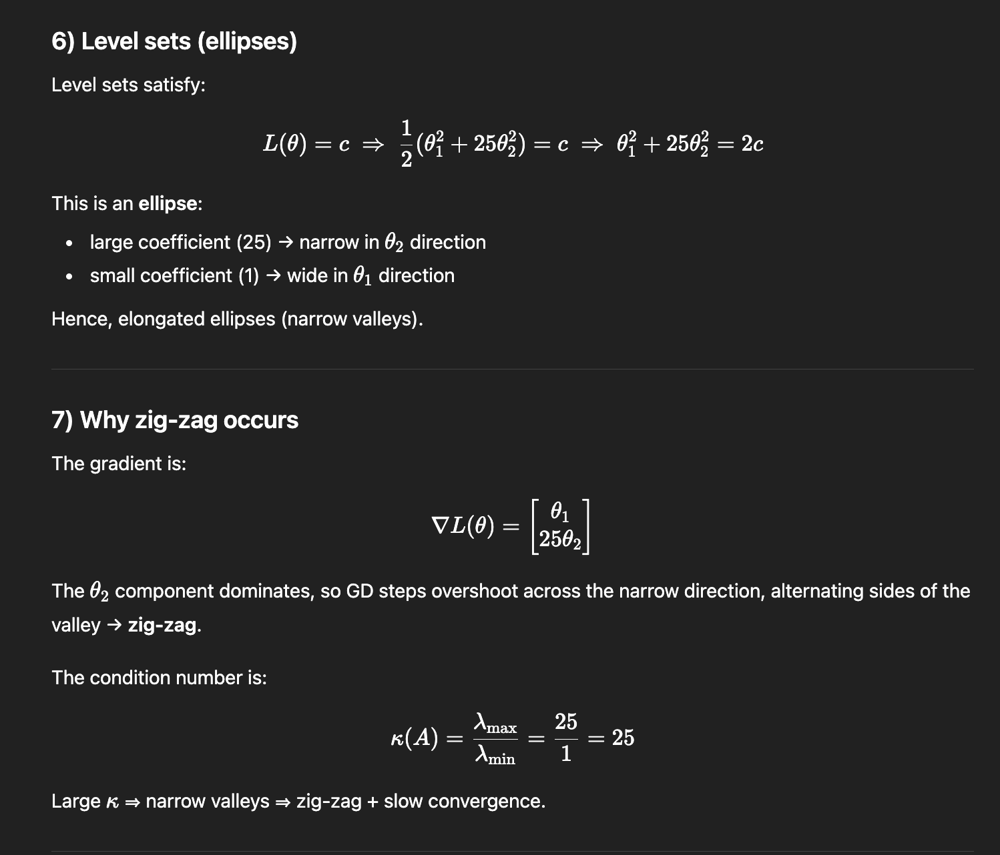
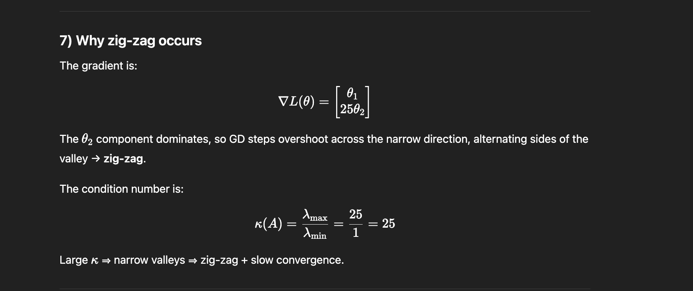
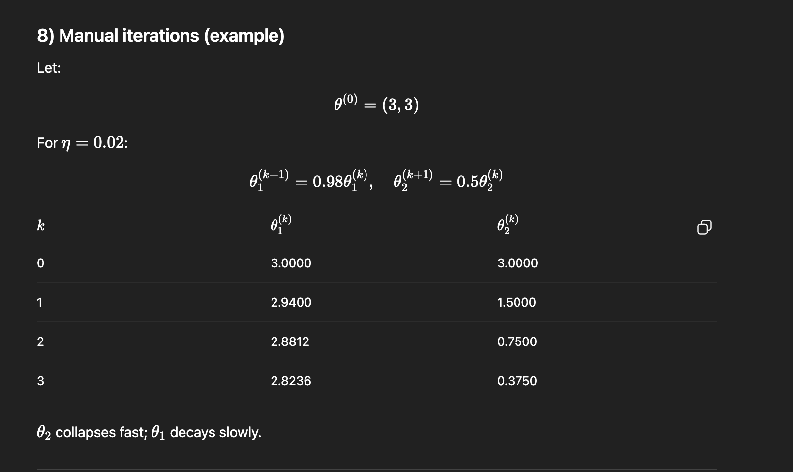
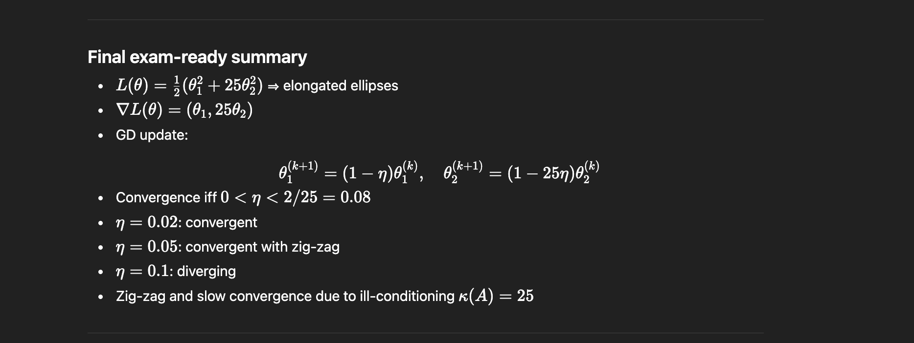

## Comments

Given the shape of the loss function and its definition, by modifying the values in the diagonal of the matrix A we can control the level of elogation and direction of the ellipses seen in the plots.
\
\
By looking at the plots, it can be seen that the direction of the gradients will always point towards the inner of the ellipses perpendicual to the ellipses themselves; so, if the function was shaped in a way that there were circles instead of ellispes, then gradiends would have pointed directly to the center.
\
\
The more the ellipes will be elongated, the more gradient descent will have an hard time to get to convergence, this is due to the fact that the algorithm will bounce side to side in the 3d representation of the function, and this behaviour is represented in a 2 dimensioal way in the level set through the zig-zag lines traced by the algorithm. Of course if the step is small enough (like in $\eta = .2$) the effect won't show.

