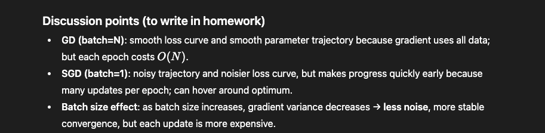

### Comments

# =========================
# 2) Model + Loss
# f_theta(x) = theta0 + theta1 * x
# L(theta) = (1/N) sum_i (f_theta(x_i) - y_i)^2
# =========================

def grad_L(theta, x, y):
    # Gradient of MSE:
    # d/dtheta0: mean(2*(theta0+theta1*x - y))
    # d/dtheta1: mean(2*(theta0+theta1*x - y)*x)
    r = f_theta(theta, x) - y
    g0 = np.mean(2.0 * r)
    g1 = np.mean(2.0 * r * x)
    return np.array([g0, g1])

# =========================
# 3) Mini-batch SGD / Full GD under one function name: gradient_descent
# - If batch_size == N -> full batch GD (one update per epoch)
# - Otherwise -> mini-batch SGD
# Outputs:
# - theta_last
# - losses_per_epoch  (loss vs epoch as requested)
# - thetas_trajectory (theta0, theta1 after each update)
# =========================

# =========================
# 4) Stochastic Gradient Descent (SGD / mini-batch)
# - batch_size = 1, 10, 50, ...
# - loss curve (loss vs epoch)
# - parameter trajectory in (theta0, theta1) for ALL updates
# =========================

# ----------------------------
# 3) Closed-form optimum (for red dot)
# theta* = (Xtilde^T Xtilde)^(-1) Xtilde^T y
# where Xtilde = [1, x]
# ----------------------------

# ----------------------------
# 5) Stochastic Gradient Descent (mini-batch) aligned with your style
# Track:
#   - thetas per epoch (for a clean trajectory plot)
#   - losses per epoch (loss vs epoch)
# ----------------------------

