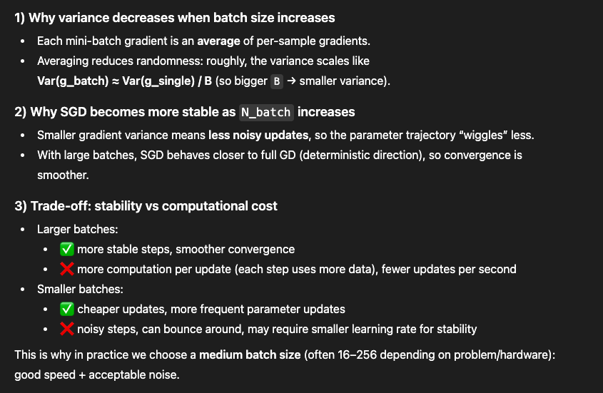

# ------------------------------------------------------------
# Exercise 2: empirical variance of stochastic gradient
# Var(g) = (1/100) sum_k || g_k - g_bar ||^2
# g_bar = (1/100) sum_k g_k
# ------------------------------------------------------------

    """
    For each batch size B:
      - sample K mini-batches (uniformly without replacement)
      - compute g_k = grad_L(theta, X_batch, Y_batch)
      - compute empirical variance: (1/K) sum ||g_k - g_bar||^2
    Returns:
      vars_dict: {B: variance_value}
      grads_dict: {B: array shape (K, d)} (optional, useful for debugging)
    """

    