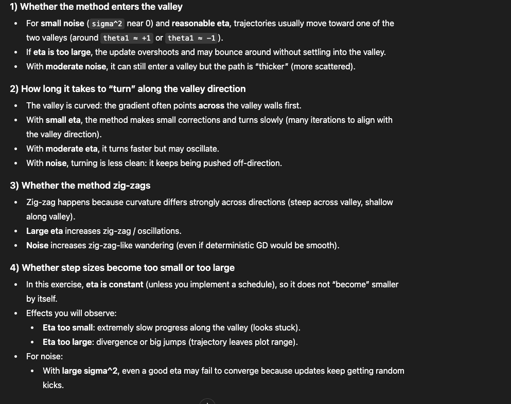

def grad_L(theta):
    theta = np.asarray(theta, dtype=float)
    t1, t2 = theta[0], theta[1]

    # L = (t1^2 - 1)^2 + 10 (t2 - t1^2)^2
    # d/dt1: 4 t1 (t1^2 - 1) + 10 * 2 (t2 - t1^2) * (-2 t1)
    #      = 4 t1 (t1^2 - 1) - 40 t1 (t2 - t1^2)
    # d/dt2: 10 * 2 (t2 - t1^2) = 20 (t2 - t1^2)
    g1 = 4.0 * t1 * (t1**2 - 1.0) - 40.0 * t1 * (t2 - t1**2)
    g2 = 20.0 * (t2 - t1**2)

        """
    Simulated SGD:
      g_k = grad_L(theta_k) + eps_k, eps_k ~ N(0, sigma^2 I)
      theta_{k+1} = theta_k - eta * g_k

    Returns:
      theta_last, it, thetas, losses
    """

    def plot_all_runs(theta0_list, eta_list, sigma2_list,
                 maxit=2000, xlim=(-2,2), ylim=(-1,3), ncontours=20):
    """
    For each theta0:
      Make a figure with rows = sigma2 values, columns = eta values
      Each subplot shows trajectory on level sets.
    """''

            # Wide range in Z -> log-spaced levels show the valley nicely without over-cluttering
        # (this is why people use logspace for Rosenbrock-like valleys)

