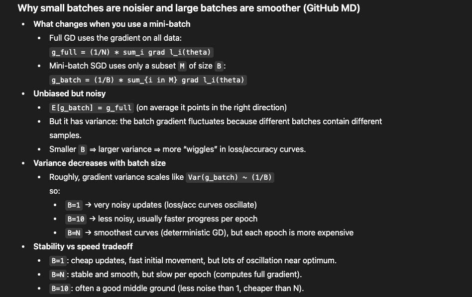

def train_sgd_logreg(L, grad_L, X, y, lr=1e-2, epochs=200, batch_size=32, theta0=None, seed=0):
    """
    Matches your style:
    - shuffle each epoch
    - mini-batch gradient steps
    - log full-dataset loss/accuracy once per epoch
    """

    