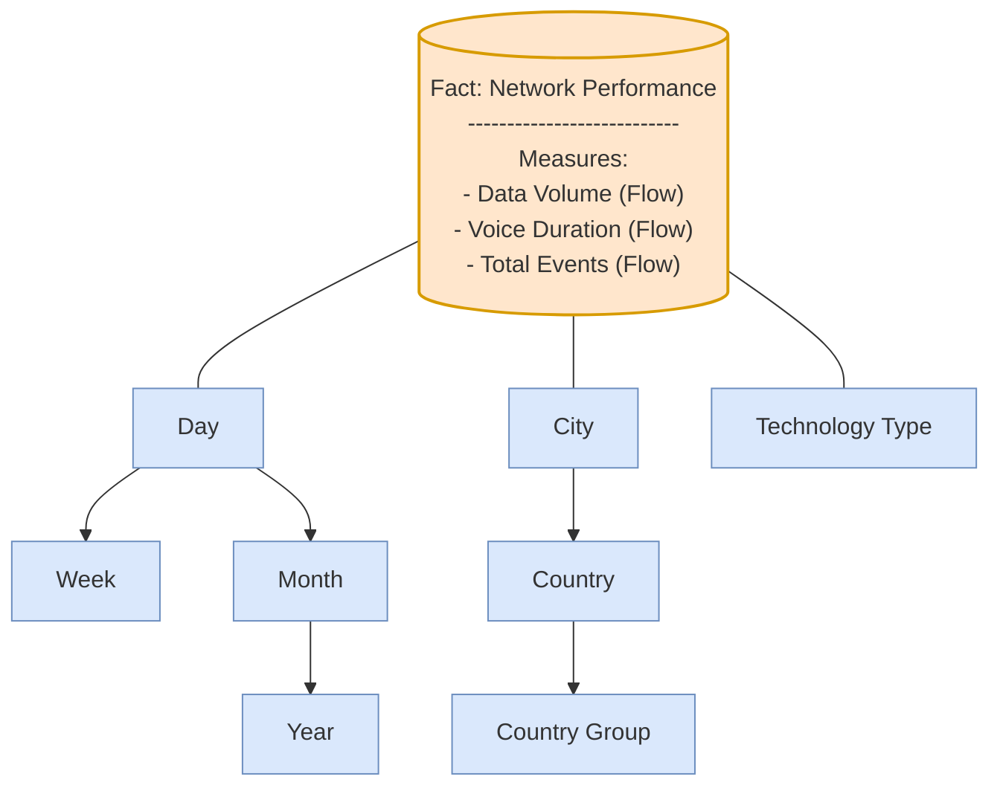

Based on the exercise provided in the image, here is the conceptual model designed using the **Dimensional Fact Model (DFM)** principles we discussed.

### **1. Analysis of Requirements**

Before drawing the schema, let's break down the text to identify the core components:

* **The Goal:** Monitor network performance (Data and Voice).
* **The Fact (Center):** `Network Performance` or `Traffic`.
* **Dimensions (Analysis Perspectives):**
* *Where?* "European area... different countries... main cities."  **Location Dimension**.
* *When?* "Daily/weekly/monthly-basis."  **Time Dimension**.
* *What Tech?* "Type of technology used (e.g., 2G, 3G)."  **Technology Dimension**.

* **Hierarchies:**
* **Location:** The text specifies a hierarchy: `City`  `Country`  `Group` (Main vs. Small).
* **Time:** `Day`  `Week` and `Day`  `Month`.

---

### **2. Conceptual Model (DFM Schema)**

Here is the resulting schema. I have defined the **Grain** as: *One summary record per City, per Technology, per Day.*

**Visual Representation:**

---

### **3. Detailed Explanation of Components**

#### **A. The Fact**

* **Name:** `Network Performance`
* **Measures:**
* **Data Volume:** (e.g., MB/GB) to measure the "Data" aspect mentioned.
* **Voice Duration:** (e.g., Minutes) to measure the "Voice" aspect mentioned.
* **Total Events:** (Optional but useful) Count of calls or data sessions.

* **Additivity:** These are **Flow measures** (fully additive). You can sum traffic across all cities to get the Country total, or sum traffic across all days to get the Monthly total.

#### **B. The Dimensions**

**1. Location Dimension**
This captures the geographical hierarchy described in the text.

* **Hierarchy:** `City`  `Country`  `Country Group`
* **Logic:** The text explicitly states countries are divided into "Main group" and "Small group." This "Group" becomes the top level of the location hierarchy, allowing analysts to compare "Main Group vs. Small Group" performance.

**2. Time Dimension**

* **Hierarchy:**
* Path 1: `Day`  `Month`  `Quarter`  `Year` (Standard calendar rollup).
* Path 2: `Day`  `Week` (Weeks often don't fit perfectly into months, so this is usually a separate branch).

* **Logic:** The text asks for "daily/weekly/monthly" analysis. The base level (grain) must be **Day** to allow aggregation up to Week or Month.

**3. Technology Dimension**

* **Hierarchy:** `Technology Type` (flat dimension).
* **Logic:** The text requests analysis depending on "type of technology (e.g., 2G, 3G)." If needed, this could be expanded later (e.g., `Type`  `Generation`), but currently, a single attribute is sufficient.

### **4. Recommended Grain**

* **Grain:** Daily summary by City by Technology.
* **Why?** This is the finest level of detail required to answer all the questions in the prompt. It allows the provider to see "How much 3G Voice traffic happened in Rome on Monday?"
