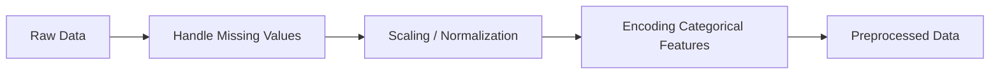

### OLTP

OLTP is short for Online Transaction Processing. It refers to a type of database system designed to handle high volumes of real-time transactions and manage daily business operations, such as online banking, e-commerce, and airline reservations. OLTP systems are optimized for fast response times, data integrity, and processing thousands of concurrent transactions, ensuring that data is accurate and up-to-date. 
Key Characteristics of OLTP Systems
Real-time Transactions: OLTP systems process many transactions at the same time, with rapid, millisecond-level response times. 
High Volume: They are built to handle a massive number of transactions, often from many users concurrently. 
Data Integrity: These systems maintain data accuracy and atomicity, meaning a transaction is either completed successfully or fails entirely, never in an intermediate state. 
Day-to-Day Operations: OLTP is used for operational tasks like checking bank balances, making purchases, or updating inventory. 
Simplified Queries: The queries in an OLTP system are generally simple, focused on retrieving or modifying individual data records. 
Data Design: OLTP databases use a normalized format and are designed for capturing and storing detailed data for business operations. 


### OLAP

Online analytical processing (OLAP) is software technology you can use to analyze business data from different points of view. Organizations collect and store data from multiple data sources, such as websites, applications, smart meters, and internal systems. OLAP combines and groups this data into categories to provide actionable insights for strategic planning. For example, a retailer stores data about all the products it sells, such as color, size, cost, and location. The retailer also collects customer purchase data, such as the name of the items ordered and total sales value, in a different system. OLAP combines the datasets to answer questions such as which color products are more popular or how product placement impacts sales.

Online analytical processing (OLAP) helps organizations process and benefit from a growing amount of digital information. Some benefits of OLAP include the following.

Faster decision making
Businesses use OLAP to make quick and accurate decisions to remain competitive in a fast-paced economy. Performing analytical queries on multiple relational databases is time consuming because the computer system searches through multiple data tables. On the other hand, OLAP systems precalculate and integrate data so business analysts can generate reports faster when needed.

Non-technical user support
OLAP systems make complex data analysis easier for non-technical business users. Business users can create complex analytical calculations and generate reports instead of learning how to operate databases.

Integrated data view
OLAP provides a unified platform for marketing, finance, production, and other business units. Managers and decision makers can see the bigger picture and effectively solve problems. They can perform what-if analysis, which shows the impact of decisions taken by one department on other areas of the business.

##### What is OLAP architecture?
Online analytical processing (OLAP) systems store multidimensional data by representing information in more than two dimensions, or categories. Two-dimensional data involves columns and rows, but multidimensional data has multiple characteristics. For example, multidimensional data for product sales might consist of the following dimensions:

Product type
Location
Time
Data engineers build a multidimensional OLAP system that consists of the following elements. 

Data warehouse
A data warehouse collects information from different sources, including applications, files, and databases. It processes the information using various tools so that the data is ready for analytical purposes. For example, the data warehouse might collect information from a relational database that stores data in tables of rows and columns. 

ETL tools 
Extract, transform, and load (ETL) tools are database processes that automatically retrieve, change, and prepare the data to a format fit for analytical purposes. Data warehouses use ETL to convert and standardize information from various sources before making it available to OLAP tools.

OLAP server 
An OLAP server is the underlying machine that powers the OLAP system. It uses ETL tools to transform information in the relational databases and prepare them for OLAP operations. 

OLAP database
An OLAP database is a separate database that connects to the data warehouse. Data engineers sometimes use an OLAP database to prevent the data warehouse from being burdened by OLAP analysis. They also use an OLAP database to make it easier to create OLAP data models.

OLAP cubes
A data cube is a model representing a multidimensional array of information. While it’s easier to visualize it as a three-dimensional data model, most data cubes have more than three dimensions. An OLAP cube, or hypercube, is the term for data cubes in an OLAP system. OLAP cubes are rigid because you can't change the dimensions and underlying data once you model it. For example, if you add the warehouse dimension to a cube with product, location, and time dimensions, you have to remodel the entire cube. 

OLAP analytic tools
Business analysts use OLAP tools to interact with the OLAP cube. They perform operations such as slicing, dicing, and pivoting to gain deeper insights into specific information within the OLAP cube. 


# 📘 Data Mining – Theory + Practice Guide (with Visuals)

This guide combines **math formulas**, **Python implementations**, and **visual diagrams** for major data mining topics.  
Use it as a reference for both **course exams** and **hands-on projects**.

---

## 🔹 1. Data Preprocessing

### Math Intuition
- Standardization (z-score):
\[
z = \frac{x - \mu}{\sigma}
\]

- Min-Max Scaling:
\[
x' = \frac{x - \min(x)}{\max(x) - \min(x)}
\]

### Diagram

import pandas as pd
from sklearn.preprocessing import StandardScaler

df = pd.DataFrame({"age":[25,30,35,None],
                   "income":[50000,60000,75000,80000]})

df["age"].fillna(df["age"].median(), inplace=True)

scaler = StandardScaler()
df[["age", "income"]] = scaler.fit_transform(df[["age", "income"]])
print(df)
```

 2. Similarity & Distance

 ```
	•	Euclidean Distance
[
d(x, y) = \sqrt{\sum_{i=1}^{n} (x_i - y_i)^2}
]
	•	Cosine Similarity
[
\cos(x,y) = \frac{x \cdot y}{|x||y|}
]

 ```


```
graph TD
  A[Data Point 1] -->|Compare| C[Distance Metric]
  B[Data Point 2] -->|Compare| C[Distance Metric]
  C --> D[Similarity Score]

```

```
from sklearn.metrics.pairwise import euclidean_distances, cosine_similarity
import numpy as np

X = np.array([[1,2],[2,3],[3,4]])
print("Euclidean:\n", euclidean_distances(X))
print("Cosine:\n", cosine_similarity(X))

```

3. Association Rule Mining

```
	•	Support:
[
Support(A) = \frac{|Transactions(A)|}{|Total Transactions|}
]
	•	Confidence:
[
Conf(A \Rightarrow B) = \frac{Support(A \cup B)}{Support(A)}
]
	•	Lift:
[
Lift(A \Rightarrow B) = \frac{Conf(A \Rightarrow B)}{Support(B)}
]
```

```
flowchart LR
  A[Transaction Dataset] --> B[Frequent Itemset Mining (Apriori/FP-Growth)]
  B --> C[Generate Association Rules]
  C --> D{Evaluate: Support, Confidence, Lift}
```

```
from mlxtend.frequent_patterns import apriori, association_rules
import pandas as pd

data = {'milk':[1,0,1,1],'bread':[1,1,1,0],'butter':[0,1,1,1]}
df = pd.DataFrame(data)

frequent_itemsets = apriori(df, min_support=0.5, use_colnames=True)
rules = association_rules(frequent_itemsets, metric="confidence", min_threshold=0.7)
print(rules)
```


4. Clustering

```
	•	K-Means Objective:
[
J = \sum_{i=1}^k \sum_{x \in C_i} |x - \mu_i|^2
]
	•	DBSCAN: Core point if ≥ MinPts within radius ( \varepsilon ).

```


```
flowchart TD
  A[Data Points] --> B[Choose K Clusters]
  B --> C[Assign Points to Nearest Centroid]
  C --> D[Recompute Centroids]
  D --> B
  B --> E[Final Clusters]


```


```
from sklearn.cluster import KMeans
import matplotlib.pyplot as plt

X = [[1,2],[1,4],[1,0],[10,2],[10,4],[10,0]]
kmeans = KMeans(n_clusters=2, random_state=42).fit(X)

print("Centers:", kmeans.cluster_centers_)
print("Labels:", kmeans.labels_)

plt.scatter([x[0] for x in X],[x[1] for x in X],c=kmeans.labels_)
plt.show()
```

5. Classification

```
Math
	•	Logistic Regression:
[
P(y=1|x) = \frac{1}{1 + e^{-(w^Tx + b)}}
]
	•	Naive Bayes:
[
P(C|x) = \frac{P(C)\prod_{i=1}^n P(x_i|C)}{P(x)}
]
	•	Decision Tree (Gini):
[
Gini(D) = 1 - \sum_{i=1}^m p_i^2
]

```


```
flowchart TD
  A[Training Data] --> B[Choose Algorithm]
  B --> C{Model Type?}
  C -->|Logistic| D[Regression: Sigmoid Function]
  C -->|Tree| E[Decision Tree: Splitting by Gini/Entropy]
  C -->|Naive Bayes| F[Probabilistic Classification]
  D --> G[Predictions]
  E --> G
  F --> G
```


```
from sklearn.datasets import load_iris
from sklearn.tree import DecisionTreeClassifier
from sklearn.model_selection import train_test_split
from sklearn.metrics import accuracy_score

iris = load_iris()
X, y = iris.data, iris.target
X_train,X_test,y_train,y_test = train_test_split(X,y,test_size=0.3,random_state=42)

clf = DecisionTreeClassifier()
clf.fit(X_train, y_train)

y_pred = clf.predict(X_test)
print("Accuracy:", accuracy_score(y_test, y_pred))

```


6. Dimensionality Reduction


```

Math
	•	PCA Covariance Matrix:
[
\Sigma = \frac{1}{n} X^T X
]
	•	Projection:
[
Z = XW
]

```


```
flowchart TD
  A[High-Dimensional Data] --> B[Compute Covariance Matrix]
  B --> C[Eigen Decomposition]
  C --> D[Select Top K Eigenvectors]
  D --> E[Reduced-Dimensional Data]
```


7. Evaluation Metrics

```
Math
	•	Accuracy:
[
Acc = \frac{TP+TN}{TP+TN+FP+FN}
]
	•	Precision:
[
Prec = \frac{TP}{TP+FP}
]
	•	Recall:
[
Rec = \frac{TP}{TP+FN}
]
	•	F1 Score:
[
F1 = \frac{2 \cdot Prec \cdot Rec}{Prec+Rec}
]

```


```
flowchart LR
  A[Predicted Positive] -->|True| B[TP]
  A -->|False| C[FP]
  D[Predicted Negative] -->|True| E[TN]
  D -->|False| F[FN]
  B & C & E & F --> G[Metrics: Accuracy, Precision, Recall, F1]

```


```

from sklearn.metrics import classification_report
print(classification_report(y_test, y_pred))
```
