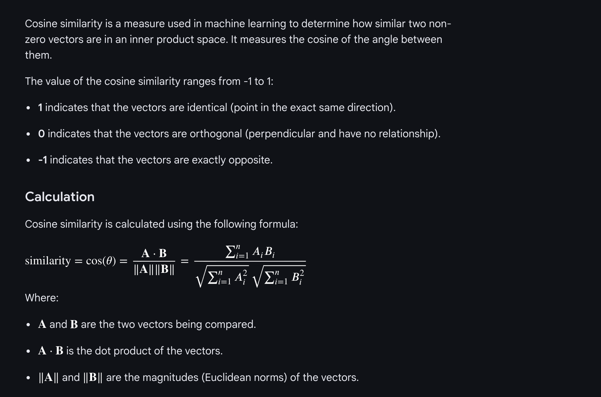
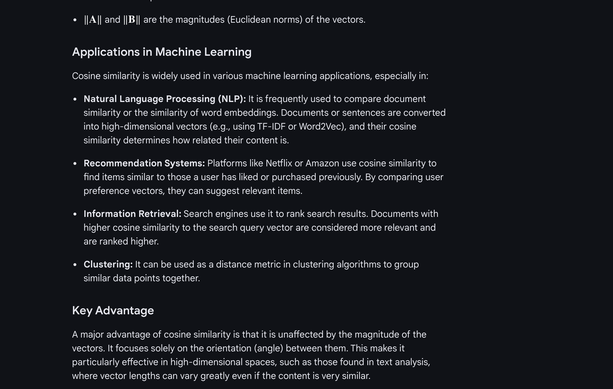
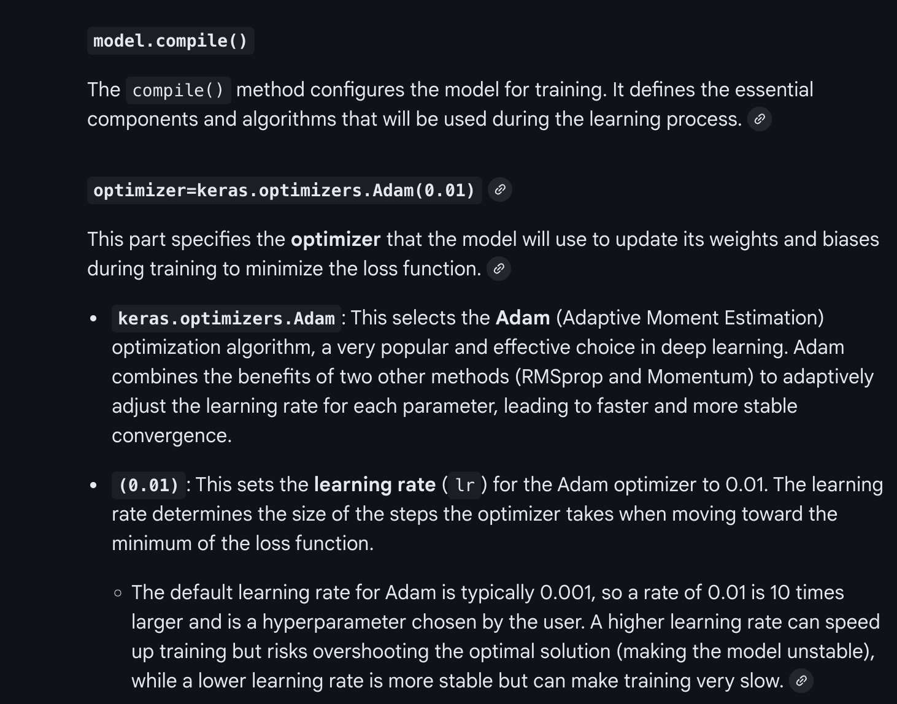
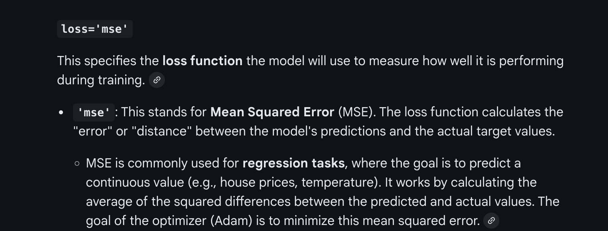
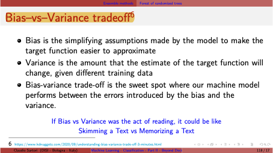

In deep learning, "shallow function" and "deep function" refer to the models used to learn them. The main difference is the **architecture's depth** (the number of layers) and, more importantly, **how they learn features**.

A "shallow function" is learned by a shallow model, while a "deep function" is learned by a deep model (a deep neural network).

### ☀️ Shallow Functions (Shallow Learning)

A shallow model has a simple architecture, typically with **zero or only one hidden layer** between the input and the output.

* **Key Characteristic:** They almost always rely on **manual feature engineering**. This means a human expert must first analyze the raw data (like an image or text) and manually extract the most relevant features (e.g., "pixel brightness," "word count," "average word length"). The shallow model then learns a simple relationship between *those specific features* and the final output.
* **Examples:** Logistic Regression, Support Vector Machines (SVMs), and simple neural networks (like a single-layer perceptron).
* **Best For:**
    * Simpler problems.
    * Smaller, structured (tabular) datasets.
    * Situations where you need the model to be easily interpretable (to understand *why* it made a decision).

---

### 🧠 Deep Functions (Deep Learning)

A deep model, or Deep Neural Network (DNN), has a complex architecture with **multiple hidden layers** (sometimes hundreds or thousands) stacked on top of each other.


* **Key Characteristic:** They perform **automatic feature learning**, also known as *representation learning*. You feed the model the raw data (like raw pixels of an image), and the layers learn the features by themselves in a hierarchy.
    * **Example (Image Recognition):**
        * **Layer 1** might learn to detect simple edges and colors.
        * **Layer 2** combines those edges to learn simple shapes (circles, squares).
        * **Layer 3** combines those shapes to learn textures or parts (an eye, a nose, a wheel).
        * **Final Layers** combine those parts to recognize the entire object (a face, a car).
* **Examples:** Convolutional Neural Networks (CNNs) for images, Recurrent Neural Networks (RNNs) and Transformers for text and sequences.
* **Best For:**
    * Highly complex problems.
    * Large, unstructured datasets (images, audio, text).
    * Tasks where performance is more important than interpretability.

---

### ## At a Glance: Shallow vs. Deep

| Feature | Shallow Functions (Shallow Learning) | Deep Functions (Deep Learning) |
| :--- | :--- | :--- |
| **Architecture** | Simple (0-1 hidden layers) | Complex (Many hidden layers) |
| **Feature Learning** | **Manual** (requires human feature engineering) | **Automatic** (learns features hierarchically) |
| **Data Needs** | Works well with smaller datasets | Requires large datasets to perform well |
| **Compute Power** | Less intensive (can run on CPUs) | Very intensive (often requires GPUs/TPUs) |
| **Interpretability** | High (easier to interpret) | Low ("black box," harder to interpret) |
| **Best For** | Structured data, simple tasks | Unstructured data (images, text), complex tasks |

The main takeaway is that deep learning's power comes from its *deep* architecture, which allows it to automatically learn a complex hierarchy of features, eliminating the need for manual feature engineering.

***

This video provides a short visual explanation of the [differences between shallow and deep networks](https://www.youtube.com/watch?v=AHeBRWZ5B7Y).
http://googleusercontent.com/youtube_content/0


Here's the difference between multi-class and multi-label classification.

The main difference is simple:
* **Multi-Class:** You must pick **one and only one** class for an item.
* **Multi-Label:** You can pick **zero, one, or multiple** labels for an item.

The classes in a multi-class problem are **mutually exclusive**, while the labels in a multi-label problem are **not**.

---

### 🏷️ Multi-Class Classification

This is a classification task where each sample belongs to **exactly one** class out of three or more possible classes.

* **Question it answers:** "Which *one* of these categories does this item belong to?"
* **Real-world Examples:**
    * **Sentiment Analysis:** Is a review **positive**, **negative**, or **neutral**? (It can't be both positive and negative).
    * **Fruit Recognition:** Is this image an **apple**, an **orange**, or a **banana**?
    * **Digit Recognition:** Is this handwritten digit a **0**, **1**, **2**, ... or **9**?


---

### 🏷️🏷️ Multi-Label Classification

This is a classification task where each sample can be assigned a **set of labels**. An item can have no labels, one label, or multiple labels.

* **Question it answers:** "Which of these categories *apply* to this item?"
* **Real-world Examples:**
    * **Movie Genres:** A movie can be classified as **Action**, **Comedy**, and **Sci-Fi** all at the same time.
    * **Tagging a News Article:** An article can be tagged with **Politics**, **Europe**, and **Economics**.
    * **Photo Content:** An image from a social media post could be labeled with **friends**, **beach**, **sunset**, and **vacation**.


---

### ## At a Glance: Multi-Class vs. Multi-Label

| Feature | Multi-Class Classification | Multi-Label Classification |
| :--- | :--- | :--- |
| **Main Goal** | Assign **one** class from 3+ options | Assign **zero or more** labels |
| **Classes** | Mutually exclusive (e.g., "cat" vs. "dog") | Not mutually exclusive (e.g., "action" & "comedy") |
| **Analogy** | A multiple-choice question with **one correct answer**. | A "select all that apply" question. |
| **Model Output (Tech)** | A single probability distribution (using **Softmax**) that sums to 1. | An independent probability for *each* label (using **Sigmoid**). |
| **Example Question** | "What *is* this?" | "What is *in* this?" |

This [video explains the difference visually](https://www.youtube.com/watch?v=Epx2V3Kd3dE) using common examples and diagrams.
http://googleusercontent.com/youtube_content/1


### Summary: Use ReLU (or variant) for hidden layers, choose the output activation according to the prediction type: linear for regression, sigmoid for binary, softmax for multi-class.






```
model.compile(optimizer=keras.optimizers.Adam(0.01), loss='mse')
```







### Entropy

A measure fo uncertainity or impurity in a dataset.
Entropy is a fundamental concept in machine learning used to measure **uncertainty, randomness, or impurity** in a set of data.

Think of it this way:
* **Low Entropy:** A dataset that is very "pure" or predictable. Imagine a bag with 10 red marbles. If you pull one out, you are 100% certain it will be red. This set has zero entropy.
* **High Entropy:** A dataset that is very "mixed" or unpredictable. Imagine a bag with 5 red marbles and 5 blue marbles. If you pull one out, you have no idea which it will be. This set has high entropy.

In machine learning, this concept is used in two primary ways:

---

### 1. Entropy in Decision Trees (as a Splitting Metric)

This is the classic use of entropy. When building a decision tree, the algorithm needs to decide which "question" to ask (i.e., which feature to split on) to best separate the data.

* **Goal:** To create "leaf nodes" that are as **pure** as possible (low entropy).
* **How it works:** The algorithm calculates the entropy of the data *before* a potential split (the "parent" node) and the weighted average entropy of the data *after* the split (the "child" nodes).
* **Information Gain:** The reduction in entropy caused by the split is called **Information Gain**.

The decision tree algorithm will always **choose the split that produces the highest Information Gain**, which is the same as saying it chooses the split that results in the *purest* child nodes (the lowest combined entropy).


---

### 2. Cross-Entropy (as a Loss Function)

This is the most common application of entropy in modern deep learning, especially for **classification** models.

**Cross-Entropy Loss** (or "log loss") is a function that measures the performance of a classification model. It quantifies the *difference* between the model's predicted probabilities and the actual "ground truth" labels.

* **Goal:** To train a model whose predicted probabilities are as close to the true labels as possible.
* **How it works:**
    * **The Truth:** The actual label is represented as a probability, e.g., if the image is a **dog**, the truth is `[Cat=0, Dog=1, Bird=0]`.
    * **The Prediction:** The model outputs its own probabilities, e.g., `[Cat=0.1, Dog=0.8, Bird=0.1]` (it's 80% sure it's a dog).
* **Calculating Loss:**
    * **Low Loss (Good):** If the model is confident and *correct* (like the 80% "dog" prediction), the cross-entropy loss will be a small number.
    * **High Loss (Bad):** If the model is confident and *wrong* (e.g., it predicted `[Cat=0.8, Dog=0.1, Bird=0.1]`), it gets "surprised" by the truth, and the loss will be a very large number.

During training, the model's main objective is to **minimize this cross-entropy loss value**, which forces it to make more accurate and confident predictions for the correct classes.

***

This [video explains the concept of cross-entropy loss](https://www.youtube.com/watch?v=FODwUM-1PyI) and why it's so important for training deep learning models.
http://googleusercontent.com/youtube_content/2


### Ensemble method  (key: Individuality)

These slides explain **ensemble methods** in machine learning, a powerful technique for getting better predictions.

Here's a simple breakdown of the concept using your slides.

### 1. The Basic Idea (Your First Slide)

Think of it as the **"wisdom of the crowd."**

Instead of relying on a single "expert" (one classifier), you train a *group* of different "base classifiers." Then, you let them all "vote" on the final prediction.

* **Slide 1 says:**
    1.  You train a set of **base classifiers**.
    2.  The final prediction is made by **taking their votes**.
    3.  This combined "ensemble" model **tends to perform better** than any single one of its members.

**Analogy:** If you ask one average person a tough question, they might get it wrong. If you ask 25 average people the same question and take the most common answer (majority vote), your chance of getting the right answer is much higher.

---

### 2. Why It Works: The Math Explained (Your Second Slide)

This slide provides the mathematical proof for *why* the "wisdom of the crowd" works, using a specific example.

#### The Setup
* Let's create an ensemble of **25 classifiers**.
* Each classifier is a "binary classifier" (it just answers "Yes" or "No").
* Each classifier is "okay," but not great. It has an **error rate of $\epsilon = 0.35$** (meaning it's wrong 35% of the time, or correct 65% of the time).
* The ensemble's final decision is based on **majority vote** (at least 13 of the 25 classifiers must agree).

#### The Key Condition: Independence
The slides make two critical points:

1.  **If all classifiers are equal (identical):** If you just copy the same classifier 25 times, they will all make the *exact same mistakes*. The ensemble will also have an error rate of 35%. This is useless.
2.  **If the classifiers are independent (diverse):** This is the secret. "Independent" means their errors are "uncorrelated"—they all make *different* mistakes for different reasons.

#### The Big Payoff
If the classifiers are independent, the ensemble will *only* be wrong when **the majority of the classifiers are wrong** (i.e., 13 or more of them make a mistake *on the same problem*).

What's the probability of that happening?

The formula on your slide is the **Binomial Probability Formula**. It calculates the exact probability of getting *at least 13 errors* out of 25 "chances."

* $\epsilon_{ensemble} = \sum_{i=13}^{25} \binom{25}{i} \epsilon^i (1-\epsilon)^{25-i}$

Let's break that formula down:
* **$\sum_{i=13}^{25}$**: This means "add up the probabilities" for all outcomes from 13 errors *up to* 25 errors.
    * (Prob. of *exactly 13* errors) + (Prob. of *exactly 14* errors) + ... + (Prob. of *exactly 25* errors)
* **$\binom{25}{i}$**: This is "25 choose $i$". It's the number of different ways you can pick $i$ classifiers to be wrong out of the group of 25.
* **$\epsilon^i$**: This is the probability of $i$ classifiers being wrong ($0.35^i$).
* **$(1-\epsilon)^{25-i}$**: This is the probability of the *rest* of the classifiers ($25-i$) being correct ($0.65^{25-i}$).

When you plug in the numbers ($\epsilon = 0.35$), the result is **0.06**.

### 🏁 Summary: The "Magic" of Ensembles

* **Individual Classifier Error:** 35%
* **Ensemble (Group) Error:** 6%

By combining 25 "okay" classifiers, the error rate dropped from 35% to 6%. This is a massive improvement!

The whole system works *only if* the base classifiers are **diverse** and **independent**. In practice, we can't make them perfectly independent, but methods like **Random Forests** and **Bagging** are designed to make the classifiers as different from each other as possible to get this benefit.

***

We choose subset of the predicted value for different classifiers (see the dataset and generate classifiers)


You're right, that's the most important part!

If all the classifiers are trained on the exact same data, they'll probably all make the same mistakes. The key is to **force them to be different**.

Random Forests do this using two brilliant techniques:

### 1. Bagging (Bootstrap Aggregating)

This technique creates diversity in the **data** each classifier sees.

Instead of giving all 25 classifiers (or "trees" in this case) the *entire* dataset, Random Forest gives each tree a **random sample** of the data.

Specifically, it uses "bootstrapping," which means **sampling *with* replacement**.

* **Analogy:** Imagine your full dataset is a big bag of 100 marbles.
* **Tree 1:** Pulls 100 marbles, but *puts each one back* after noting its color. Its "training set" might have some marbles duplicated and others missing entirely.
* **Tree 2:** Does the same thing, but gets a *different* random combination.
* **Result:** Each tree is trained on a slightly different version of the dataset. This variation is enough to make the trees learn slightly different patterns and make different errors.


### 2. Feature Randomness

This technique creates diversity in the **features** each classifier can use.

When a normal decision tree tries to make a split (ask a question), it looks at *all* the available features (e.g., "age," "income," "zip code") and picks the single best one. If one feature is very strong, *every* tree might pick it first, making all the trees look similar.

Random Forest **prevents this** by adding a rule:

* At *every single split* in the tree, it first picks a **small, random subset** of the features.
* It is *only* allowed to choose the best feature *from that small subset*.

**Analogy:** You're training 25 "student" classifiers.
* You give them all slightly different study notes (Bagging).
* You also tell Student 1, "When studying, you can only look at chapters 1, 3, and 7."
* You tell Student 2, "You can only look at chapters 2, 4, and 5."
* **Result:** Even if Chapter 1 has the most important answers, Student 2 *must* find other ways to solve the problem using Chapters 2, 4, and 5. This forces the trees to be diverse and discover different predictive patterns.

By combining **Bagging** (different data) and **Feature Randomness** (different features), you get a "forest" full of trees that are unique and "uncorrelated." Their individual errors cancel each other out, leading to a much more robust and accurate final vote.

***

Here's how **Boosting** works, complete with examples, math, and code.

Boosting is the other major ensemble method. Unlike Bagging (Random Forests) which builds *independent* models in parallel, **Boosting builds models *sequentially*, where each new model learns from the mistakes of the previous ones.**

  * **Analogy:** Imagine a team of students taking a test.
      * **Bagging:** 25 students take the test *at the same time* and you take the majority vote.
      * **Boosting:** Student 1 takes the test. The teacher grades it. Student 2 *only studies the questions Student 1 got wrong*. Student 3 then studies the questions that *both 1 and 2* still couldn't get right.
  * **Core Idea:** It combines many "weak learners" (models that are just slightly better than random guessing) into a single, very strong learner. The final prediction is a **weighted vote** where more accurate models get a bigger say.

-----

### 1\. AdaBoost (Adaptive Boosting)

AdaBoost is the classic example. It "adapts" by changing the **weights of the training samples**. Misclassified samples get *more* weight, forcing the next model to pay closer attention to them.

#### 🧠 How it Works & The Math

1.  **Initialize:** Give every data point an equal weight, $w_i = 1/N$.
2.  **Iterate:** For each new model $m$ (from 1 to $M$):
    a.  Train a weak classifier (e.g., a "stump," a decision tree with only one split) on the *weighted* data.
    b.  Calculate the model's **total error ($\epsilon_m$)**. This is the sum of the *weights* of all the misclassified samples.
    c.  Calculate the model's **"amount of say" ($\alpha_m$)** based on its error. A low error means a big "say."
    $$
    $$$$\\alpha\_m = \\frac{1}{2} \\ln\\left(\\frac{1 - \\epsilon\_m}{\\epsilon\_m}\\right)
    $$
    $$$$d.  **Update sample weights:** This is the key step.
    \* **For misclassified samples:** Increase their weight: $w_{\text{new}} = w_{\text{old}} \times e^{\alpha_m}$ (makes them *harder* to ignore).
    \* **For correctly classified samples:** Decrease their weight: $w_{\text{new}} = w_{\text{old}} \times e^{-\alpha_m}$ (makes them *less* important).
    e.  **Normalize** all weights so they sum back to 1.
3.  **Final Prediction:** To classify a new item, each of the $M$ models gets to vote. The final decision is the sign of the *weighted sum* of their votes. Models with a higher $\alpha$ (amount of say) get a more powerful vote.
    $$
    $$$$\\text{Final Prediction} = \\text{sign}\\left(\\sum\_{m=1}^{M} \\alpha\_m \\times \\text{prediction}\_m\\right)
    $$
    $$$$
    $$
#### 💻 Code Example (Python + scikit-learn)

Here's how you'd implement `AdaBoostClassifier` in practice.

```python
import pandas as pd
from sklearn.model_selection import train_test_split
from sklearn.datasets import make_classification
from sklearn.ensemble import AdaBoostClassifier
from sklearn.tree import DecisionTreeClassifier
from sklearn.metrics import accuracy_score

# 1. Create a sample dataset
X, y = make_classification(n_samples=1000, n_features=20, n_informative=10, 
                           n_redundant=5, random_state=42)

# 2. Split the data
X_train, X_test, y_train, y_test = train_test_split(X, y, test_size=0.3, random_state=42)

# 3. Create the AdaBoost model
# We use a DecisionTreeClassifier with max_depth=1 (a "stump") as the weak learner.
weak_learner = DecisionTreeClassifier(max_depth=1)

# n_estimators is the number of models to build sequentially (M in our math)
# learning_rate shrinks the contribution of each classifier (helps prevent overfitting)
ada_model = AdaBoostClassifier(
    estimator=weak_learner,
    n_estimators=100,  # 100 weak learners
    learning_rate=0.5,
    random_state=42
)

# 4. Train the model
ada_model.fit(X_train, y_train)

# 5. Make predictions
y_pred = ada_model.predict(X_test)

# 6. Check accuracy
accuracy = accuracy_score(y_test, y_pred)
print(f"AdaBoost Accuracy: {accuracy * 100:.2f}%")

# Compare to the weak learner alone
weak_learner.fit(X_train, y_train)
y_pred_weak = weak_learner.predict(X_test)
accuracy_weak = accuracy_score(y_test, y_pred_weak)
print(f"Single Weak Learner Accuracy: {accuracy_weak * 100:.2f}%")
```

-----

### 2\. Gradient Boosting (GBM)

Gradient Boosting is a more general and (often) more powerful method. Instead of tweaking *sample weights* like AdaBoost, it **trains each new model to predict the *errors* (the residuals) of the model before it.**

#### 🧠 How it Works & The Math (Simplified for Regression)

It's easiest to understand with a regression problem (predicting a number, like house price).

1.  **Initialize:** Make a simple first guess. A good guess is just the **average** of all the target values (e.g., the average house price).
2.  **Iterate:** For each new model $m$ (from 1 to $M$):
    a.  **Calculate residuals:** Find the errors from the *current* ensemble's prediction.
    $\text{Residual}_i = \text{TrueValue}_i - \text{CurrentPrediction}_i$
    b.  **Train a new weak learner** (a tree) to **predict those residuals**. This tree's job is not to predict the house price, but to predict the *error* (e.g., "the last model was $10,000 too low for this house").
    c.  **Update the ensemble's prediction:** Add this new tree's prediction to the total, but scaled by a **learning rate ($\\eta$)\*\*.
    $$
    $$$$\\text{New Prediction} = \\text{Old Prediction} + \\eta \\times \\text{Residual Prediction}\_m
    $$
    $$$$
    $$
3.  **Final Prediction:** The final prediction is the sum of the first guess *plus* all the scaled predictions from every tree in the sequence.

The name "Gradient" comes from the fact that this process of fitting residuals is mathematically equivalent to optimizing the model's loss function using *gradient descent*.

#### 💻 Code Example (Python + scikit-learn)

Here's `GradientBoostingClassifier` (the classification version, which uses a similar logic).

```python
import pandas as pd
from sklearn.model_selection import train_test_split
from sklearn.datasets import make_classification
from sklearn.ensemble import GradientBoostingClassifier
from sklearn.metrics import accuracy_score

# 1. Create the same sample dataset
X, y = make_classification(n_samples=1000, n_features=20, n_informative=10, 
                           n_redundant=5, random_state=42)

# 2. Split the data
X_train, X_test, y_train, y_test = train_test_split(X, y, test_size=0.3, random_state=42)

# 3. Create the Gradient Boosting model
# In Gradient Boosting, weak learners are almost always decision trees.
# max_depth is usually kept small (e.g., 3-8).
gbm_model = GradientBoostingClassifier(
    n_estimators=100,     # 100 trees
    learning_rate=0.1,    # A small learning rate is common
    max_depth=3,          # Trees are slightly more complex than stumps
    random_state=42
)

# 4. Train the model
gbm_model.fit(X_train, y_train)

# 5. Make predictions
y_pred = gbm_model.predict(X_test)

# 6. Check accuracy
accuracy = accuracy_score(y_test, y_pred)
print(f"Gradient Boosting Accuracy: {accuracy * 100:.2f}%")
```

-----

### \#\# At a Glance: Bagging vs. Boosting

| Feature | Bagging (e.g., Random Forest) | Boosting (e.g., AdaBoost, GBM) |
| :--- | :--- | :--- |
| **How Models are Built** | In **parallel** (independently) | **Sequentially** (one after another) |
| **Main Goal** | Decrease **variance** (less sensitive to data) | Decrease **bias** (makes a stronger model) |
| **How it Learns** | Each model sees a random subset of data/features | Each new model *corrects the errors* of the previous ones |
| **Model Voting** | Simple majority vote (all models are equal) | **Weighted vote** (better models get more say) |
| **Risk of Overfitting** | Low risk (very robust) | Higher risk (can overfit if too many learners are used) |
| **Key Analogy** | **Wisdom of the crowd** | **Team of experts** learning from mistakes |

Popular, highly optimized versions of Gradient Boosting, like **XGBoost** and **LightGBM**, are extremely powerful and often win machine learning competitions for tabular data.

-----

You're absolutely right\! Let's cover the "other ones" — the **Bagging** family, including **Random Forests**.

This family works on the principle you saw in your original slide: **if you average the predictions of *independent*, uncorrelated models, you reduce the overall error.** The whole goal of Bagging is to create these uncorrelated models.

-----

### 1\. Bagging (Bootstrap Aggregating)

This is the core technique. It's a general method that can be used with any base model (like Decision Trees, SVMs, etc.). It gets its name from its two parts: **B**ootstrap + **Agg**regating.

#### 🧠 How it Works & The "Math" (The Algorithm)

1.  **Bootstrap (Sampling):**

      * You have one original dataset with $N$ samples.
      * To train $T$ different models, you create $T$ new datasets.
      * Each new dataset is created by **sampling *with replacement*** from the original data.
      * This means a "bootstrapped" dataset will have the same size $N$, but some original samples will be missing, and others will appear multiple times.
      * **Result:** You get $T$ slightly different datasets ($D_1, D_2, \dots, D_T$).

2.  **Aggregate (Voting):**

      * You train one base model (e.g., a fully grown Decision Tree) on each bootstrapped dataset ($M_1$ on $D_1$, $M_2$ on $D_2$, etc.).
      * Because each model saw slightly different data, they will all learn slightly different rules and become "de-correlated" (as your slide said).
      * To make a final prediction for a new item, you "aggregate" their votes:
          * **Classification:** Majority vote. The class that gets the most votes wins.
            $$\text{Prediction} = \text{mode}(\{M_1(x), M_2(x), \dots, M_T(x)\})$$
          * **Regression:** Average. The average of all predictions is the final answer.
            $$\text{Prediction} = \frac{1}{T} \sum_{t=1}^{T} M_t(x)$$

**The main goal of Bagging is to reduce *variance***. It makes the final model much more stable and less likely to overfit to the noise in a single training set.

#### 💻 Code Example (Python + scikit-learn)

Here's how you'd implement a `BaggingClassifier`. We'll use a Decision Tree as the base model.

```python
import pandas as pd
from sklearn.model_selection import train_test_split
from sklearn.datasets import make_classification
from sklearn.ensemble import BaggingClassifier
from sklearn.tree import DecisionTreeClassifier
from sklearn.metrics import accuracy_score

# 1. Create a sample dataset
X, y = make_classification(n_samples=1000, n_features=20, n_informative=10, 
                           n_redundant=5, random_state=42)

# 2. Split the data
X_train, X_test, y_train, y_test = train_test_split(X, y, test_size=0.3, random_state=42)

# 3. Create the Bagging model
# We'll use a Decision Tree as the base estimator.
# By default, it's a fully grown tree.
base_model = DecisionTreeClassifier()

# n_estimators is the number of models (T)
# max_samples=1.0 means each bootstrap sample has size N
# bootstrap=True is the key! It enables sampling with replacement.
bagging_model = BaggingClassifier(
    estimator=base_model,
    n_estimators=100,      # 100 trees
    max_samples=1.0,         # Each tree gets a full-sized bootstrap sample
    bootstrap=True,
    random_state=42,
    n_jobs=-1              # Use all available CPU cores
)

# 4. Train the model (this trains all 100 trees in parallel)
bagging_model.fit(X_train, y_train)

# 5. Make predictions
y_pred = bagging_model.predict(X_test)

# 6. Check accuracy
accuracy = accuracy_score(y_test, y_pred)
print(f"Bagging Accuracy: {accuracy * 100:.2f}%")

# Compare to a single Decision Tree
single_tree = DecisionTreeClassifier(random_state=42)
single_tree.fit(X_train, y_train)
y_pred_tree = single_tree.predict(X_test)
accuracy_tree = accuracy_score(y_test, y_pred_tree)
print(f"Single Tree Accuracy: {accuracy_tree * 100:.2f}%")
```

You'll typically see that the Bagging accuracy is higher and more stable (less overfit) than the single tree.

-----

### 2\. Random Forests

A Random Forest is a clever **enhancement of Bagging** that is almost exclusively used with Decision Trees.

It takes the main idea of Bagging (bootstrapped data) and adds **one more layer of randomness** to make the trees *even more* different from each other.

#### 🧠 How it Works & The "Math" (The Algorithm)

A Random Forest does *everything* Bagging does, plus one extra step:

1.  **Bootstrap (Sampling):** Same as Bagging. Create $T$ datasets ($D_1 \dots D_T$) by sampling with replacement.
2.  **Train Trees with Feature Randomness (The Secret Sauce):**
      * When growing each tree $M_t$ on its dataset $D_t$...
      * At *every single node* where the tree needs to decide on the best split...
      * ...it **does not** look at all $p$ features.
      * Instead, it first selects a **random subset of $m$ features** (where $m < p$).
      * It is then forced to find the *best possible split* using **only** that small subset of $m$ features.
3.  **Aggregate (Voting):** Same as Bagging (majority vote or average).

**Why add this extra step?**
Imagine you have one very dominant feature (e.g., "age"). In a normal Bagging model, *every* tree would probably pick "age" as its very first split. As a result, all the trees would look very similar ("correlated").

By forcing each split to pick from a *random subset* of features, Random Forest ensures that some trees *won't even have the chance* to pick "age" as their first split. They'll be forced to use other, weaker features, leading to a much more diverse "forest" of trees. This directly creates the "uncorrelated" classifiers your slide talked about, making the ensemble more powerful.

#### 💻 Code Example (Python + scikit-learn)

`RandomForestClassifier` is just a highly optimized, built-in version of what we did above, with feature randomness included by default.

```python
import pandas as pd
from sklearn.model_selection import train_test_split
from sklearn.datasets import make_classification
from sklearn.ensemble import RandomForestClassifier
from sklearn.metrics import accuracy_score

# 1. Create the same sample dataset
X, y = make_classification(n_samples=1000, n_features=20, n_informative=10, 
                           n_redundant=5, random_state=42)

# 2. Split the data
X_train, X_test, y_train, y_test = train_test_split(X, y, test_size=0.3, random_state=42)

# 3. Create the Random Forest model
# This class does all the work for you:
# - It automatically uses Decision Trees.
# - It automatically uses Bagging (bootstrap=True is the default).
# - It automatically uses feature randomness (max_features="sqrt" is the default).

# max_features="sqrt" means the random subset size m = sqrt(p)
# e.g., for our 20 features, m = sqrt(20) ≈ 4. 
# So at each split, it randomly picks 4 features to check.

rf_model = RandomForestClassifier(
    n_estimators=100,      # 100 trees
    max_features="sqrt",   # The key randomness parameter!
    random_state=42,
    n_jobs=-1
)

# 4. Train the model
rf_model.fit(X_train, y_train)

# 5. Make predictions
y_pred = rf_model.predict(X_test)

# 6. Check accuracy
accuracy = accuracy_score(y_test, y_pred)
print(f"Random Forest Accuracy: {accuracy * 100:.2f}%")
```

### \#\# Summary: Bagging vs. Random Forest

| Method | How it Creates Diversity |
| :--- | :--- |
| **Bagging** | **1. Random Data:** Each model gets a different (bootstrapped) sample of the *data*. |
| **Random Forest** | **1. Random Data:** (Same as Bagging) <br> **2. Random Features:** At *each split*, each tree gets a different random subset of *features*. |

Random Forest's extra step of randomizing features almost always makes it more robust and accurate than a standard Bagging model using Decision Trees.


#### how and why and when and on what basis we choose these classifiers?

This is the most important practical question. The choice is a classic trade-off between **performance, speed, and complexity**.

Here’s the simple answer:
* **Start with Random Forest.** It's robust, hard to overfit, and gives great results with minimal tuning.
* **Switch to Boosting (like XGBoost)** only when you need to squeeze out the absolute *last bit of performance* and are willing to spend time carefully tuning it.

---

### ## At a Glance: How to Choose

| Basis of Comparison | Bagging (Random Forest) | Boosting (Gradient Boosting, XGBoost) |
| :--- | :--- | :--- |
| **Main Goal** | Reduces **Variance** (prevents overfitting) | Reduces **Bias** (builds a more accurate model) |
| **Performance** | Very high "out-of-the-box" performance | Potentially *the highest* performance, but only after tuning |
| **Hyperparameter Tuning** | **Easy**. Needs little tuning. | **Difficult**. Very sensitive to parameters. |
| **Risk of Overfitting** | **Very Low**. More trees just make it stabler. | **High**. Too many trees will *definitely* overfit. |
| **Training Speed** | **Fast**. Can be built in parallel (all trees at once). | **Slow**. Must be built sequentially (one tree at a time). |
| **Key Analogy** | A "wisdom of the crowd" democracy | A "team of experts" learning from mistakes |

---

### 🌳 When and Why to Choose Bagging (Random Forest)

Choose a Random Forest when:

* **You need a strong, reliable baseline *fast*.**
    * **Why?** RF has very few key parameters (mostly just the number of trees). It works incredibly well with default settings. It's often the first model you should try on a tabular dataset.

* **You are worried about overfitting.**
    * **Why?** The core idea of averaging predictions from many de-correlated trees makes the model very stable. It smooths out the noise. Adding more trees doesn't cause overfitting.

* **You have a noisy dataset.**
    * **Why?** The averaging process tends to cancel out the noise that individual trees might have learned.

* **You need to train your model in parallel.**
    * **Why?** Since all 100 trees are independent, you can train 25 trees on CPU core 1, 25 on core 2, etc. This makes it very fast to train on modern hardware.

* **You need easy-to-understand feature importance.**
    * **Why?** RF's feature importance (based on "mean decrease in impurity") is very reliable and widely trusted.

> **Bottom Line:** Choose Random Forest for its **robustness, speed of development, and reliability**. It's the "set it and forget it" of high-performance models.

---

### 🚀 When and Why to Choose Boosting (Gradient Boosting, XGBoost, LightGBM)

Choose a Boosting model when:

* **You need the *absolute best possible performance*.**
    * **Why?** Boosting is obsessively focused on correcting errors. By sequentially adding models that fix the previous model's mistakes, it can "chase down" the bias and build a model that is more accurate than any other. This is why it dominates machine learning competitions (like on Kaggle).

* **You have time for careful hyperparameter tuning.**
    * **Why?** Boosting's power is also its weakness. It has many sensitive parameters, especially `n_estimators` (number of trees) and `learning_rate`. If you set these wrong, the model will either be weak or overfit badly. You *must* use cross-validation to find the right balance.

* **Your Random Forest model is "underfitting."**
    * **Why?** If your RF model is stable but just not accurate enough (it has high bias), it means the "wisdom of the crowd" is settling on a slightly wrong answer. Boosting is designed to *reduce* this bias and find a more accurate signal.

> **Bottom Line:** Choose Boosting when you are in a **performance-critical** situation and are willing to treat it like a **high-performance race car** that needs careful tuning to win.

---

### ## 📝 A Practical Workflow

Here is how you can combine these ideas in practice:

1.  **Step 1: Get a Baseline.** First, run a simple, non-ensemble model like **Logistic Regression** or a **single Decision Tree**. This tells you the minimum score to beat.
2.  **Step 2: Run Random Forest.** Use `RandomForestClassifier` with default settings (maybe just `n_estimators=100`). This will give you a very strong second baseline, often with 90-95% of the possible accuracy, in just a few minutes.
3.  **Step 3: Evaluate.** Is the Random Forest score good enough for your project?
    * If **Yes**: Stop. You're done. You have a robust, fast, and reliable model.
    * If **No**: Proceed to Step 4.
4.  **Step 4: Run Gradient Boosting.** Use a powerful library like **XGBoost** or **LightGBM**. Spend time carefully tuning the hyperparameters (using `GridSearchCV` or `RandomizedSearchCV`) to find the best `learning_rate`, `n_estimators`, `max_depth`, etc.
5.  **Step 5: Final Decision.** Compare your tuned Boosting model to your Random Forest model. The Boosting model will *probably* be more accurate, but is the 1-2% accuracy gain worth the extra training time and model complexity? That's your final call.




This slide explains the **Bias-Variance Tradeoff**, which is the single most important challenge in building an accurate machine learning model.

It's a balancing act between two different types of errors: **Bias** (being too simple) and **Variance** (being too complex).

Your total error is essentially: **Error = Bias² + Variance + Irreducible Error**

---

### 🎯 Bias (Underfitting)

The slide calls this "simplifying assumptions."

* **What it is:** Bias is the error from a model being **too simple** to understand the true patterns in your data. It *underfits* the data.
* **Analogy (from your slide):** "Skimming a Text." You get the general, high-level idea, but you are "biased" against all the important, complex details, so you can't answer specific questions.
* **Example Model:** A simple linear regression line trying to model a complex, curvy, U-shaped pattern.
* **Result:** The model performs poorly on your training data and *also* performs poorly on new test data. It's just not a good model.

---

### 🌊 Variance (Overfitting)

The slide calls this the "amount that the estimate... will change, given different training data."

* **What it is:** Variance is the error from a model being **too complex and sensitive**. It learns the data *so* well that it memorizes the *noise* and random flukes in the training set, not just the underlying pattern.
* **Analogy (from your slide):** "Memorizing a Text." The model can "recite" the training data perfectly (100% accuracy), but it has zero *understanding*. The moment you give it a new, slightly different sentence (test data), it fails completely.
* **Example Model:** A very deep, fully-grown decision tree that has so many branches it ends up creating a specific rule for every single data point.
* **Result:** The model performs *perfectly* on your training data but fails *miserably* on new test data. It doesn't generalize.

---

### ⚖️ The Trade-off (The "Sweet Spot")

This is the central problem. Bias and Variance have an inverse relationship:

* If you make your model *simpler* (e.g., a smaller tree), your **Bias goes UP** (it's too simple) but your **Variance goes DOWN** (it's more stable).
* If you make your model *more complex* (e.g., a deeper tree), your **Bias goes DOWN** (it fits the data) but your **Variance goes UP** (it starts memorizing noise).

The **"sweet spot"** is the point of model complexity where the *total error* is minimized. This is the model that **generalizes** best to new, unseen data.


---

### ## How This Explains Ensemble Methods

This slide is the **exact reason** why ensemble methods are so powerful. They are two different strategies for beating the trade-off:

1.  **Bagging (Random Forest) is a Variance Reducer:**
    * It starts with **high-variance, low-bias** models (deep, complex decision trees that are all overfit).
    * It then **averages** their predictions.
    * The averaging process makes the errors (the noise) cancel each other out, dramatically **reducing the variance** while keeping the bias low.

2.  **Boosting (Gradient Boosting) is a Bias Reducer:**
    * It starts with **high-bias, low-variance** models (very simple trees or "stumps" that are underfit).
    * It then **sequentially** adds new models, with each one focused on correcting the errors (the bias) of the one before it.
    * It builds a strong model by combining many weak ones, step-by-step **reducing the bias**.