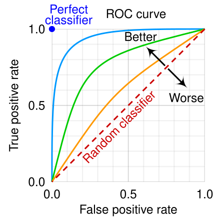

A perfect classifier has a decision boundary that completely and cleanly separates every instance of one class from every instance of another class. It is important to note that a classifier's "shape" is not a physical form, but rather the geometric representation of its decision boundaries. 
In terms of a decision boundary
The "shape" of a perfect classifier is the ideal decision boundary in a feature space. A perfect classifier draws a boundary (or boundaries) around the data points for each class so that no data point is ever misclassified. 
For a two-class problem, this boundary would have a distinct shape that perfectly encapsulates the positive and negative training samples. The exact shape depends on the nature of the data distribution. 
If the data for each class is linearly separable (meaning a single straight line or flat plane can separate the data), the perfect boundary would be a simple line or hyperplane.
If the data for each class is not linearly separable, the perfect boundary would be more complex and non-linear, wrapping around the data clusters for each class. 
In terms of a Receiver Operating Characteristic (ROC) curve
When evaluating a classifier's performance, a perfect classifier has a very specific shape on an ROC curve plot, which graphs the True Positive Rate (TPR) versus the False Positive Rate (FPR) at various threshold settings. 
The curve: The perfect classifier's ROC curve is a right-angle shape, going straight up from the origin (0,0) to the top-left corner (0,1) and then straight across to the top-right corner (1,1).
The point: The top-left corner at the coordinate (0,1) represents the ideal scenario where the classifier has a True Positive Rate (sensitivity) of 1.0 (100%) and a False Positive Rate of 0.0, meaning it correctly identifies every positive case with zero false alarms.
The area under the curve (AUC): The AUC for a perfect classifier is 1.0, representing the maximum possible score and indicating that the model has perfect discriminative ability. 
In terms of a confusion matrix
A perfect classifier would also have a very specific "shape" for its confusion matrix, a table that summarizes the model's predictions against the actual values. In this matrix, the only non-zero values would be on the diagonal. 
True Positives (TP) and True Negatives (TN) would have positive values.
False Positives (FP) and False Negatives (FN) would have values of 0, indicating zero errors. 

