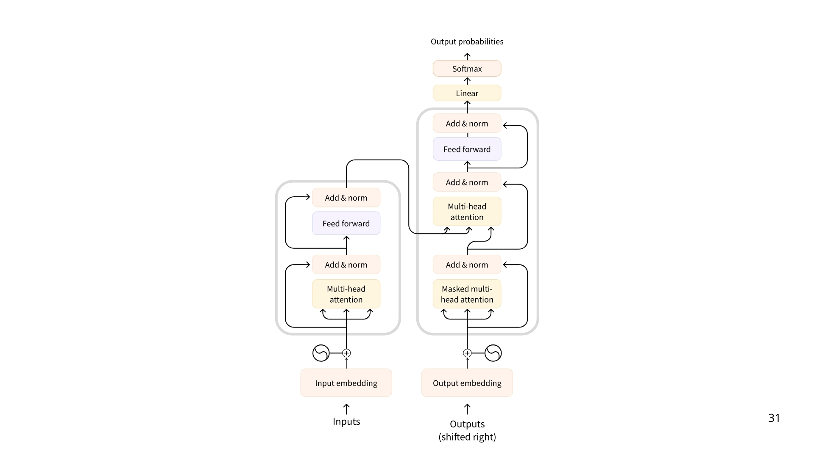
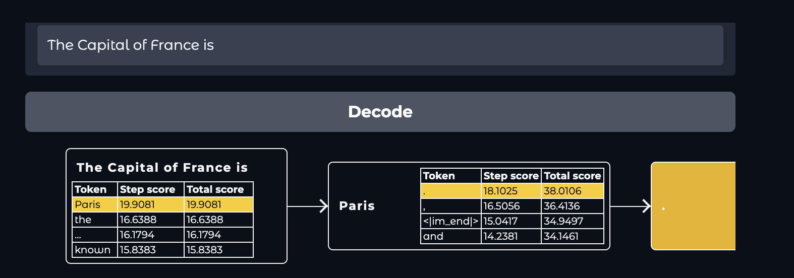
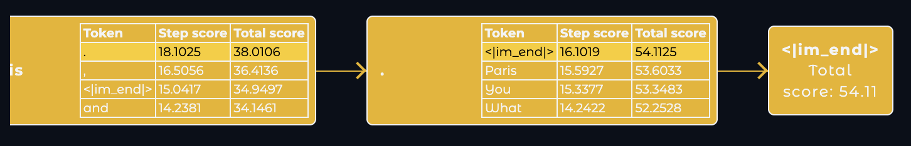

An LLM is a type of AI model that excels at understanding and generating human language. They are trained on vast amounts of text data, allowing them to learn patterns, structure, and even nuance in language. These models typically consist of many millions of parameters.

Most LLMs nowadays are built on the Transformer architecture—a deep learning architecture based on the “Attention” algorithm, that has gained significant interest since the release of BERT from Google in 2018.

There are 3 types of transformers:

- Encoders
        An encoder-based Transformer takes text (or other data) as input and outputs a dense representation (or embedding) of that text.

        Example: BERT from Google
        Use Cases: Text classification, semantic search, Named Entity Recognition
        Typical Size: Millions of parameters

- Decoders
        A decoder-based Transformer focuses on generating new tokens to complete a sequence, one token at a time.

        Example: Llama from Meta
        Use Cases: Text generation, chatbots, code generation
        Typical Size: Billions (in the US sense, i.e., 10^9) of parameters

- Seq2Seq (Encoder–Decoder)
        A sequence-to-sequence Transformer combines an encoder and a decoder. The encoder first processes the input sequence into a context representation, then the decoder generates an output sequence.

        Example: T5, BART
        Use Cases: Translation, Summarization, Paraphrasing
        Typical Size: Millions of parameters

The underlying principle of an LLM is simple yet highly effective: its objective is to predict the next token, given a sequence of previous tokens. A “token” is the unit of information an LLM works with. You can think of a “token” as if it was a “word”, but for efficiency reasons LLMs don’t use whole words.

For example, while English has an estimated 600,000 words, an LLM might have a vocabulary of around 32,000 tokens (as is the case with Llama 2). Tokenization often works on sub-word units that can be combined.

For instance, consider how the tokens “interest” and “ing” can be combined to form “interesting”, or “ed” can be appended to form “interested.”

In other words, an LLM will decode text until it reaches the EOS. But what happens during a single decoding loop?

- While the full process can be quite technical for the purpose of learning agents, here’s a brief overview:

- Once the input text is tokenized, the model computes a representation of the sequence that captures information about the meaning and the position of each token in the input sequence.
This representation goes into the model, which outputs scores that rank the likelihood of each token in its vocabulary as being the next one in the sequence.

https://huggingface.co/datasets/agents-course/course-images/resolve/main/en/unit1/DecodingFinal.gif

But there are more advanced decoding strategies. For example, beam search explores multiple candidate sequences to find the one with the maximum total score–even if some individual tokens have lower scores.

***Attention is all you need***

A key aspect of the Transformer architecture is Attention. When predicting the next word, not every word in a sentence is equally important; words like “France” and “capital” in the sentence “The capital of France is …” carry the most meaning.

How are LLMs used in AI Agents?
LLMs are a key component of AI Agents, providing the foundation for understanding and generating human language.

They can interpret user instructions, maintain context in conversations, define a plan and decide which tools to use.