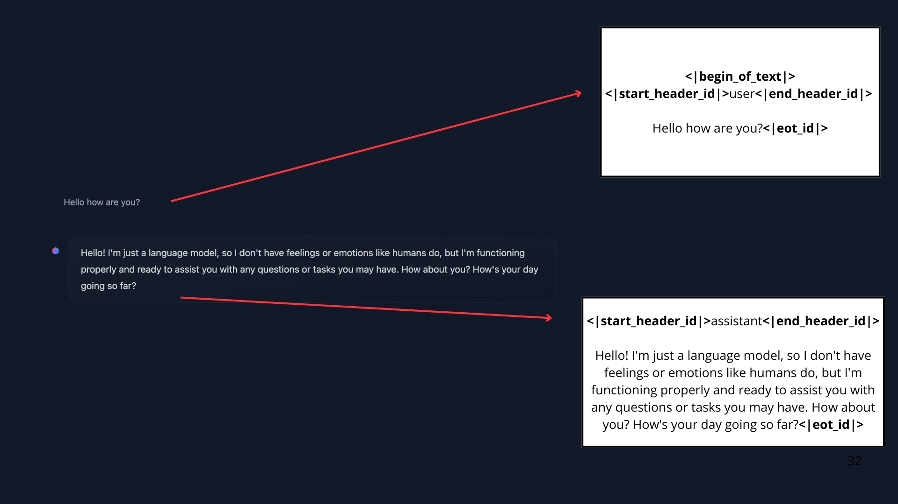

## Messages and Special Tokens


Q: When, I’m interacting with ChatGPT/Hugging Chat, I’m having a conversation using chat Messages, not a single prompt sequence

A: That’s correct! But this is in fact a UI abstraction. Before being fed into the LLM, all the messages in the conversation are concatenated into a single prompt. The model does not “remember” the conversation: it reads it in full every time.


Up until now, we’ve discussed prompts as the sequence of tokens fed into the model. But when you chat with systems like ChatGPT or HuggingChat, you’re actually exchanging messages. Behind the scenes, these messages are concatenated and formatted into a prompt that the model can understand.




This is where chat templates come in. They act as the bridge between conversational messages (user and assistant turns) and the specific formatting requirements of your chosen LLM. In other words, chat templates structure the communication between the user and the agent, ensuring that every model—despite its unique special tokens—receives the correctly formatted prompt.

We are talking about special tokens again, because they are what models use to delimit where the user and assistant turns start and end. Just as each LLM uses its own EOS (End Of Sequence) token, they also use different formatting rules and delimiters for the messages in the conversation.


#### System Prompt

```

system_message = {
    "role": "system",
    "content": "You are a professional customer service agent. Always be polite, clear, and helpful."
}
```

When using Agents, the System Message also gives information about the available tools, provides instructions to the model on how to format the actions to take, and includes guidelines on how the thought process should be segmented.


#### Conversations: User and Assistant Messages

A conversation consists of alternating messages between a Human (user) and an LLM (assistant).

Chat templates help maintain context by preserving conversation history, storing previous exchanges between the user and the assistant. This leads to more coherent multi-turn conversations.

For example:

```
conversation = [
    {"role": "user", "content": "I need help with my order"},
    {"role": "assistant", "content": "I'd be happy to help. Could you provide your order number?"},
    {"role": "user", "content": "It's ORDER-123"},
]
```


#### Conversation in Llama 3.2:

```
<|begin_of_text|><|start_header_id|>system<|end_header_id|>

Cutting Knowledge Date: December 2023
Today Date: 10 Feb 2025

<|eot_id|><|start_header_id|>user<|end_header_id|>

I need help with my order<|eot_id|><|start_header_id|>assistant<|end_header_id|>

I'd be happy to help. Could you provide your order number?<|eot_id|><|start_header_id|>user<|end_header_id|>

It's ORDER-123<|eot_id|><|start_header_id|>assistant<|end_header_id|>
```

Templates can handle complex multi-turn conversations while maintaining context:

```
messages = [
    {"role": "system", "content": "You are a math tutor."},
    {"role": "user", "content": "What is calculus?"},
    {"role": "assistant", "content": "Calculus is a branch of mathematics..."},
    {"role": "user", "content": "Can you give me an example?"},
]
```


### Base Models vs. Instruct Models
Another point we need to understand is the difference between a Base Model vs. an Instruct Model:

A Base Model is trained on raw text data to predict the next token.

An Instruct Model is fine-tuned specifically to follow instructions and engage in conversations. For example, SmolLM2-135M is a base model, while SmolLM2-135M-Instruct is its instruction-tuned variant.

To make a Base Model behave like an instruct model, we need to format our prompts in a consistent way that the model can understand. This is where chat templates come in.

ChatML is one such template format that structures conversations with clear role indicators (system, user, assistant). If you have interacted with some AI API lately, you know that’s the standard practice.

It’s important to note that a base model could be fine-tuned on different chat templates, so when we’re using an instruct model we need to make sure we’re using the correct chat template.