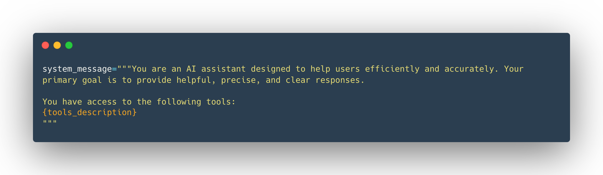
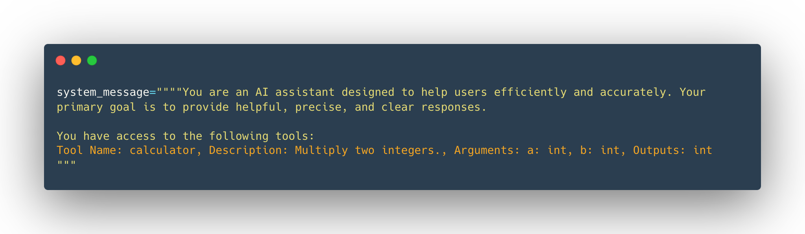

A good tool should be something that complements the power of an LLM.

For instance, if you need to perform arithmetic, giving a calculator tool to your LLM will provide better results than relying on the native capabilities of the model.

Furthermore, LLMs predict the completion of a prompt based on their training data, which means that their internal knowledge only includes events prior to their training. Therefore, if your agent needs up-to-date data you must provide it through some tool.

For instance, if you ask an LLM directly (without a search tool) for today’s weather, the LLM will potentially hallucinate random weather.


A Tool should contain:

- A textual description of what the function does.
- A Callable (something to perform an action).
- Arguments with typings.
- (Optional) Outputs with typings.


#### How do tools work?
LLMs, as we saw, can only receive text inputs and generate text outputs. They have no way to call tools on their own. When we talk about providing tools to an Agent, we mean teaching the LLM about the existence of these tools and instructing it to generate text-based invocations when needed.

For example, if we provide a tool to check the weather at a location from the internet and then ask the LLM about the weather in Paris, the LLM will recognize that this is an opportunity to use the “weather” tool. Instead of retrieving the weather data itself, the LLM will generate text that represents a tool call, such as call weather_tool(‘Paris’).

The Agent then reads this response, identifies that a tool call is required, executes the tool on the LLM’s behalf, and retrieves the actual weather data.

The Tool-calling steps are typically not shown to the user: the Agent appends them as a new message before passing the updated conversation to the LLM again. The LLM then processes this additional context and generates a natural-sounding response for the user. From the user’s perspective, it appears as if the LLM directly interacted with the tool, but in reality, it was the Agent that handled the entire execution process in the background.

#### How do we give tools to an LLM?
The complete answer may seem overwhelming, but we essentially use the system prompt to provide textual descriptions of available tools to the model:




For this to work, we have to be very precise and accurate about:

- What the tool does
- What exact inputs it expects


Reminder: This textual description is what we want the LLM to know about the tool.

#### Auto-formatting Tool sections
Our tool was written in Python, and the implementation already provides everything we need:

A descriptive name of what it does: calculator
A longer description, provided by the function’s docstring comment: Multiply two integers.
The inputs and their type: the function clearly expects two ints.
The type of the output.
There’s a reason people use programming languages: they are expressive, concise, and precise.

We could provide the Python source code as the specification of the tool for the LLM, but the way the tool is implemented does not matter. All that matters is its name, what it does, the inputs it expects and the output it provides.

We will leverage Python’s introspection features to leverage the source code and build a tool description automatically for us. All we need is that the tool implementation uses type hints, docstrings, and sensible function names. We will write some code to extract the relevant portions from the source code.

After we are done, we’ll only need to use a Python decorator to indicate that the calculator function is a tool:

```
@tool
def calculator(a: int, b: int) -> int:
    """Multiply two integers."""
    return a * b

print(calculator.to_string())
```


Note the @tool decorator before the function definition.

With the implementation we’ll see next, we will be able to retrieve the following text automatically from the source code via the to_string() function provided by the decorator:

```
Tool Name: calculator, Description: Multiply two integers., Arguments: a: int, b: int, Outputs: int
```

### Generic Tool implementation
We create a generic Tool class that we can reuse whenever we need to use a tool.

Disclaimer: This example implementation is fictional but closely resembles real implementations in most libraries.


```

from typing import Callable


class Tool:
    """
    A class representing a reusable piece of code (Tool).

    Attributes:
        name (str): Name of the tool.
        description (str): A textual description of what the tool does.
        func (callable): The function this tool wraps.
        arguments (list): A list of arguments.
        outputs (str or list): The return type(s) of the wrapped function.
    """
    def __init__(self,
                 name: str,
                 description: str,
                 func: Callable,
                 arguments: list,
                 outputs: str):
        self.name = name
        self.description = description
        self.func = func
        self.arguments = arguments
        self.outputs = outputs

    def to_string(self) -> str:
        """
        Return a string representation of the tool,
        including its name, description, arguments, and outputs.
        """
        args_str = ", ".join([
            f"{arg_name}: {arg_type}" for arg_name, arg_type in self.arguments
        ])

        return (
            f"Tool Name: {self.name},"
            f" Description: {self.description},"
            f" Arguments: {args_str},"
            f" Outputs: {self.outputs}"
        )

    def __call__(self, *args, **kwargs):
        """
        Invoke the underlying function (callable) with provided arguments.
        """
        return self.func(*args, **kwargs)

        
```


```

calculator_tool = Tool(
    "calculator",                   # name
    "Multiply two integers.",       # description
    calculator,                     # function to call
    [("a", "int"), ("b", "int")],   # inputs (names and types)
    "int",                          # output
)
```

But we can also use Python’s inspect module to retrieve all the information for us! This is what the @tool decorator does.

```

import inspect

def tool(func):
    """
    A decorator that creates a Tool instance from the given function.
    """
    # Get the function signature
    signature = inspect.signature(func)

    # Extract (param_name, param_annotation) pairs for inputs
    arguments = []
    for param in signature.parameters.values():
        annotation_name = (
            param.annotation.__name__
            if hasattr(param.annotation, '__name__')
            else str(param.annotation)
        )
        arguments.append((param.name, annotation_name))

    # Determine the return annotation
    return_annotation = signature.return_annotation
    if return_annotation is inspect._empty:
        outputs = "No return annotation"
    else:
        outputs = (
            return_annotation.__name__
            if hasattr(return_annotation, '__name__')
            else str(return_annotation)
        )

    # Use the function's docstring as the description (default if None)
    description = func.__doc__ or "No description provided."

    # The function name becomes the Tool name
    name = func.__name__

    # Return a new Tool instance
    return Tool(
        name=name,
        description=description,
        func=func,
        arguments=arguments,
        outputs=outputs
    )
```


Just to reiterate, with this decorator in place we can implement our tool like this:

```
@tool
def calculator(a: int, b: int) -> int:
    """Multiply two integers."""
    return a * b

print(calculator.to_string())
```

And we can use the Tool’s to_string method to automatically retrieve a text suitable to be used as a tool description for an LLM:

```
Tool Name: calculator, Description: Multiply two integers., Arguments: a: int, b: int, Outputs: int
```

The description is injected in the system prompt. Taking the example with which we started this section, here is how it would look like after replacing the tools_description:




To summarize:

- What Tools Are: Functions that give LLMs extra capabilities, such as performing calculations or accessing external data.

- How to Define a Tool: By providing a clear textual description, inputs, outputs, and a callable function.

- Why Tools Are Essential: They enable Agents to overcome the limitations of static model training, handle real-time tasks, and perform specialized actions.