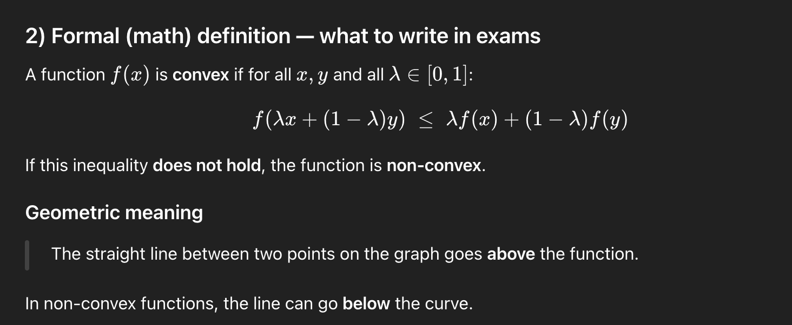
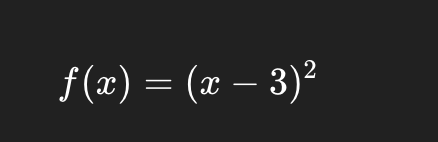
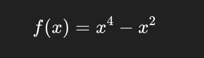

### Non-convex function —

---

## 1) Intuition (plain words)

* A **convex function** looks like **one smooth bowl** → one lowest point.
* A **non-convex function** looks like **hills and valleys** → **many low points**.

So in a non-convex function:

* there can be **many local minima**
* only one (or none obvious) **global minimum**
* algorithms like Gradient Descent can **get stuck**.

---

### Geometric meaning

> The straight line between two points on the graph goes **above** the function.

In non-convex functions, the line can go **below** the curve.

---

## 3) Visual test (easy to remember)

* Pick **two points** on the curve
* Draw a straight line between them

| Function type | Line lies                   |
| ------------- | --------------------------- |
| Convex        | above the curve             |
| Non-convex    | below the curve (somewhere) |

---

## 4) Example (by inspection)

### Convex example

* One minimum
* No bumps
* GD always reaches the same solution

---

### Non-convex example

* Has **two local minima**
* And a local maximum
* GD result depends on starting point

---

## 5) Why Gradient Descent struggles (important)

In **convex** functions:

* Any local minimum = global minimum
* GD is **guaranteed** to converge (with proper step size)

In **non-convex** functions:

* GD may converge to a **local minimum**
* GD may stop at a **saddle point**
* Different initializations → different solutions

---

## 6) Saddle points (very common exam word)

A **saddle point**:

* Gradient = 0
* But it is **not** a minimum

Example intuition:

* Curve goes **down** in one direction
* Goes **up** in another

GD may **slow down or stop** near saddle points.

---

## 7) Real-world relevance (short)

Most modern ML models are **non-convex**:

* Neural networks
* Deep learning loss functions
* Matrix factorization

Yet GD works because:

* approximate solutions are often good enough
* randomness (SGD) helps escape bad points

---

## 8) One-paragraph exam answer (memorize this)

> A non-convex function is a function that does not satisfy the convexity inequality and may contain multiple local minima and saddle points. In such functions, Gradient Descent is not guaranteed to find the global minimum and may converge to different solutions depending on initialization. This contrasts with convex functions, where any local minimum is also global and convergence is guaranteed under suitable step sizes.

